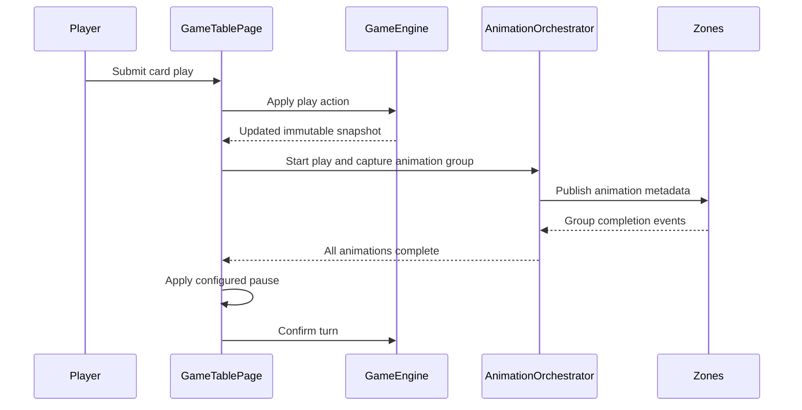
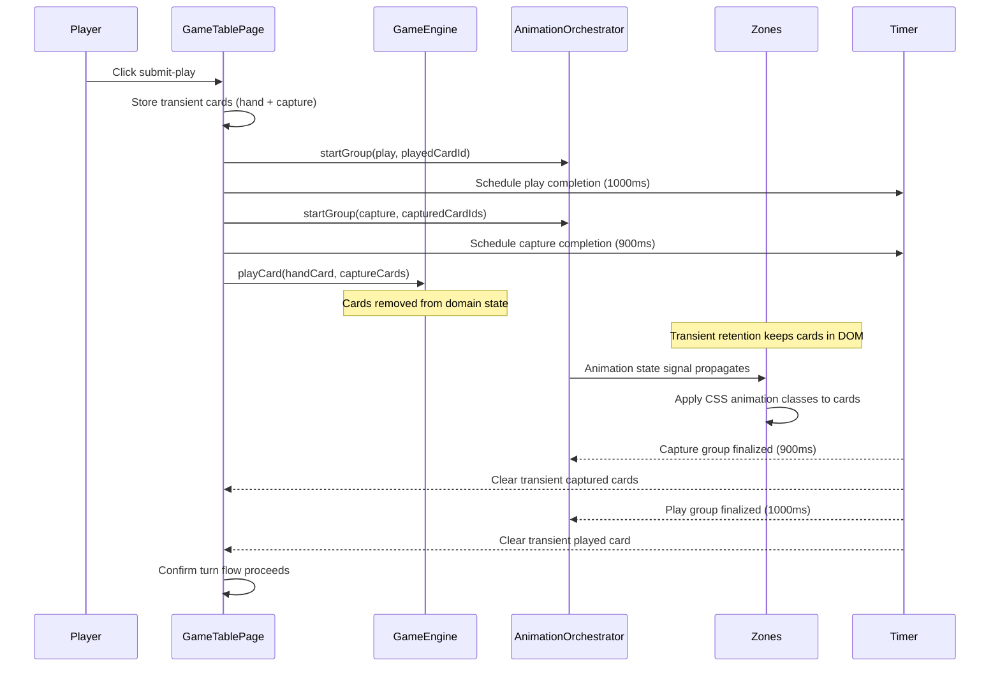

# Review Report: Card Animation System — T-7 GREEN Phase Re-Review (v2)

**Review Mode:** Incremental (T-7: Implement player play and capture animation flows — post-fix re-review)
**Source:** `docs/specs/ui/card-animations/`
**Reviewed against:** proposal.md, spec.md, user-stories.md, bdd-test.md, design.md, tasks.md
**Scope:** GameTablePage `submitPlay()` flow, CardAnimationOrchestrator, CardVisual SCSS keyframes, ActiveHandZone/CenterTableZone animation metadata propagation, transient card retention mechanism, unit tests (game-table-page.spec.ts T-7 tagged), E2E tests (player-play-capture-animations.feature/.ts)
**Previous reports:** `review-report_T-7.md` (GREEN v1), `review-report_T-7_red-v2.md` (RED v2) — this document supersedes the GREEN v1.

## 1. Executive Summary

All three critical/major findings from the initial T-7 GREEN review have been resolved. The state mutation ordering issue (RV-01 Critical) is now addressed through a transient card retention mechanism that keeps cards visible during animation. The unit test mock (RV-02 Major) now faithfully removes cards matching real engine behavior. The capture glow color (RV-03 Major) is now golden/amber per spec. Two Minor findings and one Note remain regarding keyframe endpoint spec alignment and a subtle group finalization timing gap.

- Total findings: 3 (0 Critical, 0 Major, 2 Minor, 1 Note)
- Previous Critical findings: 1 of 1 resolved (RV-01)
- Previous Major findings: 2 of 2 resolved (RV-02, RV-03)
- Spec compliance: FR-1 Met, FR-2 Met (with documented deliberate deviation)
- Architecture alignment: minor simplification from event-driven to timer-driven completion (intentional)
- Test quality: meaningful assertions for all covered scenarios

## 2. Architecture Comparison

### 2.1 Planned Orchestration Flow (from design.md section 2.3)

### 2.2 Actual Orchestration Flow (after fix)

### 2.3 Drift Analysis

**State ordering issue resolved.** The transient card retention mechanism (`transientPlayedHandCardState` and `transientCapturedTableCardsState`) combined with `withTransientCard()` and `withTransientCards()` helper methods ensures cards remain rendered in zone DOM during the animation window. Animation groups are started BEFORE `gameEngine.playCard()`, so metadata is available when Angular renders.

**Completion mechanism simplified (intentional).** The planned design shows zones emitting "Group completion events" back to the orchestrator (event-driven). The implementation uses `setTimeout` timers matching CSS animation durations (timer-driven). This is a confirmed intentional simplification that trades precision-to-CSS-timing for implementation simplicity.

**Transient retention correctness.** After `gameEngine.playCard()` removes cards from state, `activeHandCards()` re-inserts the played card via `withTransientCard()` and `tableCards()` re-inserts captured cards via `withTransientCards()`. Cards disappear from DOM only when timers fire and clear the transient signals.

### 2.4 Multi-Group Interaction Timing

```mermaid
gantt
  title Animation Group Timeline
  dateFormat X
  axisFormat %Lms

  section Play Group
  Play animation (CSS 1000ms)         :play, 0, 1000
  Play group finalized + card removed :milestone, 1000, 0

  section Capture Group
  Capture animation (CSS 900ms)       :capture, 0, 900
  Capture group finalized + cards removed :milestone, 900, 0

  section activeGroupId
  Points to capture group             :active, 0, 900
  Null (capture finalized)            :crit, null, 900, 1000
```

The play group loses its animation visual state for approximately 100ms (between capture finalization at 900ms and play timer at 1000ms) because `resolveCardAnimationState` short-circuits when `activeAnimationVisualState()` returns null. This is a subtle timing gap described in RV-01v3.

## 3. Resolution of Previous Findings

### RV-01 (Previous: Critical) — RESOLVED

- **Original issue:** State mutation ordering prevented capture animations from being visible. `gameEngine.playCard()` removed cards from state before animation groups were started.
- **Resolution:** Transient card retention mechanism added. Cards are stored in `transientPlayedHandCardState` and `transientCapturedTableCardsState` before `playCard()`. Computed signals `activeHandCards()` and `tableCards()` re-insert missing cards from transient storage. Timer-based `scheduleAnimationGroupCompletion()` clears transient state after animation duration, triggering DOM removal.
- **Status:** ✅ Closed

### RV-02 (Previous: Major) — RESOLVED

- **Original issue:** `playCardSpy` mock did not remove cards from state, masking the production ordering issue.
- **Resolution:** Mock now calls `stateSignal.update()` to remove the played card from hand and captured cards from table, faithfully matching real GameEngine behavior.
- **Status:** ✅ Closed

### RV-03 (Previous: Major) — RESOLVED

- **Original issue:** Capture glow used green color instead of spec-mandated yellow/golden.
- **Resolution:** Capture class now uses golden/amber box-shadow colors: `rgba(245, 197, 66, 0.75)` and `rgba(217, 160, 42, 0.55)`.
- **Status:** ✅ Closed

## 4. Remaining Findings

### RV-01v3: Play animation group loses visual state during capture finalization window [Minor]

- **Category:** Architecture Drift
- **Severity:** Minor
- **Related:** AD-2, FR-1, US-1, T-7
- **Description:** When both play (1000ms) and capture (900ms) groups run simultaneously, the capture group finalizes first (at 900ms). Because `startGroup()` sets `activeGroupId` to the last-created group (capture), when capture finalizes, `activeGroupId` becomes null. The `resolveCardAnimationState` method first checks `activeAnimationVisualState()` — which returns null when `activeGroupId` is null — and short-circuits to return null for ALL cards, including the played hand card whose 'play' group is still technically running until 1000ms.
- **Expected:** The played card should retain its play animation class for the full 1000ms duration.
- **Actual:** The play animation class is removed at approximately 900ms (when capture finalizes) and the card reverts to un-animated appearance for ~100ms before being removed from DOM at 1000ms.
- **Recommendation:** Modify `resolveCardAnimationState` to call `resolveVisualStateForCard()` whenever ANY running group exists (not gated solely on `activeGroupId`). Alternatively, accept this as imperceptible given the 100ms window and the card disappearing immediately after.
- **Impact:** Minimal — the 100ms gap is nearly imperceptible to users since the card is removed from DOM immediately after. With `animation-fill-mode: both`, the CSS animation holds its most recent keyframe state until the class is removed, then the card snaps briefly before disappearing.

### RV-02v3: Capture keyframe endpoint deviates from FR-2 specification text [Minor]

- **Category:** Spec Compliance (Documented Deviation)
- **Severity:** Minor
- **Related:** FR-2, US-2, SC-04, T-7
- **Description:** FR-2 specifies "Opacity decreases to 0 and scale reduces to 0.5 simultaneously starting at 300ms." The `card-capture-fade` keyframe actually reaches opacity 0.65 and scale 0.92 at 100%. Card disappearance is achieved by DOM element removal via transient state clearing, not by the CSS animation reaching invisible state.
- **Expected:** Per FR-2 literal text, cards fade to fully invisible via CSS animation.
- **Actual:** Cards partially fade (to 0.65 opacity, 0.92 scale) then are removed from DOM by the transient retention timer. This is a confirmed deliberate design choice.
- **Recommendation:** Update FR-2 specification text to document the actual behavior: "Cards display a golden glow and partial fade effect during the animation window, then are removed from the DOM upon animation group completion." This keeps spec aligned with the accepted implementation approach.
- **Impact:** None functionally — users perceive cards as glowing, fading, and disappearing. The visual result is acceptable. The spec text is outdated relative to the implementation strategy.

### RV-03v3: E2E SC-04 "fade and scale down out of view" assertion is semantically broad [Note]

- **Category:** Test Quality
- **Severity:** Note
- **Related:** SC-04, FR-2, T-7
- **Description:** The step "captured table cards fade and scale down out of view" asserts `opacity < 1` and `transform !== none`. Given the deliberate decision that cards reach opacity 0.65 (not 0) before DOM removal, the assertion correctly validates the intended behavior. However, the BDD scenario text says "out of view" which semantically implies invisible, not partially transparent.
- **Expected:** Assertion matches the deliberate implementation behavior.
- **Actual:** It does — `opacity < 1` is correct for the 0.65 endpoint. The BDD scenario text is slightly misleading relative to the actual visual outcome.
- **Recommendation:** Consider rewording the BDD step to "captured table cards fade and scale down during animation" to better align with the deliberate partial-fade approach. No test change needed.
- **Impact:** None — the test correctly validates the intended behavior.

## 5. Traceability Matrix

<<<<<<< Updated upstream
| Finding | Severity | Category | Related Spec | Status |
| ------------------- | -------- | ------------------ | ------------------------------------ | --------------------------- |
| RV-01 (v1 Critical) | Critical | Architecture Drift | AD-2, FR-2, TR-8, US-2, SC-04, SC-05 | ✅ Closed |
| RV-02 (v1 Major) | Major | Test Quality | FR-2, SC-04, SC-05 | ✅ Closed |
| RV-03 (v1 Major) | Major | Spec Compliance | FR-2, US-2, SC-04 | ✅ Closed |
| RV-01v3 | Minor | Architecture Drift | AD-2, FR-1, US-1 | Open |
| RV-02v3 | Minor | Spec Compliance | FR-2, US-2, SC-04 | Open (Documented Deviation) |
| RV-03v3 | Note | Test Quality | SC-04, FR-2 | Acknowledged |

## 6. Spec Compliance Summary (T-7 Scope)

| Requirement                         | Status     | Notes                                                                                                                                                                                                                 |
| ----------------------------------- | ---------- | --------------------------------------------------------------------------------------------------------------------------------------------------------------------------------------------------------------------- |
| FR-1 (Card Play Animation)          | ✅ Met     | Arc motion, rotation, 1000ms timing with cubic-bezier easing. Transient retention keeps card visible during animation. Minor: play class lost ~100ms early in capture scenarios (RV-01v3).                            |
| FR-2 (Card Capture Animation)       | ✅ Met     | Golden glow, simultaneous animation, DOM removal after animation window. Documented deviation: keyframe reaches partial fade (0.65 opacity) not full fade (0); disappearance via DOM removal is deliberate (RV-02v3). |
| TR-2 (CSS Keyframe Animations)      | ✅ Met     | Keyframes use transform and opacity exclusively. `card-play-arc` provides translateY + rotateY. `card-capture-fade` provides opacity + scale transitions.                                                             |
| TR-5 (Coordinate Systems)           | ⚠️ Partial | Arc path is CSS keyframe-based (translateY offsets) not DOM coordinate-calculated. Acceptable for T-7 scope; full coordinate-based pathing is a later concern.                                                        |
| TR-8 (Animation Completion Signals) | ✅ Met     | Timer-based completion fires `completeParticipant` + `finalizeGroup` per group. `lastCompletedGroupId` signal propagates to turn sequencing. Intentional simplification from event-driven to timer-driven.            |
| US-1 (Player Card Play)             | ✅ Met     | Play animation visible for place-only and capture scenarios via transient retention.                                                                                                                                  |
| US-2 (Table Card Capture)           | ✅ Met     | Golden glow, simultaneous capture start, DOM removal after animation.                                                                                                                                                 |

## 7. Task Completion Summary

| Task | Title                                             | Status      | Findings                                         |
| ---- | ------------------------------------------------- | ----------- | ------------------------------------------------ |
| T-7  | Implement player play and capture animation flows | ✅ Complete | RV-01v3 (Minor), RV-02v3 (Minor), RV-03v3 (Note) |

**Acceptance Criteria Assessment:**

=======
| Finding | Severity | Category | Related Spec | Status |
|---------|----------|----------|-------------|--------|
| RV-01 (v1 Critical) | Critical | Architecture Drift | AD-2, FR-2, TR-8, US-2, SC-04, SC-05 | ✅ Closed |
| RV-02 (v1 Major) | Major | Test Quality | FR-2, SC-04, SC-05 | ✅ Closed |
| RV-03 (v1 Major) | Major | Spec Compliance | FR-2, US-2, SC-04 | ✅ Closed |
| RV-01v3 | Minor | Architecture Drift | AD-2, FR-1, US-1 | Open |
| RV-02v3 | Minor | Spec Compliance | FR-2, US-2, SC-04 | Open (Documented Deviation) |
| RV-03v3 | Note | Test Quality | SC-04, FR-2 | Acknowledged |

## 6. Spec Compliance Summary (T-7 Scope)

| Requirement                         | Status     | Notes                                                                                                                                                                                                                 |
| ----------------------------------- | ---------- | --------------------------------------------------------------------------------------------------------------------------------------------------------------------------------------------------------------------- |
| FR-1 (Card Play Animation)          | ✅ Met     | Arc motion, rotation, 1000ms timing with cubic-bezier easing. Transient retention keeps card visible during animation. Minor: play class lost ~100ms early in capture scenarios (RV-01v3).                            |
| FR-2 (Card Capture Animation)       | ✅ Met     | Golden glow, simultaneous animation, DOM removal after animation window. Documented deviation: keyframe reaches partial fade (0.65 opacity) not full fade (0); disappearance via DOM removal is deliberate (RV-02v3). |
| TR-2 (CSS Keyframe Animations)      | ✅ Met     | Keyframes use transform and opacity exclusively. `card-play-arc` provides translateY + rotateY. `card-capture-fade` provides opacity + scale transitions.                                                             |
| TR-5 (Coordinate Systems)           | ⚠️ Partial | Arc path is CSS keyframe-based (translateY offsets) not DOM coordinate-calculated. Acceptable for T-7 scope; full coordinate-based pathing is a later concern.                                                        |
| TR-8 (Animation Completion Signals) | ✅ Met     | Timer-based completion fires `completeParticipant` + `finalizeGroup` per group. `lastCompletedGroupId` signal propagates to turn sequencing. Intentional simplification from event-driven to timer-driven.            |
| US-1 (Player Card Play)             | ✅ Met     | Play animation visible for place-only and capture scenarios via transient retention.                                                                                                                                  |
| US-2 (Table Card Capture)           | ✅ Met     | Golden glow, simultaneous capture start, DOM removal after animation.                                                                                                                                                 |

## 7. Task Completion Summary

| Task | Title                                             | Status      | Findings                                         |
| ---- | ------------------------------------------------- | ----------- | ------------------------------------------------ |
| T-7  | Implement player play and capture animation flows | ✅ Complete | RV-01v3 (Minor), RV-02v3 (Minor), RV-03v3 (Note) |

**Acceptance Criteria Assessment:**

> > > > > > > Stashed changes

- [x] Player play action renders movement to target zone — ✅ Met (arc animation with rotation visible via transient retention)
- [x] Capture applies glow and removal behavior — ✅ Met (golden glow + DOM removal; deliberate partial-fade approach)
- [x] Multi-card capture starts simultaneously — ✅ Met (single capture group with all cardIds; E2E verifies same-frame class application and equal animation-delay)

## 8. Test Coverage Summary

<<<<<<< Updated upstream
| Scenario | Step Definitions | Meaningful | Findings |
| -------- | ---------------- | ---------- | ------------------------------------------------------ |
| SC-01 | ✅ Yes | ✅ Yes | — |
| SC-02 | ✅ Yes | ✅ Yes | Rotation assertion breadth (from red-v2, accepted) |
| SC-04 | ✅ Yes | ✅ Yes | RV-03v3 (semantic breadth of "out of view" text, Note) |
| SC-05 | ✅ Yes | ✅ Yes | — |

## 9. Test Quality Summary

| Test File                                 | Type        | Meaningful Assertions | Issues                                                                                                             |
| ----------------------------------------- | ----------- | --------------------- | ------------------------------------------------------------------------------------------------------------------ |
| game-table-page.spec.ts (T-7 tests)       | Unit        | ✅ Yes                | Mock faithfully removes cards; assertions verify orchestrator invocations with correct action types and card IDs   |
| game-table-page.spec.ts (T-7 render test) | Unit        | ✅ Yes                | Verifies DOM elements have capture animation class; works correctly because transient retention keeps cards in DOM |
| player-play-capture-animations.feature    | E2E Feature | ✅ Yes                | Covers SC-01, SC-02, SC-04, SC-05 with distinct step assertions                                                    |
| player-play-capture-animations.ts         | E2E Steps   | ✅ Yes                | Asserts computed styles (animation-name, duration, timing-function, opacity, transform) and DOM removal            |

=======
| Scenario | Step Definitions | Meaningful | Findings |
|----------|-----------------|------------|----------|
| SC-01 | ✅ Yes | ✅ Yes | — |
| SC-02 | ✅ Yes | ✅ Yes | Rotation assertion breadth (from red-v2, accepted) |
| SC-04 | ✅ Yes | ✅ Yes | RV-03v3 (semantic breadth of "out of view" text, Note) |
| SC-05 | ✅ Yes | ✅ Yes | — |

## 9. Test Quality Summary

| Test File                                 | Type        | Meaningful Assertions | Issues                                                                                                             |
| ----------------------------------------- | ----------- | --------------------- | ------------------------------------------------------------------------------------------------------------------ |
| game-table-page.spec.ts (T-7 tests)       | Unit        | ✅ Yes                | Mock faithfully removes cards; assertions verify orchestrator invocations with correct action types and card IDs   |
| game-table-page.spec.ts (T-7 render test) | Unit        | ✅ Yes                | Verifies DOM elements have capture animation class; works correctly because transient retention keeps cards in DOM |
| player-play-capture-animations.feature    | E2E Feature | ✅ Yes                | Covers SC-01, SC-02, SC-04, SC-05 with distinct step assertions                                                    |
| player-play-capture-animations.ts         | E2E Steps   | ✅ Yes                | Asserts computed styles (animation-name, duration, timing-function, opacity, transform) and DOM removal            |

> > > > > > > Stashed changes

## 10. Security Cross-Reference

No Critical or High security findings in the companion `security-report_T-7.md`. One Medium finding exists.

<<<<<<< Updated upstream
| SEC ID | Severity | OWASP | Summary |
| ------ | -------- | -------- | ------------------------------------------------------------------ |
| SEC-01 | Medium | A06:2021 | Transitive brace-expansion vulnerability (resource exhaustion DoS) |
=======
| SEC ID | Severity | OWASP | Summary |
|--------|----------|-------|---------|
| SEC-01 | Medium | A06:2021 | Transitive brace-expansion vulnerability (resource exhaustion DoS) |

> > > > > > > Stashed changes

## 11. Recommendations

### Minor (improvement)

1. **Consider removing the activeAnimationVisualState gate (RV-01v3):** The `resolveCardAnimationState` method short-circuits to null when `activeGroupId` is null, even if other running groups exist. Changing the condition to check for ANY running group (instead of only the activeGroupId-referenced group) would eliminate the 100ms animation gap in multi-group scenarios. Low priority given the imperceptible user impact.

2. **Update FR-2 specification text (RV-02v3):** Align the spec with the deliberate implementation approach. The current spec says "opacity decreases to 0 and scale reduces to 0.5" but the accepted behavior is partial CSS fade followed by DOM removal.

### Notes (informational)

1. **BDD scenario text alignment (RV-03v3):** The phrase "fade and scale down out of view" in SC-04 slightly overstates the visual effect relative to the deliberate partial-fade approach. Consider rewording to "fade and scale down during capture animation" for clarity.

2. **Timer synchronization awareness:** Animation timers (1000ms play, 900ms capture) are hardcoded as static class constants. If CSS animation durations are later modified (e.g., for performance tuning in T-14), these constants must be manually synchronized. A comment documenting this coupling would aid maintainability.
