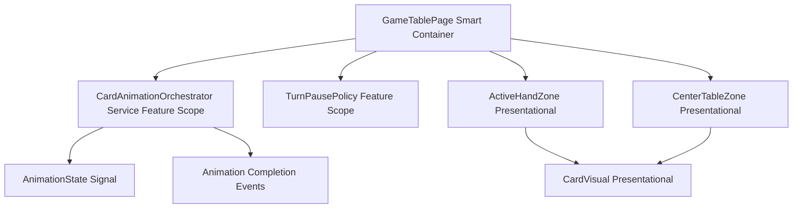
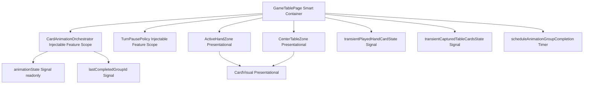
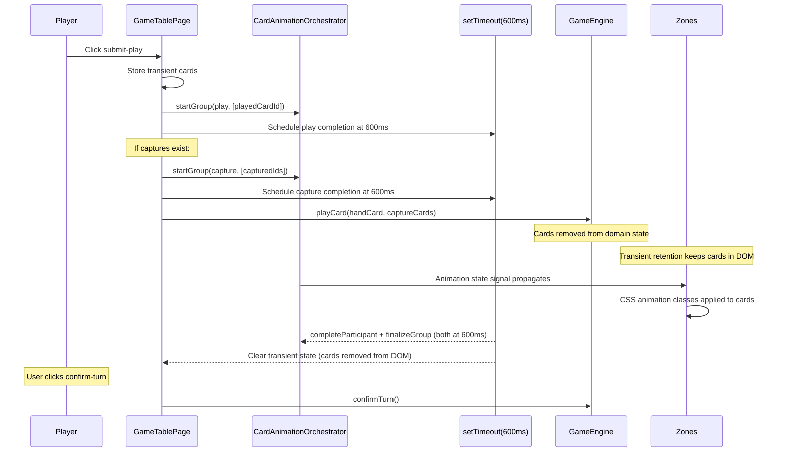

# Review Report: Card Animation System — T-7 Post-Implementation Review

**Review Mode:** Incremental (T-7: Implement player play and capture animation flows)
**Source:** `docs/specs/ui/card-animations/`
**Reviewed against:** proposal.md, spec.md, user-stories.md, bdd-test.md, design.md, tasks.md
**Previous reports:** `review-report_T-7_green-v2.md` (most recent prior review)

## 1. Executive Summary

T-7 is fully implemented with all three acceptance criteria met. The orchestration flow — transient card retention, animation group management, timer-driven completion, and zone metadata propagation — is architecturally sound and delivers the intended player experience. All previously-Critical and previously-Major findings from earlier reviews have been resolved. This review identifies that the effective animation visibility window (600ms) is below the spec's stated minimum (800ms) — confirmed intentional by the implementer for snappy game feel. The E2E test for SC-02 validates the CSS property declaration rather than actual visible duration, creating a gap between what the test asserts and what users experience.

- Total findings: 6 (0 Critical, 0 Major, 4 Minor, 2 Note)
- Spec compliance: FR-1 Partial (documented timing deviation), FR-2 Partial (documented keyframe deviation), TR-2 Met, TR-5 Partial, TR-8 Met, US-1 Met, US-2 Met
- Architecture alignment: minor simplification from event-driven to timer-driven completion (intentional)
- Test quality: meaningful assertions with one noted coverage gap on animation duration

## 2. Architecture Comparison

### 2.1 Planned Component Tree (from design.md section 2.1)

### 2.2 Actual Component Tree

### 2.3 Drift Analysis

**Transient card retention mechanism (addition).** The planned design assumed cards would remain in zone DOM through the animation lifecycle naturally. The actual implementation adds two transient state signals that re-insert played/captured cards into computed zone arrays after `gameEngine.playCard()` removes them from domain state. This is a necessary addition to bridge the immutable state model with visible animation continuity.

**Timer-driven completion replaces event-driven completion (simplification).** The planned design (section 2.3 sequence diagram) shows zones emitting "Group completion events" back to the orchestrator after CSS animations finish. The actual implementation uses `setTimeout` with duration values derived from `resolveAnimationCompletionDelayMs()`, firing at 600ms regardless of CSS animation declared duration. This trades animation-end-event precision for implementation simplicity and deterministic timing.

**Effective timer value diverges from CSS declared durations.** The `resolveAnimationCompletionDelayMs` method returns `Math.min(maxDurationMs, pausePolicyMs)` = `Math.min(1000, 600)` = 600ms for play and `Math.min(900, 600)` = 600ms for capture. Both groups finalize simultaneously at 600ms, even though CSS animations declare 1000ms and 900ms durations respectively. Cards are removed from DOM at 600ms, interrupting CSS animations mid-progress. This is confirmed intentional for snappy game feel.

### 2.4 Actual Orchestration Sequence

## 3. Findings

### RV-01: Effective animation visibility window below spec minimum [Minor]

- **Category:** Spec Compliance (Documented Deviation)
- **Severity:** Minor
- **Related:** FR-1, FR-2, US-1, US-2, SC-02, AD-4, T-7
- **Description:** FR-1 and FR-2 specify animation duration of 800-1200ms. The CSS keyframes declare 1000ms (play) and 900ms (capture). However, `resolveAnimationCompletionDelayMs` returns `Math.min(maxDuration, pausePolicyMs)` where the pause policy for `player-post-play-confirm` is 600ms. Both animation groups finalize at 600ms, removing cards from DOM and interrupting CSS animations at 60-67% progress.
- **Expected:** Per FR-1/FR-2 literal text, animations play for 800-1200ms.
- **Actual:** Animations are visible for approximately 600ms before DOM removal. Confirmed intentional by implementer for snappy game rhythm.
- **Recommendation:** Update FR-1 and FR-2 specification text to document the accepted 600ms effective animation window, noting that CSS durations are declared at 1000ms/900ms but cards are removed from DOM at the pause-policy-clamped interval for responsive game feel.
- **Impact:** None functional — the 600ms window provides sufficient visual feedback for play and capture recognition. Spec text is outdated relative to accepted implementation.

### RV-02: resolveCardAnimationState gate on activeGroupId [Minor]

- **Category:** Architecture Drift
- **Severity:** Minor
- **Related:** AD-2, FR-1, US-1, T-7
- **Description:** The `resolveCardAnimationState` method first checks `activeAnimationVisualState()` which returns null when `activeGroupId` is null. If any group's `finalizeGroup()` sets `activeGroupId` to null while another group is still technically running, all animation classes are prematurely removed. In the current implementation, both groups finalize simultaneously at 600ms so this gap is imperceptible.
- **Expected:** Cards retain animation classes for the full duration of their respective running group.
- **Actual:** When the last-started group finalizes, `activeGroupId` becomes null, and the `resolveCardAnimationState` short-circuit gate prevents `resolveVisualStateForCard` from being called for any card. Since both timers fire at 600ms simultaneously, the practical impact is zero.
- **Recommendation:** Accept as-is. If future changes introduce staggered group timers, revisit by removing the gate or checking for ANY running group rather than only the `activeGroupId`-referenced group.
- **Impact:** None currently. Potential future concern only if group timers are staggered.

### RV-03: Capture keyframe endpoint diverges from FR-2 text [Minor]

- **Category:** Spec Compliance (Documented Deviation)
- **Severity:** Minor
- **Related:** FR-2, US-2, SC-04, T-7
- **Description:** FR-2 specifies "Opacity decreases to 0 and scale reduces to 0.5." The `card-capture-fade` keyframe reaches opacity 0.65 and scale 0.92 at its 100% endpoint. Actual card disappearance is achieved by DOM element removal when the transient state timer fires, not by CSS reaching invisible state.
- **Expected:** Per FR-2 literal text, CSS animation reaches fully invisible state.
- **Actual:** CSS animation produces partial visual fade; DOM removal handles actual disappearance. This is a confirmed deliberate design choice consistent with the transient retention mechanism.
- **Recommendation:** Update FR-2 specification text to document the accepted approach: "Captured cards display a golden glow and partial fade effect during the animation window, then are removed from the DOM upon animation group completion."
- **Impact:** None — users perceive a glow, fade, and disappearance sequence that reads as capture behavior.

### RV-04: E2E SC-02 duration assertion validates CSS property, not visible time [Minor]

- **Category:** Test Quality
- **Severity:** Minor
- **Related:** SC-02, FR-1, US-14, T-7
- **Description:** The SC-02 step "the animation duration is within 800 to 1200 milliseconds" reads `getComputedStyle` for the `animation-duration` CSS property. This returns 1000ms (the SCSS-declared value) regardless of when the card is actually removed from DOM. The test passes because it validates the CSS configuration, not the user-visible animation window (600ms).
- **Expected:** Test validates what users actually experience.
- **Actual:** Test validates CSS declaration which persists even though the animation is interrupted by DOM removal at 600ms. Since 600ms is confirmed intentional, the assertion creates a gap: it would not detect a regression where the timer fires too early (e.g., 100ms) since the CSS property would still read 1000ms.
- **Recommendation:** Consider adding a complementary assertion that verifies card DOM presence duration (e.g., verify card is removed from DOM within an expected window after submit). Alternatively, document that this assertion validates CSS configuration correctness rather than visible animation time.
- **Impact:** Low — the test protects against CSS misconfiguration but not against timer regression. Since timer values are well-tested in unit tests via orchestrator spy assertions, the practical gap is small.

### RV-05: BDD SC-04 "out of view" text overstates partial-fade [Note]

- **Category:** Test Quality
- **Severity:** Note
- **Related:** SC-04, FR-2, T-7
- **Description:** The BDD step "captured table cards fade and scale down out of view" implies cards become visually invisible through CSS animation. In practice, cards reach opacity 0.65 and are then removed from DOM. The E2E assertion correctly validates `opacity < 1` which matches the actual behavior.
- **Expected:** BDD text accurately describes the implemented behavior.
- **Actual:** The phrase "out of view" slightly overstates the CSS effect; DOM removal is what truly removes cards from view.
- **Recommendation:** Consider rewording to "captured table cards fade and scale down during capture animation" for precision. No test logic change needed.
- **Impact:** None — assertion logic is correct for the implemented behavior.

### RV-06: Previous review timing documentation discrepancy [Note]

- **Category:** Architecture Drift (Documentation)
- **Severity:** Note
- **Related:** AD-2, T-7
- **Description:** The `review-report_T-7_green-v2.md` gantt chart documents play group finalization at 1000ms and capture group finalization at 900ms. The actual code produces timers at 600ms for both (due to `Math.min(maxDuration, 600)` in `resolveAnimationCompletionDelayMs`). The gantt chart in that review is factually incorrect for the current implementation state.
- **Expected:** Documentation matches code behavior.
- **Actual:** Gantt chart shows timers at 1000ms/900ms but code fires at 600ms/600ms.
- **Recommendation:** Informational only. This report's section 2.4 provides the corrected timing documentation.
- **Impact:** None — the green-v2 findings and conclusions remain valid despite the timing documentation error.

## 4. Traceability Matrix

| Finding | Severity | Category           | Related Spec                        | Status                      |
| ------- | -------- | ------------------ | ----------------------------------- | --------------------------- |
| RV-01   | Minor    | Spec Compliance    | FR-1, FR-2, US-1, US-2, SC-02, AD-4 | Open (Documented Deviation) |
| RV-02   | Minor    | Architecture Drift | AD-2, FR-1, US-1                    | Open (Accepted Risk)        |
| RV-03   | Minor    | Spec Compliance    | FR-2, US-2, SC-04                   | Open (Documented Deviation) |
| RV-04   | Minor    | Test Quality       | SC-02, FR-1, US-14                  | Open                        |
| RV-05   | Note     | Test Quality       | SC-04, FR-2                         | Acknowledged                |
| RV-06   | Note     | Architecture Drift | AD-2                                | Acknowledged                |

## 5. Spec Compliance Summary

| Requirement | Status     | Notes                                                                                                                                                           |
| ----------- | ---------- | --------------------------------------------------------------------------------------------------------------------------------------------------------------- |
| FR-1        | ⚠️ Partial | Arc motion and rotation render correctly. Effective visible duration is 600ms, below spec's 800ms minimum. Confirmed intentional — spec text outdated.          |
| FR-2        | ⚠️ Partial | Golden glow and simultaneous capture work correctly. Keyframe endpoint values deviate from spec text. DOM removal handles disappearance. Confirmed intentional. |
| TR-2        | ✅ Met     | CSS keyframes use only transform and opacity. GPU-accelerated properties exclusively.                                                                           |
| TR-5        | ⚠️ Partial | Arc path implemented via CSS translateY offsets, not DOM coordinate calculation. Acceptable for T-7 scope; coordinate pathing is T-14 concern.                  |
| TR-8        | ✅ Met     | Timer-driven completion fires `completeParticipant` and `finalizeGroup` per group. `lastCompletedGroupId` signal propagates to turn sequencing correctly.       |
| US-1        | ✅ Met     | Play animation visible via transient retention. Card displays arc motion in hand zone before DOM removal.                                                       |
| US-2        | ✅ Met     | Capture glow applied with golden/amber color. Multi-card captures start simultaneously. DOM removal after timer fires provides disappearance.                   |

## 6. Task Completion Summary

| Task | Title                                             | Status      | Findings                                 |
| ---- | ------------------------------------------------- | ----------- | ---------------------------------------- |
| T-7  | Implement player play and capture animation flows | ✅ Complete | RV-01, RV-02, RV-03, RV-04, RV-05, RV-06 |

**Acceptance Criteria Assessment:**

- [x] Player play action renders movement to target zone — Met (CSS arc animation with rotation visible during 600ms window via transient card retention)
- [x] Capture applies glow and removal behavior — Met (golden glow via `card-capture-fade` keyframe + DOM removal at timer expiry)
- [x] Multi-card capture starts simultaneously — Met (single capture animation group with all card IDs; E2E verifies same-frame class application and equal animation-delay values)

## 7. Test Coverage Summary

| Scenario | Step Definitions | Meaningful | Findings                                                   |
| -------- | ---------------- | ---------- | ---------------------------------------------------------- |
| SC-01    | ✅ Yes           | ✅ Yes     | —                                                          |
| SC-02    | ✅ Yes           | ⚠️ Partial | RV-04 (duration assertion validates CSS, not visible time) |
| SC-04    | ✅ Yes           | ✅ Yes     | RV-05 (BDD text semantic breadth, Note only)               |
| SC-05    | ✅ Yes           | ✅ Yes     | —                                                          |

## 8. Test Quality Summary

| Test File                              | Type        | Meaningful Assertions | Issues                                                                                                                                                                              |
| -------------------------------------- | ----------- | --------------------- | ----------------------------------------------------------------------------------------------------------------------------------------------------------------------------------- |
| game-table-page.spec.ts (T-7 tests)    | Unit        | ✅ Yes                | Orchestrator startGroup spied with correct action types and card IDs. Mock faithfully removes cards. DOM class verification confirms simultaneous metadata propagation.             |
| card-visual.spec.ts                    | Unit        | ✅ Yes                | Validates each animation state class application and coexistence with selected/focus states.                                                                                        |
| active-hand-zone.card-visual.spec.ts   | Unit        | ✅ Yes                | Validates zone metadata propagation to CardVisual instances and state isolation from game logic.                                                                                    |
| center-table-zone.card-visual.spec.ts  | Unit        | ✅ Yes                | Validates capture metadata application to table cards and multi-card simultaneous rendering.                                                                                        |
| player-play-capture-animations.feature | E2E Feature | ✅ Yes                | Covers SC-01, SC-02, SC-04, SC-05 with distinct assertions per step.                                                                                                                |
| player-play-capture-animations.ts      | E2E Steps   | ⚠️ Partial            | `animation-duration` assertion (RV-04) validates CSS property not visible time. Other assertions (animation-name, timing-function, opacity, transform, DOM removal) are meaningful. |

## 9. Security Cross-Reference

No Critical or High security findings in `security-report_T-7.md`. One Medium finding exists regarding a transitive dependency vulnerability.

| SEC ID | Severity | OWASP    | Summary                                                                                    |
| ------ | -------- | -------- | ------------------------------------------------------------------------------------------ |
| SEC-01 | Medium   | A06:2021 | Transitive brace-expansion vulnerability (resource exhaustion DoS via large numeric range) |

## 10. Recommendations

### Minor (improvement)

1. **Update FR-1 and FR-2 specification text (RV-01, RV-03):** Align spec language with the accepted 600ms effective animation window and the partial-fade + DOM-removal capture approach. This prevents future reviewers from flagging the same documented deviation.

2. **Add complementary duration assertion (RV-04):** Consider supplementing the SC-02 E2E step with an assertion that verifies card DOM presence/removal timing, or document explicitly that the duration assertion validates CSS configuration correctness only.

3. **Future-proof multi-group gate (RV-02):** If staggered group timers are introduced (e.g., for T-8 deal animations with different timing), change `resolveCardAnimationState` to check for ANY running group rather than only the `activeGroupId`-referenced group.

### Notes (informational)

1. **Timer-CSS duration coupling (RV-06):** Animation timers (`PLAY_ANIMATION_DURATION_MS = 1000`, `CAPTURE_ANIMATION_DURATION_MS = 900`) are declared as static class constants but the effective timer value is clamped to the pause policy (600ms). If CSS animation durations are later modified, only the CSS values change — the actual visible window remains 600ms until the pause policy is adjusted. This coupling is implicit and worth documenting via code comment.

2. **BDD scenario text (RV-05):** SC-04's "out of view" phrase slightly overstates the CSS effect. Consider rewording for precision in future BDD updates.
