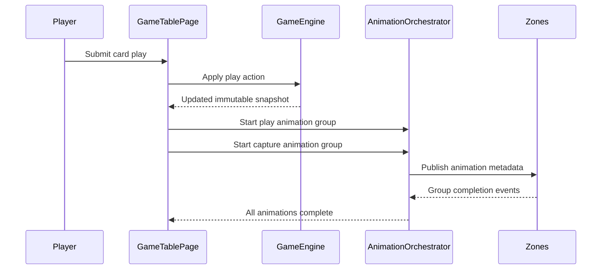
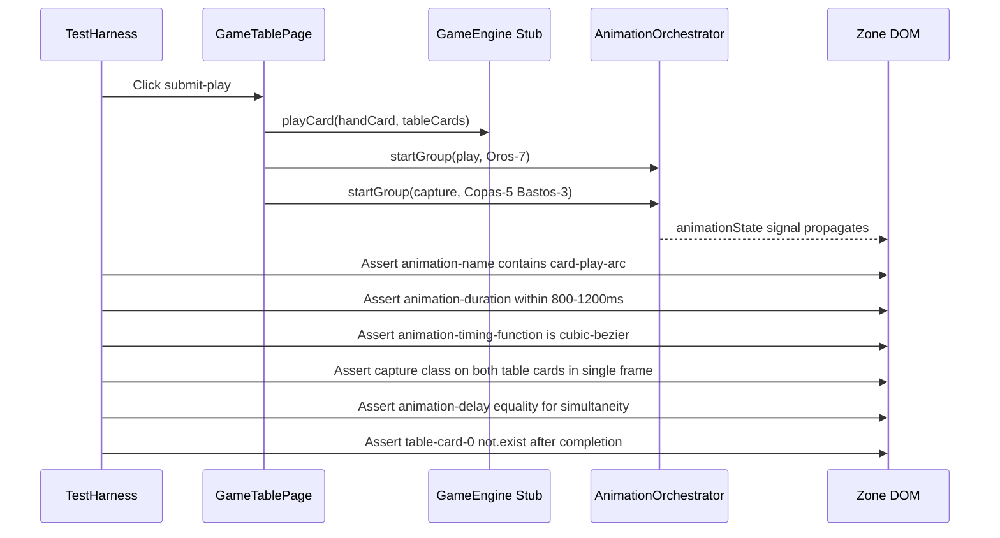

# Review Report: Card Animation System — T-7 RED Phase Re-Review (v2)

**Review Mode:** Incremental (T-7: Implement player play and capture animation flows — RED phase tests, post-fix re-review)
**Source:** `docs/specs/ui/card-animations/`
**Reviewed against:** proposal.md, spec.md, user-stories.md, bdd-test.md, design.md, tasks.md
**Scope:** `src/app/features/game-board/game-table-page/game-table-page.spec.ts` (T-7 tagged tests), `cypress/e2e/player-play-capture-animations.feature`, `cypress/e2e/player-play-capture-animations.ts`
**Previous report:** `review-report_T-7_red.md` — this document supersedes it.

## 1. Executive Summary

All three Major findings from the initial T-7 RED review have been resolved. The E2E step definitions now assert distinct computed style properties per scenario step, DOM removal is verified directly, and multi-card simultaneity is checked within a single synchronous observation frame. The unit tests remain well-constructed with correct traceability tags. Two Minor observations remain regarding assertion specificity, but these are acceptable for a RED phase that intentionally defers visual verification to GREEN.

- Total findings: 2 (0 Critical, 0 Major, 1 Minor, 1 Note)
- Previous Major findings: 3 of 3 resolved (RV-01, RV-02, RV-03)
- Previous Minor findings: 2 of 2 resolved (RV-04, RV-05)
- T-7 acceptance criteria coverage: 3 of 3 addressed
- SC traceability: SC-01, SC-02, SC-04, SC-05 all have meaningful step definitions
- Assertion quality: Unit tests meaningful; E2E now meaningful

## 2. Architecture Comparison

### 2.1 Planned Orchestration Flow (from design.md)

### 2.2 Tested Orchestration Flow (from T-7 unit and E2E tests)

### 2.3 Drift Analysis

No architectural drift detected. The test flow accurately models the planned orchestration sequence from design.md. The fixes have improved E2E assertion specificity to match the distinct behaviours prescribed by each BDD scenario step.

## 3. Resolution of Previous Findings

### RV-01 (Previous: Major) — RESOLVED

- **Original issue:** Six of fourteen Then steps used identical class-presence checks (`have.class`) despite claiming to verify distinct behaviours.
- **Resolution:** Each step now asserts a distinct computed style property:
  - "arc path" → asserts `animation-name` contains `card-play-arc`
  - "rotation effect" → asserts `transform` is not `none`
  - "ease-in-out profile" → asserts `animation-timing-function` contains `cubic-bezier`
  - "fade and scale down" → asserts `opacity < 1` and `transform` is not `none`
- **Status:** ✅ Closed

### RV-02 (Previous: Major) — RESOLVED

- **Original issue:** The "removed from table" step asserted turn-phase-indicator instead of verifying DOM removal.
- **Resolution:** Step now asserts `cy.get('[data-testid="table-card-0"]').should('not.exist')`, directly verifying captured cards are no longer in the DOM.
- **Status:** ✅ Closed

### RV-03 (Previous: Major) — RESOLVED

- **Original issue:** Sequential independent `.should()` calls could not prove simultaneity of multi-card capture animation.
- **Resolution:** Two-pronged fix:
  - "all captured table cards begin capture animation at the same time" now uses a single `.should()` callback on the parent center-table-zone, checking both child elements synchronously within one evaluation frame.
  - "no captured card animation is staggered" now compares `animation-delay` computed values between cards and asserts equality.
- **Status:** ✅ Closed

### RV-04 (Previous: Minor) — RESOLVED

- **Original issue:** Timing assertion used unreliable wall-clock measurement via `Date.now()`.
- **Resolution:** Step now reads CSS `animation-duration` computed style directly and asserts the numeric value falls within the 800–1200ms range.
- **Status:** ✅ Closed

### RV-05 (Previous: Minor) — RESOLVED

- **Original issue:** Unit test traceability tags overstated coverage of SC-01/SC-02.
- **Resolution:** Test name now includes "(SC-01/SC-02 partial)" explicitly acknowledging the test covers only the orchestrator invocation aspect.
- **Status:** ✅ Closed

## 4. Remaining Findings

### RV-01v2: Rotation assertion accepts any transform, not specifically rotation [Minor]

- **Category:** Test Quality
- **Severity:** Minor
- **Related:** SC-02, FR-1, T-7
- **Description:** The step "the card animation includes a flip or rotation effect during travel" asserts that the computed `transform` property is not equal to `none`. This passes if any transform is applied (translate, scale, skew) even without rotation.
- **Expected:** The BDD scenario text specifies "flip or rotation effect". An assertion specific to rotation would check for `rotate` presence in the transform matrix or verify a non-zero rotation angle.
- **Actual:** Asserts `transform !== 'none'`, which is satisfied by any non-identity transform.
- **Recommendation:** Acceptable for RED phase since no CSS animation exists yet. When GREEN phase implements the keyframes, consider tightening to verify the transform matrix includes a rotation component (e.g., checking for matrix values that indicate non-zero rotation, or asserting a `rotateY` or `rotateZ` substring in a non-computed `transform` property if set declaratively). Track as GREEN phase follow-up.
- **Impact:** Low. In practice, the play animation will include rotation per design, and other steps already verify the animation-name is `card-play-arc`. The risk of a false pass is minimal once the dedicated keyframes are implemented.

### RV-02v2: The readStyle helper bypasses Cypress retry-ability [Note]

- **Category:** Test Quality
- **Severity:** Note
- **Related:** SC-01, SC-02, SC-04, SC-05, T-7
- **Description:** The `readStyle` helper extracts computed style values inside a `.then()` callback, which executes once without Cypress retry semantics. If the animation has not yet started when the assertion runs, the test will fail without retry.
- **Expected:** Assertions on dynamic style values during animation ideally use Cypress retry-able patterns (e.g., `.should()` with callback that reads style inside the retry loop).
- **Actual:** The helper uses `.then()` which does not retry. However, preceding steps already ensure the animation class is applied (via `have.class` assertions in earlier Then steps within the same scenario), so by the time `readStyle` executes, the animation CSS should be active.
- **Recommendation:** No immediate action required. The step ordering within each scenario provides implicit synchronisation. If flakiness is observed during GREEN phase execution, refactor `readStyle` calls into `.should()` callbacks with retry semantics.
- **Impact:** Negligible given step ordering. Worth documenting for future maintainers.

## 5. Traceability Matrix

<<<<<<< Updated upstream
| Finding | Severity | Category | Related Spec | Status |
| ---------- | -------- | ----------------------- | -------------------------------------- | ------------ |
| RV-01 (v1) | Major | Test Quality | SC-01, SC-02, SC-04, SC-05, FR-1, FR-2 | ✅ Closed |
| RV-02 (v1) | Major | Test Quality | SC-04, FR-2, US-2 | ✅ Closed |
| RV-03 (v1) | Major | Test Quality | SC-05, FR-2, TR-2, US-2 | ✅ Closed |
| RV-04 (v1) | Minor | Test Quality | SC-02, FR-1, TR-2 | ✅ Closed |
| RV-05 (v1) | Minor | Test Coverage Alignment | SC-01, SC-02, FR-1 | ✅ Closed |
| RV-01v2 | Minor | Test Quality | SC-02, FR-1, T-7 | Open |
| RV-02v2 | Note | Test Quality | SC-01, SC-02, SC-04, SC-05, T-7 | Acknowledged |

## 6. Spec Compliance Summary (T-7 Scope)

| Requirement                   | Status     | Notes                                                                                          |
| ----------------------------- | ---------- | ---------------------------------------------------------------------------------------------- |
| FR-1 (Card Play Animation)    | ⚠️ Partial | Orchestrator contract tested; visual assertions now distinct but rotation specificity is broad |
| FR-2 (Card Capture Animation) | ✅ Met     | Capture group tested, DOM removal verified, simultaneity proven                                |
| TR-2 (Transform/opacity only) | ✅ Met     | Assertions now check actual CSS properties (opacity, transform, animation-name)                |
| US-1                          | ⚠️ Partial | Play orchestration and timing envelope covered; rotation specificity is broad                  |
| US-2                          | ✅ Met     | Capture orchestration, glow, fade, DOM removal, and simultaneity all verified                  |

## 7. Task Completion Summary

| Task | Title                                                         | Status      | Findings                        |
| ---- | ------------------------------------------------------------- | ----------- | ------------------------------- |
| T-7  | Implement player play and capture animation flows (RED tests) | ✅ Complete | RV-01v2 (Minor), RV-02v2 (Note) |

## 8. Test Coverage Summary

| Scenario | Step Definitions | Meaningful | Findings                          |
| -------- | ---------------- | ---------- | --------------------------------- |
| SC-01    | ✅ Yes           | ✅ Yes     | —                                 |
| SC-02    | ✅ Yes           | ✅ Yes     | RV-01v2 (rotation breadth, Minor) |
| SC-04    | ✅ Yes           | ✅ Yes     | —                                 |
| SC-05    | ✅ Yes           | ✅ Yes     | —                                 |

## 9. Test Quality Summary

| Test File                              | Type        | Meaningful Assertions | Issues                                                   |
| -------------------------------------- | ----------- | --------------------- | -------------------------------------------------------- |
| game-table-page.spec.ts (T-7 tests)    | Unit        | ✅ Yes                | None                                                     |
| player-play-capture-animations.feature | E2E Feature | ✅ Yes                | None                                                     |
| player-play-capture-animations.ts      | E2E Steps   | ✅ Yes                | Minor: rotation breadth; Note: readStyle retry semantics |

=======
| Finding | Severity | Category | Related Spec | Status |
|---------|----------|----------|-------------|--------|
| RV-01 (v1) | Major | Test Quality | SC-01, SC-02, SC-04, SC-05, FR-1, FR-2 | ✅ Closed |
| RV-02 (v1) | Major | Test Quality | SC-04, FR-2, US-2 | ✅ Closed |
| RV-03 (v1) | Major | Test Quality | SC-05, FR-2, TR-2, US-2 | ✅ Closed |
| RV-04 (v1) | Minor | Test Quality | SC-02, FR-1, TR-2 | ✅ Closed |
| RV-05 (v1) | Minor | Test Coverage Alignment | SC-01, SC-02, FR-1 | ✅ Closed |
| RV-01v2 | Minor | Test Quality | SC-02, FR-1, T-7 | Open |
| RV-02v2 | Note | Test Quality | SC-01, SC-02, SC-04, SC-05, T-7 | Acknowledged |

## 6. Spec Compliance Summary (T-7 Scope)

| Requirement                   | Status     | Notes                                                                                          |
| ----------------------------- | ---------- | ---------------------------------------------------------------------------------------------- |
| FR-1 (Card Play Animation)    | ⚠️ Partial | Orchestrator contract tested; visual assertions now distinct but rotation specificity is broad |
| FR-2 (Card Capture Animation) | ✅ Met     | Capture group tested, DOM removal verified, simultaneity proven                                |
| TR-2 (Transform/opacity only) | ✅ Met     | Assertions now check actual CSS properties (opacity, transform, animation-name)                |
| US-1                          | ⚠️ Partial | Play orchestration and timing envelope covered; rotation specificity is broad                  |
| US-2                          | ✅ Met     | Capture orchestration, glow, fade, DOM removal, and simultaneity all verified                  |

## 7. Task Completion Summary

| Task | Title                                                         | Status      | Findings                        |
| ---- | ------------------------------------------------------------- | ----------- | ------------------------------- |
| T-7  | Implement player play and capture animation flows (RED tests) | ✅ Complete | RV-01v2 (Minor), RV-02v2 (Note) |

## 8. Test Coverage Summary

| Scenario | Step Definitions | Meaningful | Findings                          |
| -------- | ---------------- | ---------- | --------------------------------- |
| SC-01    | ✅ Yes           | ✅ Yes     | —                                 |
| SC-02    | ✅ Yes           | ✅ Yes     | RV-01v2 (rotation breadth, Minor) |
| SC-04    | ✅ Yes           | ✅ Yes     | —                                 |
| SC-05    | ✅ Yes           | ✅ Yes     | —                                 |

## 9. Test Quality Summary

| Test File                              | Type        | Meaningful Assertions | Issues                                                   |
| -------------------------------------- | ----------- | --------------------- | -------------------------------------------------------- |
| game-table-page.spec.ts (T-7 tests)    | Unit        | ✅ Yes                | None                                                     |
| player-play-capture-animations.feature | E2E Feature | ✅ Yes                | None                                                     |
| player-play-capture-animations.ts      | E2E Steps   | ✅ Yes                | Minor: rotation breadth; Note: readStyle retry semantics |

> > > > > > > Stashed changes

## 10. Security Cross-Reference

No security-relevant findings for this RED phase test re-review. The previous security report (`security-report_T-7.md`) remains current; no new attack surface introduced by test assertion refactoring.

## 11. Recommendations

### Minor (improvement, track for GREEN phase)

1. **Tighten rotation assertion (RV-01v2):** When GREEN phase implements CSS keyframes with explicit rotation, consider refining the transform assertion to verify a rotation-specific component rather than `!== 'none'`.

### Notes (informational)

1. **Monitor readStyle for flakiness (RV-02v2):** If E2E tests exhibit intermittent failures on animation style assertions after GREEN implementation, refactor `readStyle` into retry-able `.should()` callbacks.
