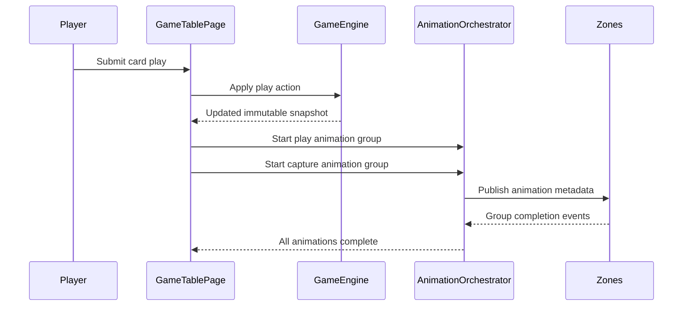
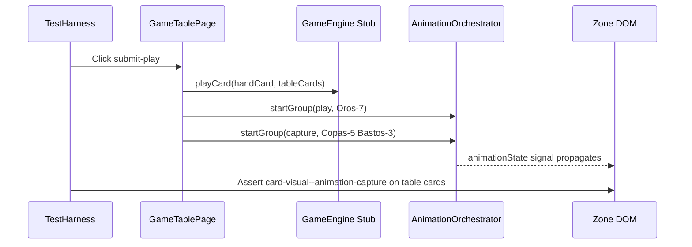

# Review Report: Card Animation System — T-7 RED Phase (Tests Only)

**Review Mode:** Incremental (T-7: Implement player play and capture animation flows — RED phase tests)
**Source:** `docs/specs/ui/card-animations/`
**Reviewed against:** proposal.md, spec.md, user-stories.md, bdd-test.md, design.md, tasks.md
**Scope:** Unit tests in `game-table-page.spec.ts` (T-7 tagged), E2E feature file `player-play-capture-animations.feature`, E2E step definitions `player-play-capture-animations.ts`

## 1. Executive Summary

The T-7 RED phase introduces three unit tests and one E2E feature file with four scenarios covering player play and capture animation orchestration. The unit tests are well-constructed and meaningfully verify the orchestrator integration contract. However, the E2E step definitions contain pervasive duplicate assertions — six of fourteen Then steps use identical class-presence checks despite claiming to verify distinct behaviours (arc motion, rotation, timing profile, fade/scale). This creates false confidence in scenario-level coverage. The timing assertion for SC-02 uses an unreliable wall-clock approach. All three T-7 acceptance criteria have at least one meaningful test, but the E2E layer needs refinement before it can serve as a genuine quality gate.

- Total findings: 6 (0 Critical, 3 Major, 2 Minor, 1 Note)
- T-7 acceptance criteria coverage: 3 of 3 addressed at orchestration level
- SC traceability: SC-01, SC-02, SC-04, SC-05 all have step definitions
- Assertion quality: Unit tests meaningful; E2E partially meaningful (duplicate assertions)

## 2. Architecture Comparison

### 2.1 Planned Orchestration Flow (from design.md)

### 2.2 Tested Orchestration Flow (from T-7 unit tests)

### 2.3 Drift Analysis

The unit tests accurately model the planned orchestration sequence. The GameTablePage calls `startGroup` for both play and capture actions after `playCard` completes, which aligns with AD-1 and AD-2. No structural drift detected between the tested flow and the design document expectations. The E2E feature file exercises the same flow through a full lobby-to-game navigation path.

## 3. Findings

### RV-01: Duplicate E2E assertions masquerade as distinct behaviour verification [Major]

- **Category:** Test Quality
- **Severity:** Major
- **Related:** SC-01, SC-02, SC-04, SC-05, FR-1, FR-2, T-7
- **Description:** Six of fourteen Then step definitions in the E2E step file use identical assertions (checking `have.class` on the same element with the same class name) despite each claiming to verify a different behaviour. Specifically: "movement follows an arc path", "card animation includes a flip or rotation effect", "timing uses a natural ease-in-out motion profile", "captured table cards fade and scale down", and the second assertion in "no captured card animation is staggered" all duplicate adjacent steps verbatim.
- **Expected:** Each BDD step definition should verify the distinct behaviour its Gherkin text describes. Arc path verification should check trajectory or computed transform values. Rotation verification should check rotation-related properties. Fade/scale verification should check opacity or scale state progression.
- **Actual:** Steps assert `have.class, 'card-visual--animation-play'` or `have.class, 'card-visual--animation-capture'` repeatedly without differentiating what aspect they verify.
- **Recommendation:** Each step should assert a distinct observable. For RED phase, acceptable approaches include: asserting distinct data-attributes that the implementation must add (e.g., `data-animation-path="arc"`, `data-animation-rotation="active"`), or asserting computed style properties (transform containing rotate, animation-timing-function containing ease). If distinct assertions are not feasible in RED phase, consolidate steps into fewer, honestly-scoped assertions and add TODO markers for GREEN phase refinement.
- **Impact:** Creates false confidence that arc path, rotation, and easing are independently verified when in reality only class presence is tested once.

### RV-02: SC-04 "removed from table" step does not verify DOM removal [Major]

- **Category:** Test Quality
- **Severity:** Major
- **Related:** SC-04, FR-2, US-2, T-7
- **Description:** The step "captured table cards are removed from the table after animation completion" asserts that `turn-phase-indicator` contains 'awaiting-confirmation' instead of verifying that captured card elements are no longer present in the DOM.
- **Expected:** After animation completes, the step should verify that table card elements (e.g., `[data-testid="table-card-0"]`) no longer exist in the center table zone, matching the BDD specification: "captured table cards are removed from the table after animation completion."
- **Actual:** The step only checks that the turn phase indicator advanced, which is an indirect proxy for completion but does not verify card removal from the table zone.
- **Recommendation:** Assert that the previously-visible table card elements are either absent from the DOM or not visible within the center table zone after the phase transitions.
- **Impact:** A passing test would not catch a bug where animation completes and phase advances but captured cards remain visually present in the table zone.

### RV-03: SC-05 "no staggering" step cannot prove simultaneity [Major]

- **Category:** Test Quality
- **Severity:** Major
- **Related:** SC-05, FR-2, TR-2, US-2, T-7
- **Description:** The step "no captured card animation is staggered after another" uses sequential Cypress `.should('have.class')` calls on individual elements. Cypress retries each assertion independently, meaning one card could have the class applied, then removed, then the next card gets it — and the test would still pass.
- **Expected:** Simultaneity verification should confirm both cards hold the animation class within the same observation frame, proving they started together rather than in sequence.
- **Actual:** Two sequential `.should()` calls that independently retry until each passes, providing no guarantee both classes coexist at the same instant.
- **Recommendation:** Use a single assertion that checks both elements in one callback (e.g., a `.should()` on the parent container that verifies both children simultaneously), or capture animation-start timestamps via a test API and assert they are within a tight tolerance window.
- **Impact:** Test cannot distinguish simultaneous animation from rapid-sequential animation where one card finishes before the next starts.

### RV-04: SC-02 timing assertion uses unreliable wall-clock measurement [Minor]

- **Category:** Test Quality
- **Severity:** Minor
- **Related:** SC-02, FR-1, TR-2, US-1, T-7
- **Description:** The step "animation duration is within 800 to 1200 milliseconds" captures `Date.now()` before the submit click and compares elapsed time after several preceding Then assertions have already run (including DOM queries and Cypress retry loops).
- **Expected:** Animation duration measurement should isolate the time between animation start and animation end, excluding Cypress overhead and prior assertion processing.
- **Actual:** `submissionTimestamp` is captured before `submit-play` click, but the timing assertion runs after three preceding Then steps (class checks with Cypress retry). The measured interval includes Cypress processing time, not just animation duration.
- **Recommendation:** Either use CSS `animation-duration` computed style assertion (verify the declared duration value) or introduce a test API that exposes animation start/end timestamps from the orchestrator for precise measurement.
- **Impact:** In RED phase this test will fail (no animation exists). Once implemented, flaky behaviour is likely due to variable Cypress overhead adding to measured duration.

### RV-05: Unit test SC-01/SC-02 traceability is semantically loose [Minor]

- **Category:** Test Coverage Alignment
- **Severity:** Minor
- **Related:** SC-01, SC-02, FR-1, T-7
- **Description:** The first unit test is tagged `SC-01 / SC-02 / FR-1` but verifies only that `startGroup` is called with action type 'play' and the correct card ID. SC-01 requires "arc path" and "settles into final position." SC-02 requires "rotation", "800-1200ms", and "ease-in-out profile." None of these visual/timing behaviours are verified by this test.
- **Expected:** Test traceability tags should match the scope of what the test actually verifies. The test verifies the orchestrator contract (that a play group is started), which relates to FR-1 and the orchestration aspect of AD-1/AD-2.
- **Actual:** Tags claim coverage of full SC-01 and SC-02 scenarios, but the test only covers the orchestrator invocation portion.
- **Recommendation:** Narrow the test name to reference the specific sub-behaviour verified (e.g., "starts a play animation group") and note SC-01/SC-02 as partial coverage. Full SC-01/SC-02 coverage requires visual layer validation in E2E or additional unit tests for CardVisual rendering.
- **Impact:** Misleading traceability could lead to premature sign-off of SC-01/SC-02 based on unit test pass alone.

### RV-06: Unit tests and E2E collectively cover all three T-7 acceptance criteria [Note]

- **Category:** Test Coverage Alignment
- **Severity:** Note
- **Related:** T-7, AD-1, AD-2, FR-1, FR-2
- **Description:** Despite the assertion quality concerns in E2E, the overall test suite does address each T-7 acceptance criterion at least once with a meaningful assertion: (1) play group started on submit, (2) capture group started with correct cards, (3) simultaneous capture class application on DOM. The orchestration-level coverage is sound; the gap is in visual behaviour verification which appropriately belongs to GREEN phase CSS implementation.
- **Expected:** RED phase tests define the contract that GREEN implementation must satisfy.
- **Actual:** The contract is well-defined at orchestrator boundary. Visual concerns (arc path, rotation, fade) are represented in E2E steps but not yet meaningfully distinguishable from class presence.
- **Recommendation:** No action for RED phase. Track as a GREEN phase follow-up to strengthen E2E visual assertions once CSS animations are implemented.
- **Impact:** None for RED phase gating. Acceptable technical debt for the current phase.

## 4. Traceability Matrix

| Finding | Severity | Category                | Related Spec                                | Status       |
| ------- | -------- | ----------------------- | ------------------------------------------- | ------------ |
| RV-01   | Major    | Test Quality            | SC-01, SC-02, SC-04, SC-05, FR-1, FR-2, T-7 | Open         |
| RV-02   | Major    | Test Quality            | SC-04, FR-2, US-2, T-7                      | Open         |
| RV-03   | Major    | Test Quality            | SC-05, FR-2, TR-2, US-2, T-7                | Open         |
| RV-04   | Minor    | Test Quality            | SC-02, FR-1, TR-2, US-1, T-7                | Open         |
| RV-05   | Minor    | Test Coverage Alignment | SC-01, SC-02, FR-1, T-7                     | Open         |
| RV-06   | Note     | Test Coverage Alignment | T-7, AD-1, AD-2, FR-1, FR-2                 | Acknowledged |

## 5. Spec Compliance Summary (T-7 Scope)

| Requirement                   | Status     | Notes                                                                             |
| ----------------------------- | ---------- | --------------------------------------------------------------------------------- |
| FR-1 (Card Play Animation)    | ⚠️ Partial | Orchestrator call tested; arc path and rotation not distinctly verified in E2E    |
| FR-2 (Card Capture Animation) | ⚠️ Partial | Capture group tested; glow/fade not distinctly verified; DOM removal not asserted |
| TR-2 (Transform/opacity only) | ⚠️ Partial | Class presence tested but no assertion on actual CSS property constraints         |
| TR-5 (Responsive pathing)     | ❌ Not Met | No responsive viewport assertions in T-7 test scope                               |
| US-1                          | ⚠️ Partial | Play orchestration covered; timing, arc, position settle not verified             |
| US-2                          | ⚠️ Partial | Capture orchestration covered; glow behaviour and DOM removal not verified        |

## 6. Task Completion Summary

| Task | Title                                             | Status                 | Findings                                 |
| ---- | ------------------------------------------------- | ---------------------- | ---------------------------------------- |
| T-7  | Implement player play and capture animation flows | ⚠️ Partial (RED tests) | RV-01, RV-02, RV-03, RV-04, RV-05, RV-06 |

## 7. Test Coverage Summary

| Scenario | Step Definitions | Meaningful | Findings                                                               |
| -------- | ---------------- | ---------- | ---------------------------------------------------------------------- |
| SC-01    | ✅ Yes           | ⚠️ Partial | RV-01 (arc path step is duplicate class check)                         |
| SC-02    | ✅ Yes           | ⚠️ Partial | RV-01 (rotation, timing, easing steps are duplicate or fragile), RV-04 |
| SC-04    | ✅ Yes           | ⚠️ Partial | RV-01 (fade/scale step is duplicate), RV-02 (removal not verified)     |
| SC-05    | ✅ Yes           | ⚠️ Partial | RV-03 (simultaneity not provable with current assertion approach)      |

## 8. Test Quality Summary

| Test File                              | Type        | Meaningful Assertions | Issues                                                                                         |
| -------------------------------------- | ----------- | --------------------- | ---------------------------------------------------------------------------------------------- |
| game-table-page.spec.ts (T-7 tests)    | Unit        | ✅ Yes                | Minor: traceability tags overstate coverage                                                    |
| player-play-capture-animations.feature | E2E Feature | ✅ Yes                | Well-structured Gherkin, appropriate background                                                |
| player-play-capture-animations.ts      | E2E Steps   | ⚠️ Partial            | 6 of 14 Then steps are duplicate class-check assertions; timing fragile; simultaneity unproven |

## 9. Security Cross-Reference

No security-relevant findings for this RED phase test review. Animation orchestration tests do not introduce input validation, data handling, or injection surface concerns. Security report generation is not warranted for test-only scope.

## 10. Recommendations

### Major (fix before merge)

1. **Differentiate E2E step assertions (RV-01):** Each Then step should verify a distinct observable. For RED phase, introduce placeholder assertions with explicit fail conditions that the GREEN implementation must satisfy (e.g., check for distinct data attributes, computed style properties, or animation metadata exposed via test API). Remove verbatim duplicate assertions.
2. **Assert DOM removal for capture completion (RV-02):** Add `.should('not.exist')` or `.should('have.length', 0)` assertion on the captured card test-id selectors after animation completes.
3. **Prove simultaneity with a single-frame observation (RV-03):** Replace sequential independent assertions with a single callback that checks both elements within one `.should()` evaluation, ensuring coexistence of animation classes is verified atomically.

### Minor (improvement)

1. **Replace wall-clock timing with declarative assertion (RV-04):** Assert CSS `animation-duration` computed value or use orchestrator test API timestamps rather than `Date.now()` differences.
2. **Narrow unit test traceability tags (RV-05):** Update test descriptions to indicate partial SC coverage and add a comment noting which SC aspects remain for visual-layer tests.

### Notes (informational)

1. **RED phase coverage is architecturally sound (RV-06):** The orchestrator integration contract is well-defined. Visual behaviour verification is appropriately deferred to GREEN phase. Track E2E refinement as a follow-up when CSS animations are implemented.
