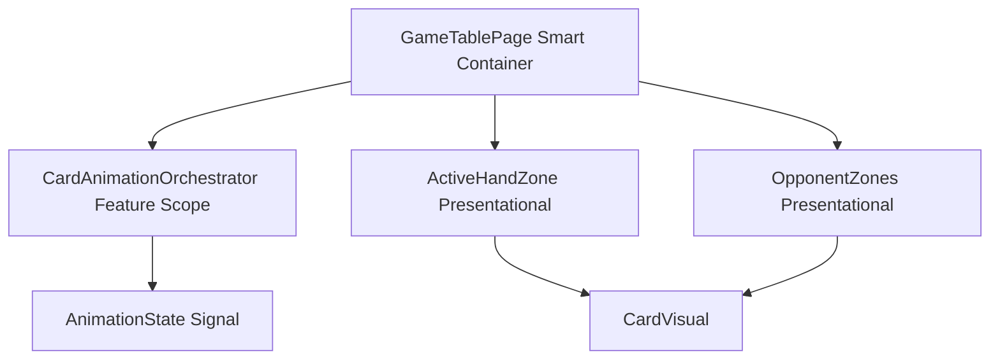
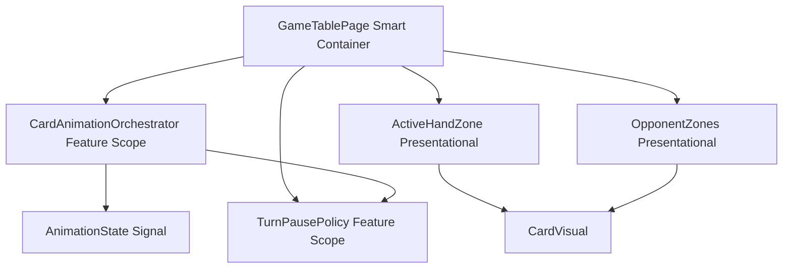

# Review Report: Card Animation System — T-8 Deal and Opponent Animation Flows (GREEN v2)

**Review Mode:** Incremental (T-8: Implement deal and opponent animation flows)
**Source:** `docs/specs/ui/card-animations/`
**Reviewed against:** proposal.md, spec.md, user-stories.md, bdd-test.md, design.md, tasks.md

## 1. Executive Summary

The T-8 GREEN implementation faithfully delivers deal and opponent-play animation orchestration. The deal path correctly detects newly dealt cards by comparing hand snapshots before and after confirm, creates a simultaneous animation group, propagates deal metadata to ActiveHandZone, and finalizes the group on a timer. The opponent-play path integrates within the existing AI turn orchestration flow, starting an animation group during the resolving phase and publishing opponent metadata to OpponentZones. CSS keyframes use GPU-friendly properties only. The implementation aligns well with the architecture in design.md and satisfies the core T-8 acceptance criteria.

- Total findings: 5 (0 Critical, 1 Major, 3 Minor, 1 Note)
- Spec compliance: 5 of 7 traceable requirements fully met, 2 partial
- Architecture alignment: aligned (minor metadata derivation nuance)
- Test quality: meaningful

## 2. Architecture Comparison

### 2.1 Planned Component Tree (T-8 Scope)

### 2.2 Actual Component Tree (T-8 Scope)

### 2.3 Drift Analysis

No meaningful structural drift. The component hierarchy matches the planned design. CardAnimationOrchestrator is feature-scoped and provided at GameTablePage level as designed. OpponentZones receives animation metadata through an Input binding as planned. The only addition beyond the minimal T-8 diagram is TurnPausePolicy's involvement in resolving the animation completion delay — this is expected per AD-2 and AD-3.

## 3. Findings

### RV-01: No deal-to-opponent animation when AI hand is replenished [Major]

- **Category:** Spec Compliance
- **Severity:** Major
- **Related:** FR-5, FR-8, US-5, US-8, AD-7
- **Description:** FR-5 specifies "When the AI opponent receives new cards (hand replenishment), a subtle animation indicates cards being dealt." US-5 acceptance criterion 2 states "When the AI opponent receives new cards (hand replenishment), a subtle animation indicates cards being dealt." The implementation provides no animation group or metadata when the AI player's hand grows after a round deal. The `startDealAnimationForNewHandCards` method is only invoked for the active player identified by `activePlayerIdBeforeConfirm`, never for the AI opponent.
- **Expected:** After a turn confirmation causes the AI player to receive new cards (hand count increases), an animation group of type deal (or a distinct sub-type) should be started with corresponding metadata delivered to OpponentZones, allowing CardVisual instances in the AI hand zone to render the deal animation class.
- **Actual:** AI hand count changes are tracked reactively via the `aiHandCardCount` computed signal, but no animation orchestration occurs for that transition. The AI only receives the `opponent-play` animation during its active play phase.
- **Recommendation:** Extend the post-confirm flow or a post-confirm hook to detect when the AI player's hand grows and start a deal animation group targeting the opponent zone. The existing OpponentZonesAnimationMetadata structure already supports per-card animation state and could carry a deal visual state.
- **Impact:** Players do not see any dealing motion for AI hand replenishment. The experience gap is noticeable in round transitions where both players receive new cards — the player sees deal animation, the AI does not. This was flagged in the RED review (RV-01) and remains unaddressed.

### RV-02: Opponent animation metadata derivation is index-based rather than card-identity-based [Minor]

- **Category:** Architecture Drift
- **Severity:** Minor
- **Related:** AD-1, AD-4, TR-1
- **Description:** The `opponentAnimationMetadata` computed signal maps animation card IDs to indexes using a sequential map over `activeAnimationCardIds()`, which assigns animation state to sequential indexes regardless of which specific AI card is animating. This differs from the hand and table metadata derivation which uses card identity matching. The fallback path uses `aiTurnAnimationState.selectedCardIndex` when no active group is running, which is more precise.
- **Expected:** Per the animation contracts, OpponentCardAnimationMetadata uses `cardIndex` rather than `cardId`. This is architecturally intentional since AI cards are face-down and lack stable identity for the presentation layer. However, the index mapping in the non-fallback branch blindly maps all active card IDs to sequential indices, which would be incorrect if the opponent-play group contained a card at a non-zero index.
- **Actual:** In practice, the opponent-play group always contains exactly one card (the played card), and the fallback branch (which uses `selectedCardIndex`) activates when `activeAnimationVisualState` is null but the AI phase is not idle. The non-fallback path executes only during a brief window when the animation group is actively running. Given the single-card constraint, the index 0 mapping is functionally correct.
- **Recommendation:** No immediate fix needed. Document that the index-based mapping assumes single-card opponent-play groups. If future multi-card opponent actions are introduced, this derivation must be refactored to map card IDs to their actual hand indexes.
- **Impact:** Minimal with current single-card opponent-play constraint. Could produce incorrect animation targeting if multi-card AI actions are added later.

### RV-03: CSS keyframe for deal does not include rotation as specified in FR-3 [Minor]

- **Category:** Spec Compliance
- **Severity:** Minor
- **Related:** FR-3, TR-2, US-3
- **Description:** FR-3 specifies "Cards rotate 180°–360° during flight to convey dealing action." US-3 acceptance criterion 2 states "Cards rotate 180–360° during the flight to convey dealing action." The `card-deal-slide` keyframe uses only `translateY` and `scale` transforms — no `rotate` transform is included.
- **Expected:** The keyframe should include a rotation component (e.g., `rotate(180deg)` to `rotate(360deg)`) during the 0% to 100% progression.
- **Actual:** The keyframe animates opacity from 0.25 to 1, translateY from -18px to -3px, and scale from 0.95 to 1.01. No rotation is applied.
- **Recommendation:** Add a rotation transform to the `card-deal-slide` keyframe, composing it with the existing translate and scale. This satisfies FR-3 while remaining GPU-friendly per AD-4.
- **Impact:** The deal animation lacks the specified "dealing" motion cue. Cards slide in without the rotation that conveys shuffling or dealing. Visual quality is reduced but functionality is unaffected.

### RV-04: E2E SC-12 step timing sensitivity (carried forward from RED review) [Minor]

- **Category:** Test Quality
- **Severity:** Minor
- **Related:** SC-12, TR-4, AD-3
- **Description:** The E2E step definition for SC-12 relies on catching the AI animation class during a brief transient window. The step clicks confirm, then immediately queries the AI hand zone for the `card-visual--animation-opponent` class with an 8-second timeout. This is generous but fundamentally races against the animation lifecycle. The TurnPausePolicy runtime override is not leveraged in E2E mode to extend observation windows.
- **Expected:** Step definitions use deterministic synchronization — waiting for a stable marker (e.g., `data-ai-phase="resolving"`) before asserting the animation class, or extending the animation hold duration via the test override mechanism.
- **Actual:** The step uses `cy.get` with a large timeout, which is adequate for most CI environments but could flake under heavy load.
- **Recommendation:** Add a deterministic gate before asserting the animation class. Either wait for a `data-ai-phase` attribute or configure the pause policy test override to hold the resolving state long enough for reliable observation.
- **Impact:** Low probability of E2E flakiness on slow CI runners. No functional correctness impact.

### RV-05: Card ID derivation is centralized in GameTablePage via toCardId [Note]

- **Category:** Code Quality
- **Severity:** Note
- **Related:** TR-1, AD-1
- **Description:** The RED review (RV-03) noted that card ID format was implicitly assumed in tests. The GREEN implementation centralizes the `{suit}-{rank}` derivation in the private `toCardId` method on GameTablePage. All animation group requests use this method consistently for deal, play, capture, and opponent-play actions.
- **Expected:** A shared utility or method for card ID derivation.
- **Actual:** The derivation lives as a private method on GameTablePage. While not a shared utility in a separate file, it is the single source of truth for all animation operations within the feature.
- **Recommendation:** No action required. If other components outside GameTablePage need to derive card IDs in the future, extract to a shared utility.
- **Impact:** None. Convention is consistent across all T-8 animation paths.

## 4. Traceability Matrix

<<<<<<< Updated upstream
| Finding | Severity | Category | Related Spec | Status |
| ------- | -------- | ------------------ | ---------------------------- | ------ |
| RV-01 | Major | Spec Compliance | FR-5, FR-8, US-5, US-8, AD-7 | Open |
| RV-02 | Minor | Architecture Drift | AD-1, AD-4, TR-1 | Open |
| RV-03 | Minor | Spec Compliance | FR-3, TR-2, US-3 | Open |
| RV-04 | Minor | Test Quality | SC-12, TR-4, AD-3 | Open |
| RV-05 | Note | Code Quality | TR-1, AD-1 | Closed |

## 5. Spec Compliance Summary

| Requirement | Status     | Notes                                                                      |
| ----------- | ---------- | -------------------------------------------------------------------------- |
| FR-3        | ⚠️ Partial | Deal animation present and simultaneous; missing rotation per spec (RV-03) |
| FR-5        | ⚠️ Partial | AI play animated; AI hand replenishment has no animation (RV-01)           |
| FR-8        | ✅ Met     | AI play uses same orchestration, timing, and visual language as player     |
| TR-2        | ✅ Met     | CSS keyframes use transform and opacity only; GPU-friendly                 |
| TR-5        | ✅ Met     | Coordinate-based paths not required for T-8; positions resolve via layout  |
| US-3        | ⚠️ Partial | Deal is simultaneous and settles into hand; missing rotation (RV-03)       |
| US-5        | ⚠️ Partial | AI play path fully animated; replenishment path has no animation (RV-01)   |
| US-8        | ✅ Met     | AI turn orchestration with animation is visible and follows player timing  |

## 6. Task Completion Summary

| Task | Title | Status | Findings |
| ---- | ----- | ------ | -------- |

=======
| Finding | Severity | Category | Related Spec | Status |
|---------|----------|----------|-------------|--------|
| RV-01 | Major | Spec Compliance | FR-5, FR-8, US-5, US-8, AD-7 | Open |
| RV-02 | Minor | Architecture Drift | AD-1, AD-4, TR-1 | Open |
| RV-03 | Minor | Spec Compliance | FR-3, TR-2, US-3 | Open |
| RV-04 | Minor | Test Quality | SC-12, TR-4, AD-3 | Open |
| RV-05 | Note | Code Quality | TR-1, AD-1 | Closed |

## 5. Spec Compliance Summary

| Requirement | Status     | Notes                                                                      |
| ----------- | ---------- | -------------------------------------------------------------------------- |
| FR-3        | ⚠️ Partial | Deal animation present and simultaneous; missing rotation per spec (RV-03) |
| FR-5        | ⚠️ Partial | AI play animated; AI hand replenishment has no animation (RV-01)           |
| FR-8        | ✅ Met     | AI play uses same orchestration, timing, and visual language as player     |
| TR-2        | ✅ Met     | CSS keyframes use transform and opacity only; GPU-friendly                 |
| TR-5        | ✅ Met     | Coordinate-based paths not required for T-8; positions resolve via layout  |
| US-3        | ⚠️ Partial | Deal is simultaneous and settles into hand; missing rotation (RV-03)       |
| US-5        | ⚠️ Partial | AI play path fully animated; replenishment path has no animation (RV-01)   |
| US-8        | ✅ Met     | AI turn orchestration with animation is visible and follows player timing  |

## 6. Task Completion Summary

| Task | Title | Status | Findings |
| ---- | ----- | ------ | -------- |

> > > > > > > Stashed changes
> > > > > > > | T-8 | Implement deal and opponent animation flows | ⚠️ Partial | RV-01, RV-02, RV-03, RV-04 |

## 7. Test Coverage Summary

| Scenario | Step Definitions | Meaningful | Findings |
<<<<<<< Updated upstream
| -------- | ---------------- | ---------- | -------- |
| SC-07 | ✅ Yes | ✅ Yes | — |
| SC-08 | ✅ Yes | ✅ Yes | — |
| SC-12 | ✅ Yes | ✅ Yes | RV-04 |

## 8. Test Quality Summary

| Test File                              | Type                 | Meaningful Assertions | Issues                                                    |
| -------------------------------------- | -------------------- | --------------------- | --------------------------------------------------------- |
| game-table-page.deal-opponent.spec.ts  | Unit/Integration     | ✅ Yes                | None — all 8 tests verify real orchestration behavior     |
| deal-opponent-animations.feature       | E2E Gherkin          | ✅ Yes                | None                                                      |
| deal-opponent-animations.ts            | E2E Step Definitions | ✅ Yes                | Timing sensitivity on SC-12 (RV-04)                       |
| opponent-zones.spec.ts (T-5 tests)     | Unit                 | ✅ Yes                | None — metadata propagation and suppression verified      |
| card-visual.spec.ts (animation states) | Unit                 | ✅ Yes                | None — parametrized test covers deal and opponent classes |

=======
|----------|-----------------|------------|----------|
| SC-07 | ✅ Yes | ✅ Yes | — |
| SC-08 | ✅ Yes | ✅ Yes | — |
| SC-12 | ✅ Yes | ✅ Yes | RV-04 |

## 8. Test Quality Summary

| Test File                              | Type                 | Meaningful Assertions | Issues                                                    |
| -------------------------------------- | -------------------- | --------------------- | --------------------------------------------------------- |
| game-table-page.deal-opponent.spec.ts  | Unit/Integration     | ✅ Yes                | None — all 8 tests verify real orchestration behavior     |
| deal-opponent-animations.feature       | E2E Gherkin          | ✅ Yes                | None                                                      |
| deal-opponent-animations.ts            | E2E Step Definitions | ✅ Yes                | Timing sensitivity on SC-12 (RV-04)                       |
| opponent-zones.spec.ts (T-5 tests)     | Unit                 | ✅ Yes                | None — metadata propagation and suppression verified      |
| card-visual.spec.ts (animation states) | Unit                 | ✅ Yes                | None — parametrized test covers deal and opponent classes |

> > > > > > > Stashed changes

## 9. Security Cross-Reference

See `docs/specs/ui/card-animations/security-report_T-8.md` for the full security analysis.

<<<<<<< Updated upstream
| SEC ID | Severity | OWASP | Summary |
| ------ | -------- | -------- | ------------------------------------------------------- |
=======
| SEC ID | Severity | OWASP | Summary |
|--------|----------|-------|---------|

> > > > > > > Stashed changes
> > > > > > > | SEC-01 | Medium | A06:2021 | Vulnerable brace-expansion dev dependency (not runtime) |

No Critical or High security findings. The T-8 feature code introduces no new security surfaces.

## 10. Recommendations

### Major (fix before merge)

<<<<<<< Updated upstream

1. **RV-01:** Implement AI hand replenishment animation. When the AI player's hand grows after a round deal, start a deal animation group targeting OpponentZones so users see dealing motion for both players. This fulfils FR-5 and US-5 acceptance criterion 2.

### Minor (improvement)

=======

1. **RV-01:** Implement AI hand replenishment animation. When the AI player's hand grows after a round deal, start a deal animation group targeting OpponentZones so users see dealing motion for both players. This fulfils FR-5 and US-5 acceptance criterion 2.

### Minor (improvement)

> > > > > > > Stashed changes

1. **RV-03:** Add rotation (180–360 degrees) to the `card-deal-slide` keyframe to satisfy FR-3's specified dealing motion cue. Compose with existing translate and scale.
2. **RV-04:** Add deterministic AI phase synchronization to the E2E SC-12 step to eliminate timing sensitivity.
3. **RV-02:** Document the single-card assumption in the opponent metadata index mapping for future maintainability.

### Notes (informational)

<<<<<<< Updated upstream

=======

> > > > > > > Stashed changes

1. **RV-05:** Card ID derivation is centralized and consistent. No action needed.
