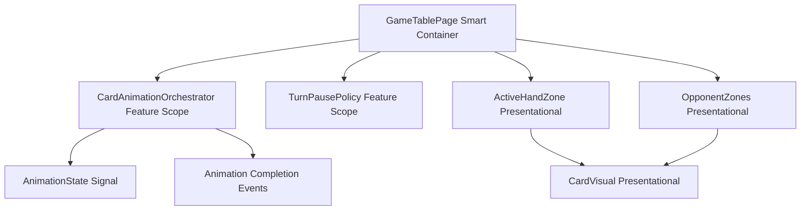
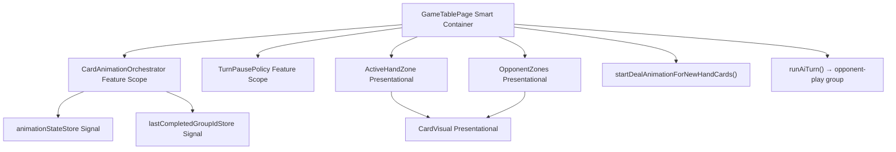

# Review Report: Card Animation System — T-8 Deal and Opponent Animation Flows (GREEN Phase)

**Review Mode:** Incremental (T-8: Implement deal and opponent animation flows)
**Source:** `docs/specs/ui/card-animations/`
**Reviewed against:** proposal.md, spec.md, user-stories.md, bdd-test.md, design.md, tasks.md

## 1. Executive Summary

The GREEN phase implementation of T-8 delivers functional deal and opponent-play animation orchestration that aligns well with AD-4, AD-7, and the majority of FR-3/FR-5/FR-8/TR-2/TR-5 requirements. The deal animation correctly detects newly dealt cards by comparing hand state before/after confirm and creates a single simultaneous group. The opponent-play animation integrates cleanly into the AI turn flow with proper orchestrator lifecycle. Unit tests are meaningful and verify real behaviour. E2E tests assert DOM-level CSS class presence and computed style values.

Two intentional deferrals (rotation in deal keyframe, reduced-motion CSS) were confirmed by the developer. One specification gap persists from the RED review: no animation for AI hand replenishment (deal-to-opponent).

- Total findings: 5 (0 Critical, 0 Major, 3 Minor, 2 Note)
- Spec compliance: 5 of 7 traceable requirements fully met, 2 partial
- Architecture alignment: aligned (minor keyframe detail deferred)
- Test quality: meaningful

## 2. Architecture Comparison

### 2.1 Planned Component Tree (design.md section 2.1, relevant subset)

### 2.2 Actual Component Tree (as implemented)

### 2.3 Drift Analysis

The actual component tree matches the planned hierarchy with no structural deviations. GameTablePage orchestrates both deal and opponent-play flows directly, which aligns with design.md section 4.1 stating GameTablePage "orchestrates turn lifecycle, animation lifecycle, and pause policy." The orchestrator exposes `animationState` and `lastCompletedGroupId` as read-only signals consistent with AD-1. No components were added, renamed, or removed relative to the plan. Animation metadata flows correctly from orchestrator through GameTablePage computed properties to ActiveHandZone and OpponentZones as presentational inputs.

## 3. Findings

### RV-01: Deal keyframe omits FR-3 rotation requirement [Minor]

- **Category:** Spec Compliance
- **Severity:** Minor
- **Related:** FR-3, TR-2, TR-5, US-3
- **Description:** FR-3 requires "Cards rotate 180°–360° during flight to convey 'dealing' action." US-3 acceptance criteria item 2 states "Cards rotate 180–360° during the flight to convey dealing action." The `card-deal-slide` keyframe in card-visual.scss uses only `translateY` and `scale` transforms. No `rotate` transform is present.
- **Expected:** The `card-deal-slide` keyframe should include a rotation (e.g., `rotate(360deg)` or `rotateY(180deg)`) during the 0%–100% progression.
- **Actual:** The keyframe animates `opacity`, `translateY`, and `scale` only. Motion suggests a slide-in from above but no rotational dealing effect.
- **Recommendation:** Add a `rotate` transform component to `card-deal-slide` keyframe. This remains compliant with AD-4 since `rotate` is a transform sub-property (GPU-composited). Developer confirmed this is intentionally deferred to a later task.
- **Impact:** Dealing motion appears as a simple fade-slide rather than the specified dealing-with-rotation effect. Visually less distinctive but functionally correct.

### RV-02: No deal-to-opponent animation for AI hand replenishment [Minor]

- **Category:** Spec Compliance
- **Severity:** Minor
- **Related:** FR-5, US-5, US-8
- **Description:** FR-5 specifies "For card draws (hand count decreases): Visual decrease in card count with a subtle fade/scale effect." US-5 acceptance criteria item 2 states "When the AI opponent receives new cards (hand replenishment), a subtle animation indicates cards being dealt." The `startDealAnimationForNewHandCards` method only fires after the player who confirmed their turn gets new cards. In single-player mode, when the game deals new cards to the AI after a round boundary, no animation metadata is propagated to OpponentZones for a deal-style visual.
- **Expected:** When the AI's hand count increases (round-start deal or replenishment), OpponentZones should receive animation metadata with a deal or replenishment visual cue.
- **Actual:** The AI only receives `opponent-play` animation metadata when it plays a card. No deal animation targets the AI's incoming cards. The `activeHandCards` computed always shows `players[0]` in single-player mode, so deal groups targeting the AI player's card IDs have no visual path to OpponentZones.
- **Recommendation:** Add a secondary check in `confirmTurnWithSequencing` or the round-start flow that detects AI hand growth and propagates a brief deal-style animation to OpponentZones. This was flagged in the RED review (RV-01) and persists in GREEN.
- **Impact:** Players cannot visually observe when the AI receives new cards. The AI hand count updates instantly. This is a subtle UX gap, not a functional defect.

### RV-03: E2E SC-12 timing sensitivity (inherited from RED review) [Minor]

- **Category:** Test Quality
- **Severity:** Minor
- **Related:** SC-12, TR-4, AD-3
- **Description:** The E2E step definition for SC-12 clicks confirm-turn then immediately waits for the AI hand zone animation class. The AI resolving phase produces a brief animation window that could be missed on slow CI runners. The 8-second timeout mitigates this but the step fundamentally races against animation lifecycle.
- **Expected:** The step definition should synchronize against a deterministic marker (e.g., a data attribute indicating AI-resolving phase) before asserting the animation CSS class.
- **Actual:** Step uses `cy.get(selectors.aiHandZone, { timeout: 8000 }).should('exist')` followed by assertion on `.card-visual--animation-opponent` class with another 8-second timeout. The generous timeouts reduce flake risk but don't eliminate the race condition.
- **Recommendation:** Add a `data-ai-phase` attribute to the game table page template that exposes the current AI phase, and use it as a synchronization point in E2E steps. Alternatively, leverage TurnPausePolicy's runtime override in E2E configuration to extend the animation window.
- **Impact:** Potential intermittent E2E failures on resource-constrained CI environments. Low probability given the generous timeouts.

### RV-04: prefers-reduced-motion CSS rule deferred to T-11 [Note]

- **Category:** Spec Compliance
- **Severity:** Note
- **Related:** TR-6, NFR-3, AD-5
- **Description:** card-visual.scss contains no `@media (prefers-reduced-motion: reduce)` media query. This is expected: T-11 ("Implement reduced-motion compatibility path") is the dedicated task for this concern and depends on T-8.
- **Expected:** Not required in T-8. T-11 will add the media query to disable animation timing.
- **Actual:** No media query present. Animation durations remain constant regardless of user preference.
- **Recommendation:** No action required for T-8. Ensure T-11 addresses this.
- **Impact:** None for T-8 scope. Users with reduced-motion preference currently see full animations until T-11 is implemented.

### RV-05: Performance hints (will-change, contain) deferred to T-14 [Note]

- **Category:** Code Quality
- **Severity:** Note
- **Related:** TR-7, NFR-1
- **Description:** TR-7 specifies "Apply `will-change: transform, opacity` to animating cards before animation starts" and "Use `contain: strict` on animation containers to isolate repaints." Neither property is present in card-visual.scss. T-14 ("Performance tuning") is the dedicated task for these optimizations.
- **Expected:** Not required in T-8. T-14 will add GPU compositing hints.
- **Actual:** Neither `will-change` nor `contain` appear in any animation SCSS file.
- **Recommendation:** No action required for T-8.
- **Impact:** None for T-8 scope. Performance may not reach 60fps target on lower-end devices until T-14.

## 4. Traceability Matrix

<<<<<<< Updated upstream
| Finding | Severity | Category | Related Spec | Status |
| ------- | -------- | --------------- | ---------------------- | ------------------------- |
| RV-01 | Minor | Spec Compliance | FR-3, TR-2, TR-5, US-3 | Open (confirmed deferred) |
| RV-02 | Minor | Spec Compliance | FR-5, US-5, US-8 | Open |
| RV-03 | Minor | Test Quality | SC-12, TR-4, AD-3 | Open |
| RV-04 | Note | Spec Compliance | TR-6, NFR-3, AD-5 | Expected (T-11) |
| RV-05 | Note | Code Quality | TR-7, NFR-1 | Expected (T-14) |

## 5. Spec Compliance Summary

| Requirement | Status     | Notes                                                                                                        |
| ----------- | ---------- | ------------------------------------------------------------------------------------------------------------ |
| FR-3        | ⚠️ Partial | Deal animation works (simultaneous, correct timing, settles into position) but rotation per spec is deferred |
| FR-5        | ⚠️ Partial | Opponent-play animation implemented; deal-to-opponent (hand replenishment) not implemented                   |
| FR-8        | ✅ Met     | AI turn animations execute with same timing and easing as player actions                                     |
| TR-2        | ✅ Met     | All animations use CSS keyframes with transform/opacity only, cubic-bezier easing                            |
| TR-5        | ✅ Met     | Card paths use coordinate-based positioning (translateY offsets from source positions)                       |
| AD-4        | ✅ Met     | Only transform and opacity animated; no layout-affecting properties                                          |
| AD-7        | ✅ Met     | Opponent animation scope is single-player AI only; no multiplayer paths                                      |

## 6. Task Completion Summary

| Task | Title                                       | Status     | Findings     |
| ---- | ------------------------------------------- | ---------- | ------------ |
| T-8  | Implement deal and opponent animation flows | ⚠️ Partial | RV-01, RV-02 |

**Acceptance Criteria Assessment:**

=======
| Finding | Severity | Category | Related Spec | Status |
|---------|----------|----------|-------------|--------|
| RV-01 | Minor | Spec Compliance | FR-3, TR-2, TR-5, US-3 | Open (confirmed deferred) |
| RV-02 | Minor | Spec Compliance | FR-5, US-5, US-8 | Open |
| RV-03 | Minor | Test Quality | SC-12, TR-4, AD-3 | Open |
| RV-04 | Note | Spec Compliance | TR-6, NFR-3, AD-5 | Expected (T-11) |
| RV-05 | Note | Code Quality | TR-7, NFR-1 | Expected (T-14) |

## 5. Spec Compliance Summary

| Requirement | Status     | Notes                                                                                                        |
| ----------- | ---------- | ------------------------------------------------------------------------------------------------------------ |
| FR-3        | ⚠️ Partial | Deal animation works (simultaneous, correct timing, settles into position) but rotation per spec is deferred |
| FR-5        | ⚠️ Partial | Opponent-play animation implemented; deal-to-opponent (hand replenishment) not implemented                   |
| FR-8        | ✅ Met     | AI turn animations execute with same timing and easing as player actions                                     |
| TR-2        | ✅ Met     | All animations use CSS keyframes with transform/opacity only, cubic-bezier easing                            |
| TR-5        | ✅ Met     | Card paths use coordinate-based positioning (translateY offsets from source positions)                       |
| AD-4        | ✅ Met     | Only transform and opacity animated; no layout-affecting properties                                          |
| AD-7        | ✅ Met     | Opponent animation scope is single-player AI only; no multiplayer paths                                      |

## 6. Task Completion Summary

| Task | Title                                       | Status     | Findings     |
| ---- | ------------------------------------------- | ---------- | ------------ |
| T-8  | Implement deal and opponent animation flows | ⚠️ Partial | RV-01, RV-02 |

**Acceptance Criteria Assessment:**

> > > > > > > Stashed changes

- "Deal animations enter hand simultaneously" — ✅ Met. `startDealAnimationForNewHandCards` creates a single group with all dealt card IDs. `animation-delay: 0ms` ensures simultaneous rendering.
- "Opponent action visuals are clear and consistent with style system" — ✅ Met. `card-opponent-play` keyframe uses same cubic-bezier easing and 1000ms duration as other animation profiles.
- "Opponent scope remains single-player AI only" — ✅ Met. The `runAiTurn` method guards on `mode === 'Single Player'`.

## 7. Test Coverage Summary

| Scenario | Step Definitions | Meaningful | Findings |
<<<<<<< Updated upstream
| -------- | ---------------- | ---------- | -------- |
| SC-07 | ✅ Yes | ✅ Yes | — |
| SC-08 | ✅ Yes | ✅ Yes | — |
| SC-12 | ✅ Yes | ✅ Yes | RV-03 |

## 8. Test Quality Summary

| Test File                             | Type        | Meaningful Assertions | Issues                                                                                                      |
| ------------------------------------- | ----------- | --------------------- | ----------------------------------------------------------------------------------------------------------- |
| game-table-page.deal-opponent.spec.ts | Unit        | ✅ Yes                | None — all 8 tests assert orchestrator group creation, card IDs, timing lifecycle, and metadata propagation |
| deal-opponent-animations.feature      | E2E Gherkin | ✅ Yes                | SC-12 timing sensitivity (RV-03)                                                                            |
| deal-opponent-animations.ts           | E2E Steps   | ✅ Yes                | Asserts CSS classes, computed animation-duration, animation-timing-function, animation-delay uniformity     |

=======
|----------|-----------------|------------|----------|
| SC-07 | ✅ Yes | ✅ Yes | — |
| SC-08 | ✅ Yes | ✅ Yes | — |
| SC-12 | ✅ Yes | ✅ Yes | RV-03 |

## 8. Test Quality Summary

| Test File                             | Type        | Meaningful Assertions | Issues                                                                                                      |
| ------------------------------------- | ----------- | --------------------- | ----------------------------------------------------------------------------------------------------------- |
| game-table-page.deal-opponent.spec.ts | Unit        | ✅ Yes                | None — all 8 tests assert orchestrator group creation, card IDs, timing lifecycle, and metadata propagation |
| deal-opponent-animations.feature      | E2E Gherkin | ✅ Yes                | SC-12 timing sensitivity (RV-03)                                                                            |
| deal-opponent-animations.ts           | E2E Steps   | ✅ Yes                | Asserts CSS classes, computed animation-duration, animation-timing-function, animation-delay uniformity     |

> > > > > > > Stashed changes

## 9. Security Cross-Reference

No security concerns identified for T-8. The implementation is purely presentational animation orchestration consuming immutable game state. No user input processing, no API calls, no data persistence, and no DOM manipulation via innerHTML or similar patterns. No security report generated.

## 10. Recommendations

### Minor (improvement)

<<<<<<< Updated upstream

=======

> > > > > > > Stashed changes

1. **RV-01:** Add `rotate(360deg)` to the `card-deal-slide` keyframe when the rotation deferral resolves. Track as a follow-up item.
2. **RV-02:** Implement a deal-to-opponent visual cue when AI hand count increases. Consider a brief opacity pulse or scale animation on OpponentZones card slots when replenishment is detected.
3. **RV-03:** Add a `data-ai-phase` attribute to GameTablePage template to enable deterministic E2E synchronization against AI lifecycle phases.

### Notes (informational)

<<<<<<< Updated upstream

=======

> > > > > > > Stashed changes

1. **RV-04/RV-05:** T-11 and T-14 are expected to close the reduced-motion and performance gaps respectively. No action required for T-8.
