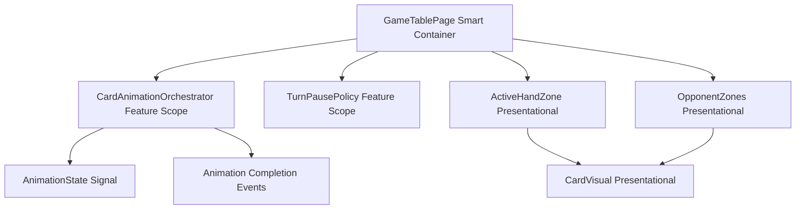
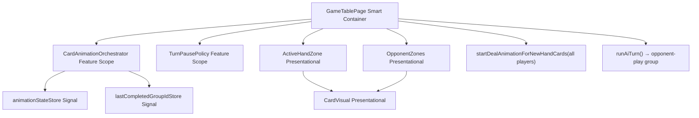

# Review Report: Card Animation System — T-8 Deal and Opponent Animation Flows (v3)

**Review Mode:** Incremental (T-8: Implement deal and opponent animation flows)
**Source:** `docs/specs/ui/card-animations/`
**Reviewed against:** proposal.md, spec.md, user-stories.md, bdd-test.md, design.md, tasks.md

## 1. Executive Summary

T-8 is now substantially complete. The previous Major finding (RV-01 from green-v2: no deal-to-opponent animation) has been resolved — `startDealAnimationForNewHandCards` now iterates ALL players, comparing hand snapshots before and after confirm, and includes newly dealt cards from every player in a single simultaneous group. A dedicated unit test validates the AI deal path. The opponent-play animation remains correctly integrated into the AI turn flow. CSS keyframes use GPU-friendly properties exclusively. Three Minor findings persist (rotation deferral, index-based metadata mapping, E2E timing sensitivity), and two Notes remain for deferred tasks (T-11, T-14).

- Total findings: 5 (0 Critical, 0 Major, 3 Minor, 2 Note)
- Spec compliance: 6 of 7 traceable requirements fully met, 1 partial
- Architecture alignment: aligned
- Test quality: meaningful (with one gap in visual propagation coverage for AI deal)

## 2. Architecture Comparison

### 2.1 Planned Component Tree (design.md section 2.1, T-8 subset)

### 2.2 Actual Component Tree (as implemented)

### 2.3 Drift Analysis

No structural drift. The component hierarchy matches design.md section 2.1 and section 4. GameTablePage orchestrates both deal and opponent-play animation flows directly, consistent with its role as the smart container owning "turn lifecycle, animation lifecycle, and pause policy" (section 4.1). CardAnimationOrchestrator is feature-scoped, provided at GameTablePage level. Animation metadata flows through computed properties from GameTablePage to zone components as presentational inputs. The only evolution since green-v2 is that `startDealAnimationForNewHandCards` now processes all players rather than only the active player — this is an implementation detail that better fulfils the planned data flow without altering component structure.

## 3. Findings

### RV-01: CSS deal keyframe omits rotation specified in FR-3 [Minor]

- **Category:** Spec Compliance
- **Severity:** Minor
- **Related:** FR-3, TR-2, US-3
- **Description:** FR-3 states "Cards rotate 180°–360° during flight to convey dealing action." US-3 acceptance criterion 2 mirrors this requirement. The `card-deal-slide` keyframe in card-visual.scss animates only opacity (0.25 to 1), translateY (-18px to -3px), and scale (0.95 to 1.01). No rotate transform is present.
- **Expected:** The keyframe should include a rotation component during the animation progression to convey dealing motion.
- **Actual:** Cards slide in from above with a scale and opacity change but no rotational dealing cue.
- **Recommendation:** Add a rotate transform (e.g., `rotate(180deg)` at 0% to `rotate(0deg)` at 100%) to the keyframe, composed with the existing translate and scale. This remains GPU-friendly per AD-4.
- **Impact:** The deal animation lacks the specified rotational motion cue. Functionally correct but visually less distinctive than specified. Developer previously confirmed this as an intentional deferral.

### RV-02: Opponent metadata derivation uses index-based mapping rather than card-identity filtering [Minor]

- **Category:** Architecture Drift
- **Severity:** Minor
- **Related:** AD-1, TR-1
- **Description:** The `opponentAnimationMetadata` computed property maps ALL active animation card IDs to sequential indices (`this.activeAnimationCardIds().map((_, index) => ...)`), regardless of whether those card IDs belong to the AI player. In contrast, `activeHandAnimationMetadata` and `centerTableAnimationMetadata` use card-identity matching via `resolveCardAnimationState`. For the deal animation group that now includes all players' cards, this means OpponentZones receives entries for indices 0 through N-1 (where N = total dealt cards across all players), applying the active visual state to all of them.
- **Expected:** Metadata derivation should be consistent across zones — either all use identity-based matching or the index-based approach should filter to only AI-relevant card IDs.
- **Actual:** In standard Escobita gameplay, deals always replenish all players simultaneously, so the AI always has cards in the group and the indices covering its hand range (0, 1, 2) are always populated correctly. The extra indices beyond the AI's hand count simply have no matching rendered element. The implementation is functionally correct for the actual game rules.
- **Recommendation:** Document the assumption that deals are always simultaneous to all players. If future game modes introduce asymmetric dealing, the metadata derivation must be refactored to filter card IDs by player ownership before index mapping.
- **Impact:** Minimal for current game rules. Potential visual incorrectness if asymmetric dealing is introduced in the future.

### RV-03: E2E SC-12 step relies on timing window without deterministic gate [Minor]

- **Category:** Test Quality
- **Severity:** Minor
- **Related:** SC-12, TR-4, AD-3
- **Description:** The E2E step definition for SC-12 clicks confirm-turn then queries the AI hand zone for the `card-visual--animation-opponent` class with an 8-second timeout. The animation lifecycle produces a brief transient window. No deterministic synchronization marker (such as a `data-ai-phase` attribute) is exposed on the game table page template.
- **Expected:** Step definitions should synchronize against a stable observable marker before asserting transient visual state.
- **Actual:** The steps rely on generous timeouts (8 seconds) which reduce but do not eliminate race conditions on resource-constrained CI environments.
- **Recommendation:** Expose a `data-ai-phase` attribute on the game table page template reflecting the current AI orchestration phase. E2E steps can then wait for `[data-ai-phase="resolving"]` before asserting animation classes.
- **Impact:** Low probability of E2E flakiness. No functional correctness impact.

### RV-04: No `prefers-reduced-motion` CSS rule — deferred to T-11 [Note]

- **Category:** Spec Compliance
- **Severity:** Note
- **Related:** TR-6, NFR-3, AD-5
- **Description:** card-visual.scss contains no `@media (prefers-reduced-motion: reduce)` media query. T-11 ("Implement reduced-motion compatibility path") is the dedicated task and depends on T-8.
- **Expected:** Not required for T-8 scope.
- **Actual:** Animations always run at full duration regardless of motion preference.
- **Recommendation:** No action required for T-8. T-11 will address this.
- **Impact:** None for T-8 scope.

### RV-05: No GPU compositing hints (`will-change`, `contain`) — deferred to T-14 [Note]

- **Category:** Code Quality
- **Severity:** Note
- **Related:** TR-7, NFR-1
- **Description:** TR-7 specifies applying `will-change: transform, opacity` and `contain: strict` on animation containers. Neither property is present in card-visual.scss or opponent-zones.scss. T-14 ("Performance tuning") is the dedicated task.
- **Expected:** Not required for T-8 scope.
- **Actual:** No GPU compositing hints are declared.
- **Recommendation:** No action required for T-8. T-14 will address this.
- **Impact:** None for T-8 scope.

## 4. Traceability Matrix

| Finding | Severity | Category           | Related Spec      | Status                    |
| ------- | -------- | ------------------ | ----------------- | ------------------------- |
| RV-01   | Minor    | Spec Compliance    | FR-3, TR-2, US-3  | Open (confirmed deferred) |
| RV-02   | Minor    | Architecture Drift | AD-1, TR-1        | Open (accepted risk)      |
| RV-03   | Minor    | Test Quality       | SC-12, TR-4, AD-3 | Open                      |
| RV-04   | Note     | Spec Compliance    | TR-6, NFR-3, AD-5 | Expected (T-11)           |
| RV-05   | Note     | Code Quality       | TR-7, NFR-1       | Expected (T-14)           |

## 5. Spec Compliance Summary

| Requirement | Status     | Notes                                                                                         |
| ----------- | ---------- | --------------------------------------------------------------------------------------------- |
| FR-3        | ⚠️ Partial | Deal animation functional and simultaneous; rotation per spec deferred (RV-01)                |
| FR-5        | ✅ Met     | AI play animated via opponent-play group; AI deal animated via all-player deal group          |
| FR-8        | ✅ Met     | AI animations use identical orchestration, timing (1000ms), and cubic-bezier easing as player |
| TR-2        | ✅ Met     | CSS keyframes use only transform and opacity; cubic-bezier(0.25, 0.1, 0.25, 1) easing         |
| TR-5        | ✅ Met     | Coordinate-based positioning via translateY offsets from layout positions                     |
| US-3        | ⚠️ Partial | Deal simultaneous and settles into hand; rotation absent (RV-01)                              |
| US-5        | ✅ Met     | AI play animated; AI hand replenishment now covered by all-player deal group                  |
| US-8        | ✅ Met     | AI turn orchestration fully visible with same visual language and timing                      |
| AD-4        | ✅ Met     | Only transform and opacity animated; no layout-affecting properties                           |
| AD-7        | ✅ Met     | Opponent animation scope is single-player AI only; `runAiTurn` guards on mode                 |

## 6. Task Completion Summary

| Task | Title                                       | Status     | Findings |
| ---- | ------------------------------------------- | ---------- | -------- |
| T-8  | Implement deal and opponent animation flows | ⚠️ Partial | RV-01    |

**Acceptance Criteria Assessment:**

- "Deal animations enter hand simultaneously" — ✅ Met. `startDealAnimationForNewHandCards` creates a single group with all dealt card IDs. `animation-delay: 0ms` ensures simultaneous rendering.
- "Opponent action visuals are clear and consistent with style system" — ✅ Met. `card-opponent-play` keyframe uses same cubic-bezier easing and 1000ms duration as all other animation profiles.
- "Opponent scope remains single-player AI only" — ✅ Met. `runAiTurn` guards on `configuration?.mode !== 'Single Player'`.

**Previously Reported Findings — Resolution Status:**

- **green-v2 RV-01 (Major):** "No deal-to-opponent animation when AI hand is replenished" — **RESOLVED.** `startDealAnimationForNewHandCards` now processes all players in `stateAfterConfirm.players`, detecting newly dealt cards for every player including the AI. Dedicated unit test validates this path.

## 7. Test Coverage Summary

| Scenario | Step Definitions | Meaningful | Findings |
| -------- | ---------------- | ---------- | -------- |
| SC-07    | ✅ Yes           | ✅ Yes     | —        |
| SC-08    | ✅ Yes           | ✅ Yes     | —        |
| SC-12    | ✅ Yes           | ✅ Yes     | RV-03    |

## 8. Test Quality Summary

| Test File                             | Type                 | Meaningful Assertions | Issues                                                                                                            |
| ------------------------------------- | -------------------- | --------------------- | ----------------------------------------------------------------------------------------------------------------- |
| game-table-page.deal-opponent.spec.ts | Unit/Integration     | ✅ Yes                | 8 tests verifying orchestrator group creation, card IDs, timing lifecycle, metadata propagation, and AI deal path |
| deal-opponent-animations.feature      | E2E Gherkin          | ✅ Yes                | Covers SC-07, SC-08, SC-12                                                                                        |
| deal-opponent-animations.ts           | E2E Step Definitions | ✅ Yes                | Timing sensitivity on SC-12 (RV-03)                                                                               |
| opponent-zones.spec.ts                | Unit                 | ✅ Yes                | Tests opponent metadata application, suppression, state isolation; no deal-specific metadata visual test          |
| active-hand-zone.card-visual.spec.ts  | Unit                 | ✅ Yes                | Tests deal animation metadata propagation to hand cards                                                           |
| card-visual.spec.ts                   | Unit                 | ✅ Yes                | Parametrized test covers deal and opponent animation class rendering                                              |

**Gap noted:** No integration-level test verifies that `opponentAnimationMetadata` propagates a 'deal' visual state to OpponentZones CardVisual instances when the AI receives new cards. The unit test confirms the orchestrator group starts, but the visual path from metadata to rendered CSS class is not asserted for the AI deal scenario specifically.

## 9. Security Cross-Reference

See `docs/specs/ui/card-animations/security-report_T-8.md` for the full security analysis.

| SEC ID | Severity | OWASP    | Summary                                                 |
| ------ | -------- | -------- | ------------------------------------------------------- |
| SEC-01 | Medium   | A06:2021 | Vulnerable brace-expansion dev dependency (not runtime) |

No Critical or High security findings. T-8 introduces no new security surfaces.

## 10. Recommendations

### Minor (improvement)

1. **RV-01:** Add rotation (180–360 degrees) to the `card-deal-slide` keyframe when the confirmed deferral resolves. Track as a follow-up item.
2. **RV-02:** Document the simultaneous-dealing assumption in a code comment near `opponentAnimationMetadata`. If asymmetric dealing is introduced, refactor to filter card IDs by player ownership.
3. **RV-03:** Expose a `data-ai-phase` attribute on the game table page template for deterministic E2E synchronization. Alternatively, configure TurnPausePolicy test override to extend the animation observation window in E2E mode.
4. **Test gap:** Add an integration test to opponent-zones.spec.ts that applies `animationState: 'deal'` metadata and verifies the `card-visual--animation-deal` class renders on AI card elements.

### Notes (informational)

1. **RV-04/RV-05:** T-11 and T-14 are expected to close the reduced-motion and performance gaps respectively. No action required for T-8.
2. **green-v2 RV-01 resolution confirmed:** The all-player deal detection is architecturally sound and aligns with Escobita's dealing rules where all players receive cards simultaneously.
