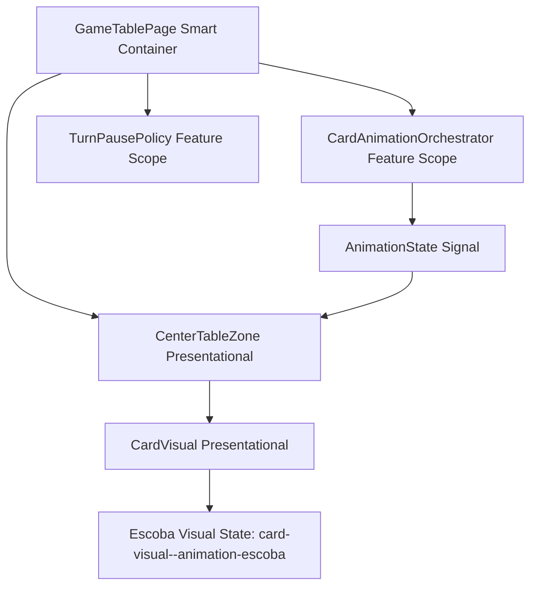
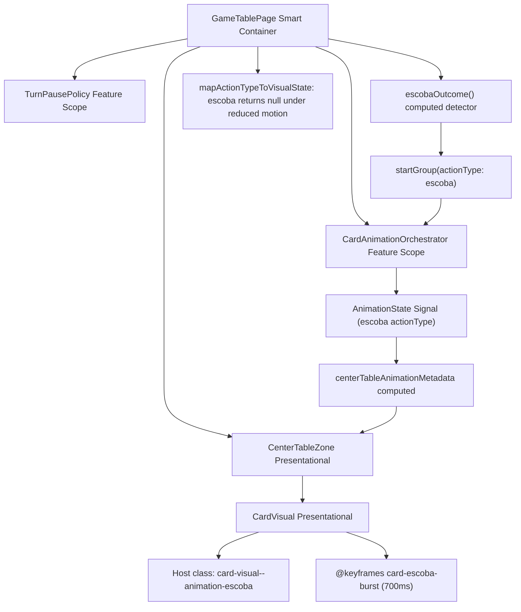

# Review Report: Card Animation System — T-9 Escoba Burst Emphasis

**Review Mode:** Incremental (T-9: Implement Escoba mandatory burst emphasis)
**Source:** `docs/specs/ui/card-animations/`
**Reviewed against:** proposal.md, spec.md, user-stories.md, bdd-test.md, design.md, tasks.md

## 1. Executive Summary

The T-9 implementation delivers a visually distinct Escoba burst effect with correct orchestration integration, proper reduced-motion suppression, and table clear reconciliation. The burst emphasis is implemented via a dedicated CSS keyframe that expands before collapsing, satisfying AD-6's mandatory burst-style requirement. Completion handling correctly removes cards from the DOM after the animation group is finalized.

- Total findings: 4 (0 Critical, 0 Major, 2 Minor, 2 Note)
- Spec compliance: 5 of 6 requirements fully met, 1 partial
- Architecture alignment: aligned (minor orchestration timing asymmetry)
- Test quality: meaningful

## 2. Architecture Comparison

### 2.1 Planned Component Tree (T-9 Scope from design.md)

### 2.2 Actual Component Tree (Implemented)

### 2.3 Drift Analysis

No structural drift from the planned architecture. The component tree matches design.md section 4 exactly for the T-9 scope. The escoba detection uses a computed signal (`escobaOutcome`) that checks engine state after `playCard()` — specifically verifying `table.length === 0`, `lastCapturerId !== null`, and `escobaCount > 0`. This aligns with the orchestration-level responsibility defined in AD-1.

One behavioral subtlety: the escoba animation group coexists with an already-started capture animation group on the same card IDs. The `resolveVisualStateForCard()` method resolves this correctly by iterating groups from last to first, giving the escoba group priority over the earlier capture group. This escalation behavior is not explicitly documented in design.md but is architecturally sound.

## 3. Findings

### RV-01: Escoba group finalization occurs before CSS keyframe completes [Minor]

- **Category:** Architecture Drift
- **Severity:** Minor
- **Related:** AD-6, FR-6, TR-2, T-9 AC-2
- **Description:** The escoba CSS keyframe has a duration of 700ms, but the orchestration group is finalized after `resolveAnimationCompletionDelayMs(700)` which resolves to `Math.min(700, 600)` = 600ms using the default TurnPausePolicy value for 'player-post-play-confirm'. This means the DOM elements are removed at approximately 85% of the animation timeline.
- **Expected:** AD-2 states animation completion should be the source of truth for phase progression. The animation should complete its full keyframe before elements are removed.
- **Actual:** Cards are removed at 600ms. At this point in the `card-escoba-burst` keyframe, the card is at approximately scale 0.35 and opacity 0.13 — nearly invisible but not at the keyframe endpoint.
- **Recommendation:** Consider using the raw ESCOBA_ANIMATION_DURATION_MS (700ms) directly for the escoba group finalization rather than routing through `resolveAnimationCompletionDelayMs`, similar to how the capture group already uses CAPTURE_ANIMATION_DURATION_MS directly. Alternatively, accept the current behavior since 600ms is within FR-6's 600–800ms range.
- **Impact:** Visual impact is negligible because at 85% of the burst animation the card is already nearly invisible. The functional outcome (table cleared) is correct. FR-6 duration range is technically met.

### RV-02: AI escoba does not trigger burst animation group [Minor]

- **Category:** Spec Compliance
- **Severity:** Minor
- **Related:** FR-6, US-6, AD-7, T-9 AC-1
- **Description:** When the AI opponent achieves an escoba (all table cards captured), the AI turn flow detects it (for live announcement purposes) but does not start an 'escoba' animation group. The burst visual effect is therefore player-only.
- **Expected:** FR-6 states "Applies to: All instances where Escoba is triggered (cards cleared from table)." This includes AI escoba.
- **Actual:** Only the player flow in `submitPlay()` starts an escoba animation group. The AI flow in `runAiTurn()` detects the escoba for announcement text only.
- **Recommendation:** This is reasonably deferred to T-10 ("Align AI flow with completion-driven timing") given the task dependency chain: T-9 depends on T-7 (player play), while T-10 depends on T-6 (turn sequencing). Adding AI escoba burst to T-10's scope is architecturally appropriate since it requires AI animation coordination.
- **Impact:** AI escoba table clears happen without the visual burst emphasis in the current implementation. Functionally correct but visually inconsistent between player and AI escoba events.

### RV-03: Redundant transient state clearing in escoba-with-capture path [Note]

- **Category:** Code Quality
- **Severity:** Note
- **Related:** AD-2, T-9 AC-3
- **Description:** When escoba occurs, both the capture group completion callback (at 900ms) and the escoba group completion callback (at 600ms) clear `transientCapturedTableCardsState`. Since escoba fires first, the capture callback's clearing is always a no-op.
- **Expected:** Each group's completion callback should have a distinct responsibility without overlap.
- **Actual:** Both callbacks perform the same operation. The escoba callback fires first, making the capture callback redundant.
- **Recommendation:** No action required. The redundancy is harmless and removing it would add conditional logic that reduces readability for minimal benefit.
- **Impact:** None. The double-clear is idempotent.

### RV-04: Capture group duration not routed through policy resolution [Note]

- **Category:** Code Quality
- **Severity:** Note
- **Related:** AD-2, AD-3, TR-4
- **Description:** The play group and escoba group use `resolveAnimationCompletionDelayMs()` (which respects TurnPausePolicy), but the capture group uses `GameTablePage.CAPTURE_ANIMATION_DURATION_MS` (900ms) directly. This creates an asymmetry in how animation group durations are determined.
- **Expected:** Consistent duration resolution strategy across all animation groups, either all policy-resolved or all fixed.
- **Actual:** Play and escoba are clamped by policy; capture uses a fixed constant.
- **Recommendation:** This asymmetry may be intentional (capture must always complete for visual clarity). If so, documenting the rationale would improve maintainability. If unintentional, standardize on one approach.
- **Impact:** Informational only. In practice the capture group completes at 900ms regardless of policy, while the escoba group that overlaps the same cards completes at 600ms and removes them from DOM first. The asymmetry has no visible user impact because DOM removal at 600ms pre-empts the capture group's visual effect.

## 4. Traceability Matrix

<<<<<<< Updated upstream
| Finding | Severity | Category | Related Spec | Status |
| ------- | -------- | ------------------ | ---------------------- | ----------------------- |
| RV-01 | Minor | Architecture Drift | AD-6, FR-6, TR-2, AD-2 | Open |
| RV-02 | Minor | Spec Compliance | FR-6, US-6, AD-7 | Open (deferred to T-10) |
| RV-03 | Note | Code Quality | AD-2, T-9 AC-3 | Open (no action needed) |
| RV-04 | Note | Code Quality | AD-2, AD-3, TR-4 | Open (informational) |

## 5. Spec Compliance Summary

| Requirement | Status     | Notes                                                                                  |
| ----------- | ---------- | -------------------------------------------------------------------------------------- |
| FR-6        | ⚠️ Partial | Player escoba fully met. AI escoba burst missing (deferred to T-10).                   |
| TR-2        | ✅ Met     | CSS keyframe uses transform and opacity only. GPU-friendly properties throughout.      |
| TR-8        | ✅ Met     | Escoba group emits completion via finalizeGroup; turn orchestration can await it.      |
| NFR-3       | ✅ Met     | Reduced-motion returns null visual state for escoba; no burst class applied.           |
| NFR-7       | ✅ Met     | Orange/golden glow distinct from yellow capture glow. Burst expansion at 35% keyframe. |
| US-6        | ⚠️ Partial | All player-facing acceptance criteria met. AI escoba gap per RV-02.                    |

## 6. Task Completion Summary

| Task | Title | Status | Findings |
| ---- | ----- | ------ | -------- |

=======
| Finding | Severity | Category | Related Spec | Status |
|---------|----------|----------|-------------|--------|
| RV-01 | Minor | Architecture Drift | AD-6, FR-6, TR-2, AD-2 | Open |
| RV-02 | Minor | Spec Compliance | FR-6, US-6, AD-7 | Open (deferred to T-10) |
| RV-03 | Note | Code Quality | AD-2, T-9 AC-3 | Open (no action needed) |
| RV-04 | Note | Code Quality | AD-2, AD-3, TR-4 | Open (informational) |

## 5. Spec Compliance Summary

| Requirement | Status     | Notes                                                                                  |
| ----------- | ---------- | -------------------------------------------------------------------------------------- |
| FR-6        | ⚠️ Partial | Player escoba fully met. AI escoba burst missing (deferred to T-10).                   |
| TR-2        | ✅ Met     | CSS keyframe uses transform and opacity only. GPU-friendly properties throughout.      |
| TR-8        | ✅ Met     | Escoba group emits completion via finalizeGroup; turn orchestration can await it.      |
| NFR-3       | ✅ Met     | Reduced-motion returns null visual state for escoba; no burst class applied.           |
| NFR-7       | ✅ Met     | Orange/golden glow distinct from yellow capture glow. Burst expansion at 35% keyframe. |
| US-6        | ⚠️ Partial | All player-facing acceptance criteria met. AI escoba gap per RV-02.                    |

## 6. Task Completion Summary

| Task | Title | Status | Findings |
| ---- | ----- | ------ | -------- |

> > > > > > > Stashed changes
> > > > > > > | T-9 | Implement Escoba mandatory burst emphasis | ✅ Complete | RV-01, RV-02, RV-03, RV-04 |

## 7. Test Coverage Summary

| Scenario | Step Definitions | Meaningful | Findings |
<<<<<<< Updated upstream
| -------- | ---------------- | ---------- | -------- |
| SC-14 | ✅ Yes | ✅ Yes | — |
| SC-15 | ✅ Yes | ✅ Yes | — |
| SC-16 | ✅ Yes | ✅ Yes | — |

## 8. Test Quality Summary

| Test File                                              | Type | Meaningful Assertions | Issues                                                                                                                   |
| ------------------------------------------------------ | ---- | --------------------- | ------------------------------------------------------------------------------------------------------------------------ |
| game-table-page.escoba-burst.spec.ts                   | Unit | ✅ Yes                | None — tests verify orchestrator group creation, timing completion, table reconciliation, and reduced-motion suppression |
| center-table-zone.card-visual.spec.ts (escoba section) | Unit | ✅ Yes                | Covers escoba metadata propagation to CardVisual without mutating game state                                             |
| escoba-burst-emphasis.feature + .ts                    | E2E  | ✅ Yes                | SC-14 asserts class presence; SC-15 validates computed duration; SC-16 validates suppression                             |

=======
|----------|-----------------|------------|----------|
| SC-14 | ✅ Yes | ✅ Yes | — |
| SC-15 | ✅ Yes | ✅ Yes | — |
| SC-16 | ✅ Yes | ✅ Yes | — |

## 8. Test Quality Summary

| Test File                                              | Type | Meaningful Assertions | Issues                                                                                                                   |
| ------------------------------------------------------ | ---- | --------------------- | ------------------------------------------------------------------------------------------------------------------------ |
| game-table-page.escoba-burst.spec.ts                   | Unit | ✅ Yes                | None — tests verify orchestrator group creation, timing completion, table reconciliation, and reduced-motion suppression |
| center-table-zone.card-visual.spec.ts (escoba section) | Unit | ✅ Yes                | Covers escoba metadata propagation to CardVisual without mutating game state                                             |
| escoba-burst-emphasis.feature + .ts                    | E2E  | ✅ Yes                | SC-14 asserts class presence; SC-15 validates computed duration; SC-16 validates suppression                             |

> > > > > > > Stashed changes

## 9. Security Cross-Reference

See `docs/specs/ui/card-animations/security-report_T-9.md` for the full security analysis. One Medium finding (SEC-01: vulnerable transitive dependency brace-expansion) exists at the dependency graph level, unrelated to T-9 implementation logic.

<<<<<<< Updated upstream
| SEC ID | Severity | OWASP | Summary |
| ------ | -------- | -------- | ------------------------------------------------ |
=======
| SEC ID | Severity | OWASP | Summary |
|--------|----------|-------|---------|

> > > > > > > Stashed changes
> > > > > > > | SEC-01 | Medium | A06:2021 | Vulnerable brace-expansion transitive dependency |

No Critical or High security findings relate to T-9 implementation code.

## 10. Recommendations

### Critical (blocks release)

None.

### Major (fix before merge)

None.

### Minor (improvement)

1. **RV-01:** Consider using ESCOBA_ANIMATION_DURATION_MS directly for the escoba group (bypassing `resolveAnimationCompletionDelayMs`) to align the orchestration finalization with the CSS keyframe endpoint. This would increase the escoba group duration from 600ms to 700ms.
2. **RV-02:** When implementing T-10, include AI escoba burst effect by starting an 'escoba' animation group in the AI flow when `escobaCount` increases after `playCard()`.

### Notes (informational)

1. **RV-03:** The redundant transient state clearing is benign and does not warrant refactoring.
2. **RV-04:** Document the rationale for the asymmetric duration resolution approach (capture uses fixed delay; escoba/play use policy-resolved delay) in a code comment for future maintainability.
