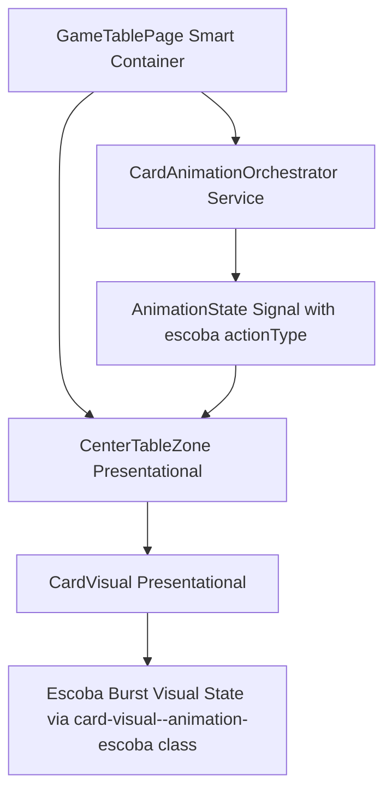
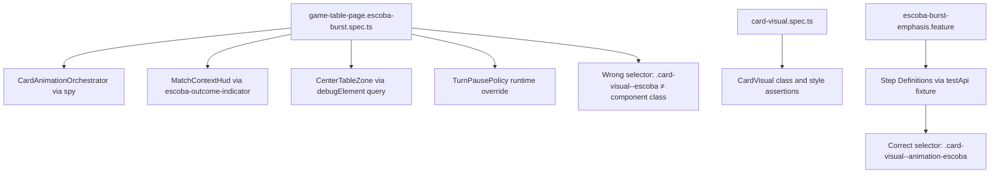

# Review Report: Card Animation System — T-9 Escoba Burst Emphasis (RED Phase, v2 Re-review)

**Review Mode:** Incremental (T-9: Implement Escoba mandatory burst emphasis) — Tests Only (RED phase)
**Source:** `docs/specs/ui/card-animations/`
**Reviewed against:** spec.md, user-stories.md, bdd-test.md, design.md, tasks.md
**Update:** Second re-review after SC-16 test updates to `game-table-page.escoba-burst.spec.ts`. Focused on confirming whether prior RV-03 Major finding is resolved.

## 1. Executive Summary

The SC-16 test was updated to add visual suppression and state outcome assertions. **State outcome assertion is now valid** — the test queries `escoba-outcome-indicator` and confirms the player name and escoba count are rendered, satisfying the "scoring and state outcomes remain unchanged" clause of SC-16. **However, the visual suppression assertion uses an incorrect CSS selector** (`.card-visual--escoba`) that does not exist anywhere in the component implementation. The actual class rendered by CardVisual is `.card-visual--animation-escoba`. This makes the visual suppression check tautological — it will always find zero elements regardless of whether reduced-motion actually suppresses the burst effect.

- Total findings: 4 (0 Critical, 1 Major, 3 Minor)
- Prior RV-03 status: state outcome half ✅ resolved, visual suppression half ❌ still tautological
- BDD scenario coverage: SC-14 covered, SC-15 covered, SC-16 partially covered
- Test quality: meaningful overall, with one tautological assertion remaining

## 2. Architecture Comparison

### 2.1 Planned Component Tree (T-9 Scope)

### 2.2 Actual Test Structure

### 2.3 Drift Analysis

No structural drift in test architecture. The test topology mirrors the planned GameTablePage → Orchestrator → CenterTableZone/CardVisual flow. The only issue is a selector mismatch in one assertion within the page-level SC-16 test.

## 3. Findings

### RV-01: Table clear reconciliation — RESOLVED ✅

- **Status:** Closed (resolved in prior update)

### RV-02: SC-15 timing test precondition — RESOLVED ✅

- **Status:** Closed (resolved in prior update)

### RV-03: SC-16 reduced-motion visual suppression — PARTIALLY RESOLVED ⚠️

- **Category:** Test Quality
- **Severity:** Major
- **Related:** SC-16, TR-6, NFR-3, US-6, AD-6
- **Description:** The SC-16 test now includes both state outcome and visual suppression assertions. The state outcome check is valid and meaningful. However, the visual suppression assertion queries the CSS class `.card-visual--escoba` which does not exist in the CardVisual component. The component binds the class `card-visual--animation-escoba` (confirmed in the host metadata of CardVisual). Because `.card-visual--escoba` is never rendered by any component, `querySelectorAll('.card-visual--escoba')` will always return an empty NodeList regardless of whether reduced-motion actually suppresses the animation.
- **Expected:** The test should query `.card-visual--animation-escoba` (the class that CardVisual actually renders when `isEscobaAnimation()` returns true) and assert it has zero elements under reduced-motion.
- **Actual:** Queries `.card-visual--escoba` — a class that is never applied to any element — making the assertion vacuously true.
- **Evidence:** CardVisual host binding in component source declares `'[class.card-visual--animation-escoba]': 'isEscobaAnimation()'`. The class `.card-visual--escoba` appears nowhere in component TypeScript, HTML template, or SCSS. The E2E step definitions correctly use `.card-visual--animation-escoba`.
- **Recommendation:** Change the selector from `.card-visual--escoba` to `.card-visual--animation-escoba` in the SC-16 test assertion.
- **Impact:** A regression where reduced-motion fails to suppress the Escoba burst animation would not be detected at unit test level. The E2E test (using the correct selector) would still catch it, but the fast feedback loop is broken.

### RV-03b: SC-16 state outcome assertion — RESOLVED ✅

- **Category:** Test Coverage
- **Severity:** ~~Major~~ → Closed
- **Related:** SC-16, FR-6, US-6
- **Resolution:** The test now queries `[data-testid="escoba-outcome-indicator"]` and asserts it contains the player name and escoba count. This confirms that "Escoba scoring and state outcomes remain unchanged" under reduced-motion, satisfying the second clause of SC-16.

### RV-04: CardVisual burst keyframe assertion relies on computed style [Minor]

- **Category:** Test Quality
- **Severity:** Minor
- **Related:** SC-15, FR-6, TR-2
- **Status:** Open (unchanged from prior review)
- **Description:** The computed style test for animation-name and animation-duration depends on CSS processing behavior of the test environment.
- **Impact:** Low — class presence is independently tested; timing is validated at E2E level.

### RV-05: E2E SC-14 post-completion emptiness [Minor]

- **Category:** Test Coverage
- **Severity:** Minor
- **Related:** SC-14, FR-6, NFR-7
- **Status:** Open (unchanged — mitigated by unit test coverage of table clear reconciliation)

### RV-06: No single test contrasts escoba vs normal capture distinctness [Minor]

- **Category:** Test Coverage
- **Severity:** Minor (informational)
- **Related:** FR-6, NFR-7, T-9 AC-1
- **Status:** Open (no action required — adequately covered by composition)

## 4. Traceability Matrix

| Finding | Severity  | Category      | Related Spec                   | Status                   |
| ------- | --------- | ------------- | ------------------------------ | ------------------------ |
| RV-01   | ~~Major~~ | Test Coverage | T-9 AC-3, FR-6, SC-14          | ✅ Closed                |
| RV-02   | ~~Major~~ | Test Quality  | SC-15, FR-6, T-9 AC-2          | ✅ Closed                |
| RV-03   | Major     | Test Quality  | SC-16, TR-6, NFR-3, US-6, AD-6 | ⚠️ Tautological selector |
| RV-03b  | ~~Major~~ | Test Coverage | SC-16, FR-6, US-6              | ✅ Closed                |
| RV-04   | Minor     | Test Quality  | SC-15, FR-6, TR-2              | Open                     |
| RV-05   | Minor     | Test Coverage | SC-14, FR-6, NFR-7             | Open                     |
| RV-06   | Minor     | Test Coverage | FR-6, NFR-7, T-9 AC-1          | Open (informational)     |

## 5. Spec Compliance Summary (T-9 Scope)

| Requirement | Test Coverage Status | Notes                                                                                                         |
| ----------- | -------------------- | ------------------------------------------------------------------------------------------------------------- |
| FR-6        | ⚠️ Partial           | Triggering, timing, table clear, state preservation all covered; visual suppression assertion is tautological |
| TR-2        | ⚠️ Partial           | Burst keyframe depends on CSS environment                                                                     |
| TR-6        | ⚠️ Partial           | Reduced-motion orchestration and state outcome tested; visual suppression assertion ineffective               |
| NFR-3       | ⚠️ Partial           | Same gap as TR-6                                                                                              |
| NFR-7       | ✅ Met               | Class differentiation and metadata propagation covered                                                        |
| US-6        | ⚠️ Partial           | Single selector typo prevents full coverage                                                                   |

## 6. Task Completion Summary

| Task | Title                                     | Status                   | Findings                           |
| ---- | ----------------------------------------- | ------------------------ | ---------------------------------- |
| T-9  | Implement Escoba mandatory burst emphasis | ⚠️ Partial (RED battery) | RV-03 (Major), RV-04/05/06 (Minor) |

## 7. Test Coverage Summary

| Scenario | Unit Test  | E2E Step Defs | Meaningful | Findings                      |
| -------- | ---------- | ------------- | ---------- | ----------------------------- |
| SC-14    | ✅ Yes     | ✅ Yes        | ✅ Yes     | RV-05 (minor)                 |
| SC-15    | ✅ Yes     | ✅ Yes        | ✅ Yes     | RV-04 (minor)                 |
| SC-16    | ⚠️ Partial | ✅ Yes        | ⚠️ Partial | RV-03 (tautological selector) |

## 8. Test Quality Summary

| Test File                            | Type | Meaningful Assertions | Issues                                                      |
| ------------------------------------ | ---- | --------------------- | ----------------------------------------------------------- |
| game-table-page.escoba-burst.spec.ts | Unit | ⚠️ Partial            | SC-16 visual suppression uses wrong selector (tautological) |
| card-visual.spec.ts (escoba section) | Unit | ✅ Yes                | Computed style env concern (Minor)                          |
| escoba-burst-emphasis.feature + .ts  | E2E  | ✅ Yes                | Correct selector used; SC-14 post-completion gap (Minor)    |

## 9. Security Cross-Reference

No security review performed — RED phase test-only scope. No security-sensitive patterns identified.

## 10. Recommendations

### Major (fix before proceeding to GREEN)

1. **Fix selector in SC-16 unit test:** The querySelectorAll call should target `.card-visual--animation-escoba` (the class CardVisual actually renders) instead of `.card-visual--escoba` (a non-existent class). This single-character fix converts the assertion from tautological to meaningful.

### Minor (improvement)

1. RV-04: Verify computed-style test passes in CI. If not, restructure or defer to E2E.
2. RV-05: Lower priority — unit test now covers table clear; E2E extension optional.
3. RV-06: No action needed.
