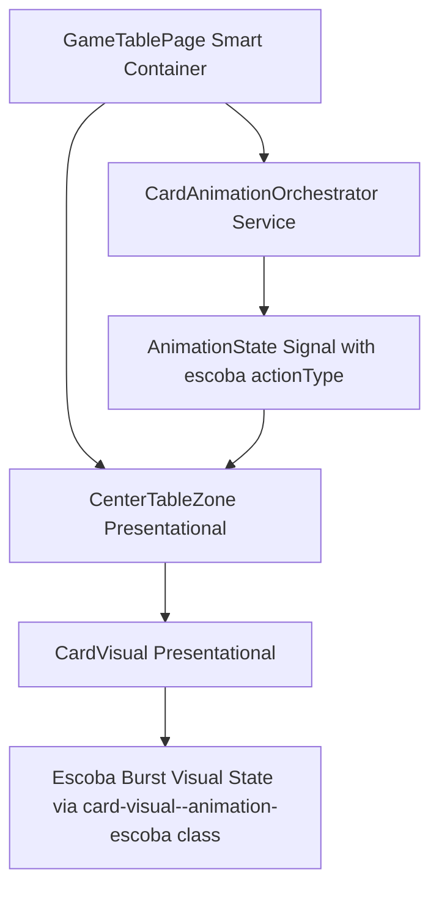
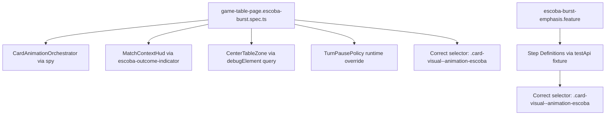

# Review Report: Card Animation System — T-9 Escoba Burst Emphasis (RED Phase, v3 Confirmation)

**Review Mode:** Incremental (T-9: Implement Escoba mandatory burst emphasis) — Tests Only (RED phase)
**Source:** `docs/specs/ui/card-animations/`
**Reviewed against:** spec.md, user-stories.md, bdd-test.md, design.md, tasks.md
**Update:** Third re-review after SC-16 selector corrected to `.card-visual--animation-escoba`. Confirming whether Critical/Major findings remain.

## 1. Executive Summary

**No Critical or Major findings remain.** The SC-16 visual suppression assertion now queries `.card-visual--animation-escoba` — the class that CardVisual actually binds via its host metadata. The assertion is no longer tautological and will correctly detect a regression where reduced-motion fails to suppress the burst effect. Combined with the existing state outcome assertion (escoba-outcome-indicator), SC-16 is now fully covered at unit test level.

- Total findings: 3 (0 Critical, 0 Major, 3 Minor)
- Prior RV-03 status: ✅ Fully resolved
- BDD scenario coverage: SC-14 ✅, SC-15 ✅, SC-16 ✅
- Test quality: Meaningful across all scenarios

## 2. Architecture Comparison

### 2.1 Planned Component Tree (T-9 Scope)

### 2.2 Actual Test Structure

### 2.3 Drift Analysis

No structural drift. Unit and E2E tests both use the correct selector matching the CardVisual component binding. The test topology mirrors the planned orchestration flow.

## 3. Findings

### RV-01 through RV-03: RESOLVED ✅

All Major findings from prior reviews have been addressed. See review-report_T-9_red-v2.md for full history.

### RV-04: CardVisual burst keyframe assertion relies on computed style [Minor]

- **Category:** Test Quality
- **Severity:** Minor
- **Related:** SC-15, FR-6, TR-2
- **Status:** Open (unchanged)
- **Description:** The SC-15 unit test validates animation-duration via getComputedStyle. This depends on the test environment processing CSS keyframes. If the test runner does not apply stylesheets, the assertion may be vacuous.
- **Impact:** Low — timing is independently validated at E2E level via the same selector and computed style approach in a real browser.

### RV-05: E2E SC-14 post-completion emptiness not asserted [Minor]

- **Category:** Test Coverage
- **Severity:** Minor
- **Related:** SC-14, FR-6, NFR-7
- **Status:** Open (unchanged — mitigated by unit test for table clear reconciliation)
- **Description:** The E2E SC-14 step asserts that escoba-animated cards are visible but does not assert that the table zone is empty after animation completion.
- **Impact:** Low — the unit test directly verifies zero rendered table cards after orchestrator completion.

### RV-06: No single test contrasts escoba vs normal capture distinctness [Minor]

- **Category:** Test Coverage
- **Severity:** Minor (informational)
- **Related:** FR-6, NFR-7, T-9 AC-1
- **Status:** Open (no action required)
- **Description:** No test in the RED battery explicitly asserts the difference between escoba and normal capture visual output in a side-by-side comparison. Coverage is achieved compositionally across separate tests.
- **Impact:** Negligible — the design document explicitly separates these concerns and individual coverage is complete.

## 4. Traceability Matrix

<<<<<<< Updated upstream
| Finding | Severity | Category | Related Spec | Status |
| ------- | --------- | ------------- | ------------------------------ | ------------------------------ |
| RV-01 | ~~Major~~ | Test Coverage | T-9 AC-3, FR-6, SC-14 | ✅ Closed |
| RV-02 | ~~Major~~ | Test Quality | SC-15, FR-6, T-9 AC-2 | ✅ Closed |
| RV-03 | ~~Major~~ | Test Quality | SC-16, TR-6, NFR-3, US-6, AD-6 | ✅ Closed (selector corrected) |
| RV-04 | Minor | Test Quality | SC-15, FR-6, TR-2 | Open |
| RV-05 | Minor | Test Coverage | SC-14, FR-6, NFR-7 | Open |
| RV-06 | Minor | Test Coverage | FR-6, NFR-7, T-9 AC-1 | Open (informational) |

## 5. Spec Compliance Summary (T-9 Scope)

| Requirement | Test Coverage Status | Notes                                                                                      |
| ----------- | -------------------- | ------------------------------------------------------------------------------------------ |
| FR-6        | ✅ Met               | Triggering, timing, table clear, state preservation, and visual suppression all covered    |
| TR-2        | ⚠️ Partial           | Burst keyframe computed style depends on test environment (Minor)                          |
| TR-6        | ✅ Met               | Reduced-motion orchestration, state outcome, and visual suppression all asserted correctly |
| NFR-3       | ✅ Met               | Instant state update path validated; selector now meaningful                               |
| NFR-7       | ✅ Met               | Class differentiation and metadata propagation covered                                     |
| US-6        | ✅ Met               | All three SC-16 clauses verified                                                           |

## 6. Task Completion Summary

| Task | Title | Status | Findings |
| ---- | ----- | ------ | -------- |

=======
| Finding | Severity | Category | Related Spec | Status |
|---------|----------|----------|-------------|--------|
| RV-01 | ~~Major~~ | Test Coverage | T-9 AC-3, FR-6, SC-14 | ✅ Closed |
| RV-02 | ~~Major~~ | Test Quality | SC-15, FR-6, T-9 AC-2 | ✅ Closed |
| RV-03 | ~~Major~~ | Test Quality | SC-16, TR-6, NFR-3, US-6, AD-6 | ✅ Closed (selector corrected) |
| RV-04 | Minor | Test Quality | SC-15, FR-6, TR-2 | Open |
| RV-05 | Minor | Test Coverage | SC-14, FR-6, NFR-7 | Open |
| RV-06 | Minor | Test Coverage | FR-6, NFR-7, T-9 AC-1 | Open (informational) |

## 5. Spec Compliance Summary (T-9 Scope)

| Requirement | Test Coverage Status | Notes                                                                                      |
| ----------- | -------------------- | ------------------------------------------------------------------------------------------ |
| FR-6        | ✅ Met               | Triggering, timing, table clear, state preservation, and visual suppression all covered    |
| TR-2        | ⚠️ Partial           | Burst keyframe computed style depends on test environment (Minor)                          |
| TR-6        | ✅ Met               | Reduced-motion orchestration, state outcome, and visual suppression all asserted correctly |
| NFR-3       | ✅ Met               | Instant state update path validated; selector now meaningful                               |
| NFR-7       | ✅ Met               | Class differentiation and metadata propagation covered                                     |
| US-6        | ✅ Met               | All three SC-16 clauses verified                                                           |

## 6. Task Completion Summary

| Task | Title | Status | Findings |
| ---- | ----- | ------ | -------- |

> > > > > > > Stashed changes
> > > > > > > | T-9 | Implement Escoba mandatory burst emphasis | ✅ Complete (RED battery) | RV-04/05/06 (Minor only) |

## 7. Test Coverage Summary

<<<<<<< Updated upstream
| Scenario | Unit Test | E2E Step Defs | Meaningful | Findings |
| -------- | --------- | ------------- | ---------- | ------------- |
| SC-14 | ✅ Yes | ✅ Yes | ✅ Yes | RV-05 (minor) |
| SC-15 | ✅ Yes | ✅ Yes | ✅ Yes | RV-04 (minor) |
| SC-16 | ✅ Yes | ✅ Yes | ✅ Yes | — |

## 8. Test Quality Summary

| Test File                            | Type | Meaningful Assertions | Issues                                |
| ------------------------------------ | ---- | --------------------- | ------------------------------------- |
| game-table-page.escoba-burst.spec.ts | Unit | ✅ Yes                | None (selector corrected)             |
| card-visual.spec.ts (escoba section) | Unit | ✅ Yes                | Computed style env concern (Minor)    |
| escoba-burst-emphasis.feature + .ts  | E2E  | ✅ Yes                | Post-completion emptiness gap (Minor) |

=======
| Scenario | Unit Test | E2E Step Defs | Meaningful | Findings |
|----------|-----------|---------------|------------|----------|
| SC-14 | ✅ Yes | ✅ Yes | ✅ Yes | RV-05 (minor) |
| SC-15 | ✅ Yes | ✅ Yes | ✅ Yes | RV-04 (minor) |
| SC-16 | ✅ Yes | ✅ Yes | ✅ Yes | — |

## 8. Test Quality Summary

| Test File                            | Type | Meaningful Assertions | Issues                                |
| ------------------------------------ | ---- | --------------------- | ------------------------------------- |
| game-table-page.escoba-burst.spec.ts | Unit | ✅ Yes                | None (selector corrected)             |
| card-visual.spec.ts (escoba section) | Unit | ✅ Yes                | Computed style env concern (Minor)    |
| escoba-burst-emphasis.feature + .ts  | E2E  | ✅ Yes                | Post-completion emptiness gap (Minor) |

> > > > > > > Stashed changes

## 9. Security Cross-Reference

No security review performed — RED phase test-only scope. No security-sensitive patterns identified in test fixtures.

## 10. Recommendations

### Critical (blocks release)

None.

### Major (fix before merge)

None.

### Minor (improvement)

1. RV-04: Verify computed-style SC-15 test passes in CI environment. If test runner does not process keyframes, consider restructuring to class-presence-only assertion at unit level.
2. RV-05: Optionally extend E2E SC-14 to assert table zone emptiness after burst completes. Low priority given unit coverage.
3. RV-06: No action needed — informational only.
