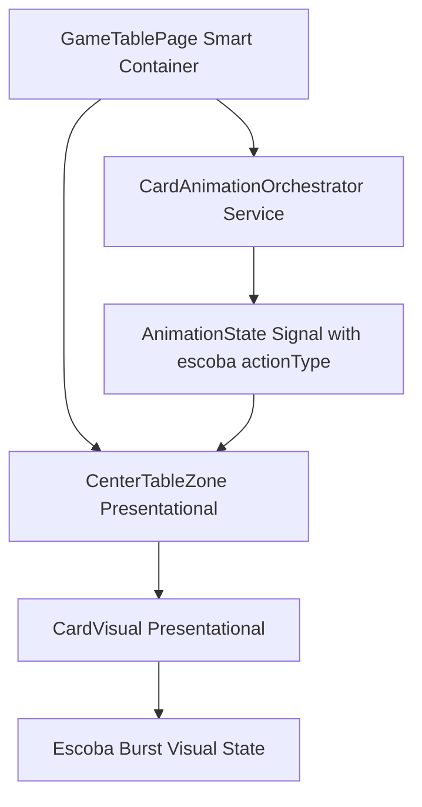
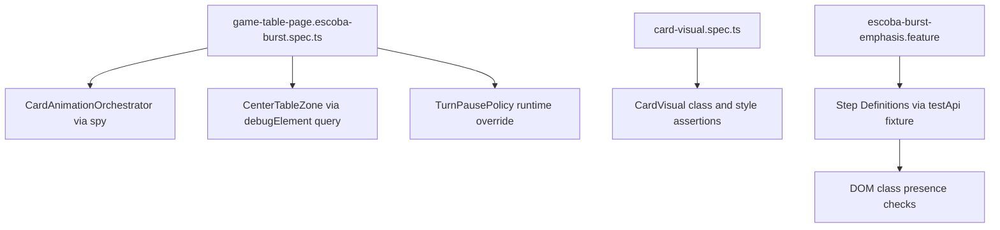

# Review Report: Card Animation System — T-9 Escoba Burst Emphasis (RED Phase, Re-review)

**Review Mode:** Incremental (T-9: Implement Escoba mandatory burst emphasis) — Tests Only (RED phase)
**Source:** `docs/specs/ui/card-animations/`
**Reviewed against:** spec.md, user-stories.md, bdd-test.md, design.md, tasks.md
**Update:** Re-review confirming resolution status of prior RV-01, RV-02, RV-03 findings after updates to `game-table-page.escoba-burst.spec.ts` and `card-visual.spec.ts`.

## 1. Executive Summary

Two of the three prior Major findings are now fully resolved. RV-01 (table clear reconciliation) is addressed by a new test that advances timers and asserts zero rendered table cards. RV-02 (missing precondition) is addressed by an intermediate `expect(escobaCall).toBeDefined()` assertion before timer advancement. RV-03 (reduced-motion coverage) is partially resolved — the orchestration path is tested but visual suppression and state outcome assertions remain absent.

The remaining open gaps are: the SC-16 unit test verifies orchestration group creation under reduced-motion but omits assertions for visual suppression and escoba state preservation; the computed-style keyframe test remains environment-dependent; and E2E SC-14 coverage remains necessary-but-insufficient for the full scenario.

- Total findings: 4 (0 Critical, 1 Major, 3 Minor)
- Prior findings resolved: RV-01 ✅, RV-02 ✅, RV-03 ⚠️ Partial
- BDD scenario coverage: SC-14 covered, SC-15 covered, SC-16 partially covered
- Acceptance criteria coverage: AC-1 covered, AC-2 covered, AC-3 covered
- Test quality: meaningful — assertions target real behavior with minor gaps remaining

## 2. Architecture Comparison

### 2.1 Planned Component Tree (T-9 Scope)

### 2.2 Actual Test Structure

### 2.3 Drift Analysis

The test architecture correctly mirrors the planned component hierarchy for T-9 scope. The unit test suite exercises the GameTablePage-to-Orchestrator-to-CenterTableZone flow as designed in AD-1 and AD-6. The CardVisual spec independently validates the atomic visual state boundary. No structural drift detected in the test topology.

## 3. Findings

### RV-01: Table clear reconciliation assertion — RESOLVED ✅

- **Category:** Test Coverage
- **Severity:** ~~Major~~ → Closed
- **Related:** T-9 AC-3, FR-6, SC-14
- **Resolution:** New test `'FR-6 - escoba completion reconciles a visually cleared center table'` uses fake timers, clicks submit, advances by 801ms, and asserts `renderedTableCards.length` equals 0. This directly validates that Escoba completion reconciles the table clear state as required by AC-3.

### RV-02: SC-15 timing test precondition — RESOLVED ✅

- **Category:** Test Quality
- **Severity:** ~~Major~~ → Closed
- **Resolution:** The timing test now includes `expect(escobaCall).toBeDefined()` immediately after the click and before advancing timers. This establishes the precondition that an escoba group was actually started, eliminating the silent false-positive risk.

### RV-03: SC-16 reduced-motion visual suppression — PARTIALLY RESOLVED ⚠️

- **Category:** Test Coverage
- **Severity:** Major (downgraded scope)
- **Related:** SC-16, TR-6, NFR-3, US-6
- **Description:** The new test `'SC-16 / FR-6 - reduced-motion escoba path still starts an escoba group for completion handling'` mocks `prefers-reduced-motion: reduce` and verifies that the orchestrator still creates an escoba group. This covers the completion-handling path.
- **Remaining gap:** SC-16 specifies "the table clears instantly without special motion effects" and "Escoba scoring and state outcomes remain unchanged." The test omits two assertions: (a) that CardVisual does not apply the burst animation class or that the animation duration is zero/instant under reduced-motion, and (b) that `escobaCount` is incremented in game state confirming state outcomes are preserved.
- **Expected:** The test should additionally assert either that no `card-visual--animation-escoba` class is rendered in the DOM (visual suppression) or that the animation metadata includes an instant/zero-duration flag. It should also assert `escobaCount` equals 1 after capture to confirm state preservation.
- **Actual:** Only orchestration group creation is verified. Visual layer and state outcome remain unasserted.
- **Recommendation:** Extend the existing SC-16 test to query rendered card elements for the absence of the escoba animation class, and assert the player's `escobaCount` is incremented in the engine state stub.
- **Impact:** A regression where reduced-motion mode still plays the full burst animation (violating NFR-3 accessibility) would not be caught at unit level.

### RV-04: CardVisual burst keyframe assertion relies on computed style in headless environment [Minor]

- **Category:** Test Quality
- **Severity:** Minor
- **Related:** SC-15, FR-6, TR-2
- **Description:** The test `'applies burst keyframe timing for escoba emphasis within 600-800ms'` calls `getComputedStyle` to read `animation-name` and `animation-duration`. In headless test environments (jsdom, happy-dom), CSS keyframe animations defined in SCSS are typically not resolved.
- **Recommendation:** Verify this test passes in the project's actual test runner. If it does not resolve keyframe properties, consider restructuring to use class presence (already covered) and defer timing to E2E.
- **Impact:** Environmental false failure or false pass depending on CSS resolution behavior.

### RV-05: E2E SC-14 assertion is necessary but insufficient for full scenario [Minor]

- **Category:** Test Coverage
- **Severity:** Minor
- **Related:** SC-14, FR-6, NFR-7, US-6
- **Description:** The E2E step definition asserts only class presence (`.card-visual--animation-escoba` exists). SC-14's full specification includes table clearance after completion and simultaneous animation of all table cards. Post-completion emptiness is not asserted at E2E level.
- **Recommendation:** Extend the SC-14 E2E step to wait for animation completion and assert table zone has zero card elements.
- **Impact:** Partial implementation where cards remain after Escoba would not be caught by E2E alone (though now caught by the unit test per RV-01 resolution).

### RV-06: No single test contrasts escoba versus normal capture visual distinctness [Minor]

- **Category:** Test Coverage
- **Severity:** Minor
- **Related:** FR-6, NFR-7, US-6, T-9 AC-1
- **Description:** No test explicitly contrasts escoba timing (600-800ms) against capture timing in a single assertion. Distinctness is implicitly guaranteed by the composition of parameterized class tests and separate timing tests.
- **Recommendation:** No action required — existing tests collectively enforce distinctness. Informational only.
- **Impact:** None — adequately covered by composition.

## 4. Traceability Matrix

| Finding | Severity         | Category      | Related Spec                | Status               |
| ------- | ---------------- | ------------- | --------------------------- | -------------------- |
| RV-01   | ~~Major~~        | Test Coverage | T-9 AC-3, FR-6, SC-14       | ✅ Closed            |
| RV-02   | ~~Major~~        | Test Quality  | SC-15, FR-6, T-9 AC-2       | ✅ Closed            |
| RV-03   | Major (narrowed) | Test Coverage | SC-16, TR-6, NFR-3, US-6    | ⚠️ Partial           |
| RV-04   | Minor            | Test Quality  | SC-15, FR-6, TR-2           | Open                 |
| RV-05   | Minor            | Test Coverage | SC-14, FR-6, NFR-7, US-6    | Open                 |
| RV-06   | Minor            | Test Coverage | FR-6, NFR-7, US-6, T-9 AC-1 | Open (informational) |

## 5. Spec Compliance Summary (T-9 Scope)

| Requirement | Test Coverage Status | Notes                                                                                                                            |
| ----------- | -------------------- | -------------------------------------------------------------------------------------------------------------------------------- |
| FR-6        | ⚠️ Partial           | Triggering, timing, and table clear reconciliation now covered; reduced-motion visual suppression still unasserted at unit level |
| TR-2        | ⚠️ Partial           | Burst keyframe assertion depends on test environment CSS processing                                                              |
| NFR-3       | ⚠️ Partial           | Reduced-motion orchestration tested; visual suppression not asserted                                                             |
| NFR-7       | ✅ Met               | Class differentiation and metadata propagation adequately specified                                                              |
| US-6        | ⚠️ Partial           | Reduced-motion visual suppression assertion remains the single gap                                                               |

## 6. Task Completion Summary

| Task | Title                                     | Status                   | Findings                                 |
| ---- | ----------------------------------------- | ------------------------ | ---------------------------------------- |
| T-9  | Implement Escoba mandatory burst emphasis | ⚠️ Partial (RED battery) | RV-01, RV-02, RV-03, RV-04, RV-05, RV-06 |

## 7. Test Coverage Summary

| Scenario | Unit Test  | E2E Step Defs | Meaningful | Findings                       |
| -------- | ---------- | ------------- | ---------- | ------------------------------ |
| SC-14    | ✅ Yes     | ✅ Yes        | ✅ Yes     | RV-05 (minor E2E gap)          |
| SC-15    | ✅ Yes     | ✅ Yes        | ✅ Yes     | RV-04 (env concern)            |
| SC-16    | ⚠️ Partial | ✅ Yes        | ⚠️ Partial | RV-03 (visual suppression gap) |

## 8. Test Quality Summary

| Test File                            | Type      | Meaningful Assertions | Issues                                                                     |
| ------------------------------------ | --------- | --------------------- | -------------------------------------------------------------------------- |
| game-table-page.escoba-burst.spec.ts | Unit      | ✅ Yes                | SC-16 test omits visual suppression and state assertions (RV-03)           |
| card-visual.spec.ts (escoba section) | Unit      | ✅ Yes                | Computed style reliability concern (RV-04), but class assertions are solid |
| escoba-burst-emphasis.feature        | E2E       | ⚠️ Partial            | Assertions are necessary but insufficient for full SC-14 scope (RV-05)     |
| escoba-burst-emphasis.ts             | E2E Steps | ✅ Yes                | Step implementations are non-trivial and use valid test seam pattern       |

## 9. Security Cross-Reference

No security review performed — this is a RED phase test-only review. No security-sensitive concerns identified in the test files.

## 10. Recommendations

### Major (fix before proceeding to GREEN)

1. Extend the SC-16 reduced-motion test to assert visual suppression (absence of `card-visual--animation-escoba` in rendered DOM or instant-mode flag in metadata) and state preservation (`escobaCount` incremented) — completing RV-03.

### Minor (improvement)

1. Verify the computed style test (RV-04) passes in CI; if not, restructure to rely on class presence (already covered elsewhere) and defer timing verification to E2E.
2. Consider extending E2E SC-14 to assert post-completion table emptiness (RV-05) — now lower priority since unit test covers this.
3. RV-06 is adequately covered by composition — no action required.
