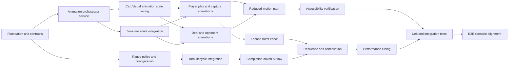

# Implementation Tasks: Card Animation System

**Source Design:** docs/specs/ui/card-animations/design.md

## Task Dependency Overview

## Tasks

### T-1: Define animation domain contracts

- **Status:** ✅ Implemented

- **Description:** Define feature-level animation concepts, group lifecycle states, action categories, and completion accounting in plain architecture terms aligned to existing game-table boundaries.
- **Architectural Decision:** AD-1, AD-2, AD-4.
- **Depends on:** None.
- **Components affected:** GameTablePage orchestration contracts, CardAnimationOrchestrator boundary, zone metadata contracts.
- **Acceptance criteria:**
  - [ ] Animation group lifecycle states are documented and unambiguous.
  - [ ] Action categories cover play, capture, deal, Escoba, and opponent actions.
  - [ ] Completion accounting expectations are defined for single and multi-card actions.
- **Estimation hint:** S.
- **Spec traceability:** TR-1, TR-8, US-12.

### T-2: Implement feature-scoped animation orchestrator

- **Status:** ✅ Implemented

- **Description:** Add a feature-scoped orchestrator that owns animation state signal, group creation, and completion collection.
- **Architectural Decision:** AD-1, AD-2.
- **Depends on:** T-1.
- **Components affected:** CardAnimationOrchestrator, GameTablePage integration points.
- **Acceptance criteria:**
  - [ ] Orchestrator exposes read-only animation state to presentation components.
  - [ ] Orchestrator supports group start, participant completion, and group finalization.
  - [ ] Group finalization is observable by turn orchestration.
- **Estimation hint:** M.
- **Spec traceability:** FR-1, FR-2, FR-3, TR-1, TR-8, US-12.

### T-3: Implement pause policy with runtime test override

- **Status:** ✅ Implemented

- **Description:** Add feature-level pause policy that resolves effective pause durations and supports deterministic override for automated tests.
- **Architectural Decision:** AD-3, AD-5.
- **Depends on:** T-1.
- **Components affected:** TurnPausePolicy, GameTablePage pause integration.
- **Acceptance criteria:**
  - [ ] Effective pause is resolved from policy for normal mode.
  - [ ] Test override can reduce or bypass pause deterministically.
  - [ ] Reduced-motion path still honors configured pause mode.
- **Estimation hint:** S.
- **Spec traceability:** FR-7, TR-4, TR-6, US-7, US-9, US-14.

### T-4: Wire atomic card visual animation states

- **Status:** ✅ Implemented

- **Description:** Extend card visual presentation states to support movement, glow, depth, and Escoba emphasis classes while preserving selection semantics.
- **Architectural Decision:** AD-4, AD-6.
- **Depends on:** T-2.
- **Components affected:** CardVisual.
- **Acceptance criteria:**
  - [ ] Visual states exist for play, capture, deal, opponent, and Escoba emphasis.
  - [ ] Selection visual remains distinct from capture and Escoba states.
  - [ ] Focus visibility remains clear under animation states.
- **Estimation hint:** M.
- **Spec traceability:** FR-4, FR-6, TR-2, NFR-2, NFR-7, US-4, US-6.

### T-5: Integrate animation metadata into zone components

- **Status:** ✅ Implemented

- **Description:** Pass orchestrator metadata into hand, table, and opponent zones and map per-card state rendering responsibilities.
- **Architectural Decision:** AD-1, AD-7.
- **Depends on:** T-2.
- **Components affected:** ActiveHandZone, CenterTableZone, OpponentZones.
- **Acceptance criteria:**
  - [ ] Zones consume and apply animation metadata without mutating game logic.
  - [ ] Multi-card simultaneous states are rendered consistently.
  - [ ] Opponent zones support single-player AI animation metadata.
- **Estimation hint:** M.
- **Spec traceability:** FR-1, FR-2, FR-3, FR-5, FR-8, US-1, US-2, US-3, US-5, US-8.

### T-6: Integrate completion-driven turn sequencing

- **Status:** ✅ Implemented

- **Description:** Update game-table flow so turn advancement waits for animation-group completion, then applies pause policy before confirm progression.
- **Architectural Decision:** AD-2, AD-3.
- **Depends on:** T-2, T-3.
- **Components affected:** GameTablePage turn orchestration.
- **Acceptance criteria:**
  - [ ] Turn progression does not occur before group completion.
  - [ ] Post-completion pause is applied consistently.
  - [ ] Transition logic remains stable across player and AI flows.
- **Estimation hint:** M.
- **Spec traceability:** FR-7, TR-4, TR-8, US-7, US-14.

### T-7: Implement player play and capture animation flows

- **Description:** Implement orchestration for play-card pathing, capture glow-disappear behavior, and simultaneous capture handling.
- **Architectural Decision:** AD-1, AD-2, AD-4.
- **Depends on:** T-4, T-5.
- **Components affected:** GameTablePage, ActiveHandZone, CenterTableZone, CardVisual.
- **Acceptance criteria:**
  - [ ] Player play action renders movement to target zone.
  - [ ] Capture applies glow and removal behavior.
  - [ ] Multi-card capture starts simultaneously.
- **Estimation hint:** L.
- **Spec traceability:** FR-1, FR-2, TR-2, TR-5, US-1, US-2.

### T-8: Implement deal and opponent animation flows

- **Description:** Implement simultaneous hand-deal motion and single-player opponent action visuals aligned to shared animation profiles.
- **Architectural Decision:** AD-4, AD-7.
- **Depends on:** T-4, T-5.
- **Components affected:** ActiveHandZone, OpponentZones, GameTablePage.
- **Acceptance criteria:**
  - [ ] Deal animations enter hand simultaneously.
  - [ ] Opponent action visuals are clear and consistent with style system.
  - [ ] Opponent scope remains single-player AI only.
- **Estimation hint:** L.
- **Spec traceability:** FR-3, FR-5, FR-8, TR-2, TR-5, US-3, US-5, US-8.

### T-9: Implement Escoba mandatory burst emphasis

- **Description:** Add Escoba-specific effect profile with required burst-style emphasis and distinct completion handling.
- **Architectural Decision:** AD-6.
- **Depends on:** T-7.
- **Components affected:** CenterTableZone, CardVisual, GameTablePage orchestration.
- **Acceptance criteria:**
  - [ ] Escoba effect is visually distinct from normal capture.
  - [ ] Burst-style emphasis is present on Escoba clear.
  - [ ] Escoba completion reconciles table clear state correctly.
- **Estimation hint:** M.
- **Spec traceability:** FR-6, TR-2, NFR-7, US-6.

### T-10: Align AI flow with completion-driven timing

- **Description:** Keep AI semantic phases while making animation completion and pause policy authoritative for turn advancement.
- **Architectural Decision:** AD-2, AD-7.
- **Depends on:** T-6.
- **Components affected:** GameTablePage AI flow orchestration, OpponentZones integration.
- **Acceptance criteria:**
  - [ ] AI turn progression waits for animation completion.
  - [ ] Existing AI phase semantics remain understandable.
  - [ ] AI to player handoff remains clear with configured pause.
- **Estimation hint:** M.
- **Spec traceability:** FR-8, TR-8, US-8, US-14.

### T-11: Implement reduced-motion compatibility path

- **Description:** Ensure instant visual outcomes under reduced-motion while preserving orchestration and pause policy semantics.
- **Architectural Decision:** AD-5.
- **Depends on:** T-7, T-8.
- **Components affected:** Card visual state system, orchestrator timing mode, pause policy integration.
- **Acceptance criteria:**
  - [ ] Movement and timed effects are disabled in reduced-motion mode.
  - [ ] End-state outcomes match normal mode.
  - [ ] Transition pause behavior follows approved policy.
- **Estimation hint:** M.
- **Spec traceability:** TR-6, NFR-3, FR-7, US-9.

### T-12: Add resilience for cancellation and completion gaps

- **Description:** Add fallback finalization and cancellation-safe cleanup to prevent deadlocks or orphaned visual state.
- **Architectural Decision:** AD-2.
- **Depends on:** T-9, T-10.
- **Components affected:** CardAnimationOrchestrator, GameTablePage recovery path.
- **Acceptance criteria:**
  - [ ] Missing participant completion does not block turn progression.
  - [ ] Cancellation resets animation state safely.
  - [ ] No duplicate or orphaned card visual outcomes remain.
- **Estimation hint:** M.
- **Spec traceability:** TR-8, US-12, US-14.

### T-13: Verify accessibility behavior under animation load

- **Description:** Validate focus continuity, keyboard usability, and visual distinguishability across animation and reduced-motion modes.
- **Architectural Decision:** AD-5.
- **Depends on:** T-11.
- **Components affected:** GameTablePage interaction flow, CardVisual, zone focus behavior.
- **Acceptance criteria:**
  - [ ] Keyboard navigation remains stable during all action animations.
  - [ ] Focus indicators remain visible and unobscured.
  - [ ] Selection and capture states remain distinguishable without motion.
- **Estimation hint:** S.
- **Spec traceability:** NFR-2, NFR-3, US-4, US-9, US-14.

### T-14: Tune performance and responsive path behavior

- **Description:** Validate and tune animation behavior for responsive geometry and mobile frame stability.
- **Architectural Decision:** AD-4.
- **Depends on:** T-12.
- **Components affected:** Orchestrator pathing logic, zone rendering cadence.
- **Acceptance criteria:**
  - [ ] Mobile animation runs within performance target envelope.
  - [ ] Responsive pathing remains correct across viewport profiles.
  - [ ] Simultaneous actions preserve smoothness.
- **Estimation hint:** M.
- **Spec traceability:** TR-5, TR-7, NFR-1, NFR-4, US-10, US-11.

### T-15: Add unit and integration validation suite

- **Description:** Add deterministic tests for orchestrator lifecycle, pause policy, reduced-motion mode, and recovery logic.
- **Architectural Decision:** AD-2, AD-3, AD-5.
- **Depends on:** T-13, T-14.
- **Components affected:** Feature-level orchestration tests and integration tests.
- **Acceptance criteria:**
  - [ ] Group lifecycle and completion reconciliation are covered.
  - [ ] Pause override behavior is covered.
  - [ ] Reduced-motion parity of outcomes is covered.
- **Estimation hint:** M.
- **Spec traceability:** TR-1, TR-4, TR-6, TR-8, US-12, US-14.

### T-16: Align and execute E2E scenarios from BDD

- **Description:** Implement and align end-to-end scenarios for player, AI, Escoba, pause sequencing, reduced-motion, responsive behavior, and scope guardrails.
- **Architectural Decision:** AD-6, AD-7.
- **Depends on:** T-15.
- **Components affected:** E2E feature coverage for game-table flows.
- **Acceptance criteria:**
  - [ ] Core scenarios from bdd-test are represented and traceable.
  - [ ] Timing and reduced-motion assertions are stable under test override mode.
  - [ ] Scope guardrail for remote multiplayer remains explicit.
- **Estimation hint:** L.
- **Spec traceability:** FR-1 through FR-8, NFR-1 through NFR-5, US-1 through US-14.

## Implementation Order

1. T-1: Define animation domain contracts — establishes shared language and prevents downstream ambiguity.
2. T-2: Implement feature-scoped animation orchestrator — creates the core state and completion backbone.
3. T-3: Implement pause policy with runtime test override — enables deterministic orchestration behavior.
4. T-4: Wire atomic card visual animation states — prepares reusable visual states.
5. T-5: Integrate animation metadata into zone components — connects orchestration to rendering surfaces.
6. T-6: Integrate completion-driven turn sequencing — anchors progression to actual completion.
7. T-7: Implement player play and capture animation flows — delivers primary gameplay value.
8. T-8: Implement deal and opponent animation flows — completes main animation coverage.
9. T-9: Implement Escoba mandatory burst emphasis — delivers special-event differentiation.
10. T-10: Align AI flow with completion-driven timing — keeps AI behavior coherent with new system.
11. T-11: Implement reduced-motion compatibility path — enforces accessibility parity.
12. T-12: Add resilience for cancellation and completion gaps — hardens runtime stability.
13. T-13: Verify accessibility behavior under animation load — validates keyboard and focus safety.
14. T-14: Tune performance and responsive path behavior — secures non-functional targets.
15. T-15: Add unit and integration validation suite — protects orchestration correctness.
16. T-16: Align and execute E2E scenarios from BDD — closes release readiness with full traceability.
