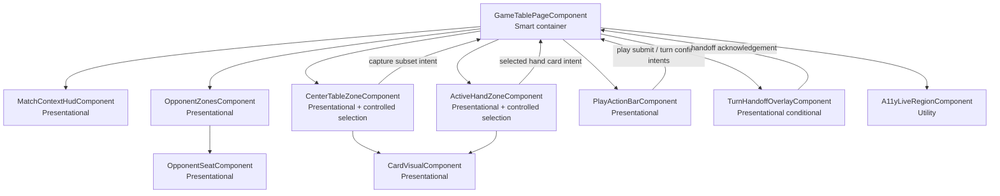
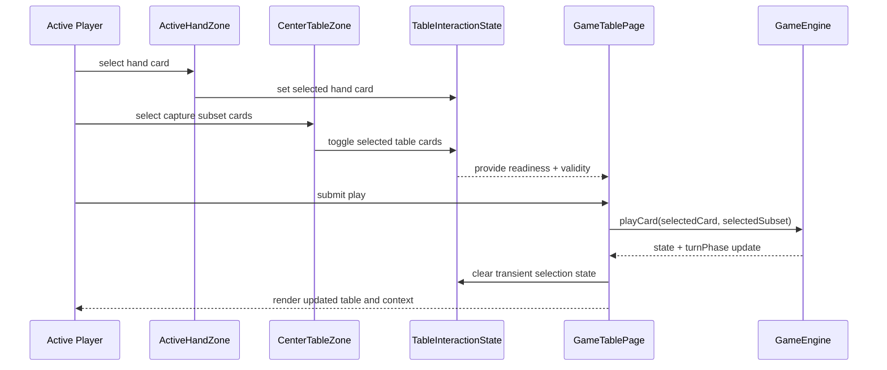
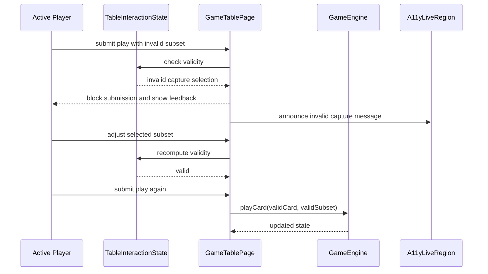
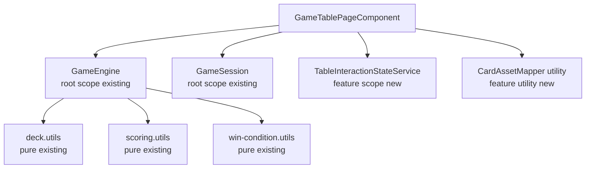
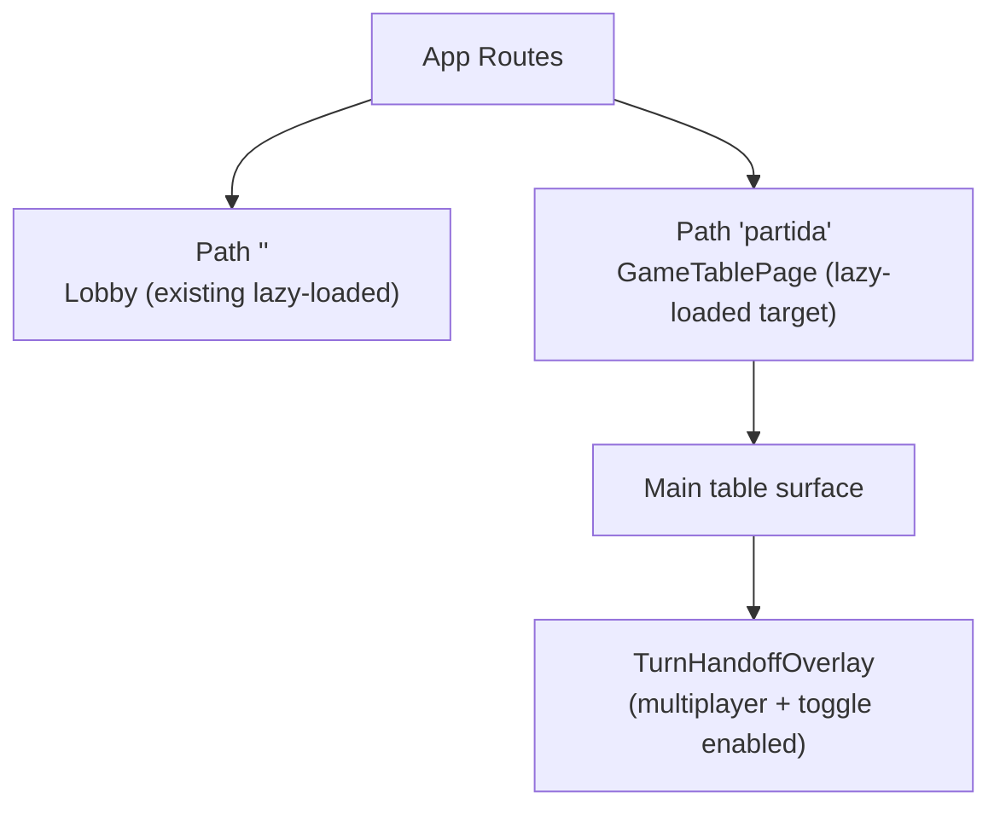

# Technical Design: Game Table MVP

**Source Spec:** `docs/specs/ui/game-table-mvp/`
**Based on:** `proposal.md`, `spec.md`, `user-stories.md`

---

## 1. Overview

Game Table MVP replaces the current game-board placeholder route with the first fully playable table surface. The feature is intentionally UI-focused and reuses the already-implemented Game Engine Core as its authoritative rules and state manager.

The design introduces:

- A fixed active-player perspective with the active hand at the bottom.
- Full capture subset interaction in the first release.
- A two-step action model that mirrors engine turn-phase behavior.
- Optional local multiplayer handoff flow.
- Keyboard and screen-reader baseline accessibility.

This document aligns with existing architecture conventions used in `docs/specs/game-engine/core/design.md` and the established Angular 21 signal-first approach in this repository.

---

## 2. Architecture Diagrams

### 2.1 Component Tree



### 2.1.1 Incremental Decomposition Contract

For incremental delivery, T-9 keeps match-context and primary action controls inline inside the table container while preserving the same data and intent contracts defined for presentational boundaries.

Staged extraction plan:

- Match-context extraction to `MatchContextHudComponent` is delivered in T-14.
- Primary action-bar extraction to `PlayActionBarComponent` is delivered in T-12.

This staged decomposition is the intended implementation sequence and is not considered architecture drift for T-9 scope.

---

### 2.2 Data Flow Diagram

```mermaid
flowchart LR
    GS["GameSession\nroot scope"] -->|configuration| GTP["GameTablePageComponent"]
    GE["GameEngine\nroot scope signals"] -->|authoritative game state| GTP

    GTP --> TIS["TableInteractionStateService\nfeature-scoped transient UI state"]
    TIS -->|selection + readiness| GTP

    GTP --> HUD["MatchContextHud"]
    GTP --> OPZ["OpponentZones"]
    GTP --> CTZ["CenterTableZone"]
    GTP --> AHZ["ActiveHandZone"]
    GTP --> PAB["PlayActionBar"]
    GTP --> THO["TurnHandoffOverlay"]
    GTP --> ALR["A11yLiveRegion"]

    AHZ -->|select hand card| TIS
    CTZ -->|toggle capture cards| TIS

    PAB -->|submit play| GTP
    GTP -->|playCard(card, subset)| GE

    PAB -->|confirm turn| GTP
    GTP -->|confirmTurn()| GE

    GE -->|updated signals| GTP
```

---

### 2.3 Sequence Diagram — Valid Capture Play



---

### 2.4 Sequence Diagram — Invalid Capture Then Recovery



---

### 2.5 Service Dependency Diagram



> **Diagram notes:**
>
> - `GameEngine` and `GameSession` remain root-scoped existing services; this feature does not change their responsibilities.
> - `TableInteractionStateService` is intentionally feature-scoped to keep UI intent state local and non-authoritative.
> - `CardAssetMapper` is a small utility for deterministic card-to-asset mapping and semantic card labels.

---

### 2.6 Routing Diagram



---

## 3. Architectural Decisions

### AD-1: Fixed Active-Player Bottom Perspective

- **Context:** The spec requires a primary interaction zone and opponent visibility without shifting player orientation.
- **Decision:** Keep the active player hand fixed at the bottom in all supported player counts.
- **Rationale:** Reduces cognitive load and makes keyboard/touch interaction consistent.
- **Consequences:** Opponent-zone positioning must adapt around the table per player count.
- **Requirement:** FR-1.2, FR-1.3, US-1.

---

### AD-2: Two-Step Play and Turn Completion

- **Context:** The existing engine explicitly separates `playCard` and `confirmTurn` using turn-phase state.
- **Decision:** UI action flow is split into play submission first, turn completion second.
- **Rationale:** Aligns directly with engine contract and avoids accidental turn progression.
- **Consequences:** UI must always expose current phase and phase-aware actions.
- **Requirement:** FR-3.4, FR-3.6, FR-5.1, FR-8.4, US-3.

---

### AD-3: Full Capture Subset Interaction in MVP

- **Context:** Product direction for this feature includes full legal capture behavior in first release.
- **Decision:** Include table-card subset selection and pre-submit validity feedback immediately.
- **Rationale:** Avoids shipping a non-playable pseudo-table and prevents reworking core interaction later.
- **Consequences:** Adds interaction complexity and demands stronger accessibility and test coverage.
- **Requirement:** FR-4.1 through FR-4.7, US-4.

---

### AD-4: Feature-Scoped Transient Interaction State

- **Context:** Engine signals are authoritative; selection state is ephemeral UI intent.
- **Decision:** Manage selected hand card, selected subset, readiness, and handoff UI flags in a feature-scoped interaction state service.
- **Rationale:** Keeps container logic manageable and avoids polluting engine state with non-authoritative UI concerns.
- **Consequences:** Clear contract required for when and how transient state resets.
- **Requirement:** TR-2.1, TR-2.2, TR-2.3, NFR-3.1.

---

### AD-5: Optional Multiplayer Handoff Flow

- **Context:** Local multiplayer requires both privacy-safe and fast-play options.
- **Decision:** Provide a handoff toggle that conditionally inserts an acknowledgement overlay between turns.
- **Rationale:** Supports different play contexts without forcing one behavior.
- **Consequences:** Multiplayer turn transition has two valid execution branches.
- **Requirement:** FR-5.2 through FR-5.5, TR-5.1 through TR-5.3, US-5.

---

### AD-6: Always-Visible Minimal Match HUD

- **Context:** Product priorities require permanent visibility of active player, match scores, and turn phase.
- **Decision:** Implement a dedicated always-visible context header for these three signals.
- **Rationale:** Keeps key decisions informed without modal or secondary navigation.
- **Consequences:** Responsive layout must protect card-zone space while preserving readability.
- **Requirement:** FR-2.1 through FR-2.4, US-2.

---

### AD-7: Accessibility-First Card Control Model

- **Context:** MVP accessibility baseline includes full keyboard and screen-reader support.
- **Decision:** Treat selectable cards as semantic controls with exposed selected-state and deterministic focus transitions.
- **Rationale:** Prevents expensive retrofit and reduces interaction ambiguity for assistive technology users.
- **Consequences:** Requires explicit focus and announcement contracts in interaction flows.
- **Requirement:** FR-6.1 through FR-6.4, TR-6.1 through TR-6.3, NFR-2.1 through NFR-2.3, US-6.

---

### AD-8: Textured Table Surface with Readability Overlay

- **Context:** Existing table texture asset should be used while maintaining contrast and legibility.
- **Decision:** Apply texture as base surface with subtle overlay and token-aligned foreground colors.
- **Rationale:** Preserves thematic identity and avoids readability regressions.
- **Consequences:** Visual regression and contrast checks become mandatory across breakpoints.
- **Requirement:** FR-1.5, TR-3.2, TR-3.3, NFR-2.3, US-1.

---

### AD-9: Reuse Existing Core Contracts Without Rule Duplication

- **Context:** Game rules, scoring, and win-condition behavior already exist in Game Engine Core.
- **Decision:** The table UI consumes engine contracts and does not duplicate rule computations in UI components.
- **Rationale:** Ensures behavioral consistency with the existing core architecture documents and avoids logic drift.
- **Consequences:** UI validation remains pre-submit guidance only; authoritative outcomes always come from engine updates.
- **Requirement:** FR-8.2, FR-8.3, FR-8.4, FR-8.6, TR-2.3, NFR-3.1, US-8.

---

## 4. Component Architecture

### 4.1 GameTablePageComponent

- **Type:** Smart container.
- **Responsibility:** Orchestrate engine/session integration, phase-aware actions, selection dispatching, and handoff branching.
- **Inputs:** Session configuration presence, engine signals, interaction-state outputs.
- **Outputs:** Play submit and turn confirm intents, handoff acknowledgement handling.
- **Children (target architecture):** MatchContextHud, OpponentZones, CenterTableZone, ActiveHandZone, PlayActionBar, TurnHandoffOverlay, A11yLiveRegion.
- **Children (T-9 implemented scope):** OpponentZones, CenterTableZone, ActiveHandZone; match-context and primary action controls remain inline until extraction tasks complete.

### 4.2 MatchContextHudComponent

- **Type:** Presentational.
- **Responsibility:** Render always-visible active player, scores, and phase.
- **Inputs:** Active player label, score summaries, phase status.
- **Outputs:** None.
- **Children:** None.
- **Delivery stage:** T-14 extracts this boundary from inline container markup.

### 4.3 OpponentZonesComponent

- **Type:** Presentational.
- **Responsibility:** Arrange and render opponent seat summaries according to player count.
- **Inputs:** Opponent summaries, active/opponent markers.
- **Outputs:** Optional focus intent events.
- **Children:** OpponentSeatComponent.

### 4.4 OpponentSeatComponent

- **Type:** Presentational.
- **Responsibility:** Display one opponent summary card.
- **Inputs:** Name, score, captured summary, active marker.
- **Outputs:** None.
- **Children:** None.

### 4.5 CenterTableZoneComponent

- **Type:** Presentational with controlled interactions.
- **Responsibility:** Render table cards and capture subset selection state.
- **Inputs:** Table cards, selected subset, interaction enabled state.
- **Outputs:** Table-card toggle intents.
- **Children:** CardVisualComponent.

### 4.6 ActiveHandZoneComponent

- **Type:** Presentational with controlled interactions.
- **Responsibility:** Render active hand and selected play-card state.
- **Inputs:** Active hand cards, selected hand card, interaction enabled state.
- **Outputs:** Hand-card selection intents.
- **Children:** CardVisualComponent.

### 4.7 CardVisualComponent

- **Type:** Presentational reusable unit.
- **Responsibility:** Render card image and semantic metadata consistently across zones.
- **Inputs:** Card descriptor, selected-state, disabled-state, label text.
- **Outputs:** Selection activation intents when interactive.
- **Children:** None.

### 4.8 PlayActionBarComponent

- **Type:** Presentational.
- **Responsibility:** Expose action controls and readiness/validity feedback.
- **Inputs:** Action readiness, capture validity, phase status.
- **Outputs:** Submit-play and confirm-turn intents.
- **Children:** None.
- **Delivery stage:** T-12 extracts this boundary from inline container markup.

### 4.9 TurnHandoffOverlayComponent

- **Type:** Presentational conditional.
- **Responsibility:** Handle optional multiplayer handoff acknowledgement between turns.
- **Inputs:** Handoff enabled state, next-player context.
- **Outputs:** Handoff acknowledgement intent.
- **Children:** None.

### 4.10 A11yLiveRegionComponent

- **Type:** Utility presentational.
- **Responsibility:** Announce turn, validation, and action outcomes to assistive technology.
- **Inputs:** Announcement message stream from container.
- **Outputs:** None.
- **Children:** None.

---

## 5. State Management

The feature uses two coordinated state layers.

### 5.1 Authoritative Layer

Authoritative state comes from Game Engine signals: table cards, hands, players, scores, turn index, turn phase, round result, and winner state.

### 5.2 Transient UI Layer

Transient interaction state contains only UI intent and is feature-scoped:

- Selected hand-card identity.
- Selected table-card subset identities.
- Derived capture validity and action readiness.
- Multiplayer handoff toggle state.
- Pending handoff acknowledgement status.
- Accessibility announcement message.

### 5.3 Transition Rules

- Selection updates only transient state.
- Successful play submission clears selection-related transient state.
- Turn completion updates authoritative state and may branch into handoff overlay.
- Invalid submissions keep authoritative state unchanged and emit feedback.

---

## 6. Service Layer

### 6.1 GameEngine (existing)

- **Scope:** Root.
- **Responsibility:** Authoritative rule enforcement, state progression, scoring, winner detection.
- **Dependencies:** Existing pure utilities.
- **Key methods:** Initialize game, execute play, confirm turn, start next round.

### 6.2 GameSession (existing)

- **Scope:** Root.
- **Responsibility:** Provide session configuration from lobby flow.
- **Dependencies:** None.
- **Key methods:** Store and expose active configuration.

### 6.3 TableInteractionStateService (new)

- **Scope:** Feature scope.
- **Responsibility:** Manage transient UI intent state for selection, readiness, handoff flags.
- **Dependencies:** None.
- **Key methods:** Select or clear hand card, toggle subset cards, clear transient state, update handoff flags.

### 6.4 CardAssetMapper Utility (new)

- **Scope:** Feature utility.
- **Responsibility:** Map card identity to visual asset descriptor and semantic label text.
- **Dependencies:** Card naming conventions and card model values.
- **Key methods:** Resolve asset key and accessible label from card identity.

---

## 7. Routing

The existing lazy-loaded `partida` route remains in place, but its route target changes from placeholder to game-table container. No additional child routes are required for MVP.

---

## 8. Data Model

No new authoritative domain model is introduced; the feature reuses existing models from Game Engine Core.

### 8.1 Reused Authoritative Models

- `Card`: Suit, rank, and value identity used for rendering and action requests.
- `Player`: Current hand, captured pile, escoba count, and player identity.
- `GameState`: Deck, table, players, turn index, round, score map, and last capturer.
- `TurnPhase`: Action gating between play submission and turn confirmation.
- `RoundResult`: End-of-round score breakdown display source.
- `GameConfiguration`: Session bootstrap context from lobby.

### 8.2 UI-Only Interaction State

- Selected play-card identity.
- Selected capture subset identities.
- Capture validity and action readiness status.
- Handoff toggle and acknowledgement status.
- Current accessibility announcement content.

These UI-only fields are transient and not persisted as authoritative game state.

---

## 9. API Integration

This feature has no backend API integration. All actions are local and synchronous via existing game engine service methods.

---

## 10. Error Handling

### 10.1 Proactive Controls

- Block known-invalid submissions through readiness and validity gating.
- Display immediate inline feedback for invalid selection combinations.

### 10.2 Reactive Controls

- If a submitted action is rejected by engine constraints, preserve deterministic recovery: adjust selection, clear selection, or retry.
- Avoid visual desynchronization by treating engine state as authoritative after every action attempt.

### 10.3 Handoff Safety

- If handoff state becomes inconsistent, fail safe to direct-turn rendering and preserve ability to continue match flow.

---

## 11. Accessibility

Accessibility baseline includes:

- Full keyboard navigation for selection, submission, and turn completion.
- Semantic card labels and selected-state announcements.
- Programmatic announcements for invalid submissions and turn changes.
- Deterministic focus behavior after submit, invalid attempt, confirm turn, and handoff acknowledgement.
- Contrast-preserving text and controls over textured backgrounds.

---

## 12. Performance Considerations

- Segment rendering by component zones to reduce unnecessary updates.
- Keep high-frequency interaction state local and lightweight.
- Use stable card identity keys for predictable list rendering.
- Protect perceived responsiveness through immediate local feedback while awaiting engine signal updates.
- Prevent layout shift by reserving card visual dimensions consistently across breakpoints.

---

## 13. Testing Strategy

### 13.1 Unit Tests

- Transient interaction-state transitions.
- Action readiness and validity derivation.
- Handoff toggle and branch behavior.

### 13.2 Integration Tests

- Engine-signal rendering synchronization.
- Play submission and turn completion orchestration.
- Invalid action handling without desynchronization.

### 13.3 End-to-End Tests

- Single-player and multiplayer core gameplay paths.
- Capture subset validity and error-recovery paths.
- Handoff enabled versus disabled branches.
- Keyboard-only operation and critical screen-reader semantics.
- Mobile and desktop responsive usability and readability checks.

---

## 14. Risk Assessment

| Risk                                                                        | Likelihood | Impact | Mitigation                                                                                                                                         |
| --------------------------------------------------------------------------- | ---------- | ------ | -------------------------------------------------------------------------------------------------------------------------------------------------- |
| Capture-subset interaction complexity causes frequent user errors           | Medium     | High   | Keep selection model explicit, provide immediate validity feedback, and test invalid/edge combinations thoroughly.                                 |
| Transient selection state drifts from authoritative engine state            | Medium     | High   | Treat engine as single source of truth, reset transient state only on explicit transition points, and assert synchronization in integration tests. |
| Handoff branch behavior leaks next-player information in multiplayer        | Medium     | Medium | Gate handoff to multiplayer only, isolate overlay flow, and test both toggle branches across turn transitions.                                     |
| Textured surface reduces readability on small screens                       | Low        | Medium | Enforce overlay treatment and run contrast/readability checks at mobile and desktop breakpoints.                                                   |
| Keyboard and screen-reader interaction regressions under feature complexity | Medium     | High   | Define focus and announcement contracts in design, and enforce them with automated tests and acceptance criteria.                                  |
