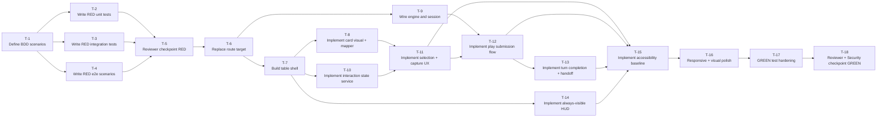

# Implementation Tasks: Game Table MVP

**Source Design:** `docs/specs/ui/game-table-mvp/design.md`

---

## Task Dependency Overview

---

## Tasks

### T-1: Define BDD Scenario Set and Traceability Matrix

- **Description:** Create the game-table BDD scenario document and map each scenario to FR, TR, and US identifiers.
- **Architectural Decision:** AD-2, AD-3, AD-7.
- **Depends on:** None.
- **Components affected:** Feature documentation and test planning assets.
- **Acceptance criteria:**
  - [ ] BDD scenarios cover layout, selection, capture, submission, turn completion, handoff, accessibility, and responsive behavior.
  - [ ] Every scenario references at least one FR or TR identifier.
  - [ ] A traceability matrix exists and is internally consistent.
- **Estimation hint:** S.
- **Spec traceability:** FR-1 through FR-8, TR-1 through TR-6, US-1 through US-8.

### T-2: RED Unit Tests for Interaction-State Logic

- **Description:** Write failing unit tests for transient selection, readiness, validity, and handoff state logic.
- **Architectural Decision:** AD-4, AD-5.
- **Depends on:** T-1.
- **Components affected:** TableInteractionStateService tests.
- **Status:** ✅ Implemented
- **Acceptance criteria:**
  - [ ] Selection and clearing behavior is defined in failing tests.
  - [ ] Capture validity derivation is defined in failing tests.
  - [ ] Handoff flag behavior is defined in failing tests.
- **Estimation hint:** M.
- **Spec traceability:** FR-3.2, FR-3.3, FR-4.1, FR-4.2, FR-5.2, TR-2.2.

### T-3: RED Integration Tests for Container Orchestration

- **Description:** Write failing integration tests for engine-driven rendering, action dispatching, and phase gating.
- **Architectural Decision:** AD-2, AD-9.
- **Depends on:** T-1.
- **Components affected:** GameTablePage orchestration tests.
- **Status:** ✅ Implemented
- **Acceptance criteria:**
  - [ ] Play submission and turn completion orchestration is represented by failing tests.
  - [ ] Engine-state synchronization expectations are represented by failing tests.
  - [ ] Invalid submission behavior is represented by failing tests.
- **Estimation hint:** M.
- **Spec traceability:** FR-3.4, FR-3.6, FR-8.2, FR-8.3, FR-8.4, NFR-3.1.

### T-4: RED End-to-End Scenario Tests

- **Description:** Write failing end-to-end scenarios for single-player and multiplayer table interactions, including handoff branches.
- **Architectural Decision:** AD-1, AD-3, AD-5, AD-7.
- **Depends on:** T-1.
- **Components affected:** Cypress BDD scenarios and step plans.
- **Status:** ✅ Implemented
- **Acceptance criteria:**
  - [ ] Single-player core play flow is represented by failing scenarios.
  - [ ] Multiplayer handoff enabled and disabled branches are represented by failing scenarios.
  - [ ] Keyboard and responsive baseline flows are represented by failing scenarios.
- **Estimation hint:** M.
- **Spec traceability:** FR-5.2 through FR-5.5, FR-6.1 through FR-6.4, FR-7.1 through FR-7.3, US-5, US-6, US-7.

### T-5: Reviewer Checkpoint (RED)

- **Description:** Perform red-phase review for test quality, scenario coverage, and traceability before production code changes.
- **Architectural Decision:** AD-7, AD-9.
- **Depends on:** T-2, T-3, T-4.
- **Components affected:** Review artefacts for this feature.
- **Status:** ✅ Implemented
- **Acceptance criteria:**
  - [ ] Coverage gaps and weak assertions are identified.
  - [ ] Traceability consistency is verified.
  - [ ] Red-phase findings are documented and actionable.
- **Estimation hint:** S.
- **Spec traceability:** NFR-3.1, NFR-4.1.

### T-6: Replace Route Target for `partida`

- **Description:** Replace placeholder route target with the game-table container while preserving lazy-loading behavior.
- **Architectural Decision:** AD-1, AD-9.
- **Depends on:** T-5.
- **Components affected:** App routes and game table container entry point.
- **Status:** ✅ Implemented
- **Acceptance criteria:**
  - [ ] `partida` resolves to game-table container.
  - [ ] Previous placeholder is no longer active route target.
  - [ ] Route remains lazy-loaded.
- **Estimation hint:** S.
- **Spec traceability:** FR-1.1, FR-8.1, TR-1.1, TR-1.2.

### T-7: Build Game Table Layout Shell

- **Description:** Implement structural layout with bottom active hand zone, center table zone, and adaptive opponent zones.
- **Architectural Decision:** AD-1, AD-6, AD-8.
- **Depends on:** T-6.
- **Components affected:** GameTablePage, OpponentZones, CenterTableZone, ActiveHandZone.
- **Status:** ✅ Implemented
- **Acceptance criteria:**
  - [ ] Active hand zone is bottom anchored.
  - [ ] Center table zone renders central play area.
  - [ ] Opponent zones adapt for 2 to 4 players.
- **Estimation hint:** M.
- **Spec traceability:** FR-1.2, FR-1.3, FR-1.4, FR-7.1, FR-7.3, US-1.

### T-8: Implement Card Visual and Asset Mapping

- **Description:** Implement reusable card visual rendering and deterministic card-to-asset mapping with semantic label support.
- **Architectural Decision:** AD-7, AD-8.
- **Depends on:** T-7.
- **Components affected:** CardVisualComponent and CardAssetMapper utility.
- **Status:** ✅ Implemented
- **Acceptance criteria:**
  - [ ] Cards render consistently in hand and table zones.
  - [ ] Asset mapping handles all expected suit/rank identities.
  - [ ] Semantic labels are available for accessibility.
- **Estimation hint:** M.
- **Spec traceability:** FR-1.5, FR-6.2, TR-3.1, TR-3.2, TR-3.4, TR-6.2.

### T-9: Wire Game Engine and Session Integration

- **Description:** Connect container logic to game-session bootstrap context and game-engine signals/actions.
- **Architectural Decision:** AD-2, AD-9.
- **Depends on:** T-6.
- **Components affected:** GameTablePage orchestration layer.
- **Decomposition note:** Match-context and primary action-bar extraction are intentionally deferred to T-14 (`MatchContextHud`) and T-12 (`PlayActionBar`).
- **Status:** ✅ Implemented
- **Acceptance criteria:**
  - [ ] Table renders authoritative state from engine signals.
  - [ ] Session configuration handoff is respected.
  - [ ] Action dispatch points align with engine method boundaries.
- **Estimation hint:** M.
- **Spec traceability:** FR-8.1, FR-8.2, FR-8.3, FR-8.4, FR-8.6, TR-2.1, TR-2.3, US-8.

### T-10: Implement Feature-Scoped Interaction State Service

- **Description:** Implement transient selection and readiness state management with deterministic reset behavior.
- **Architectural Decision:** AD-4.
- **Depends on:** T-7.
- **Components affected:** TableInteractionStateService and container bindings.
- **Status:** ✅ Implemented
- **Acceptance criteria:**
  - [ ] Selected hand-card state is managed locally.
  - [ ] Capture subset state is managed locally.
  - [ ] Readiness and validity are derived consistently.
  - [ ] Reset behavior is deterministic after successful transitions.
- **Estimation hint:** M.
- **Spec traceability:** FR-3.2, FR-3.3, FR-4.1, FR-4.2, TR-2.2, TR-2.4.

### T-11: Implement Selection and Capture UX

- **Description:** Enable active-hand card selection and table-card subset selection with clear selected-state feedback.
- **Architectural Decision:** AD-3, AD-7.
- **Depends on:** T-8, T-10.
- **Components affected:** ActiveHandZone, CenterTableZone, PlayActionBar.
- **Status:** ✅ Implemented
- **Acceptance criteria:**
  - [ ] Only active-player hand cards are interactive.
  - [ ] Table-card subset can be selected and deselected.
  - [ ] Selected-state feedback is visual and semantic.
  - [ ] Invalid combinations are identified before submit.
- **Estimation hint:** L.
- **Spec traceability:** FR-3.1, FR-4.1, FR-4.2, FR-6.2, US-3, US-4.

### T-12: Implement Play Submission Flow

- **Description:** Implement play submission gating, invalid-action feedback, placement behavior, and valid capture dispatch.
- **Architectural Decision:** AD-2, AD-3, AD-9.
- **Depends on:** T-9, T-11.
- **Components affected:** GameTablePage and PlayActionBar.
- **Status:** ✅ Implemented
- **Acceptance criteria:**
  - [ ] Submission requires selected hand card.
  - [ ] Empty subset is treated as placement.
  - [ ] Invalid capture submission is blocked with feedback.
  - [ ] Valid submission dispatches to engine and clears transient selection.
- **Estimation hint:** L.
- **Spec traceability:** FR-3.4, FR-3.5, FR-4.3, FR-4.4, FR-4.5, FR-4.7, FR-8.3, FR-8.6, US-8.

### T-13: Implement Turn Completion and Handoff Branching

- **Description:** Implement phase-aware turn confirmation and optional multiplayer handoff overlay branch.
- **Architectural Decision:** AD-2, AD-5.
- **Depends on:** T-12.
- **Components affected:** GameTablePage, TurnHandoffOverlay, PlayActionBar.
- **Status:** ✅ Implemented
- **Acceptance criteria:**
  - [ ] Turn completion is separate from play submission.
  - [ ] Handoff overlay appears when multiplayer handoff mode is enabled.
  - [ ] Direct progression occurs when handoff mode is disabled.
  - [ ] Single-player flow bypasses handoff branch.
- **Estimation hint:** M.
- **Spec traceability:** FR-3.6, FR-5.1, FR-5.2, FR-5.3, FR-5.4, FR-5.5, FR-5.6, TR-5.3.

### T-14: Build Always-Visible Match HUD

- **Description:** Implement persistent context header for active player, match scores, and turn phase.
- **Architectural Decision:** AD-6.
- **Depends on:** T-7.
- **Components affected:** MatchContextHud.
- **Status:** ✅ Implemented
- **Acceptance criteria:**
  - [ ] Active player is always visible.
  - [ ] Match scores are always visible.
  - [ ] Turn phase is always visible.
  - [ ] Context remains readable over textured surface.
- **Estimation hint:** S.
- **Spec traceability:** FR-2.1, FR-2.2, FR-2.3, FR-2.4, US-2.

### T-15: Implement Accessibility Baseline

- **Description:** Implement keyboard support, semantic labels, announcements, and deterministic focus transitions.
- **Architectural Decision:** AD-7, AD-8.
- **Depends on:** T-11, T-12, T-13, T-14.
- **Components affected:** All interactive table components and A11yLiveRegion.
- **Status:** ✅ Implemented
- **Acceptance criteria:**
  - [ ] Full keyboard flow is operable for core actions.
  - [ ] Cards and controls expose accessible names and selected-state semantics.
  - [ ] Validation and turn-change announcements are available.
  - [ ] Focus behavior is deterministic after key transitions.
- **Estimation hint:** L.
- **Spec traceability:** FR-6.1, FR-6.2, FR-6.3, FR-6.4, TR-6.1, TR-6.2, TR-6.3, NFR-2.1, NFR-2.2.

### T-16: Responsive and Visual Polish Pass

- **Description:** Finalize responsive layout behavior, texture overlay readability, and touch-target quality.
- **Architectural Decision:** AD-1, AD-6, AD-8.
- **Depends on:** T-15.
- **Components affected:** Table layout and visual styling layer.
- **Status:** ✅ Implemented
- **Acceptance criteria:**
  - [ ] Mobile usability is maintained from 320 width.
  - [ ] Touch-friendly control sizing is preserved.
  - [ ] Desktop layout remains legible and balanced.
  - [ ] Textured surface readability is validated.
- **Estimation hint:** M.
- **Spec traceability:** FR-7.1, FR-7.2, FR-7.3, NFR-2.3, US-7.

### T-17: GREEN Test Hardening and Coverage Completion

- **Description:** Make all RED tests pass, close coverage gaps, and stabilize test reliability.
- **Architectural Decision:** AD-2 through AD-9.
- **Depends on:** T-16.
- **Components affected:** Unit, integration, and end-to-end test suites.
- **Status:** ✅ Implemented
- **Acceptance criteria:**
  - [ ] RED tests are transitioned to passing GREEN state.
  - [ ] Flaky scenarios are stabilized.
  - [ ] Traceability links remain accurate after implementation changes.
- **Estimation hint:** M.
- **Spec traceability:** NFR-3.1, NFR-3.2, NFR-4.1.

### T-18: Reviewer and Security Checkpoint (GREEN)

- **Description:** Perform final architecture-quality and security-focused review before implementation sign-off.
- **Architectural Decision:** AD-7, AD-8, AD-9.
- **Depends on:** T-17.
- **Components affected:** Feature review artifacts and security assessment notes.
- **Status:** ✅ Implemented
- **Acceptance criteria:**
  - [ ] Reviewer findings are addressed or explicitly tracked.
  - [ ] Accessibility and state-synchronization risks are revalidated.
  - [ ] Security and dependency concerns are documented for release readiness.
- **Estimation hint:** S.
- **Spec traceability:** NFR-2, NFR-3, NFR-4.

---

## Implementation Order

1. T-1: Define BDD scenarios and traceability matrix - locks coverage and acceptance language early.
2. T-2: Write RED unit tests - defines expected behavior for local interaction-state logic.
3. T-3: Write RED integration tests - defines orchestration behavior against engine contracts.
4. T-4: Write RED end-to-end scenarios - defines cross-layer player flows and responsive expectations.
5. T-5: Reviewer checkpoint RED - prevents weak or misleading tests from driving implementation.
6. T-6: Replace route target - establishes real runtime entry point for the feature.
7. T-7: Build table shell - sets structural layout foundation for all interactions.
8. T-8: Implement card visual and mapper - enables consistent rendering and semantics.
9. T-9: Wire engine/session integration - activates authoritative data flow.
10. T-10: Implement interaction state service - supports controlled selection and validity logic.
11. T-11: Implement selection and capture UX - enables core player intent interactions.
12. T-12: Implement play submission flow - delivers first complete action loop.
13. T-13: Implement turn completion and handoff branching - completes phase-aware multiplayer behavior.
14. T-14: Build always-visible HUD - finalizes persistent gameplay context.
15. T-15: Implement accessibility baseline - hardens keyboard and screen-reader quality.
16. T-16: Responsive and visual polish pass - ensures cross-device readability and usability.
17. T-17: GREEN test hardening and coverage completion - stabilizes quality before final review.
18. T-18: Reviewer and Security checkpoint GREEN - final architecture and risk sign-off.
