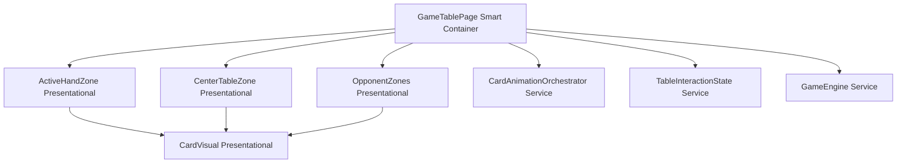
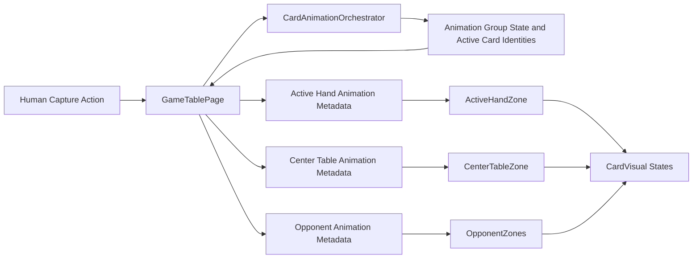
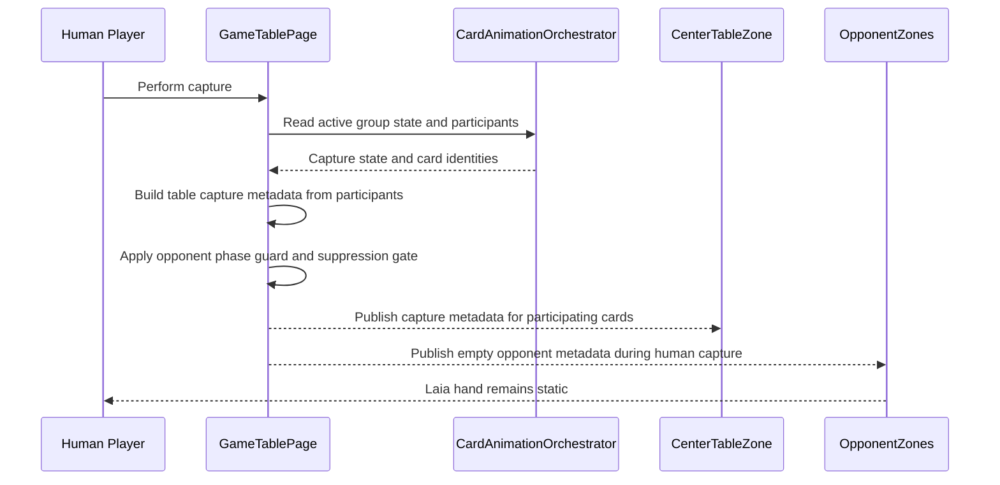
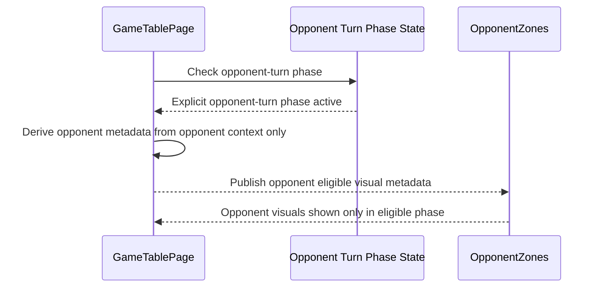
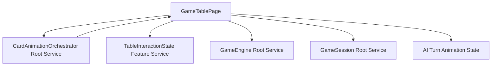
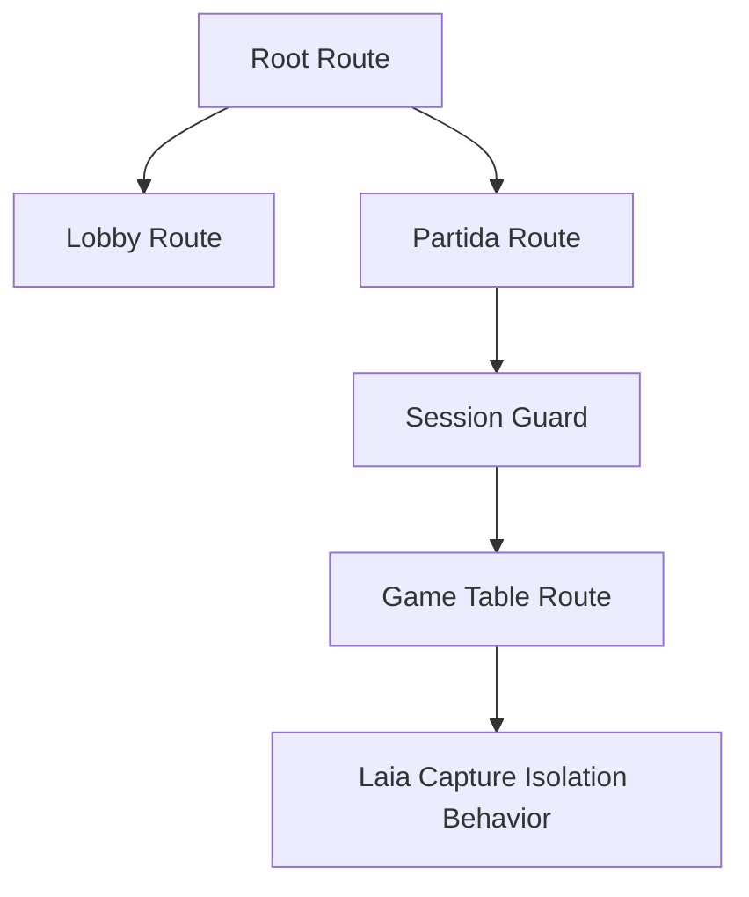

# Technical Design: Laia Hand Capture Animation Bleed

Source Spec: docs/specs/ui/laia-hand-capture-animation-bleed/
Based on: proposal.md, spec.md, user-stories.md, bdd-test.md

## 1. Overview

This design addresses a visual isolation defect where opponent hand cards incorrectly display human capture glow effects. The implementation keeps gameplay logic unchanged and constrains the fix to presentation-state derivation for animation metadata. The primary architectural goal is strict zone isolation: human capture effects apply only to capture participants, while opponent hand visuals stay inert unless the game is in an explicit opponent-turn animation phase.

## 2. Architecture Diagrams

This section provides visual architecture views for the feature-level fix.

### 2.1 Component Tree

### 2.2 Data Flow

### 2.3 Sequence Diagram — Human Capture Isolation

### 2.4 Sequence Diagram — Opponent Turn Eligibility Path

### 2.5 Service Dependency Diagram

### 2.6 Routing Diagram

Routing remains structurally unchanged. The diagram is included to show that this fix is internal to the existing game table route and introduces no new route branch, guard, or resolver.

## 3. Architectural Decisions

### AD-1: Enforce opponent-zone isolation at metadata generation

- Context: Opponent hand visuals can be contaminated by upstream animation grouping if isolation occurs only at rendering.
- Decision: Apply human-turn suppression and opponent-phase eligibility at metadata derivation in the smart container.
- Rationale: The earliest reliable boundary is metadata generation where source intent is known.
- Consequences: Opponent zone receives explicit no-op metadata during human captures.
- Requirement: FR-1.2, TR-1.1, TR-1.2, NFR-1.1.

### AD-2: Keep opponent metadata contract shape stable using empty list for no-op

- Context: Varying metadata shapes can create inconsistent handling paths and regressions.
- Decision: Return an empty opponent collection for ineligible contexts rather than null-like branching semantics.
- Rationale: Stable data contracts reduce conditional complexity and make regression tests deterministic.
- Consequences: Consumers can treat opponent metadata uniformly across phases.
- Requirement: FR-1.4, TR-1.2, NFR-1.2.

### AD-3: Opponent animation eligibility is phase-driven, not capture-group-driven

- Context: Capture group participants represent table action, not opponent hand identity.
- Decision: Opponent animation state is sourced only from explicit opponent-turn phase context.
- Rationale: Prevents cross-zone projection from positional or count-based mapping.
- Consequences: Human capture size no longer influences opponent hand visuals.
- Requirement: FR-1.4, TR-1.3, NFR-1.1.

### AD-4: Preserve existing component and routing boundaries

- Context: This is a targeted bug fix with no product requirement for architectural expansion.
- Decision: Reuse existing page, zones, and services; avoid introducing new route or state management layers.
- Rationale: Minimizes risk and keeps performance and accessibility behavior stable.
- Consequences: Change scope is narrow and easier to validate with focused regression scenarios.
- Requirement: FR-1.3, NFR-1.3, NFR-1.4.

## 4. Component Architecture

### 4.1 GameTablePage

- Type: Smart container.
- Responsibility: Derives zone-specific animation metadata and applies phase and suppression rules.
- Inputs: Active animation state, active animation participants, opponent-turn phase, session mode context.
- Outputs: Metadata streams for hand, table, and opponent zones.
- Children: ActiveHandZone, CenterTableZone, OpponentZones.

### 4.2 ActiveHandZone

- Type: Presentational.
- Responsibility: Renders human hand card visuals and accepted animation states.
- Inputs: Active hand cards, selection state, hand animation metadata.
- Outputs: Selection and play intents.
- Children: CardVisual units.

### 4.3 CenterTableZone

- Type: Presentational.
- Responsibility: Renders table cards and capture-related visual transitions.
- Inputs: Table cards and center-table animation metadata.
- Outputs: Table selection and capture targeting intents.
- Children: CardVisual units.

### 4.4 OpponentZones

- Type: Presentational.
- Responsibility: Renders opponent hand and related visual indicators.
- Inputs: Opponent metadata and suppression signal.
- Outputs: None for gameplay control.
- Children: CardVisual units for shown opponent-related cards.

### 4.5 CardAnimationOrchestrator

- Type: Service.
- Responsibility: Publishes action animation lifecycle and participant context.
- Inputs: Action lifecycle events.
- Outputs: Readable animation state and active participant identities.
- Children: Not applicable.

## 5. State Management

Game rules and turn progression remain in the existing immutable game state flow. Animation behavior is derived via signals and computed metadata. The key change is metadata gating logic:

- Table capture metadata remains participation-based.
- Opponent metadata is eligible only when explicit opponent-turn phase is active.
- Human capture contexts publish empty opponent metadata.

This keeps state ownership unchanged while enforcing deterministic visual boundaries.

## 6. Service Layer

### 6.1 CardAnimationOrchestrator

- Scope: Existing application service scope.
- Responsibility: Tracks active animation type and participant identities.
- Dependencies: Existing game table orchestration context.
- Key methods: Group start and completion reporting in plain behavioral terms.

### 6.2 TableInteractionState

- Scope: Feature-level interaction scope.
- Responsibility: Manages user interaction state in table flow.
- Dependencies: Existing feature wiring.
- Key methods: Interaction reset and selection lifecycle behavior.

### 6.3 GameEngine and GameSession

- Scope: Root scope.
- Responsibility: Rules, turn lifecycle, and session context.
- Dependencies: Existing domain services.
- Key methods: Existing turn and action progression behaviors unaffected by this fix.

## 7. Routing

No new route is introduced. No guard or resolver is added. The behavior change is contained within existing game table route rendering logic.

## 8. Data Model

Key structures in plain English:

- Active animation participants: identifiers of cards involved in the current visual action.
- Zone animation metadata: per-zone rendering instructions derived from context.
- Opponent metadata collection: list of opponent visual entries by opponent card index and animation state.
- Opponent phase context: explicit marker of whether opponent-turn visuals are currently eligible.

No gameplay model or scoring data structure changes.

## 9. API Integration

No backend integration changes are required. The defect and fix are entirely in UI-state derivation and rendering behavior.

## 10. Error Handling

- If animation state becomes unavailable momentarily, opponent zone defaults to no-op visual metadata.
- In ineligible opponent contexts, metadata remains empty to prevent stale animation carry-over.
- Consecutive capture actions recompute metadata each cycle, preventing residual bleed from previous action groups.

## 11. Accessibility

- Reduced-motion behavior remains compatible with current accessibility expectations.
- Keyboard and focus behavior remain unchanged because the fix is metadata gating, not interaction rewriting.
- Opponent-hand static behavior during human captures reduces cognitive confusion for screen-plus-keyboard users.

## 12. Performance Considerations

- The change removes unnecessary opponent-hand animation assignment during human captures.
- Metadata gating is lightweight and computed once per animation-state change.
- No additional rendering layers or animation effects are introduced.

## 13. Testing Strategy

Unit and integration targets:

- Opponent metadata generation returns empty collection during human captures.
- Opponent metadata generation is active only during explicit opponent-turn phases.
- Consecutive capture cycles do not produce residual opponent animation states.

End-to-end targets aligned with bdd-test scenarios:

- Single-card, multi-card, and Escoba capture isolation.
- Opponent-turn eligibility and recovery to static state.
- Reduced-motion, keyboard/focus preservation, and responsiveness checks.

## 14. Risk Assessment

| Risk                                                     | Likelihood | Impact | Mitigation                                                                             |
| -------------------------------------------------------- | ---------- | ------ | -------------------------------------------------------------------------------------- |
| Legitimate opponent-turn visuals accidentally suppressed | Medium     | Medium | Gate by explicit opponent phase and verify with dedicated eligibility scenarios        |
| Hidden consumer reliance on null-like metadata behavior  | Low        | Medium | Use stable empty-list contract and validate consumers through regression tests         |
| Residual animation bleed after consecutive captures      | Medium     | High   | Recompute metadata every capture cycle and add repeated-capture tests                  |
| Accessibility regressions from timing interactions       | Low        | Medium | Keep interaction pathways unchanged and validate keyboard and reduced-motion scenarios |
