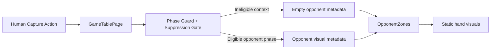
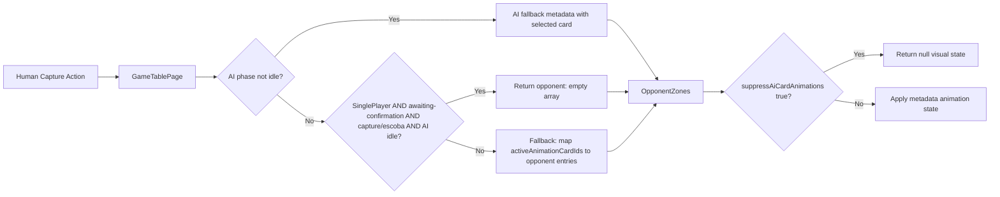

# Review Report: Laia Hand Capture Animation Bleed — T-1 GREEN Phase

**Review Mode:** Incremental (T-1: Confirm stable opponent metadata no-op contract) — GREEN implementation
**Source:** `docs/specs/ui/laia-hand-capture-animation-bleed/`
**Reviewed against:** proposal.md, spec.md, user-stories.md, bdd-test.md, design.md, tasks.md
**Scope files:**

- `src/app/features/game-board/game-table-page/game-table-page.ts`
- `src/app/features/game-board/game-table-page/game-table-page.spec.ts`
- `docs/specs/ui/laia-hand-capture-animation-bleed/tasks.md`

## 1. Executive Summary

The T-1 GREEN implementation correctly establishes the empty-array no-op contract for opponent metadata during human capture contexts. A targeted guard branch was added to the `opponentAnimationMetadata` computed signal that returns `{ opponent: [] }` when four conditions hold: single-player mode, awaiting-confirmation turn phase, capture or escoba visual state, and AI animation idle. The implementation aligns with AD-2, the three T-1 RED tests now pass, and no pre-existing tests are broken. The guard coexists cleanly with the existing consumer-side `suppressAiCardAnimations` mechanism, providing complementary coverage across the full human-turn lifecycle.

- Total findings: 4 (0 Critical, 0 Major, 1 Minor, 3 Note)
- Spec compliance: TR-1.2 Met, NFR-1.2 Met, US-2 Partial (full delivery requires T-2/T-3)
- Architecture alignment: Aligned — AD-2 contract faithfully implemented
- Test quality: Meaningful — all three T-1 tests verify shape and content without superficial assertions
- Previous RED findings resolution: RV-01 deferred correctly to T-2; RV-02 resolved (non-issue); RV-03 remains informational

## 2. Architecture Comparison

### 2.1 Planned Opponent Metadata Flow (from design.md)

### 2.2 Actual Opponent Metadata Flow (as implemented)

### 2.3 Drift Analysis

The planned design (design.md section 2.3) describes a two-gate approach: "Apply opponent phase guard and suppression gate" at the producer level. The actual implementation implements the suppression gate through a conditional branch that checks four preconditions before returning empty metadata. This aligns structurally with AD-1 (enforce at metadata generation) and AD-2 (empty list, not null).

A complementary consumer-side suppression mechanism (`suppressAiCardAnimations` passed to OpponentZones) covers the `awaiting-card-play` phase of human turns. This dual-layer approach provides defense-in-depth not explicitly called out in the design document but consistent with its intent. No architectural drift is detected for T-1 scope.

### 2.4 T-5 Test Non-Conflict Confirmation

The RED review (RV-02) flagged a potential conflict with the pre-existing T-5/AD-1 test. Analysis confirms NO conflict exists: that test uses `awaiting-card-play` phase, which bypasses the new guard entirely (the guard requires `awaiting-confirmation`). The fallback path continues to produce opponent entries during `awaiting-card-play`, and the T-5 test passes unmodified.

## 3. Findings

### RV-01: Consumer contract assumptions not documented inline [Minor]

- **Category:** Spec Compliance
- **Severity:** Minor
- **Related:** AD-2, T-1 AC-3, TR-1.2, NFR-1.2
- **Description:** T-1 acceptance criterion 3 states "Consumer assumptions are documented for regression clarity." The implementation contains no inline comments explaining the empty-array contract, why it exists, or what consumers should expect during human capture contexts.
- **Expected:** A comment above the guard branch explaining that ineligible opponent contexts produce an empty collection (not null), per AD-2, so consumers can uniformly iterate without null-checks.
- **Actual:** The guard branch has no accompanying documentation. Contract semantics are only discoverable through test names and the spec documents.
- **Recommendation:** Add a brief comment above the guard branch in `opponentAnimationMetadata` explaining the no-op contract rationale and its relationship to AD-2. This aids future regression investigators.
- **Impact:** Low functional impact. Reduces onboarding friction and regression investigation speed for future maintainers.

### RV-02: Dual suppression mechanism relationship undocumented [Note]

- **Category:** Code Quality
- **Severity:** Note
- **Related:** AD-1, AD-3, TR-1.2
- **Description:** Two complementary suppression mechanisms exist: (1) producer-side empty metadata during `awaiting-confirmation` phase, and (2) consumer-side `suppressAiCardAnimations` during `awaiting-card-play` phase. Together they cover the full human-turn lifecycle, but their relationship is not documented anywhere.
- **Expected:** Understanding why both mechanisms exist and which phase each covers is essential for maintainers modifying either path.
- **Actual:** The mechanisms work correctly together but their design relationship is implicit.
- **Recommendation:** A brief design note (either inline or in the design document) explaining that producer-side handles post-play confirmation, while consumer-side handles pre-play selection phase.
- **Impact:** No functional impact. Informational for future developers.

### RV-03: BDD scenario IDs not cross-referenced in unit test names [Note]

- **Category:** Spec Compliance
- **Severity:** Note
- **Related:** SC-01, SC-02, SC-03
- **Description:** The three T-1 tests reference task and requirement IDs (T-1, TR-1.2, NFR-1.2, FR-1.3) but do not cross-reference BDD scenarios SC-01, SC-02, SC-03 which correspond to the same capture isolation dimensions.
- **Expected:** Cross-referencing BDD scenarios aids traceability from unit tests to E2E scenarios.
- **Actual:** Test names cite requirement IDs only.
- **Recommendation:** Consider adding SC-XX references to test names. This is informational; BDD scenarios are E2E-scoped and these are unit-level contract tests.
- **Impact:** No functional impact. Minor traceability convenience.

### RV-04: Guard condition ordering favors AI-active path over human-capture path [Note]

- **Category:** Code Quality
- **Severity:** Note
- **Related:** AD-3, TR-1.3
- **Description:** The `opponentAnimationMetadata` computed evaluates the AI-active branch (returning opponent metadata with a card entry) BEFORE the human-capture empty-array branch. If both conditions could theoretically be true simultaneously (AI animation not idle AND capture visual state active during confirmation), the AI-active branch would take precedence.
- **Expected:** Per AD-3, opponent animation is phase-driven. During awaiting-confirmation with AI idle, the empty branch correctly activates. The ordering is safe because the AI-active branch requires `aiAnimationState.phase !== 'idle'` while the empty branch requires `aiAnimationState.phase === 'idle'` — these are mutually exclusive.
- **Actual:** Branch ordering is safe due to mutually exclusive conditions. No logical conflict exists.
- **Recommendation:** No action required. The mutual exclusivity is structurally guaranteed by the AI phase check. Noted for completeness.
- **Impact:** None. The conditions cannot overlap.

## 4. Traceability Matrix

| Finding | Severity | Category        | Related Spec           | Status             |
| ------- | -------- | --------------- | ---------------------- | ------------------ |
| RV-01   | Minor    | Spec Compliance | AD-2, T-1 AC-3, TR-1.2 | Open               |
| RV-02   | Note     | Code Quality    | AD-1, AD-3, TR-1.2     | Open               |
| RV-03   | Note     | Spec Compliance | SC-01, SC-02, SC-03    | Open               |
| RV-04   | Note     | Code Quality    | AD-3, TR-1.3           | Closed (non-issue) |

## 5. Spec Compliance Summary

| Requirement | Status     | Notes                                                                                               |
| ----------- | ---------- | --------------------------------------------------------------------------------------------------- |
| TR-1.2      | ✅ Met     | Empty-array contract enforced during human capture confirmation phase                               |
| NFR-1.2     | ✅ Met     | Consistent across single-card, multi-card, and Escoba captures                                      |
| US-2        | ⚠️ Partial | Contract baseline established; full enforcement requires T-2/T-3                                    |
| FR-1.2      | ⚠️ Partial | Opponent inertness confirmed for confirmation phase; play phase relies on consumer-side suppression |
| FR-1.3      | ⚠️ Partial | Three capture types covered; full always-reproducible coverage spans T-2 through T-6                |

## 6. Task Completion Summary

| Task | Title                                           | Status     | Findings                          |
| ---- | ----------------------------------------------- | ---------- | --------------------------------- |
| T-1  | Confirm stable opponent metadata no-op contract | ⚠️ Partial | RV-01 (documentation gap in AC-3) |

AC-1 (empty collection representation): ✅ Verified — implementation returns `{ opponent: [] }`.
AC-2 (consistent across human capture scenarios): ✅ Verified — tested for single-card, multi-card, and Escoba.
AC-3 (consumer assumptions documented): ❌ Not addressed — no inline documentation exists.

## 7. Test Coverage Summary

| Scenario | Step Definitions       | Meaningful | Findings |
| -------- | ---------------------- | ---------- | -------- |
| SC-01    | ❌ No (E2E scope, T-6) | N/A        | —        |
| SC-02    | ❌ No (E2E scope, T-6) | N/A        | —        |
| SC-03    | ❌ No (E2E scope, T-6) | N/A        | —        |

Unit-level coverage for T-1:

| Test                     | Scope          | Meaningful | Notes                                  |
| ------------------------ | -------------- | ---------- | -------------------------------------- |
| T-1 / TR-1.2 single-card | Contract shape | ✅ Yes     | Verifies Array.isArray and toEqual([]) |
| T-1 / NFR-1.2 multi-card | Contract shape | ✅ Yes     | Same two-step assertion pattern        |
| T-1 / FR-1.3 Escoba      | Contract shape | ✅ Yes     | Covers escoba action type              |

## 8. Test Quality Summary

| Test File                           | Type | Meaningful Assertions | Issues                                     |
| ----------------------------------- | ---- | --------------------- | ------------------------------------------ |
| game-table-page.spec.ts (T-1 tests) | Unit | ✅ Yes                | None — assertions verify shape and content |

All three T-1 tests:

- Use the real CardAnimationOrchestrator service (not mocked)
- Set up exact preconditions (awaiting-confirmation phase, capture/escoba group)
- Assert both type safety (`Array.isArray`) and value equality (`toEqual([])`)
- Are non-tautological — they test derived computed behavior, not setup values

## 9. Security Cross-Reference

The companion `security-report_T-1.md` reports no Critical or High findings. Two findings exist:

| SEC ID | Severity | OWASP    | Summary                                                                   |
| ------ | -------- | -------- | ------------------------------------------------------------------------- |
| SEC-01 | Low      | A04:2021 | Metadata tests not paired with rendered inertness checks in same scenario |
| SEC-02 | Info     | A09:2021 | AI turn failure path logs orchestration context                           |

Neither finding blocks release or impacts T-1 GREEN acceptance.

## 10. Recommendations

### Minor (fix before merge)

1. Add inline documentation above the opponent metadata guard branch explaining the empty-array no-op contract, its relationship to AD-2, and what consumers should expect (addresses T-1 AC-3).

### Notes (informational)

1. Consider documenting the dual suppression mechanism relationship (producer-side vs consumer-side) for future maintainers.
2. Consider adding SC-XX cross-references to T-1 unit test names for traceability.
3. Branch ordering in `opponentAnimationMetadata` is safe — mutually exclusive conditions prevent overlap. No action needed.

## 11. RED Review Findings Resolution

| RED Finding               | Status          | Resolution                                                                                    |
| ------------------------- | --------------- | --------------------------------------------------------------------------------------------- |
| RV-01 (play action type)  | Deferred        | Correctly scoped to T-2; play-without-capture is not a capture scenario                       |
| RV-02 (T-5 test conflict) | Resolved        | Non-issue confirmed — T-5 uses awaiting-card-play phase, guard requires awaiting-confirmation |
| RV-03 (BDD IDs in names)  | Carried forward | Remains informational (this report RV-03)                                                     |
