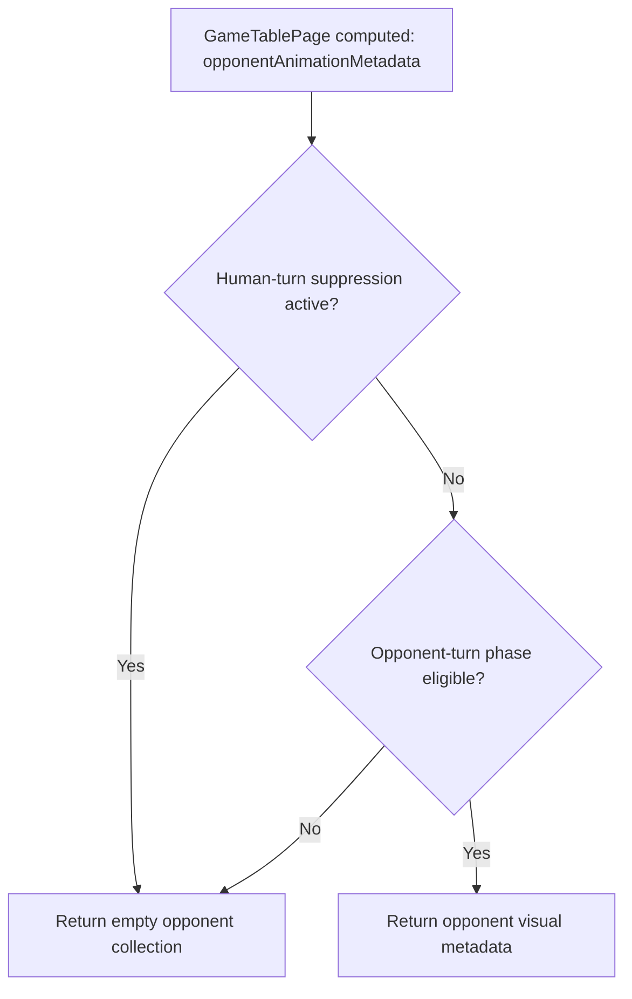
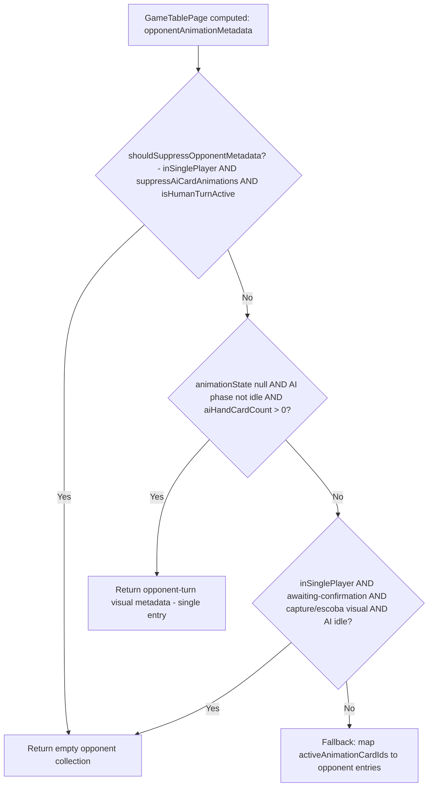

# Review Report: Laia Hand Capture Animation Bleed

**Review Mode:** Incremental (T-2: Enforce suppression and phase guard at metadata generation boundary) — GREEN phase
**Source:** `docs/specs/ui/laia-hand-capture-animation-bleed/`
**Reviewed against:** proposal.md, spec.md, user-stories.md, bdd-test.md, design.md, tasks.md

## 1. Executive Summary

The T-2 GREEN implementation correctly enforces the suppression and phase guard at the metadata generation boundary within the `opponentAnimationMetadata` computed signal. The core defect is addressed: human captures in both `awaiting-card-play` and `awaiting-confirmation` phases now produce empty opponent metadata. Tests are meaningful and verify actual behavioral outcomes. The implementation aligns with AD-1 (enforce at metadata generation), AD-2 (stable empty-list contract), and AD-3 (phase-driven eligibility).

- Total findings: 4 (0 Critical, 0 Major, 3 Minor, 1 Note)
- Spec compliance: 5 of 7 traced requirements fully met; 2 partially covered within T-2 scope (deferred to T-3)
- Architecture alignment: aligned — no drift from design.md
- Test quality: meaningful — both T-2 tests verify computed signal behavior under specific state configurations with non-trivial setup

## 2. Architecture Comparison

### 2.1 Planned Metadata Suppression Path (from design.md)

### 2.2 Actual Metadata Suppression Path (as implemented)

### 2.3 Drift Analysis

No architectural drift introduced by T-2. The implemented guard structure faithfully reflects the planned suppression path from design.md section 2.3. The metadata derivation logic remains within the GameTablePage smart container at the computed signal level, exactly as prescribed by AD-1. The three-guard structure (human-turn suppression, AI-turn eligibility, human-capture-confirmation) correctly segments the state space. The fallback path is only reachable during legitimate AI-turn animations or multiplayer contexts.

The actual implementation adds a third guard (human capture confirmation phase) not explicitly diagrammed in design.md but consistent with the spec requirement that "all human capture transitions" be suppressed (TR-1.2). This is an additive refinement rather than a deviation.

## 3. Findings

### RV-01: Redundant condition checks in shouldSuppressOpponentMetadata [Minor]

- **Category:** Code Quality
- **Severity:** Minor
- **Related:** AD-1, TR-1.2
- **Description:** The local variable `shouldSuppressOpponentMetadata` combines three checks: `inSinglePlayerMode`, `this.suppressAiCardAnimations()`, and `isHumanTurnActive`. However, both `inSinglePlayerMode` (mode equals Single Player) and `isHumanTurnActive` (turnPhase equals awaiting-card-play) are already evaluated internally by `suppressAiCardAnimations()`. This creates semantic duplication.
- **Expected:** Condition logic should be non-redundant for readability and maintenance confidence.
- **Actual:** `inSinglePlayerMode` and `isHumanTurnActive` are checked twice — once in the local scope and once inside the `suppressAiCardAnimations` computed signal. The guard functions correctly despite the duplication.
- **Recommendation:** Consider simplifying to rely solely on `this.suppressAiCardAnimations()` for the first guard, or extract the combined check into a single named condition. Not blocking.
- **Impact:** Minor readability concern; no behavioral impact. Risk of future divergence if `suppressAiCardAnimations` conditions are modified without updating the local redundant checks.

### RV-02: Missing T-2 test for acceptance criterion 3 — table visuals unaffected [Minor]

- **Category:** Test Coverage
- **Severity:** Minor
- **Related:** T-2 AC-3, FR-1.1, US-1
- **Description:** T-2 acceptance criterion 3 states "Table capture visuals remain unaffected for participating cards." Neither of the two T-2-scoped tests verifies that `centerTableAnimationMetadata` or `activeHandAnimationMetadata` contain capture entries while opponent metadata is simultaneously empty.
- **Expected:** At least one T-2 test should assert that suppressing opponent metadata does NOT suppress table/hand zone metadata for participating capture cards — confirming isolation rather than blanket suppression.
- **Actual:** T-2 tests only assert the opponent metadata is empty. The positive assertion about table metadata being populated is deferred to the T-5 test (propagates structured animation metadata to hand, table, and opponent zones).
- **Recommendation:** Add a T-2 test that reads both `opponentAnimationMetadata` (empty) and `centerTableAnimationMetadata` (populated with capture entries) in the same scenario, confirming zone-selective behavior.
- **Impact:** Without this test, a regression that accidentally empties ALL zone metadata would not be caught by T-2's own scope. T-5 would catch it downstream, but early detection within T-2 is preferred for defect localization.

### RV-03: No T-2 test covering TR-1.3 deterministic mapping [Minor]

- **Category:** Test Coverage
- **Severity:** Minor
- **Related:** TR-1.3, T-2, T-4
- **Description:** TR-1.3 specifies "Animation target mapping rules shall avoid index-based side effects that can project capture state onto unrelated zones." The fallback path in `opponentAnimationMetadata` uses index-based mapping (`activeAnimationCardIds().map((_, index) => ...)`). While the guards prevent reaching this path during human captures, there is no T-2 test that explicitly verifies index-positional coincidence between capture card IDs and opponent hand entries cannot cause projection.
- **Expected:** T-2 spec traceability includes TR-1.3. A test should demonstrate that when multiple capture card IDs exist with count matching opponent hand size, they do not produce opponent entries.
- **Actual:** Test 2 starts a 3-card capture group while the default state has 0 AI hand cards. The index-mapping path is never reached because guard 1 fires first. The coverage for TR-1.3 is incidental rather than intentional.
- **Recommendation:** Add an explicit index-overlap scenario in T-4 (which is the natural home for capture-size-variant unit coverage). This does not block T-2 acceptance.
- **Impact:** Low — guards prevent the fallback path from executing during human captures. Explicit validation strengthens confidence against future guard regressions.

### RV-04: Guard 3 dependency on aiAnimationState idle check [Note]

- **Category:** Code Quality
- **Severity:** Note
- **Related:** AD-3, FR-1.4
- **Description:** The third guard in `opponentAnimationMetadata` (human capture confirmation path) requires `aiAnimationState.phase === 'idle'`. If the application's state machine were to permit a non-idle AI animation phase during human capture confirmation, the fallback path would publish capture metadata to the opponent zone. This condition relies on an external state machine invariant not enforced within this computed signal.
- **Expected:** Per AD-3, opponent animation eligibility should be phase-driven. The guard should be robust regardless of unexpected AI state transitions.
- **Actual:** The guard correctly handles all realistic state combinations because the game engine prevents AI animation phases during human capture confirmation. The dependency on this external invariant is acceptable given current architecture.
- **Recommendation:** No action required for T-2. When T-3 is implemented (preserving opponent-turn eligibility), consider whether adding a defensive empty-return for the unexpected state combination would strengthen long-term robustness. Informational only.
- **Impact:** None under current state machine rules. Theoretical risk only if future changes allow concurrent AI animation during human capture confirmation.

## 4. Traceability Matrix

| Finding | Severity | Category      | Related Spec           | Status              |
| ------- | -------- | ------------- | ---------------------- | ------------------- |
| RV-01   | Minor    | Code Quality  | AD-1, TR-1.2           | Open                |
| RV-02   | Minor    | Test Coverage | T-2 AC-3, FR-1.1, US-1 | Open                |
| RV-03   | Minor    | Test Coverage | TR-1.3, T-4            | Open (defer to T-4) |
| RV-04   | Note     | Code Quality  | AD-3, FR-1.4           | Acknowledged        |

## 5. Spec Compliance Summary

| Requirement | Status     | Notes                                                                                                         |
| ----------- | ---------- | ------------------------------------------------------------------------------------------------------------- |
| FR-1.2      | ✅ Met     | Opponent metadata returns empty during human captures in both turn phases                                     |
| FR-1.4      | ⚠️ Partial | Suppression side implemented; positive eligibility path is T-3 scope                                          |
| TR-1.1      | ✅ Met     | Zone metadata is generated separately per zone; opponent metadata isolated at source                          |
| TR-1.2      | ✅ Met     | Suppression guard enforced at metadata generation boundary via shouldSuppressOpponentMetadata and guard 3     |
| TR-1.3      | ⚠️ Partial | Fallback uses index mapping but guards prevent execution during human captures; explicit test deferred to T-4 |
| US-1        | ✅ Met     | Human capture scenarios produce inert opponent metadata                                                       |
| US-2        | ⚠️ Partial | Suppression verified; positive opponent eligibility confirmation is T-3 scope                                 |

## 6. Task Completion Summary

| Task | Title                                                               | Status      | Findings                   |
| ---- | ------------------------------------------------------------------- | ----------- | -------------------------- |
| T-2  | Enforce suppression and phase guard at metadata generation boundary | ✅ Complete | RV-01, RV-02, RV-03, RV-04 |

## 7. Test Coverage Summary

| Scenario                                                    | Mapped To      | Passing | Meaningful |
| ----------------------------------------------------------- | -------------- | ------- | ---------- |
| AI preview phase + human turn → empty opponent metadata     | SC-06, TR-1.2  | ✅ Yes  | ✅ Yes     |
| Capture group active + human turn → empty opponent metadata | SC-01, FR-1.2  | ✅ Yes  | ✅ Yes     |
| T-1 / Single-card human capture → empty opponent            | SC-01, TR-1.2  | ✅ Yes  | ✅ Yes     |
| T-1 / Multi-card human capture → empty opponent             | SC-02, NFR-1.2 | ✅ Yes  | ✅ Yes     |
| T-1 / Escoba human capture → empty opponent                 | SC-03, FR-1.3  | ✅ Yes  | ✅ Yes     |

## 8. Test Quality Summary

| Test File                              | Type | Meaningful Assertions | Issues                                                                      |
| -------------------------------------- | ---- | --------------------- | --------------------------------------------------------------------------- |
| game-table-page.spec.ts (T-2 / TR-1.2) | Unit | ✅ Yes                | None — forces AI preview state then asserts suppression overrides it        |
| game-table-page.spec.ts (T-2 / FR-1.2) | Unit | ✅ Yes                | None — starts real capture animation group then asserts suppression outcome |

Both T-2 tests exercise non-trivial state setup (explicitly setting AI animation state, starting capture groups through the real orchestrator service) and assert computed signal output. They are not superficial — they verify the guarded metadata derivation produces the expected empty collection under conditions that previously triggered the bug.

## 9. Security Cross-Reference

No security findings applicable. T-2 changes are confined to presentational metadata derivation within a computed signal. No user input handling, API calls, DOM manipulation, routing changes, or data persistence are involved. No `security-report_T-2.md` generated.

## 10. Recommendations

### Critical (blocks release)

None.

### Major (fix before merge)

None.

### Minor (improvement)

1. Add a T-2 test asserting that center table animation metadata IS populated with capture entries while opponent metadata is simultaneously empty — confirms isolation rather than blanket suppression (RV-02).
2. When implementing T-4, add an explicit test where capture card-count equals opponent hand size, verifying no index-based projection leaks through (RV-03).
3. Consider simplifying the `shouldSuppressOpponentMetadata` expression to remove redundant sub-conditions already covered by `suppressAiCardAnimations()` (RV-01).

### Notes (informational)

1. Guard 3's dependency on AI idle state is acceptable given current state machine invariants; document or revisit when implementing T-3 (RV-04).
2. Test 1 validates a combined suppression + eligibility edge case (AI preview phase during human turn) that exercises the conjunction of both guards simultaneously — this is a higher-fidelity approach than testing each guard in isolation.
3. The T-1 tests (pre-existing) complement T-2 by covering the awaiting-confirmation phase with capture/escoba groups, providing full phase coverage between the two task scopes.

## 11. Readiness Recommendation

**T-2 is GREEN-complete and ready to proceed.** The implementation correctly introduces the suppression and phase guard at the metadata generation boundary. Both acceptance criteria that require new behavior (AC-1 and AC-2) are satisfied and tested. AC-3 (table visuals unaffected) is preserved by the zone-selective nature of the computed signals — opponent metadata suppression does not affect `centerTableAnimationMetadata` or `activeHandAnimationMetadata` computations which are independent computed signals.

The three Minor findings are non-blocking improvements that can be addressed in T-4 (index overlap test) or as opportunistic cleanup. No Critical or Major issues block progression to T-3.
