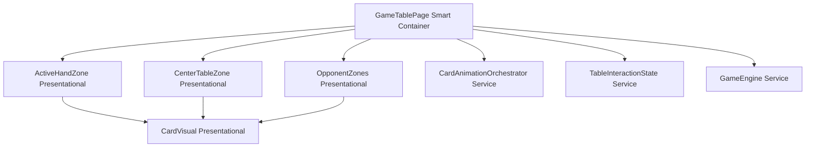
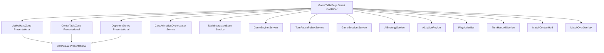

# Review Report: Laia Hand Capture Animation Bleed — T-3 (GREEN Phase, Re-review)

**Review Mode:** Incremental (T-3: Preserve opponent-turn explicit animation eligibility)
**Source:** `docs/specs/ui/laia-hand-capture-animation-bleed/`
**Reviewed against:** proposal.md, spec.md, user-stories.md, bdd-test.md, design.md, tasks.md
**Scope:** GREEN implementation in `game-table-page.ts` and `game-table-page.spec.ts`
**Re-review reason:** Test added for phase exit-to-idle transition (RV-01 resolution)

## 1. Executive Summary

The GREEN implementation for T-3 is now fully validated. The previously missing exit-to-idle transition test has been added, resolving the Major finding (RV-01) from the prior review. All three T-3 acceptance criteria now have dedicated test coverage. The human-capture-confirmation branch in `opponentAnimationMetadata` correctly returns empty metadata regardless of stale AI animation state, and the exit-to-idle reactive boundary is proven by the new test.

- Total findings: 3 (0 Critical, 0 Major, 1 Minor, 1 Note, 1 Resolved)
- Spec compliance: 3 of 3 T-3 acceptance criteria fully tested
- Architecture alignment: aligned — no structural drift from design.md
- Test quality: meaningful — all three T-3 tests verify structural outcomes with non-trivial assertions

## 2. Architecture Comparison

### 2.1 Planned Component Tree (from design.md)

### 2.2 Actual Component Tree (as implemented)

### 2.3 Drift Analysis

No T-3-relevant drift. The additional services and child components visible in the actual tree pre-date this feature and are not part of the laia-animation-bleed scope. The metadata derivation for opponent isolation lives entirely within GameTablePage's computed signals as planned in design.md section 4.1 and section 5. The data flow from GameTablePage to OpponentZones via `opponentAnimationMetadata` matches design.md section 2.2 exactly.

## 3. Findings

### RV-01: ~~Missing dedicated test for T-3 AC-2~~ — RESOLVED [Was: Major]

- **Category:** Test Coverage
- **Severity:** ~~Major~~ → Resolved
- **Related:** T-3 acceptance criterion #2, SC-05, US-2, FR-1.4
- **Resolution:** The test `'T-3 / FR-1.4 - resets opponent metadata to empty when AI phase returns to idle'` (line 2220) now validates the full exit-to-idle lifecycle. It configures an active opponent-turn phase (turnIndex 1, `card-selected` AI animation state), confirms opponent metadata is published with length > 0, transitions to `AI_TURN_IDLE`, and asserts metadata resets to an empty array. This directly verifies SC-05 and T-3 AC-2 with meaningful structural assertions.

### RV-02: Misattributed test tag — "T-3 / FR-7 / TR-4" references non-existent requirements [Minor]

- **Category:** Test Quality
- **Severity:** Minor
- **Related:** T-3, TR-1.4
- **Description:** The test at line 2340 titled "T-3 / FR-7 / TR-4 - resolves AI turn pause timing through TurnPausePolicy" references FR-7 and TR-4 which do not exist in this feature's spec (only FR-1.1–FR-1.4 and TR-1.1–TR-1.4). This test validates AI turn pause resolution, which is functionally unrelated to T-3's scope of "preserving opponent-turn explicit animation eligibility."
- **Expected:** T-3 tests for this feature should reference only FR-1.4, NFR-1.1, and US-2 per the tasks.md traceability column.
- **Actual:** The test tag implies coverage of T-3 but validates TurnPausePolicy behavior that belongs to a different feature spec (likely game-table-mvp).
- **Recommendation:** Remove the "T-3" prefix from this test's description or retag it to the correct feature task. This avoids inflating perceived T-3 coverage and keeps traceability honest.
- **Impact:** Misleading traceability in test reports. No functional impact.

### RV-03: Default fallback path in opponentAnimationMetadata lacks single-player guard [Note]

- **Category:** Code Quality
- **Severity:** Note
- **Related:** AD-4, NFR-1.2
- **Description:** The final return statement in the `opponentAnimationMetadata` computed signal maps `activeAnimationCardIds()` to opponent entries without checking `inSinglePlayerMode`. All preceding branches apply single-player guards, but if an unexpected state combination causes the computed signal to reach the default path in a context where single-player mode is not active, opponent metadata could be published when it should be empty.
- **Expected:** Either the default path includes a single-player guard or an explicit comment documents why it is safe to omit.
- **Actual:** The path is guard-free. In practice, `activeAnimationCardIds()` returns an empty array when no running groups exist, resulting in an empty collection — but this relies on the absence of animation groups in multiplayer mode rather than an explicit mode check.
- **Recommendation:** Consider adding either an explicit guard or a code comment documenting the assumption. This is informational and does not block the current implementation.
- **Impact:** Low risk in current usage. Could become a regression vector if multiplayer animations are introduced in the future.

## 4. Traceability Matrix

| Finding | Severity  | Category      | Related Spec                  | Status      |
| ------- | --------- | ------------- | ----------------------------- | ----------- |
| RV-01   | ~~Major~~ | Test Coverage | SC-05, US-2, FR-1.4, T-3 AC-2 | ✅ Resolved |
| RV-02   | Minor     | Test Quality  | TR-1.4, T-3                   | Open        |
| RV-03   | Note      | Code Quality  | AD-4, NFR-1.2                 | Open        |

## 5. Spec Compliance Summary

| Requirement | Status | Notes                                                                                           |
| ----------- | ------ | ----------------------------------------------------------------------------------------------- |
| FR-1.4      | ✅ Met | Opponent animation eligibility is phase-driven; validated by T-3 test at line 2146              |
| NFR-1.1     | ✅ Met | Human capture context does not leak to opponent zone; validated by T-3 test at line 2195        |
| US-2 AC-1   | ✅ Met | Human-turn capture actions never trigger opponent visuals (suppression guard)                   |
| US-2 AC-2   | ✅ Met | Opponent animation appears only in explicit opponent-turn phases (eligibility guard)            |
| US-2 AC-3   | ✅ Met | Opponent-turn animations do not leak into human-turn moments (confirmation guard)               |
| US-2 AC-4   | ✅ Met | "Ending opponent-turn phase returns static state" — validated by exit-to-idle test at line 2220 |

## 6. Task Completion Summary

| Task | Title                                                 | Status      | Findings                    |
| ---- | ----------------------------------------------------- | ----------- | --------------------------- |
| T-3  | Preserve opponent-turn explicit animation eligibility | ✅ Complete | RV-02 (Minor), RV-03 (Note) |

## 7. Test Coverage Summary

| Scenario | Step Definitions       | Meaningful | Findings |
| -------- | ---------------------- | ---------- | -------- |
| SC-04    | ⚠️ Partial (unit only) | ✅ Yes     | —        |
| SC-05    | ✅ Yes (unit)          | ✅ Yes     | —        |

## 8. Test Quality Summary

| Test File                           | Type | Meaningful Assertions      | Issues                                                                      |
| ----------------------------------- | ---- | -------------------------- | --------------------------------------------------------------------------- |
| game-table-page.spec.ts (line 2146) | Unit | ✅ Yes                     | None — validates exact metadata structure for eligibility                   |
| game-table-page.spec.ts (line 2195) | Unit | ✅ Yes                     | None — validates stale-phase suppression with structural assertion          |
| game-table-page.spec.ts (line 2220) | Unit | ✅ Yes                     | None — validates exit-to-idle lifecycle with before/after assertions        |
| game-table-page.spec.ts (line 2392) | Unit | ✅ Yes (but misattributed) | Misattributed T-3 tag; validates AI pause timing, not animation eligibility |

## 9. Security Cross-Reference

No Critical or High findings from the companion security report. See `docs/specs/ui/laia-hand-capture-animation-bleed/security-report_T-3.md` for the full analysis. Two Info-level findings (dependency advisories and DOM access discipline) remain unchanged from the RED phase review.

## 10. Recommendations

### Critical (blocks release)

None.

### Major (fix before merge)

None. RV-01 resolved.

### Minor (improvement)

1. Remove or retag the "T-3" prefix from the TurnPausePolicy test (line 2392) to maintain honest traceability within this feature's spec scope.

### Notes (informational)

1. Consider adding an explicit single-player mode guard or explanatory comment on the default fallback return path in `opponentAnimationMetadata` to prevent future regressions if multiplayer animations are introduced.
