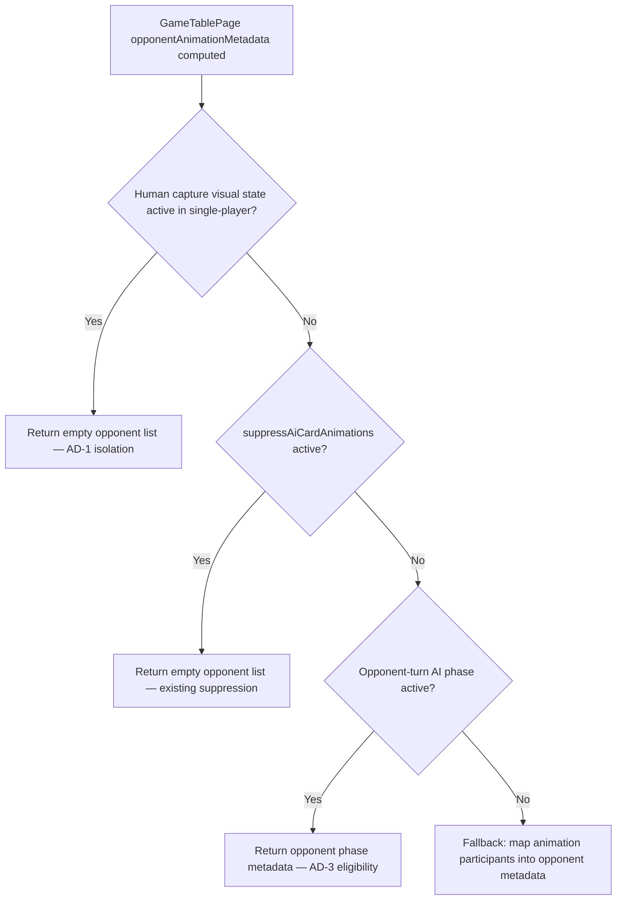
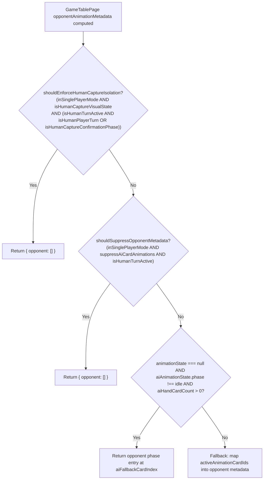

# Review Report: Laia Hand Capture Animation Bleed

**Review Mode:** Incremental (T-4: Add unit coverage for capture isolation rules) — GREEN phase
**Source:** `docs/specs/ui/laia-hand-capture-animation-bleed/`
**Reviewed against:** proposal.md, spec.md, user-stories.md, bdd-test.md, design.md, tasks.md
**Scope:**

- `src/app/features/game-board/game-table-page/game-table-page.spec.ts` — three T-4 unit tests
- `src/app/features/game-board/game-table-page/game-table-page.ts` — `shouldEnforceHumanCaptureIsolation` guard in `opponentAnimationMetadata`

## 1. Executive Summary

The T-4 GREEN implementation is correct, minimal, and architecturally aligned. The `shouldEnforceHumanCaptureIsolation` guard in the `opponentAnimationMetadata` computed signal enforces opponent-zone isolation when a human capture visual state is active, independently of the `isAiTurnInProgress` flag. This directly addresses the edge case where stale AI state would bypass the existing `suppressAiCardAnimations` path. All three T-4 acceptance criteria are met and verified by meaningful unit tests (77/77 pass, build and lint clean).

- Total findings: 2 (0 Critical, 0 Major, 1 Minor, 1 Note)
- Spec compliance: 3 of 3 T-4 acceptance criteria met
- Architecture alignment: aligned — guard placed at metadata generation boundary per AD-1
- Test quality: meaningful — assertions verify behavioural contract under real signal flow

**Blocker status: No blockers. T-4 is complete.**

## 2. Architecture Comparison

### 2.1 Planned Metadata Derivation Boundary (from design.md AD-1)

### 2.2 Actual Metadata Derivation as Implemented

### 2.3 Drift Analysis

No architecture drift. The implementation matches the planned design in the following ways:

- **Guard placement:** The `shouldEnforceHumanCaptureIsolation` guard is the first check in `opponentAnimationMetadata`, placed at the metadata generation boundary per AD-1.
- **Empty-list contract:** Returns `{ opponent: [] }` (not null), consistent with AD-2 stable contract.
- **Phase-driven eligibility:** The guard is visual-state-based (capture/escoba) and phase-based (awaiting-card-play with human turn, or awaiting-confirmation), not group-size-driven, consistent with AD-3.
- **No new components or routes:** Consistent with AD-4.

The guard is correctly independent of `isAiTurnInProgress`, which was the root cause of the stale-flag bypass identified in RED phase.

### 2.4 Guard Correctness Against AI Turn Over-Suppression

The guard includes `isHumanCaptureVisualState` which checks for animation state `'capture'` or `'escoba'`. During AI turns, the orchestrator uses action type `'opponent-play'` which maps to visual state `'opponent'` — not `'capture'` or `'escoba'`. Therefore the guard cannot fire during legitimate AI turn animations, eliminating over-suppression risk for the AD-3 eligibility path.

## 3. Findings

### RV-01: Traceability label for Escoba test uses US-3 without FR-1.3 [Note]

- **Category:** Spec Compliance
- **Severity:** Note
- **Related:** T-4, FR-1.3, US-3
- **Description:** The Escoba test is labelled `T-4 / US-3` while the other two tests include their FR reference (FR-1.2, FR-1.3). The T-4 acceptance criteria for Escoba traces to FR-1.3.
- **Expected:** Consistent traceability labelling across all three tests.
- **Actual:** The Escoba test uses `T-4 / US-3` without citing FR-1.3.
- **Recommendation:** Consider aligning the label to `T-4 / FR-1.3, US-3` for consistency with the other two T-4 tests.
- **Impact:** None for correctness. Minor inconsistency in spec traceability surface.

### RV-02: No T-4 unit test covers the awaiting-confirmation branch of the guard [Minor]

- **Category:** Test Coverage
- **Severity:** Minor
- **Related:** T-4, FR-1.2, TR-1.1, AD-1
- **Description:** The `shouldEnforceHumanCaptureIsolation` guard covers two paths: (1) `awaiting-card-play` with human as active player, and (2) `awaiting-confirmation` phase. All three T-4 tests exercise only path (1). The `awaiting-confirmation` branch is not covered by any T-4-labelled test.
- **Expected:** At least one T-4 test verifying isolation during the awaiting-confirmation phase with a capture animation active.
- **Actual:** All tests use `configureAndCreate('awaiting-card-play', handCard)` and do not transition to awaiting-confirmation.
- **Recommendation:** Consider adding a test that starts a capture animation group while turnPhase is awaiting-confirmation, verifying opponent metadata remains empty. This covers the second OR-branch of the guard.
- **Impact:** Low. The awaiting-confirmation path is exercised implicitly by the natural game flow (human plays capture → phase transitions to awaiting-confirmation → capture animation runs). However, explicit unit coverage would strengthen regression confidence for this branch.

## 4. Traceability Matrix

| Finding | Severity | Category        | Related Spec              | Status |
| ------- | -------- | --------------- | ------------------------- | ------ |
| RV-01   | Note     | Spec Compliance | T-4, FR-1.3, US-3         | Open   |
| RV-02   | Minor    | Test Coverage   | T-4, FR-1.2, TR-1.1, AD-1 | Open   |

## 5. Spec Compliance Summary

| Requirement | Status | Notes                                                                  |
| ----------- | ------ | ---------------------------------------------------------------------- |
| FR-1.2      | ✅ Met | Single-card and multi-card human capture yield empty opponent metadata |
| FR-1.3      | ✅ Met | All three capture variants (single, multi, Escoba) validated           |
| TR-1.1      | ✅ Met | Guard enforces zone isolation at metadata derivation boundary          |
| US-1        | ✅ Met | Opponent inertness during human capture verified across variants       |
| US-3        | ✅ Met | Escoba scenario covered as third test                                  |

## 6. Task Completion Summary

| Task | Title                                         | Status      | Findings     |
| ---- | --------------------------------------------- | ----------- | ------------ |
| T-4  | Add unit coverage for capture isolation rules | ✅ Complete | RV-01, RV-02 |

## 7. Test Coverage Summary

| Scenario | Step Definitions               | Meaningful | Findings |
| -------- | ------------------------------ | ---------- | -------- |
| SC-01    | ✅ Yes (unit-level equivalent) | ✅ Yes     | —        |
| SC-02    | ✅ Yes (unit-level equivalent) | ✅ Yes     | —        |
| SC-03    | ✅ Yes (unit-level equivalent) | ✅ Yes     | —        |

## 8. Test Quality Summary

| Test File                                          | Type | Meaningful Assertions | Issues |
| -------------------------------------------------- | ---- | --------------------- | ------ |
| game-table-page.spec.ts (T-4 / FR-1.2 single-card) | Unit | ✅ Yes                | None   |
| game-table-page.spec.ts (T-4 / FR-1.3 multi-card)  | Unit | ✅ Yes                | None   |
| game-table-page.spec.ts (T-4 / US-3 Escoba)        | Unit | ✅ Yes                | None   |

All three tests verify the behavioural contract (empty opponent metadata list) under a realistic edge case: stale `isAiTurnInProgress=true` with an active capture/escoba animation group. Assertions use `toEqual([])` which is structurally deterministic. The setup exercises the real CardAnimationOrchestrator via TestBed injection, confirming genuine signal flow through the metadata derivation computed. Tests are not superficial — they validate that the new guard fires independently of the existing suppression path.

## 9. Security Cross-Reference

Security sweep confirms no Critical or High findings specific to T-4 scope. The companion `security-report_T-4.md` reports one Medium finding (SEC-01) related to development dependency chain vulnerabilities (Cypress transitive advisories). This is unrelated to the T-4 implementation and does not affect release eligibility for this task.

## 10. Recommendations

### Minor (improvement)

1. Consider adding a unit test covering the `awaiting-confirmation` branch of `shouldEnforceHumanCaptureIsolation` to strengthen regression confidence for the second OR-branch of the guard.

### Notes (informational)

1. Align the Escoba test traceability label to include FR-1.3 for consistency with the other two T-4 tests.
2. The guard implementation is correctly scoped — AI turn animations use `'opponent-play'` action type (visual state `'opponent'`), so the `isHumanCaptureVisualState` condition prevents over-suppression during legitimate opponent-turn phases.
