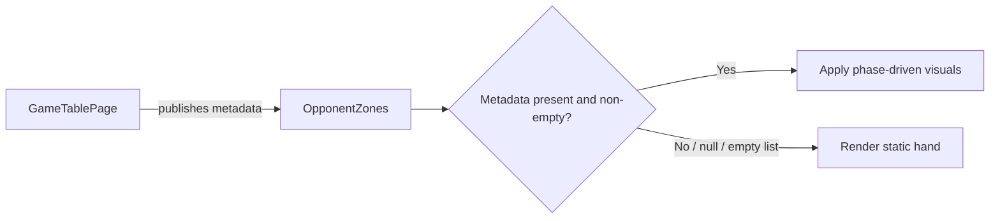
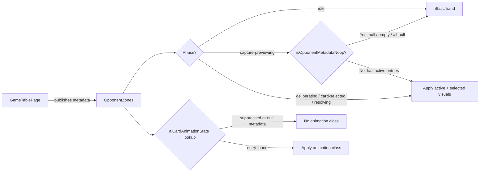

# Review Report: Laia Hand Capture Animation Bleed — T-5

**Review Mode:** Incremental (T-5: Add integration coverage for zone-level rendering contract)
**Source:** `docs/specs/ui/laia-hand-capture-animation-bleed/`
**Reviewed against:** proposal.md, spec.md, user-stories.md, bdd-test.md, design.md, tasks.md

## 1. Executive Summary

T-5 GREEN phase is complete and well-implemented. The OpponentZones component now correctly gates its active and selected visual states through an `isOpponentMetadataNoop` guard that treats the `capture-previewing` phase as static when metadata is null or empty, while preserving existing behaviour for all other phases. The implementation is minimal, focused, and architecturally aligned with AD-2 and AD-4. All 19 OpponentZones tests pass, including the three new T-5 integration tests which verify meaningful DOM state assertions.

- Total findings: 3 (0 Critical, 0 Major, 1 Minor, 2 Note)
- Spec compliance: 3 of 3 T-5 acceptance criteria met
- Architecture alignment: aligned — metadata is now the authoritative gate for capture-previewing visuals
- Test quality: meaningful — all T-5 assertions verify observable DOM behaviour tied to spec requirements
- Blocker status: **No blockers.**

## 2. Architecture Comparison

### 2.1 Planned Zone Gating (from design.md AD-1, AD-2)

### 2.2 Actual Zone Gating (GREEN implementation)

### 2.3 Drift Analysis

The GREEN implementation aligns with the planned architecture. The guard at `isAiHandActive` now makes metadata the authoritative gate for the `capture-previewing` phase specifically, which is the phase where stale state persists during human capture handoff. Other phases (deliberating, card-selected, resolving) maintain existing behaviour since they occur only during active AI turns where metadata suppression is not expected. This is a deliberate and correct scoping decision consistent with AD-3 (phase-driven eligibility) and AD-4 (preserve existing boundaries).

The `isAiCardSelected` method delegates to `isAiHandActive`, so the guard propagates automatically without code duplication.

No architectural drift detected.

## 3. Findings

### RV-01: Test labels reference non-existent spec identifiers [Minor]

- **Category:** Test Coverage
- **Severity:** Minor
- **Related:** T-5, AD-4
- **Description:** Three earlier tests in the OpponentZones spec file use labels "T-5 / FR-5", "T-5 / FR-8", and "T-5 / US-12" which do not correspond to any requirement in this feature's spec.md (which defines FR-1.1 through FR-1.4, US-1 through US-4). These labels appear to originate from a broader test effort or an alternate numbering scheme.
- **Expected:** Test labels should reference identifiers from the feature's own spec documents for traceability.
- **Actual:** Three tests reference FR-5, FR-8, and US-12 which are undefined in this feature scope.
- **Recommendation:** Rename labels to reference the correct spec identifiers (e.g., FR-1.4 for metadata application, NFR-1.2 for multi-card consistency, and a suitable US/FR for state immutability).
- **Impact:** Minimal — tests themselves are meaningful, only the traceability labels are inaccurate.

### RV-02: Guard scoping is deliberate and correct [Note]

- **Category:** Code Quality
- **Severity:** Note
- **Related:** T-5, AD-3, AD-4, FR-1.4
- **Description:** The `isAiHandActive` guard only gates the `capture-previewing` phase, leaving other phases (deliberating, card-selected, resolving) unconditionally active. This is intentional and correct: capture-previewing is the specific phase where stale state persists during human capture handoff. Other phases only occur during active AI turns where metadata is expected to be present.
- **Expected:** Phase-specific gating per AD-3.
- **Actual:** Matches expectation exactly.
- **Recommendation:** None. This is noted for completeness and to confirm the scoping was validated.
- **Impact:** None.

### RV-03: Eligibility test uses card-selected phase for positive path [Note]

- **Category:** Test Quality
- **Severity:** Note
- **Related:** T-5, FR-1.4, AD-3
- **Description:** The T-5/FR-1.4 eligibility test uses `card-selected` phase (not `capture-previewing`) to confirm opponent-turn visuals still render. This is good test design — it demonstrates the positive path across a non-gated phase, avoiding coupling the pass/fail boundary to the single gated phase value.
- **Expected:** Different phases across positive and negative tests.
- **Actual:** Matches expectation.
- **Recommendation:** None.
- **Impact:** None.

## 4. Traceability Matrix

| Finding | Severity | Category      | Related Spec            | Status        |
| ------- | -------- | ------------- | ----------------------- | ------------- |
| RV-01   | Minor    | Test Coverage | T-5, AD-4               | Open          |
| RV-02   | Note     | Code Quality  | T-5, AD-3, AD-4, FR-1.4 | Informational |
| RV-03   | Note     | Test Quality  | T-5, FR-1.4, AD-3       | Informational |

## 5. Spec Compliance Summary (T-5 scope)

| Requirement | Status | Notes                                                                                                                                    |
| ----------- | ------ | ---------------------------------------------------------------------------------------------------------------------------------------- |
| FR-1.2      | ✅ Met | Opponent zone renders static hand visuals during human capture (null and empty metadata both produce static state in capture-previewing) |
| FR-1.4      | ✅ Met | Opponent zone still renders eligible opponent-turn visuals when metadata is present during non-capture-previewing phases                 |
| NFR-1.2     | ✅ Met | Behaviour is consistent for both null metadata and empty opponent list shapes per AD-2 contract                                          |

## 6. Task Completion Summary

| Task | Title                                                      | Status      | Findings                       |
| ---- | ---------------------------------------------------------- | ----------- | ------------------------------ |
| T-5  | Add integration coverage for zone-level rendering contract | ✅ Complete | RV-01 (minor label issue only) |

## 7. Test Coverage Summary

| Scenario                                                  | Step Definitions                | Meaningful | Findings |
| --------------------------------------------------------- | ------------------------------- | ---------- | -------- |
| SC-04 (partial — eligible opponent-turn context)          | ✅ Yes (unit integration level) | ✅ Yes     | —        |
| SC-06 (partial — null metadata during capture-previewing) | ✅ Yes (unit integration level) | ✅ Yes     | —        |

## 8. Test Quality Summary

| Test File                              | Type             | Meaningful Assertions | Issues                                                                                  |
| -------------------------------------- | ---------------- | --------------------- | --------------------------------------------------------------------------------------- |
| opponent-zones.spec.ts (T-5 / FR-1.2)  | Unit Integration | ✅ Yes                | None — asserts zone inactive, card unselected, no animation classes under null metadata |
| opponent-zones.spec.ts (T-5 / NFR-1.2) | Unit Integration | ✅ Yes                | None — validates AD-2 empty-list contract produces same static outcome                  |
| opponent-zones.spec.ts (T-5 / FR-1.4)  | Unit Integration | ✅ Yes                | None — confirms eligible path preserves active zone, selected card, and animation class |

## 9. Security Cross-Reference

See `docs/specs/ui/laia-hand-capture-animation-bleed/security-report_T-5.md` for the full security analysis.

No Critical or High security findings. One Medium finding (SEC-01) relates to missing adversarial metadata boundary coverage — this is a test gap recommendation rather than a production vulnerability, and is outside the T-5 acceptance criteria scope.

| SEC ID | Severity | OWASP    | Summary                                                             |
| ------ | -------- | -------- | ------------------------------------------------------------------- |
| SEC-01 | Medium   | A04:2021 | Missing adversarial metadata boundary coverage in integration tests |

## 10. Recommendations

### Critical (blocks release)

None.

### Major (fix before merge)

None.

### Minor (improvement)

1. Rename the three earlier test labels ("FR-5", "FR-8", "US-12") to reference identifiers from this feature's spec.md for accurate traceability.

### Notes (informational)

1. The implementation guard is minimal and precisely scoped — only capture-previewing is gated, all other phases retain existing behaviour per AD-4.
2. The `isAiCardSelected` delegation pattern (through `isAiHandActive`) means the guard propagates without code duplication.
3. The `isOpponentMetadataNoop` private method cleanly handles all three no-op shapes: null metadata, empty opponent array, and all-null-animationState entries.
