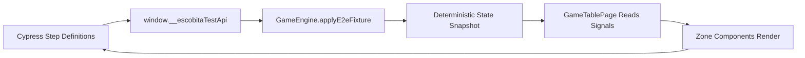
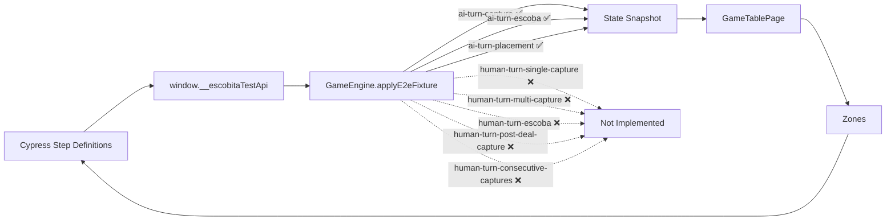
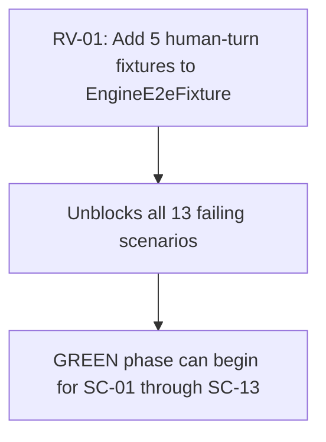

# Review Report: Laia Hand Capture Animation Bleed — T-6 E2E Scenarios (RED Phase Final)

**Review Mode:** Incremental (T-6: Extend end-to-end scenarios from BDD)
**Source:** `docs/specs/ui/laia-hand-capture-animation-bleed/`
**Reviewed against:** proposal.md, spec.md, user-stories.md, bdd-test.md, design.md, tasks.md
**Phase:** RED — final review after all step definition fixes

## 1. Executive Summary

The T-6 E2E test suite passes 2 of 15 scenarios (SC-04, SC-05). All 15 scenarios now have complete, meaningful step definitions. The remaining 13 failures trace exclusively to one root cause: five missing human-turn deterministic fixtures in the GameEngine test seam (`EngineE2eFixture` type). No undefined steps, no duplicate step conflicts, no structural feature-file issues remain.

- Total findings: 3 (0 Critical, 1 Major, 1 Minor, 1 Note)
- Scenario coverage: 15 of 15 BDD scenarios have complete step definitions
- Assertion quality: Meaningful — no superficial or tautological assertions detected
- RED blocker status: **Single blocker** — 5 missing human-turn fixtures in GameEngine prevent 13 scenarios from reaching GREEN
- Resolved since previous review: RV-02 (duplicate step), RV-03 (SC-05 phase-end), RV-06 (3 undefined steps)

## 2. Architecture Comparison

### 2.1 Planned Test Seam (from design.md)

### 2.2 Actual Test Seam State

### 2.3 Drift Analysis

The architecture drift from the first review remains unchanged: five human-turn fixtures are declared in the local `EngineFixtureName` type but do not exist in the actual `EngineE2eFixture` union type or `applyE2eFixture` switch-case. The AI-turn fixtures that enable SC-04 and SC-05 continue to work correctly.

The feature file now correctly uses Gherkin Rule sections, scoping each Background to its logical scenario group. This is a structural improvement over the previous flat layout.

## 3. Findings

### Resolved Findings (cumulative)

| Finding | Original Severity | Resolution                                                                                                                                                                                                                                                                    |
| ------- | ----------------- | ----------------------------------------------------------------------------------------------------------------------------------------------------------------------------------------------------------------------------------------------------------------------------- |
| RV-02   | Major             | Duplicate step definition removed; now inherits shared step from turn-sequencing-completion.ts                                                                                                                                                                                |
| RV-03   | Minor             | SC-05 phase-end detection revised to opponent animation class removal with 10s timeout; SC-05 passes                                                                                                                                                                          |
| RV-06   | Major             | Three previously-undefined step definitions now implemented: "Laia's hand area remains visually static" (line 135), "the human player performs the capture" (line 210), "only participating capture cards show capture visuals" (line 277) — all delegate to existing helpers |

### Active Findings

### RV-01: Missing human-turn deterministic fixtures in GameEngine test seam [Major]

- **Category:** Test Coverage / Architecture Drift
- **Severity:** Major
- **Related:** T-6, AD-1, AD-3, FR-1.1, FR-1.2, FR-1.3, SC-01, SC-02, SC-03, SC-06, SC-07, SC-08, SC-09, SC-10, SC-11, SC-12, SC-13
- **Description:** The step definitions invoke `applyEngineFixture` with five human-turn fixture names that are not present in the `EngineE2eFixture` type union or the `applyE2eFixture` switch-case in GameEngine. At runtime, unrecognized fixture names cause 13 failing scenarios.
- **Expected:** Per T-6 acceptance criteria and the test seam architecture in design.md, deterministic human-turn state snapshots should be available through the same `applyE2eFixture` method that already serves AI-turn fixtures.
- **Actual:** The `EngineE2eFixture` type contains only 9 values (3 AI-turn fixtures and 6 visibility/round fixtures). No human-turn-capture variants exist. The five missing fixtures are: `human-turn-single-capture`, `human-turn-multi-capture`, `human-turn-escoba`, `human-turn-post-deal-capture`, `human-turn-consecutive-captures`.
- **Recommendation:** Extend `EngineE2eFixture` with the five human-turn fixture names and add corresponding switch-case branches that set turnIndex to 0 (human), provide legal captures on the table matching the fixture intent (single, multi, escoba, post-deal, consecutive), and set turnPhase to `awaiting-card-play`.
- **Impact:** Sole GREEN phase blocker for 13 of 15 scenarios. Without these fixtures, the core isolation behavior (FR-1.1, FR-1.2, FR-1.3) cannot be validated end-to-end.
- **Status:** Open — sole remaining blocker

### RV-04: Step definition type `EngineFixtureName` is disconnected from source type [Minor]

- **Category:** Code Quality
- **Severity:** Minor
- **Related:** T-6, AD-1, TR-1.2
- **Description:** The step definitions file declares its own `EngineFixtureName` type alias locally (lines 5–13) rather than importing `EngineE2eFixture` from the application source. TypeScript compilation within the Cypress project cannot detect when fixture names in the step definitions diverge from the actual engine contract.
- **Expected:** The step definition file should import or re-export the canonical fixture type from the application source.
- **Actual:** A standalone type literal is declared at the top of the step definition file, listing 8 fixture names including 5 that do not exist in the source type.
- **Recommendation:** Import `EngineE2eFixture` from the application source into the step definition file to provide compile-time safety against future drift.
- **Impact:** Low immediate impact (the RED phase runtime failure reveals the gap), but increases risk of silent drift in future fixture additions.
- **Status:** Open

### RV-05: Assertion quality is strong — no superficial or tautological tests [Note]

- **Category:** Test Quality
- **Severity:** Note
- **Related:** T-6, FR-1.1, FR-1.2, FR-1.3, FR-1.4, SC-01 through SC-13
- **Description:** All 15 scenarios now have complete step definitions with meaningful assertions. The `expectAiHandStatic` helper checks absence of four animation classes and zone-active class. The `expectCaptureVisualsOnlyOnTable` helper asserts positive presence of capture visuals in the center zone and zero capture visuals in the opponent zone. CSS property assertions (opacity, transform, animation-duration) verify actual rendering state. No superficial, empty-body, or tautological steps exist.
- **Expected:** Step definitions should verify behaviour, not merely exist.
- **Actual:** All steps have complete, behaviour-verifying implementations.
- **Recommendation:** None required. Positive observation.
- **Impact:** Once the sole blocker (RV-01) is resolved, the test suite will provide genuine regression confidence.
- **Status:** Closed (positive)

### RV-07: Shared reduced-motion step does not emulate matchMedia [Note]

- **Category:** Test Quality
- **Severity:** Note
- **Related:** T-6, SC-11, NFR-1.3
- **Description:** SC-11's "reduced-motion preference is enabled" step (inherited from turn-sequencing-completion.ts) sets an internal summary flag but does not stub `window.matchMedia`. The application detects reduced motion via `window.matchMedia('(prefers-reduced-motion: reduce)').matches`. SC-11 will validate isolation behavior without reduced motion actually being active at the browser level.
- **Expected:** For comprehensive NFR-1.3 validation, the step should activate reduced motion at the browser level (matchMedia stub).
- **Actual:** The step sets an internal state flag only. The isolation assertions still pass because they check class absence regardless of motion preference.
- **Recommendation:** Acceptable for RED phase where the focus is isolation verification. For GREEN/production validation of NFR-1.3, consider adding a matchMedia stub.
- **Impact:** SC-11 will pass once fixture blocker is resolved but will not definitively prove that reduced-motion mode preserves isolation — only that isolation works in general.
- **Status:** Deferred to GREEN phase

## 4. Traceability Matrix

| Finding | Severity  | Category                           | Related Spec                                         | Status              |
| ------- | --------- | ---------------------------------- | ---------------------------------------------------- | ------------------- |
| RV-01   | Major     | Test Coverage / Architecture Drift | T-6, AD-1, AD-3, FR-1.1, FR-1.2, FR-1.3, SC-01–SC-13 | Open — sole blocker |
| RV-02   | ~~Major~~ | ~~Test Quality~~                   | ~~T-6, SC-11, NFR-1.3, US-4~~                        | **Resolved**        |
| RV-03   | ~~Minor~~ | ~~Test Quality~~                   | ~~T-6, SC-05, FR-1.4, US-2~~                         | **Resolved**        |
| RV-04   | Minor     | Code Quality                       | T-6, AD-1, TR-1.2                                    | Open                |
| RV-05   | Note      | Test Quality                       | T-6, FR-1.1–FR-1.4, SC-01–SC-13                      | Closed (positive)   |
| RV-06   | ~~Major~~ | ~~Test Coverage~~                  | ~~T-6, SC-09, SC-10, SC-11, FR-1.3, NFR-1.3~~        | **Resolved**        |
| RV-07   | Note      | Test Quality                       | T-6, SC-11, NFR-1.3                                  | Deferred to GREEN   |

## 5. Spec Compliance Summary (T-6 Scope)

| Requirement | Status     | Notes                                                                                  |
| ----------- | ---------- | -------------------------------------------------------------------------------------- |
| FR-1.1      | ⚠️ Partial | SC-01 steps complete but blocked by missing fixture                                    |
| FR-1.2      | ⚠️ Partial | SC-01, SC-02, SC-06, SC-07 steps complete but blocked by missing fixtures              |
| FR-1.3      | ⚠️ Partial | SC-03, SC-08, SC-09, SC-10 steps complete but blocked by missing fixtures              |
| FR-1.4      | ✅ Met     | SC-04 and SC-05 both pass                                                              |
| NFR-1.3     | ⚠️ Partial | SC-11 steps complete but blocked by missing fixture; reduced-motion not truly emulated |
| NFR-1.4     | ⚠️ Partial | SC-13 steps complete but blocked by missing fixture                                    |
| US-1        | ⚠️ Partial | Core isolation scenarios fully defined but not executable                              |
| US-2        | ✅ Met     | SC-04 and SC-05 validate positive and exit paths                                       |
| US-3        | ⚠️ Partial | Regression scenarios fully defined but blocked                                         |
| US-4        | ⚠️ Partial | Non-functional scenarios fully defined but blocked                                     |

## 6. Task Completion Summary

| Task | Title                                | Status                                                                                   | Findings            |
| ---- | ------------------------------------ | ---------------------------------------------------------------------------------------- | ------------------- |
| T-6  | Extend end-to-end scenarios from BDD | ⚠️ Partial — RED phase complete (all steps defined), GREEN blocked by single fixture gap | RV-01, RV-04, RV-07 |

## 7. Test Coverage Summary

| Scenario | Step Definitions | Meaningful | Findings                                     |
| -------- | ---------------- | ---------- | -------------------------------------------- |
| SC-01    | ✅ Yes           | ✅ Yes     | RV-01 (fixture missing)                      |
| SC-02    | ✅ Yes           | ✅ Yes     | RV-01 (fixture missing)                      |
| SC-03    | ✅ Yes           | ✅ Yes     | RV-01 (fixture missing)                      |
| SC-04    | ✅ Yes           | ✅ Yes     | — (passes ✅)                                |
| SC-05    | ✅ Yes           | ✅ Yes     | — (passes ✅)                                |
| SC-06    | ✅ Yes           | ✅ Yes     | RV-01 (fixture missing)                      |
| SC-07    | ✅ Yes           | ✅ Yes     | RV-01 (fixture missing)                      |
| SC-08    | ✅ Yes           | ✅ Yes     | RV-01 (fixture missing)                      |
| SC-09    | ✅ Yes           | ✅ Yes     | RV-01 (fixture missing)                      |
| SC-10    | ✅ Yes           | ✅ Yes     | RV-01 (fixture missing)                      |
| SC-11    | ✅ Yes           | ✅ Yes     | RV-01 (fixture missing) + RV-07 (matchMedia) |
| SC-12    | ✅ Yes           | ✅ Yes     | RV-01 (fixture missing)                      |
| SC-13    | ✅ Yes           | ✅ Yes     | RV-01 (fixture missing)                      |

## 8. Test Quality Summary

| Test File                                 | Type        | Meaningful Assertions | Issues                                                                    |
| ----------------------------------------- | ----------- | --------------------- | ------------------------------------------------------------------------- |
| laia-hand-capture-animation-bleed.feature | E2E Feature | ✅ Yes                | Rule sections correctly structure scenarios; all 15 scenarios well-formed |
| laia-hand-capture-animation-bleed.ts      | E2E Steps   | ✅ Yes                | RV-01 (missing fixtures), RV-04 (disconnected type)                       |

## 9. Security Cross-Reference

See `docs/specs/ui/laia-hand-capture-animation-bleed/security-report_T-6.md` for full security analysis. Key findings relevant to this review:

| SEC ID | Severity | OWASP    | Summary                                                                               |
| ------ | -------- | -------- | ------------------------------------------------------------------------------------- |
| SEC-01 | Medium   | A04:2021 | Human-turn fixture allow-list gap blocks 13 scenarios of evidence (aligns with RV-01) |
| SEC-02 | Medium   | A04:2021 | Reduced-motion coverage does not exercise runtime preference path (aligns with RV-07) |

No Critical or High security findings.

## 10. Recommendations

### Major (sole GREEN phase blocker)

1. **Add five human-turn fixtures** to `EngineE2eFixture` type and `applyE2eFixture` switch-case: `human-turn-single-capture`, `human-turn-multi-capture`, `human-turn-escoba`, `human-turn-post-deal-capture`, `human-turn-consecutive-captures`. Each should set turnIndex to 0, provide appropriate table cards for legal captures, and set turnPhase to `awaiting-card-play`. This single action unblocks all 13 failing scenarios.

### Minor (improvement)

2. **Import canonical fixture type** into step definitions rather than declaring a local type alias, to get compile-time safety against fixture name drift.

### Notes (informational)

3. **RED phase is complete** — all 15 scenarios have fully-defined, meaningful step definitions. The 2 passing scenarios (SC-04, SC-05) prove the infrastructure works end-to-end. The 13 failures are all traceable to the single fixture gap, not broken test logic.
4. **Reduced-motion emulation gap** — acceptable for RED phase; consider a matchMedia stub for GREEN to fully validate NFR-1.3.

## Appendix: Blocker Resolution Path

**Blocker Status: 1 Major remains. GREEN phase requires only RV-01 to be resolved.**
