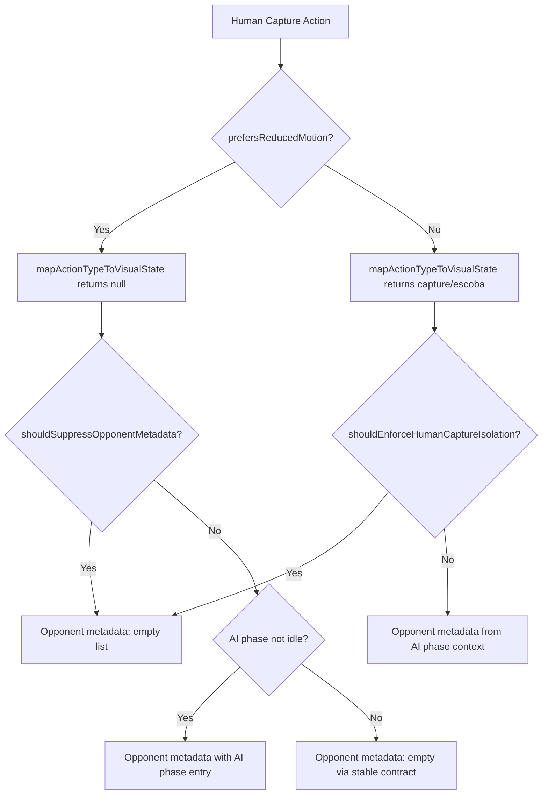
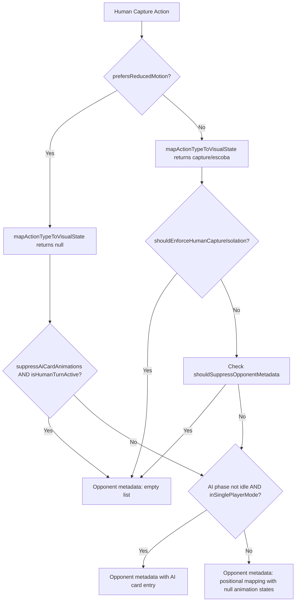

# Review Report: Laia Hand Capture Animation Bleed — T-7 Accessibility and Performance Regression

**Review Mode:** Incremental (T-7: Run accessibility and performance regression validation)
**Source:** `docs/specs/ui/laia-hand-capture-animation-bleed/`
**Reviewed against:** proposal.md, spec.md, user-stories.md, bdd-test.md, design.md, tasks.md

## 1. Executive Summary

T-7 is a validation task confirming reduced-motion consistency, keyboard and focus continuity, and absence of stutter in capture transitions. The implementation is backed by E2E step definitions for SC-11, SC-12, and SC-13. After updates to the reduced-motion step resolution and SC-11 assertion logic, SC-11 now correctly exercises the production reduced-motion branch. The shared global step from turn-sequencing-completion.ts calls `enableReducedMotionPreference()` which stubs `window.matchMedia` via `Object.defineProperty` post-navigation. Since `prefersReducedMotion()` reads `window.matchMedia` fresh on every invocation (no caching), the override is effective for subsequent capture actions. The SC-11 assertion now properly handles both standard-motion and reduced-motion paths, verifying either that table animation classes are present (standard) or that the game state advanced to `awaiting-confirmation` without animation classes (reduced-motion), while in both cases confirming no capture animations leak to the AI hand zone.

The reduced-motion code path uses a different isolation mechanism than the standard-motion path: it relies on null visual state suppressing animation class rendering at the template level, rather than the primary `shouldEnforceHumanCaptureIsolation` guard returning an empty metadata list. No dedicated unit tests validate this secondary path.

- Total findings: 4 (0 Critical, 0 Major, 3 Minor, 1 Note)
- Spec compliance: 3 of 3 NFRs addressed (NFR-1.3 partial due to SC-12 depth, NFR-1.4 partial due to proxy metrics)
- Architecture alignment: Aligned — no structural drift detected
- Test quality: Mostly meaningful — SC-11 exercises the correct runtime path with valid assertions, SC-12 and SC-13 use shallow proxies

## 2. Architecture Comparison

### 2.1 Planned Isolation Path (from design.md)

### 2.2 Actual Isolation Path (implemented in GameTablePage)

### 2.3 Drift Analysis

No structural drift detected in component hierarchy, service scopes, or routing. The implementation matches the planned architecture per AD-1, AD-3, and AD-4.

The behavioural observation for T-7 is that reduced-motion mode follows a subtly different path than what design.md section 5 implies. Under standard motion, isolation is achieved by `shouldEnforceHumanCaptureIsolation` returning an explicit empty list during the `awaiting-confirmation` phase. Under reduced-motion, the visual state is null (motion suppressed), so `isHumanCaptureVisualState` is false and the primary guard does not activate. Instead, during `awaiting-card-play` (before submit), `shouldSuppressOpponentMetadata` returns an empty list. After submit (during `awaiting-confirmation`), the code falls through to the positional mapping, which produces entries with `animationState: null`. Since null animation state means no animation class is rendered at the template level, the visual outcome is correct — no bleed occurs. The metadata shape is not an empty list but contains structurally inert entries that produce no DOM effect.

## 3. Findings

### RV-01: Reduced-Motion Path Uses Fallback Positional Mapping Instead of Explicit Empty List [Minor]

- **Category:** Architecture Drift
- **Severity:** Minor
- **Related:** AD-2, NFR-1.3, TR-1.2, T-7, SC-11
- **Description:** AD-2 specifies that ineligible contexts should return an empty opponent collection as the no-op representation. Under reduced-motion during the `awaiting-confirmation` phase (post-submit), `opponentAnimationMetadata` does not trigger either the `shouldEnforceHumanCaptureIsolation` or `shouldSuppressOpponentMetadata` guards. The fallback positional mapping produces entries with `animationState: null` for each card in the running animation group.
- **Expected:** Per AD-2, the metadata should be an empty opponent list for any ineligible context including reduced-motion human captures.
- **Actual:** The metadata contains positional entries with null animation states. The template does not render animation classes for null states, so no visual bleed occurs. The functional outcome is correct.
- **Recommendation:** Consider extending `shouldEnforceHumanCaptureIsolation` to detect reduced-motion human captures (by checking turn phase rather than visual state) or adding a dedicated reduced-motion guard that returns the empty list. This would align the metadata shape with AD-2 and make isolation explicit rather than relying on null-state entries being invisible at the template level.
- **Impact:** Low. Current behavior is visually correct. The risk is future fragility: if a downstream consumer treated non-empty opponent metadata differently from an empty list (without checking entry animation states), bleed could re-emerge under reduced-motion only.

### RV-02: No Unit-Level Validation for Reduced-Motion Opponent Metadata Isolation Path [Minor]

- **Category:** Test Coverage
- **Severity:** Minor
- **Related:** NFR-1.3, AD-2, AD-4, T-7, SC-11
- **Description:** The existing T-1 through T-4 unit tests validate `opponentAnimationMetadata` under standard-motion conditions where `shouldEnforceHumanCaptureIsolation` produces the empty list. No unit test configures `prefersReducedMotion()` to return true and then verifies the metadata shape during a capture animation group in the `awaiting-confirmation` phase.
- **Expected:** A unit test should verify that under reduced-motion with an active capture animation group, the opponent metadata either returns an empty list (per AD-2 ideal) or at minimum returns entries that are all null-state (current behavior). This would catch regressions in the fallback path independently of E2E.
- **Actual:** No unit test overrides `window.matchMedia` for the reduced-motion query while triggering a capture animation group on `opponentAnimationMetadata`. The existing T-11 unit test validates that animation classes are suppressed under reduced-motion, but does not inspect the opponent metadata signal directly.
- **Recommendation:** Add a focused unit test that sets `window.matchMedia` to return reduced-motion true, starts a capture animation group in `awaiting-confirmation` phase, and asserts the opponent metadata entries all have null animation states.
- **Impact:** A regression in the reduced-motion fallback path could pass all existing unit tests. The E2E SC-11 does validate the runtime path at the DOM level, providing partial coverage.

### RV-03: SC-12 Keyboard/Focus Assertions Verify Availability but Not Continuity [Minor]

- **Category:** Test Quality
- **Severity:** Minor
- **Related:** SC-12, NFR-1.3, US-4, T-7
- **Description:** SC-12 post-capture Then steps verify that the confirm-turn element is focusable and visible. These validate basic availability after the capture but do not assert that focus was maintained through the capture transition or that tab order across multiple interactive zones remains intact.
- **Expected:** NFR-1.3 requires "keyboard and focus workflows must remain unaffected by animation isolation changes." This implies verifying focus continuity during and after the transition, not just post-transition element availability.
- **Actual:** The assertions confirm one element is programmatically focusable after capture. They do not track focus position before/during/after the animation lifecycle or validate full tab order.
- **Recommendation:** Extend SC-12 to assert focus state immediately before submit, then verify the same or predictable focus element remains active after capture animation completes, and verify at least hand and table card tab order remains navigable.
- **Impact:** Focus-order regressions during animation transitions could go undetected while the scenario still passes.

### RV-04: SC-13 Responsiveness Validation Uses Indirect Proxy Metrics [Note]

- **Category:** Test Quality
- **Severity:** Note
- **Related:** SC-13, NFR-1.4, US-4, T-7
- **Description:** SC-13 validates responsiveness by checking that CSS animation-duration is under 1200ms and that no opponent animation classes leaked. These are reasonable proxy indicators but do not directly measure runtime stutter, frame drops, or interaction latency.
- **Expected:** NFR-1.4 requires "no noticeable stutter is introduced." Direct measurement would involve frame timing or interaction-response latency metrics.
- **Actual:** The assertion reads a computed CSS property and applies a threshold check. This confirms animation configuration is reasonable but does not prove runtime smoothness under load.
- **Recommendation:** No immediate action required. The proxy-based approach is pragmatic for the current scope. If performance regressions are suspected in the future, consider adding Lighthouse CI or frame-rate measurements to the validation pass.
- **Impact:** Informational. A performance regression from increased computation during animation derivation could pass SC-13 while producing perceptible stutter at runtime.

## 4. Traceability Matrix

| Finding | Severity | Category           | Related Spec                 | Status |
| ------- | -------- | ------------------ | ---------------------------- | ------ |
| RV-01   | Minor    | Architecture Drift | AD-2, NFR-1.3, TR-1.2, SC-11 | Open   |
| RV-02   | Minor    | Test Coverage      | NFR-1.3, AD-2, AD-4, SC-11   | Open   |
| RV-03   | Minor    | Test Quality       | SC-12, NFR-1.3, US-4         | Open   |
| RV-04   | Note     | Test Quality       | SC-13, NFR-1.4, US-4         | Open   |

## 5. Spec Compliance Summary

| Requirement | Status     | Notes                                                                                                                        |
| ----------- | ---------- | ---------------------------------------------------------------------------------------------------------------------------- |
| NFR-1.3     | ⚠️ Partial | SC-11 correctly validates reduced-motion isolation; SC-12 keyboard/focus assertions remain shallow                           |
| NFR-1.4     | ⚠️ Partial | SC-13 uses proxy metrics (CSS duration threshold) rather than direct responsiveness measurement                              |
| US-4        | ⚠️ Partial | Reduced-motion acceptance criterion met via SC-11; keyboard continuity and performance criteria have limited assertion depth |

## 6. Task Completion Summary

| Task | Title                                                   | Status     | Findings                   |
| ---- | ------------------------------------------------------- | ---------- | -------------------------- |
| T-7  | Run accessibility and performance regression validation | ⚠️ Partial | RV-01, RV-02, RV-03, RV-04 |

## 7. Test Coverage Summary

| Scenario | Step Definitions | Meaningful | Findings     |
| -------- | ---------------- | ---------- | ------------ |
| SC-11    | ✅ Yes           | ✅ Yes     | RV-01, RV-02 |
| SC-12    | ✅ Yes           | ⚠️ Partial | RV-03        |
| SC-13    | ✅ Yes           | ⚠️ Partial | RV-04        |

## 8. Test Quality Summary

| Test File                                                      | Type | Meaningful Assertions | Issues                                                                                             |
| -------------------------------------------------------------- | ---- | --------------------- | -------------------------------------------------------------------------------------------------- |
| cypress/e2e/laia-hand-capture-animation-bleed.ts (SC-11 steps) | E2E  | ✅ Yes                | Exercises reduced-motion path; handles both motion modes; verifies isolation and state advancement |
| cypress/e2e/laia-hand-capture-animation-bleed.ts (SC-12 steps) | E2E  | ⚠️ Partial            | Shallow focus availability check, not continuity                                                   |
| cypress/e2e/laia-hand-capture-animation-bleed.ts (SC-13 steps) | E2E  | ⚠️ Partial            | Proxy CSS check, not direct responsiveness                                                         |
| game-table-page.spec.ts (laia T-1–T-5 tests)                   | Unit | ✅ Yes                | Meaningful isolation assertions for standard-motion                                                |

## 9. Security Cross-Reference

See `docs/specs/ui/laia-hand-capture-animation-bleed/security-report_T-7.md` for the full security analysis. The security report identified no Critical or High findings. One Medium finding relates to Cypress dependency vulnerabilities and two Low findings relate to evidence depth of SC-12 and SC-13 paths.

| SEC ID | Severity | OWASP    | Summary                                                                 |
| ------ | -------- | -------- | ----------------------------------------------------------------------- |
| SEC-01 | Medium   | A06:2021 | Moderate vulnerabilities in Cypress dependency chain                    |
| SEC-02 | Low      | A04:2021 | Keyboard/focus continuity evidence limited to post-capture availability |
| SEC-03 | Low      | A04:2021 | Responsiveness evidence uses indirect style proxy                       |

## 10. Recommendations

### Minor (improvement)

1. Add a unit test for `opponentAnimationMetadata` that mocks `window.matchMedia` to return reduced-motion true, starts a capture animation group in `awaiting-confirmation` phase, and asserts the opponent metadata entries all have null animation states (or preferably, add a reduced-motion guard that returns an empty list per AD-2).
2. Strengthen SC-12 assertions to verify focus state is deterministically maintained through capture animation lifecycle (not just available afterward), and validate tab order across hand cards, table cards, and action controls.
3. Consider extending `shouldEnforceHumanCaptureIsolation` to cover reduced-motion human captures, aligning the metadata shape with AD-2 rather than relying on null-state template suppression.

### Notes (informational)

1. SC-13 responsiveness validation uses CSS `animation-duration` as a proxy. True stutter detection would require performance observer or frame-timing approaches, which may be impractical in Cypress E2E. The current proxy provides limited but pragmatic coverage.
2. The SC-11 reduced-motion step resolves from the shared global step in turn-sequencing-completion.ts, which calls both `enableReducedMotionPreference()` (effective matchMedia stub) and `applyTurnSequencingFixture('reduced-motion')` (updates an introspection summary with no functional impact on laia isolation behavior). This coupling is harmless but notable — if the shared step signature changes, SC-11 would need a local override.
