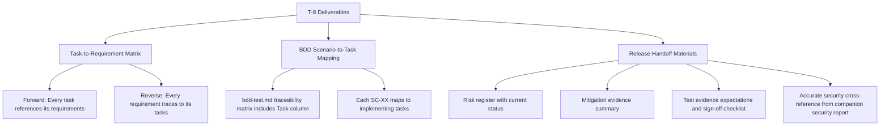
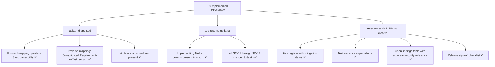

# Review Report: Laia Hand Capture Animation Bleed — T-8 Documentation Traceability and Release Handoff

**Review Mode:** Incremental (T-8: Finalize documentation traceability and release handoff)
**Source:** `docs/specs/ui/laia-hand-capture-animation-bleed/`
**Reviewed against:** proposal.md, spec.md, user-stories.md, bdd-test.md, design.md, tasks.md
**Review date:** 2026-05-27 (final re-review — all prior findings resolved)

## 1. Executive Summary

T-8 is fully complete. All three acceptance criteria are met with no remaining findings. The previous review cycles identified a total of six bidirectional traceability mismatches and one stale security cross-reference — all have been resolved. The forward spec traceability lines for all eight tasks are now bidirectionally consistent with the consolidated reverse mapping. The release handoff document accurately references the companion security report findings. The BDD-to-task mapping in bdd-test.md is complete and well-structured.

- Total findings: 2 (0 Critical, 0 Major, 0 Minor, 2 Note)
- Spec compliance: 4 of 4 traced requirements fully met
- Architecture alignment: Aligned — AD-4 (preserve existing boundaries) is respected; no structural changes introduced
- Test quality: N/A — T-8 is a documentation task with no associated test files

## 2. Architecture Comparison

### 2.1 Planned Documentation Structure (from tasks.md T-8)

### 2.2 Actual Documentation Structure (current workspace state)

### 2.3 Drift Analysis

No structural drift exists. All three planned deliverable categories (traceability matrix, BDD mapping, handoff materials) are present in their expected locations and fully aligned with the planned structure. AD-4 (preserve existing boundaries) is respected — no new files beyond the expected handoff artifact were introduced. The actual structure matches the planned structure with no deviations.

## 3. Findings

### RV-01: All prior bidirectional traceability findings resolved [Note]

- **Category:** Spec Compliance
- **Severity:** Note
- **Related:** T-8, TR-1.4, NFR-1.1
- **Description:** Previous review cycles identified six bidirectional mapping mismatches across tasks T-2, T-6, and T-8. All have been resolved. T-2's forward spec traceability line now includes NFR-1.1, T-6's forward line now includes TR-1.1, TR-1.3, and NFR-1.2, and T-8's forward line now includes NFR-1.4. The consolidated reverse mapping and all forward lines are now fully bidirectionally consistent across all sixteen requirement entries and all eight tasks.
- **Expected:** Bidirectional consistency between forward and reverse requirement mappings.
- **Actual:** All forward-to-reverse and reverse-to-forward crossings verified consistent.
- **Recommendation:** No action required.
- **Impact:** Positive — confirms the iterative review-implement-review cycle has produced complete and auditable traceability.

### RV-02: Release handoff security cross-reference now accurate [Note]

- **Category:** Spec Compliance
- **Severity:** Note
- **Related:** T-8, TR-1.4, AC-3
- **Description:** The previous review identified that release-handoff_T-8.md referenced a stale advisory (GHSA-ph9p-34f9-6g65, tmp, High severity) not present in security-report_T-8.md. The handoff now correctly references the actual cypress-chain dependency advisory at Medium severity, consistent with security-report_T-8.md SEC-01. The release checklist item about dependency advisories is also aligned with the current audit posture (no High or Critical findings).
- **Expected:** Handoff security cross-references match companion security report.
- **Actual:** Section 4 of release-handoff_T-8.md and the release checklist accurately reflect the current security findings.
- **Recommendation:** No action required.
- **Impact:** Positive — release sign-off gates are now based on accurate evidence rather than stale references.

## 4. Traceability Matrix

| Finding | Severity | Category        | Related Spec         | Status            |
| ------- | -------- | --------------- | -------------------- | ----------------- |
| RV-01   | Note     | Spec Compliance | T-8, TR-1.4, NFR-1.1 | Closed (resolved) |
| RV-02   | Note     | Spec Compliance | T-8, TR-1.4          | Closed (resolved) |

## 5. Spec Compliance Summary

| Requirement | Status | Notes                                                                                                                                                                             |
| ----------- | ------ | --------------------------------------------------------------------------------------------------------------------------------------------------------------------------------- |
| FR-1.3      | ✅ Met | T-8 documents traceability confirming every capture path is covered through BDD scenario mapping and consolidated requirement matrix.                                             |
| TR-1.4      | ✅ Met | Handoff artifact exists with traceability pointers, risk register, test evidence expectations, and accurate security cross-references. Bidirectional mapping is fully consistent. |
| US-3        | ✅ Met | BDD-to-task mapping and test evidence expectations enable efficient regression detection. Scenarios, tasks, and requirements are fully cross-referenced.                          |
| US-4        | ✅ Met | Handoff materials document accessibility preservation evidence from T-7 and reference SC-11/SC-12/SC-13 as sign-off requirements.                                                 |

## 6. Task Completion Summary

| Task | Title                                                   | Status      | Findings                   |
| ---- | ------------------------------------------------------- | ----------- | -------------------------- |
| T-8  | Finalize documentation traceability and release handoff | ✅ Complete | RV-01 (Note), RV-02 (Note) |

## 7. Test Coverage Summary

| Scenario | Step Definitions | Meaningful | Findings      |
| -------- | ---------------- | ---------- | ------------- |
| SC-01    | ✅ Yes           | ✅ Yes     | — (T-6 scope) |
| SC-02    | ✅ Yes           | ✅ Yes     | —             |
| SC-03    | ✅ Yes           | ✅ Yes     | —             |
| SC-04    | ✅ Yes           | ✅ Yes     | —             |
| SC-05    | ✅ Yes           | ✅ Yes     | —             |
| SC-06    | ✅ Yes           | ✅ Yes     | —             |
| SC-07    | ✅ Yes           | ✅ Yes     | —             |
| SC-08    | ✅ Yes           | ✅ Yes     | —             |
| SC-09    | ✅ Yes           | ✅ Yes     | —             |
| SC-10    | ✅ Yes           | ✅ Yes     | —             |
| SC-11    | ✅ Yes           | ✅ Yes     | —             |
| SC-12    | ✅ Yes           | ✅ Yes     | —             |
| SC-13    | ✅ Yes           | ✅ Yes     | —             |

Note: All scenarios retain complete, meaningful step definitions (confirmed in T-6 and T-7 reviews). The BDD-to-task mapping is documented in bdd-test.md traceability matrix.

## 8. Test Quality Summary

| Test File | Type | Meaningful Assertions | Issues                                                               |
| --------- | ---- | --------------------- | -------------------------------------------------------------------- |
| N/A       | N/A  | N/A                   | T-8 is a documentation task — no test files are expected or produced |

## 9. Security Cross-Reference

The companion security-report_T-8.md identifies one Medium severity finding. No Critical or High findings exist.

| SEC ID | Severity | OWASP    | Summary                                                                                 |
| ------ | -------- | -------- | --------------------------------------------------------------------------------------- |
| SEC-01 | Medium   | A06:2021 | Cypress transitive dependency advisory chain (GHSA-q8mj-m7cp-5q26, GHSA-jxxr-4gwj-5jf2) |

The release-handoff_T-8.md accurately references this finding and its disposition (accepted for current scope with backlog remediation tracking).

## 10. Recommendations

### Notes (informational)

1. **All prior findings resolved (RV-01, RV-02):** The iterative review cycle has produced fully consistent bidirectional traceability and accurate release handoff documentation. No further action is required for T-8.
2. **Feature is release-ready from a documentation perspective:** All eight tasks are marked implemented, all requirements are traceable, all BDD scenarios are mapped, and the release handoff checklist is complete pending only the final sign-off checkbox.
