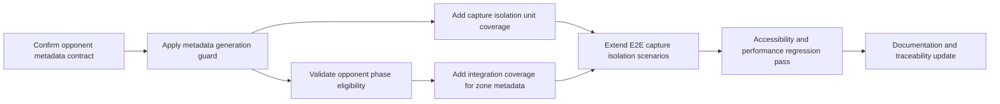

# Implementation Tasks: Laia Hand Capture Animation Bleed

Source Design: docs/specs/ui/laia-hand-capture-animation-bleed/design.md

## Task Dependency Overview

## Tasks

### T-1: Confirm stable opponent metadata no-op contract

- Status: ✅ Implemented

- Description: Formalize that ineligible opponent contexts publish an empty opponent metadata collection and never null-like semantics.
- Architectural Decision: AD-2.
- Depends on: None.
- Components affected: GameTablePage metadata derivation, OpponentZones consumption contract.
- Acceptance criteria:
  - [ ] No-op opponent metadata is represented as an empty opponent collection.
  - [ ] The contract is consistent across all human capture scenarios.
  - [ ] Consumer assumptions are documented for regression clarity.
- Estimation hint: XS.
- Spec traceability: TR-1.2, NFR-1.2, US-2.

### T-2: Enforce suppression and phase guard at metadata generation boundary

- Description: Ensure opponent metadata derivation checks human-turn suppression and opponent-phase eligibility before publishing visual entries.
- Architectural Decision: AD-1, AD-3.
- Depends on: T-1.
- Components affected: GameTablePage computed animation metadata path.
- Acceptance criteria:
  - [ ] Human captures never publish capture-state opponent metadata.
  - [ ] Opponent metadata is no-op for ineligible contexts.
  - [ ] Table capture visuals remain unaffected for participating cards.
- Estimation hint: S.
- Spec traceability: FR-1.2, FR-1.4, TR-1.1, TR-1.2, TR-1.3, US-1, US-2.

### T-3: Preserve opponent-turn explicit animation eligibility

- Description: Validate that explicit opponent-turn phases still publish allowed opponent visual metadata and exit cleanly to static state.
- Architectural Decision: AD-3.
- Depends on: T-2.
- Components affected: GameTablePage and OpponentZones phase interaction.
- Acceptance criteria:
  - [ ] Opponent visual metadata appears only in eligible opponent-turn phases.
  - [ ] Ending opponent-turn phase returns opponent metadata to no-op.
  - [ ] Human capture context cannot reactivate opponent capture visuals.
- Estimation hint: S.
- Spec traceability: FR-1.4, NFR-1.1, US-2.

### T-4: Add unit coverage for capture isolation rules

- Description: Add focused unit validations for metadata derivation logic across single-card, multi-card, and Escoba capture contexts.
- Architectural Decision: AD-1, AD-2.
- Depends on: T-2.
- Components affected: GameTablePage metadata derivation tests.
- Acceptance criteria:
  - [ ] Single-card human capture yields no-op opponent metadata.
  - [ ] Multi-card human capture yields no-op opponent metadata.
  - [ ] Escoba human capture yields no-op opponent metadata.
- Estimation hint: M.
- Spec traceability: FR-1.2, FR-1.3, TR-1.1, US-1, US-3.

### T-5: Add integration coverage for zone-level rendering contract

- Description: Validate that zone components consume stable metadata and do not show bleed effects under human capture state changes.
- Architectural Decision: AD-2, AD-4.
- Depends on: T-3.
- Components affected: OpponentZones integration behavior with upstream metadata signals.
- Acceptance criteria:
  - [ ] Opponent zone renders static hand visuals during human captures.
  - [ ] Opponent zone still renders eligible opponent-turn visuals.
  - [ ] No consumer-side null-branch regression appears.
- Estimation hint: M.
- Spec traceability: FR-1.2, FR-1.4, NFR-1.2, US-1, US-2.

### T-6: Extend end-to-end scenarios from BDD

- Description: Implement scenario coverage aligned with SC-01 through SC-13 for isolation, eligibility, repetition, and non-functional behavior.
- Architectural Decision: AD-1, AD-3, AD-4.
- Depends on: T-4, T-5.
- Components affected: End-to-end test suite and scenario traceability documentation.
- Acceptance criteria:
  - [ ] Human capture isolation scenarios pass for single, multi, and Escoba captures.
  - [ ] Opponent eligibility scenarios pass for explicit opponent-turn contexts.
  - [ ] Repeated capture and post-deal scenarios pass without bleed.
- Estimation hint: L.
- Spec traceability: FR-1.1, FR-1.2, FR-1.3, FR-1.4, US-1, US-2, US-3.

### T-7: Run accessibility and performance regression validation

- Description: Confirm reduced-motion consistency, keyboard and focus continuity, and absence of introduced stutter in capture transitions.
- Architectural Decision: AD-4.
- Depends on: T-6.
- Components affected: Game table interaction and animation presentation validation artifacts.
- Acceptance criteria:
  - [ ] Reduced-motion behavior remains correct for isolation outcomes.
  - [ ] Keyboard and focus behavior remain unchanged through capture cycles.
  - [ ] No new noticeable stutter is introduced in capture transitions.
- Estimation hint: S.
- Spec traceability: NFR-1.3, NFR-1.4, US-4.

### T-8: Finalize documentation traceability and release handoff

- Description: Update references so requirements, stories, BDD scenarios, and implementation tasks remain fully traceable for review and sign-off.
- Architectural Decision: AD-4.
- Depends on: T-7.
- Components affected: Feature documentation set and review checklist artifacts.
- Acceptance criteria:
  - [ ] Task to requirement mapping is complete and consistent.
  - [ ] BDD scenarios map clearly to implementation tasks.
  - [ ] Handoff materials capture risks, mitigations, and test evidence expectations.
- Estimation hint: XS.
- Spec traceability: TR-1.4, FR-1.3, US-3, US-4.

## Implementation Order

1. T-1: Confirm stable opponent metadata no-op contract — establishes contract baseline for all downstream changes.
2. T-2: Enforce suppression and phase guard at metadata generation boundary — implements the core defect fix path.
3. T-3: Preserve opponent-turn explicit animation eligibility — prevents over-correction and protects valid behavior.
4. T-4: Add unit coverage for capture isolation rules — secures logic-level regression prevention early.
5. T-5: Add integration coverage for zone-level rendering contract — validates consumer behavior with stable metadata.
6. T-6: Extend end-to-end scenarios from BDD — verifies user-visible behavior in realistic flows.
7. T-7: Run accessibility and performance regression validation — confirms non-functional requirements remain satisfied.
8. T-8: Finalize documentation traceability and release handoff — closes review readiness with complete traceability.
