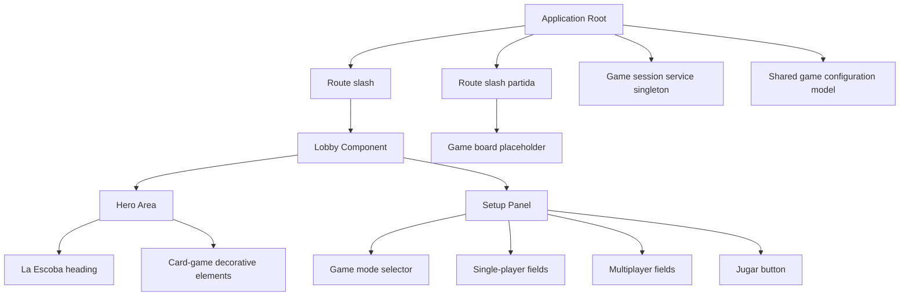
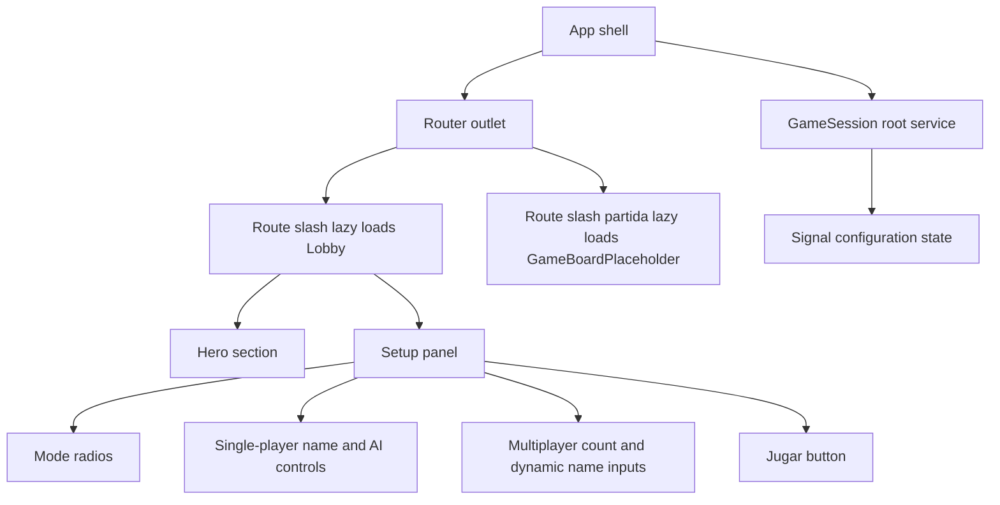
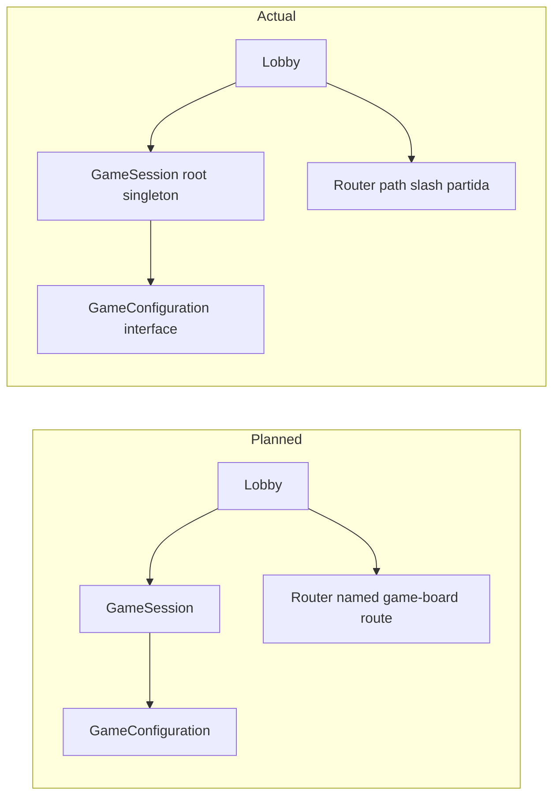

# Review Report: Lobby Screen

## Re-Review Addendum (2026-04-28, Pass 5)

This addendum supersedes any conflicting statements below from earlier passes.

### Re-Review Scope

- Review mode: Incremental (task lobby-feature)
- User-requested verification target: post-fix status check after the SC-53 update.
- Evidence reviewed in this pass:
  - docs/specs/ui/lobby/bdd-test.md
  - cypress/e2e/lobby.feature
  - cypress/e2e/lobby.ts
  - cypress/e2e/app-startup.feature
  - cypress/e2e/app-startup.ts
  - src/app/features/lobby/lobby/lobby.ts
  - src/app/features/lobby/lobby/lobby.html
  - src/app/features/lobby/lobby/lobby.scss
  - src/app/features/lobby/lobby/lobby.spec.ts
  - eslint.config.js
  - package.json
  - docs/specs/ui/lobby/security-report.md

### Outcome Snapshot

- Prior Major closed: BDD scenario parity remains complete at 58 documented and 58 implemented scenarios.
- SC-53 Major status: Closed.
- Total findings in this re-review scope: 4 (0 Critical, 0 Major, 3 Minor, 1 Note).
- Critical findings remaining: 0
- Major findings remaining: 0
- Review-pass decision for task lobby-feature: Pass for blocking severity; non-blocking improvements remain.

### Critical/Major Findings For This Re-Review

#### Critical

1. None.

#### Major

1. None.

### SC-53 Closure Status

SC-53 is now closed.

- The mode radio inputs now include directional arrow-key handlers in the Lobby template.
- The SC-53 step now drives mode selection through keyboard input and verifies checked-state movement to the adjacent option.
- The explicit state-mutation fallback path flagged in the prior pass is no longer present.

### Remaining Non-Blocking Items (Minor/Note)

1. Minor: Title-string traceability drift remains between specification wording and E2E assertions.

- Evidence: spec.md and bdd-test.md specify the primary heading as La Escoba, while lobby.feature and app-startup.ts assert La Escobini Kapitxorna.
- Acceptance risk: Medium for auditability; low for runtime correctness if rename is intentional and approved.

2. Minor: SC-50 and SC-51 coverage uses proxy checks that do not execute real Tab traversal order.

- Evidence: The step set focuses controls programmatically and derives order from layout coordinates.
- Acceptance risk: Medium for strict accessibility traceability.

3. Minor: SC-53 difficulty-selector assertion still permits a focus-retention pass path.

- Evidence: The selector response flag is satisfied when value changes or when the control remains focused, so strict value-change proof is not mandatory for pass.
- Acceptance risk: Low to medium for long-term keyboard-regression detection.

4. Note: SC-45 timing check infers feedback latency from transition declarations rather than directly measuring rendered pressed-state timing under interaction.

- Acceptance risk: Low to medium, depending on how strictly NFR-1.2 evidence is interpreted during acceptance.

### Security Cross-Reference Delta

- Current security report (docs/specs/ui/lobby/security-report.md) contains no Critical or High SEC findings.

**Review Mode:** Incremental (task lobby-feature)  
**Source:** docs/specs/ui/lobby/  
**Reviewed against:** proposal.md, spec.md, user-stories.md, bdd-test.md, security-report.md  
**Unavailable artifacts in feature folder:** design.md, tasks.md  
**Scope clarification applied:** app-startup tests included; FR and BDD wording used as authority for language conflicts.

## 1. Executive Summary

The implemented lobby feature is functionally strong and largely aligned with the available requirements, especially for routing, mode switching, signal-based state, and session handoff. The main risks are concentrated in test coverage depth and accessibility verification: the BDD scenario corpus is only partially implemented, one step definition is a no-op, and the hero color treatment does not meet the documented contrast target.

- Total findings: 6 (0 Critical, 3 Major, 2 Minor, 1 Note)
- Spec compliance: 43 of 53 requirements fully met
- Architecture alignment: Minor drift (implementation aligns with proposal and spec, but architecture traceability is limited by missing design and task artifacts)
- Test quality: Partially meaningful (good unit coverage in lobby core paths, but significant BDD coverage gaps and one no-op step)

## 2. Architecture Comparison

### 2.1 Planned Component Tree

### 2.2 Actual Component Tree

### 2.3 Drift Analysis

Relative to proposal and spec, the implemented structure is mostly aligned. Lobby is root-routed and lazy-loaded, game-board placeholder route exists, and a root-scoped signal-based session service is present.

Observed drift and limitations:

- The expected architecture baseline in design.md is unavailable, so AD-level comparison cannot be completed.
- The expected task mapping baseline in tasks.md is unavailable, so task-to-file traceability is incomplete.
- A legacy app-shell heading and title signal remain in the shell and related tests, creating test intent drift from lobby branding acceptance criteria.

### 2.4 Planned vs Actual Service Dependencies

## 3. Findings

### RV-01: BDD implementation gap across the scenario set [Major]

- **Category:** Test Coverage
- **Severity:** Major
- **Related:** FR-8.1, FR-8.3, NFR-1.2, NFR-2.3, NFR-2.4, US-8, US-9, SC-01..SC-03, SC-05..SC-06, SC-09..SC-30, SC-34..SC-35, SC-37..SC-41, SC-45..SC-58
- **Description:** The documented BDD corpus defines 58 scenarios, but the implemented lobby feature file covers only a small subset.
- **Expected:** Scenario coverage should map comprehensively to the documented SC list, including responsive, keyboard, screen-reader, and performance scenarios.
- **Actual:** The scenario source includes extensive requirements in [docs/specs/ui/lobby/bdd-test.md](docs/specs/ui/lobby/bdd-test.md#L513) and [docs/specs/ui/lobby/bdd-test.md](docs/specs/ui/lobby/bdd-test.md#L569), while implemented lobby scenarios are limited to five entries in [cypress/e2e/lobby.feature](cypress/e2e/lobby.feature#L3), [cypress/e2e/lobby.feature](cypress/e2e/lobby.feature#L9), [cypress/e2e/lobby.feature](cypress/e2e/lobby.feature#L16), [cypress/e2e/lobby.feature](cypress/e2e/lobby.feature#L24), and [cypress/e2e/lobby.feature](cypress/e2e/lobby.feature#L29).
- **Recommendation:** Expand BDD feature coverage to include all high-risk omitted SC areas first: keyboard navigation, screen-reader behavior, responsive constraints, and interaction-performance signals.
- **Impact:** Regression risk remains high in accessibility and device-specific behavior despite core path tests passing.

### RV-02: No-op step definition creates false confidence in startup scenario [Major]

- **Category:** Test Quality
- **Severity:** Major
- **Related:** FR-1.1, FR-1.2, US-1
- **Description:** A Given step is implemented as a no-op, so the scenario precondition is not verified.
- **Expected:** Each BDD step should perform meaningful setup or verification.
- **Actual:** The startup step in [cypress/e2e/app-startup.ts](cypress/e2e/app-startup.ts#L3) contains a no-op body in [cypress/e2e/app-startup.ts](cypress/e2e/app-startup.ts#L4).
- **Recommendation:** Replace the no-op with a real, observable precondition check or remove the step to avoid implied guarantees.
- **Impact:** This test can report success while not validating the scenario setup semantics.

### RV-03: Hero contrast does not satisfy documented WCAG AA requirement [Major]

- **Category:** Spec Compliance
- **Severity:** Major
- **Related:** NFR-2.2, SC-58, US-1
- **Description:** The hero text color treatment is below the required contrast threshold for normal text.
- **Expected:** Foreground/background contrast should meet SC-58 and NFR-2.2 thresholds.
- **Actual:** Hero text uses a light foreground in [src/app/features/lobby/lobby/lobby.scss](src/app/features/lobby/lobby/lobby.scss#L21) over accent colors defined in [src/styles.scss](src/styles.scss#L12) and [src/styles.scss](src/styles.scss#L13), producing an estimated contrast range below 4.5:1 for normal text.
- **Recommendation:** Adjust hero foreground/background token pairing to satisfy WCAG AA at all gradient stops.
- **Impact:** Accessibility compliance risk for low-vision users and potential release gate failure against documented requirements.

### RV-04: App-shell title assertions are disconnected from lobby branding criteria [Minor]

- **Category:** Test Quality
- **Severity:** Minor
- **Related:** FR-2.1, US-1, SC-04
- **Description:** Startup/app-shell tests validate scaffold title text rather than lobby brand heading outcomes.
- **Expected:** Startup and shell assertions should verify that lobby branding requirements are satisfied.
- **Actual:** Shell title state and hidden heading are defined in [src/app/app.ts](src/app/app.ts#L11) and [src/app/app.html](src/app/app.html#L1), with tests asserting Hello, escobita in [src/app/app.spec.ts](src/app/app.spec.ts#L21) and [cypress/e2e/app-startup.ts](cypress/e2e/app-startup.ts#L12).
- **Recommendation:** Align startup assertions with the lobby heading requirement and remove dependence on scaffold-era title text.
- **Impact:** Branding regressions can be missed while unrelated shell text still passes tests.

### RV-05: Placeholder component test traceability annotation over-claims routing coverage [Minor]

- **Category:** Test Coverage
- **Severity:** Minor
- **Related:** TR-1.2
- **Description:** One test file claims TR-1.2 coverage but only verifies placeholder text rendering.
- **Expected:** Requirement annotations should reflect behavior actually asserted by the test.
- **Actual:** Traceability comment appears in [src/app/features/game-board/game-board-placeholder/game-board-placeholder.spec.ts](src/app/features/game-board/game-board-placeholder/game-board-placeholder.spec.ts#L5), while assertions only check placeholder content in [src/app/features/game-board/game-board-placeholder/game-board-placeholder.spec.ts](src/app/features/game-board/game-board-placeholder/game-board-placeholder.spec.ts#L26). Route coverage exists separately in [src/app/app.routes.spec.ts](src/app/app.routes.spec.ts#L26).
- **Recommendation:** Re-scope the annotation to placeholder-render concerns or relocate TR-1.2 mapping to routing-focused tests.
- **Impact:** Traceability reports become less reliable for requirement audits.

### RV-06: Missing design and task artifacts limit architecture and task-level verification [Note]

- **Category:** Architecture Drift
- **Severity:** Note
- **Related:** AD-X, T-X
- **Description:** The expected design and task documents are missing for this feature folder.
- **Expected:** Architecture and task artifacts should be present for complete drift and completion review.
- **Actual:** Review baseline is limited to proposal/spec/user-stories/bdd-test only.
- **Recommendation:** Add missing architecture and task artifacts before next review cycle.
- **Impact:** Reduced confidence in drift and implementation-plan conformity conclusions.

## 4. Traceability Matrix

| Finding | Severity | Category           | Related Spec                                                            | Status |
| ------- | -------- | ------------------ | ----------------------------------------------------------------------- | ------ |
| RV-01   | Major    | Test Coverage      | FR-8.1, FR-8.3, NFR-1.2, NFR-2.3, NFR-2.4, US-8, US-9, SC coverage gaps | Open   |
| RV-02   | Major    | Test Quality       | FR-1.1, FR-1.2, US-1                                                    | Open   |
| RV-03   | Major    | Spec Compliance    | NFR-2.2, SC-58, US-1                                                    | Open   |
| RV-04   | Minor    | Test Quality       | FR-2.1, US-1, SC-04                                                     | Open   |
| RV-05   | Minor    | Test Coverage      | TR-1.2                                                                  | Open   |
| RV-06   | Note     | Architecture Drift | AD-X, T-X                                                               | Open   |

## 5. Spec Compliance Summary

| Requirement | Status     | Notes                                                                                                                                                                                                                         |
| ----------- | ---------- | ----------------------------------------------------------------------------------------------------------------------------------------------------------------------------------------------------------------------------- |
| FR-1.1      | ✅ Met     | Root route maps to lobby in [src/app/app.routes.ts](src/app/app.routes.ts#L5)                                                                                                                                                 |
| FR-1.2      | ✅ Met     | No pre-lobby route is configured in [src/app/app.routes.ts](src/app/app.routes.ts#L5)                                                                                                                                         |
| FR-1.3      | ✅ Met     | No auto-redirect away from lobby is implemented                                                                                                                                                                               |
| FR-1.4      | ✅ Met     | Named game-board route exists in [src/app/app.routes.ts](src/app/app.routes.ts#L9)                                                                                                                                            |
| FR-2.1      | ✅ Met     | Lobby heading present in [src/app/features/lobby/lobby/lobby.html](src/app/features/lobby/lobby/lobby.html#L5)                                                                                                                |
| FR-2.2      | ✅ Met     | Hero decorative elements present in [src/app/features/lobby/lobby/lobby.html](src/app/features/lobby/lobby/lobby.html#L8)                                                                                                     |
| FR-2.3      | ✅ Met     | Hero section contains no interactive controls                                                                                                                                                                                 |
| FR-3.1      | ✅ Met     | Exactly two mode options in [src/app/features/lobby/lobby/lobby.html](src/app/features/lobby/lobby/lobby.html#L32) and [src/app/features/lobby/lobby/lobby.html](src/app/features/lobby/lobby/lobby.html#L44)                 |
| FR-3.2      | ✅ Met     | Radio group enforces an always-selected mode                                                                                                                                                                                  |
| FR-3.3      | ✅ Met     | Default signal mode is Single Player in [src/app/features/lobby/lobby/lobby.ts](src/app/features/lobby/lobby/lobby.ts#L25)                                                                                                    |
| FR-3.4      | ✅ Met     | Conditional setup panel rendering implemented in [src/app/features/lobby/lobby/lobby.html](src/app/features/lobby/lobby/lobby.html#L47)                                                                                       |
| FR-4.1      | ✅ Met     | Single-player view renders one editable name field                                                                                                                                                                            |
| FR-4.2      | ✅ Met     | Single-player default name set in [src/app/features/lobby/lobby/lobby.ts](src/app/features/lobby/lobby/lobby.ts#L30)                                                                                                          |
| FR-4.3      | ✅ Met     | Read-only AI name display in [src/app/features/lobby/lobby/lobby.html](src/app/features/lobby/lobby/lobby.html#L72)                                                                                                           |
| FR-4.4      | ✅ Met     | Difficulty options available in [src/app/features/lobby/lobby/lobby.html](src/app/features/lobby/lobby/lobby.html#L84)                                                                                                        |
| FR-4.5      | ✅ Met     | Easy defaults and mode-switch reset in [src/app/features/lobby/lobby/lobby.ts](src/app/features/lobby/lobby/lobby.ts#L26) and [src/app/features/lobby/lobby/lobby.ts](src/app/features/lobby/lobby/lobby.ts#L70)              |
| FR-4.6      | ✅ Met     | Player-count selector is hidden in single-player branch                                                                                                                                                                       |
| FR-5.1      | ✅ Met     | Multiplayer player-count selector in [src/app/features/lobby/lobby/lobby.html](src/app/features/lobby/lobby/lobby.html#L90)                                                                                                   |
| FR-5.2      | ✅ Met     | Multiplayer count default is 2 in [src/app/features/lobby/lobby/lobby.ts](src/app/features/lobby/lobby/lobby.ts#L27)                                                                                                          |
| FR-5.3      | ✅ Met     | Dynamic fields from computed indexes in [src/app/features/lobby/lobby/lobby.ts](src/app/features/lobby/lobby/lobby.ts#L51)                                                                                                    |
| FR-5.4      | ✅ Met     | Multiplayer defaults provided by model in [src/app/features/lobby/lobby/lobby.ts](src/app/features/lobby/lobby/lobby.ts#L36)                                                                                                  |
| FR-5.5      | ✅ Met     | Remaining names preserved when reducing visible count                                                                                                                                                                         |
| FR-5.6      | ✅ Met     | AI difficulty hidden in multiplayer branch                                                                                                                                                                                    |
| FR-6.1      | ✅ Met     | Blank/whitespace invalidation via trim check in [src/app/features/lobby/lobby/lobby.ts](src/app/features/lobby/lobby/lobby.ts#L152)                                                                                           |
| FR-6.2      | ✅ Met     | Defaults keep form valid on load                                                                                                                                                                                              |
| FR-6.3      | ✅ Met     | Blur-driven error messages in [src/app/features/lobby/lobby/lobby.ts](src/app/features/lobby/lobby/lobby.ts#L93) and [src/app/features/lobby/lobby/lobby.html](src/app/features/lobby/lobby/lobby.html#L61)                   |
| FR-6.4      | ✅ Met     | No uniqueness validation is enforced                                                                                                                                                                                          |
| FR-7.1      | ✅ Met     | Jugar button implemented in [src/app/features/lobby/lobby/lobby.html](src/app/features/lobby/lobby/lobby.html#L140)                                                                                                           |
| FR-7.2      | ✅ Met     | Disabled state bound in [src/app/features/lobby/lobby/lobby.html](src/app/features/lobby/lobby/lobby.html#L143)                                                                                                               |
| FR-7.3      | ✅ Met     | Button enables when names are non-blank via [src/app/features/lobby/lobby/lobby.ts](src/app/features/lobby/lobby/lobby.ts#L62)                                                                                                |
| FR-7.4      | ✅ Met     | Configuration built and navigation triggered in [src/app/features/lobby/lobby/lobby.ts](src/app/features/lobby/lobby/lobby.ts#L123) and [src/app/features/lobby/lobby/lobby.ts](src/app/features/lobby/lobby/lobby.ts#L124)   |
| FR-7.5      | ✅ Met     | Session set before navigation in [src/app/features/lobby/lobby/lobby.ts](src/app/features/lobby/lobby/lobby.ts#L123)                                                                                                          |
| FR-8.1      | ⚠️ Partial | CSS suggests responsive behavior, but scenario coverage is incomplete (RV-01)                                                                                                                                                 |
| FR-8.2      | ✅ Met     | Mobile-stack and desktop split in [src/app/features/lobby/lobby/lobby.scss](src/app/features/lobby/lobby/lobby.scss#L192)                                                                                                     |
| FR-8.3      | ✅ Met     | Controls meet touch-target minimum via min-height declarations                                                                                                                                                                |
| US-1        | ⚠️ Partial | Core branding present; contrast requirement linkage remains open (RV-03)                                                                                                                                                      |
| US-2        | ✅ Met     | Mode switch behavior implemented and validated in unit tests                                                                                                                                                                  |
| US-3        | ✅ Met     | Single-player defaults and difficulty behavior implemented                                                                                                                                                                    |
| US-4        | ✅ Met     | Multiplayer count and dynamic fields implemented                                                                                                                                                                              |
| US-5        | ✅ Met     | Defaults prevent initial blocking and stay editable                                                                                                                                                                           |
| US-6        | ✅ Met     | Required-name validation and disabled submit implemented                                                                                                                                                                      |
| US-7        | ✅ Met     | Valid and invalid Jugar paths are implemented                                                                                                                                                                                 |
| US-8        | ⚠️ Partial | Responsive implementation exists but BDD test depth is incomplete (RV-01)                                                                                                                                                     |
| US-9        | ⚠️ Partial | Accessibility semantics partly implemented; keyboard scenario coverage is incomplete (RV-01)                                                                                                                                  |
| NFR-1.1     | ⚠️ Partial | No measured interactive timing evidence in automated tests                                                                                                                                                                    |
| NFR-1.2     | ⚠️ Partial | Active-state transition exists, but no timing verification test                                                                                                                                                               |
| NFR-2.1     | ✅ Met     | Labels and control semantics are present in lobby template                                                                                                                                                                    |
| NFR-2.2     | ❌ Not Met | Hero color contrast is below required threshold (RV-03)                                                                                                                                                                       |
| NFR-2.3     | ⚠️ Partial | Native controls likely keyboard-operable; SC-50..SC-55 are not fully automated (RV-01)                                                                                                                                        |
| NFR-2.4     | ✅ Met     | Error association with aria-describedby in [src/app/features/lobby/lobby/lobby.html](src/app/features/lobby/lobby/lobby.html#L58) and [src/app/features/lobby/lobby/lobby.html](src/app/features/lobby/lobby/lobby.html#L118) |
| NFR-3.1     | ⚠️ Partial | Flow appears short, but no usability timing validation exists                                                                                                                                                                 |
| NFR-3.2     | ✅ Met     | Reviewed using FR and BDD language precedence per scope clarification                                                                                                                                                         |
| NFR-4.1     | ⚠️ Partial | No browser-matrix evidence captured in current tests                                                                                                                                                                          |

## 6. Task Completion Summary

| Task          | Title                                             | Status     | Findings                                 |
| ------------- | ------------------------------------------------- | ---------- | ---------------------------------------- |
| lobby-feature | Incremental lobby implementation and tests review | ⚠️ Partial | RV-01, RV-02, RV-03, RV-04, RV-05, RV-06 |

## 7. Test Coverage Summary

| Scenario | Step Definitions | Meaningful | Findings     |
| -------- | ---------------- | ---------- | ------------ |
| SC-01    | ❌ No            | ❌ No      | RV-01        |
| SC-02    | ❌ No            | ❌ No      | RV-01        |
| SC-03    | ❌ No            | ❌ No      | RV-01        |
| SC-04    | ✅ Yes           | ✅ Yes     | —            |
| SC-05    | ❌ No            | ❌ No      | RV-01        |
| SC-06    | ❌ No            | ❌ No      | RV-01        |
| SC-07    | ✅ Yes           | ✅ Yes     | —            |
| SC-08    | ✅ Yes           | ✅ Yes     | —            |
| SC-09    | ❌ No            | ❌ No      | RV-01        |
| SC-10    | ❌ No            | ❌ No      | RV-01        |
| SC-11    | ❌ No            | ❌ No      | RV-01        |
| SC-12    | ❌ No            | ❌ No      | RV-01        |
| SC-13    | ❌ No            | ❌ No      | RV-01        |
| SC-14    | ❌ No            | ❌ No      | RV-01        |
| SC-15    | ❌ No            | ❌ No      | RV-01        |
| SC-16    | ❌ No            | ❌ No      | RV-01        |
| SC-17    | ❌ No            | ❌ No      | RV-01        |
| SC-18    | ❌ No            | ❌ No      | RV-01        |
| SC-19    | ❌ No            | ❌ No      | RV-01        |
| SC-20    | ❌ No            | ❌ No      | RV-01        |
| SC-21    | ❌ No            | ❌ No      | RV-01        |
| SC-22    | ❌ No            | ❌ No      | RV-01        |
| SC-23    | ✅ Yes           | ✅ Yes     | —            |
| SC-24    | ❌ No            | ❌ No      | RV-01        |
| SC-25    | ❌ No            | ❌ No      | RV-01        |
| SC-26    | ❌ No            | ❌ No      | RV-01        |
| SC-27    | ❌ No            | ❌ No      | RV-01        |
| SC-28    | ❌ No            | ❌ No      | RV-01        |
| SC-29    | ✅ Yes           | ✅ Yes     | —            |
| SC-30    | ❌ No            | ❌ No      | RV-01        |
| SC-31    | ✅ Yes           | ✅ Yes     | —            |
| SC-32    | ✅ Yes           | ✅ Yes     | —            |
| SC-33    | ✅ Yes           | ✅ Yes     | —            |
| SC-34    | ❌ No            | ❌ No      | RV-01        |
| SC-35    | ❌ No            | ❌ No      | RV-01        |
| SC-36    | ✅ Yes           | ✅ Yes     | —            |
| SC-37    | ❌ No            | ❌ No      | RV-01        |
| SC-38    | ❌ No            | ❌ No      | RV-01        |
| SC-39    | ❌ No            | ❌ No      | RV-01        |
| SC-40    | ❌ No            | ❌ No      | RV-01        |
| SC-41    | ❌ No            | ❌ No      | RV-01        |
| SC-42    | ✅ Yes           | ⚠️ Partial | RV-01        |
| SC-43    | ✅ Yes           | ⚠️ Partial | RV-01        |
| SC-44    | ✅ Yes           | ✅ Yes     | —            |
| SC-45    | ❌ No            | ❌ No      | RV-01        |
| SC-46    | ❌ No            | ❌ No      | RV-01        |
| SC-47    | ❌ No            | ❌ No      | RV-01        |
| SC-48    | ❌ No            | ❌ No      | RV-01        |
| SC-49    | ❌ No            | ❌ No      | RV-01        |
| SC-50    | ❌ No            | ❌ No      | RV-01        |
| SC-51    | ❌ No            | ❌ No      | RV-01        |
| SC-52    | ❌ No            | ❌ No      | RV-01        |
| SC-53    | ❌ No            | ❌ No      | RV-01        |
| SC-54    | ❌ No            | ❌ No      | RV-01        |
| SC-55    | ❌ No            | ❌ No      | RV-01        |
| SC-56    | ❌ No            | ❌ No      | RV-01        |
| SC-57    | ❌ No            | ❌ No      | RV-01        |
| SC-58    | ❌ No            | ❌ No      | RV-01, RV-03 |

## 8. Test Quality Summary

| Test File                                                                                                                                                              | Type        | Meaningful Assertions | Issues                                                               |
| ---------------------------------------------------------------------------------------------------------------------------------------------------------------------- | ----------- | --------------------- | -------------------------------------------------------------------- |
| [src/app/features/lobby/lobby/lobby.spec.ts](src/app/features/lobby/lobby/lobby.spec.ts)                                                                               | Unit        | ✅ Yes                | Strong behavior checks for mode, validation, and submit flows        |
| [src/app/core/services/game-session.spec.ts](src/app/core/services/game-session.spec.ts)                                                                               | Unit        | ✅ Yes                | Meaningful state assertions                                          |
| [src/app/app.routes.spec.ts](src/app/app.routes.spec.ts)                                                                                                               | Unit        | ✅ Yes                | Route lazy-loading assertions are aligned                            |
| [src/app/features/game-board/game-board-placeholder/game-board-placeholder.spec.ts](src/app/features/game-board/game-board-placeholder/game-board-placeholder.spec.ts) | Unit        | ⚠️ Partial            | Traceability annotation mismatch (RV-05)                             |
| [src/app/app.spec.ts](src/app/app.spec.ts)                                                                                                                             | Unit        | ⚠️ Partial            | Includes superficial creation check and scaffold-title focus (RV-04) |
| [cypress/e2e/lobby.feature](cypress/e2e/lobby.feature)                                                                                                                 | E2E Feature | ⚠️ Partial            | Covers only a subset of SC scenarios (RV-01)                         |
| [cypress/e2e/lobby.ts](cypress/e2e/lobby.ts)                                                                                                                           | E2E Steps   | ✅ Yes                | Implemented steps are active and assertive                           |
| [cypress/e2e/app-startup.feature](cypress/e2e/app-startup.feature)                                                                                                     | E2E Feature | ⚠️ Partial            | Scenario intent is broad and loosely tied to lobby acceptance        |
| [cypress/e2e/app-startup.ts](cypress/e2e/app-startup.ts)                                                                                                               | E2E Steps   | ❌ No                 | Contains a no-op step (RV-02)                                        |

## 9. Security Cross-Reference

A security report is available in this feature folder. See the Re-Review Addendum above for the current Critical and High status.

## 10. Recommendations

### Critical (blocks release)

1. None.

### Major (fix before merge)

1. Expand BDD implementation to cover omitted SC areas, prioritizing accessibility and responsive scenarios documented in [docs/specs/ui/lobby/bdd-test.md](docs/specs/ui/lobby/bdd-test.md#L513) and [docs/specs/ui/lobby/bdd-test.md](docs/specs/ui/lobby/bdd-test.md#L569).
2. Replace the no-op startup Given step in [cypress/e2e/app-startup.ts](cypress/e2e/app-startup.ts#L4) with a meaningful precondition verification.
3. Update hero contrast token pairing in [src/app/features/lobby/lobby/lobby.scss](src/app/features/lobby/lobby/lobby.scss#L20) and [src/styles.scss](src/styles.scss#L12) to meet NFR-2.2.

### Minor (improvement)

1. Align startup and app-shell title assertions with lobby branding acceptance criteria across [src/app/app.spec.ts](src/app/app.spec.ts#L21) and [cypress/e2e/app-startup.ts](cypress/e2e/app-startup.ts#L12).
2. Correct traceability annotation scope in [src/app/features/game-board/game-board-placeholder/game-board-placeholder.spec.ts](src/app/features/game-board/game-board-placeholder/game-board-placeholder.spec.ts#L5).
3. Add measurable checks for performance and browser compatibility requirements currently marked partial.

### Notes (informational)

1. Add design.md and tasks.md to this feature folder before the next review cycle to enable architecture-decision and task-level compliance validation.
2. Generate the companion security report for this feature before release sign-off.
