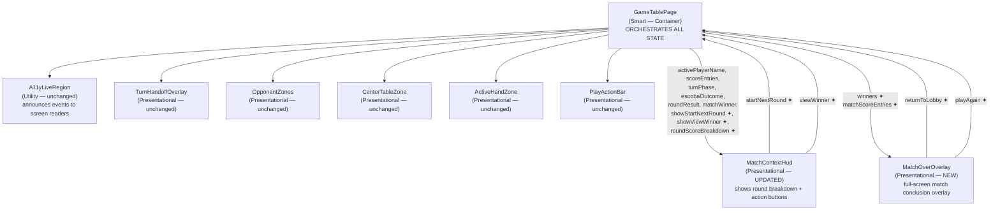
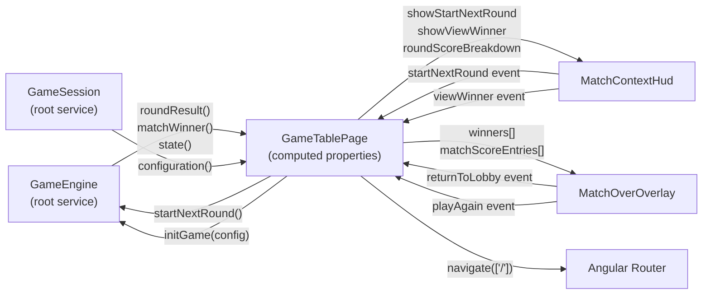
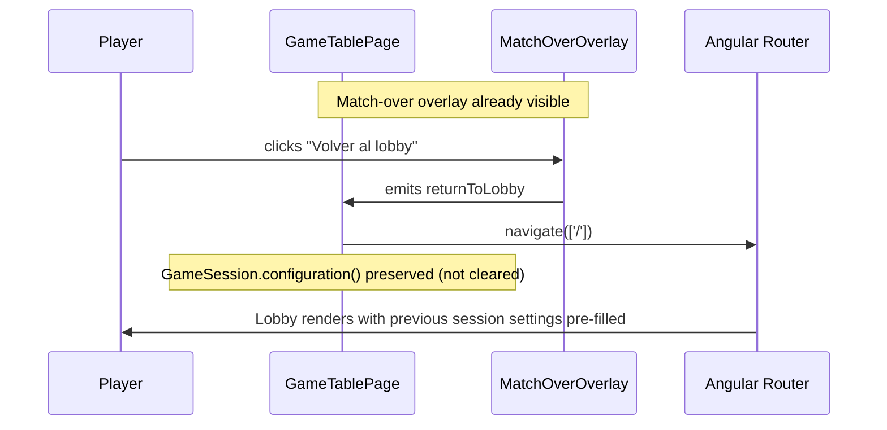
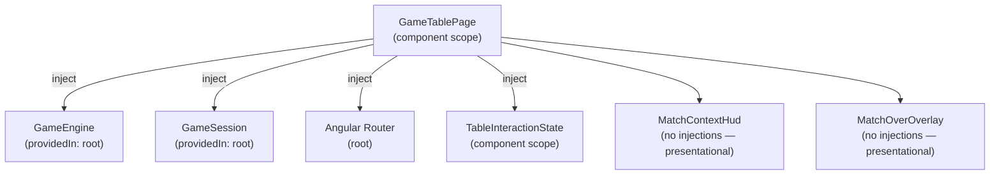
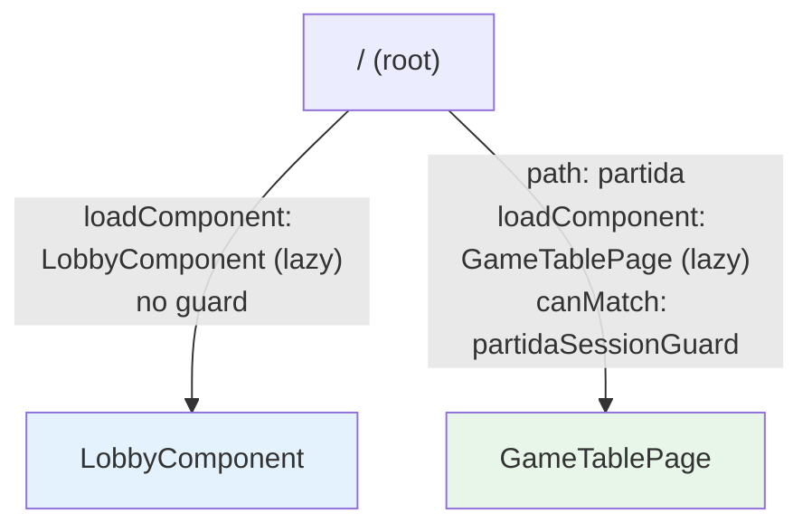

# Technical Design: Round Progression and Match Over

**Source Spec:** `docs/specs/ui/round-progression/`
**Based on:** proposal.md, spec.md, user-stories.md, bdd-test.md

---

## 1. Overview

This feature adds the missing UI continuation workflow to the game table screen, making multi-round matches fully playable from start to finish. The game engine already implements multi-round play and exposes all required signals and methods; this feature wires them to the user interface.

When a round ends, a "round-complete" state is entered: the per-player score breakdown is shown and the player must explicitly act to continue — either by starting the next round (if no winner has been declared) or by opening the match-over overlay (if a winner has been declared). The match-over overlay offers "Play Again" (fresh match, same session) and "Return to Lobby" (navigate to root). Both paths are fully keyboard-accessible and follow the existing `TurnHandoffOverlay` structural and accessibility patterns.

This feature also includes one breaking change to the game engine: the `matchWinner` signal is widened from `Player | null` to `Player[] | null` to support co-winner outcomes, which the spec requires to end the match immediately rather than playing a tiebreaker round.

The feature does not alter game rules, scoring logic, routing configuration, session management, or the guard.

---

## 2. Architecture Diagrams

### 2.1 Component Tree



> ✦ = new in this feature

---

### 2.2 Data Flow



---

### 2.3 Sequence Diagram — Round Completion → Start Next Round

```mermaid
sequenceDiagram
    participant P as Player
    participant GTP as GameTablePage
    participant MCH as MatchContextHud
    participant GE as GameEngine
    participant ALR as A11yLiveRegion

    GE->>GTP: roundResult() becomes non-null (matchWinner stays null)
    GTP->>GTP: showStartNextRoundButton computed → true
    GTP->>GTP: roundScoreBreakdown computed resolves player names
    GTP->>MCH: [showStartNextRound]=true, [roundScoreBreakdown]=breakdown
    MCH->>P: renders breakdown + "Empezar siguiente ronda" button
    GTP->>ALR: announce("Ronda N completada")
    P->>MCH: clicks "Empezar siguiente ronda"
    MCH->>GTP: emits startNextRound
    GTP->>GE: startNextRound()
    GE->>GTP: roundResult() resets to null
    GTP->>MCH: [showStartNextRound]=false, [roundScoreBreakdown]=[]
    MCH->>P: breakdown + button disappear; board shows new initial deal
```

---

### 2.4 Sequence Diagram — Final Round → View Winner → Play Again

```mermaid
sequenceDiagram
    participant P as Player
    participant GTP as GameTablePage
    participant MCH as MatchContextHud
    participant MOO as MatchOverOverlay
    participant GE as GameEngine
    participant ALR as A11yLiveRegion

    GE->>GTP: roundResult() non-null, matchWinner() becomes Player[]
    GTP->>GTP: showViewWinnerButton computed → true
    GTP->>MCH: [showViewWinner]=true, [roundScoreBreakdown]=breakdown
    MCH->>P: renders breakdown + "Ver ganador" button
    P->>MCH: clicks "Ver ganador"
    MCH->>GTP: emits viewWinner
    GTP->>GTP: showMatchOverOverlay signal → true
    GTP->>MOO: [winners]=[...], [matchScoreEntries]=[...]
    GTP->>ALR: announce("Partida terminada. Ganador: ...")
    MOO->>P: full-screen overlay renders; focus moves to first focusable element
    GTP->>GTP: background receives inert + aria-hidden="true"
    P->>MOO: clicks "Jugar de nuevo"
    MOO->>GTP: emits playAgain
    GTP->>GE: initGame(configuration) unconditionally
    GTP->>GTP: showMatchOverOverlay signal → false
    GE->>GTP: state() reinitialised, roundResult() null, matchWinner() null
    GTP->>P: overlay dismissed; board shows round 1 initial deal
    GTP->>GTP: focus → "submit play" button (afterNextRender)
```

---

### 2.5 Sequence Diagram — View Winner → Return to Lobby



---

### 2.6 Service Dependency Diagram



---

### 2.7 Routing Diagram



> No routing changes are introduced by this feature. The guard and route tree are untouched (TR-1.4).

---

## 3. Architectural Decisions

### AD-1: Widen `matchWinner` signal to `Player[]` to support co-winners

- **Context:** The engine's `_matchWinner` signal is currently typed as `Player | null`. The spec requires co-winner support: when two or more players end the match sharing the same highest score at or above 15, all tied players are declared co-winners and the match ends immediately.
- **Decision:** Change the signal type from `Player | null` to `Player[] | null` throughout the engine and all consumers. A sole winner is represented as a single-element array. A co-winner result is a multi-element array. Null remains the "no winner yet" sentinel.
- **Rationale:** A typed array avoids a separate co-winner flag, keeps the null-means-no-winner contract intact, and makes template rendering uniform (iterate over winners regardless of count).
- **Consequences:** This is a breaking change to the engine's public signal contract. All existing consumers of `matchWinner` — `MatchContextHud`, any unit tests referencing it, and `checkWinCondition` — must be updated in the same task. No hidden migration path exists; the type system enforces the update.
- **Requirement:** FR-3.3, FR-3.1, NFR-1.2 (co-winner correctness), US-2

---

### AD-2: `MatchContextHud` gains two outputs (`startNextRound`, `viewWinner`)

- **Context:** `MatchContextHud` is currently output-free. The spec requires the "Start Next Round" and "View Winner" buttons to live inside this component, adjacent to the existing round-outcome-indicator (TR-1.1).
- **Decision:** Add two `OutputEmitterRef` outputs to `MatchContextHud`. Add three new inputs: `showStartNextRound: boolean`, `showViewWinner: boolean`, and `roundScoreBreakdown: RoundScoreBreakdownEntry[]`. The button visibility is driven entirely by the boolean inputs; the component does not read engine signals directly.
- **Rationale:** Preserves the data-in / event-out contract. `GameTablePage` remains the single orchestration point (TR-1.3). Component remains testable in isolation.
- **Consequences:** Existing `MatchContextHud` tests must be extended. The existing `matchWinner` input changes type from `Player | null` to `Player[] | null` as a consequence of AD-1.
- **Requirement:** FR-2.1, FR-2.2, FR-2.5, FR-2.6, FR-2.7, TR-1.1, TR-4.2, US-1, US-6

---

### AD-3: New `MatchOverOverlay` standalone component follows `TurnHandoffOverlay` pattern

- **Context:** The spec requires a full-screen match-over modal (TR-1.2) that is structurally and behaviourally consistent with the existing `TurnHandoffOverlay`.
- **Decision:** Create `MatchOverOverlay` as a standalone component at `src/app/features/game-board/game-table-page/components/match-over-overlay/`. It accepts all data as inputs and emits two output events (`returnToLobby`, `playAgain`). It has no engine or router dependencies. It uses `role="dialog"`, `aria-modal="true"`, and `aria-labelledby` pointing to its heading. Escape key and outside-click do not dismiss it — the only dismissal paths are the two explicit action outputs.
- **Rationale:** Structural consistency with `TurnHandoffOverlay` ensures the accessibility and CSS overlay patterns are already proven in the project. Keeping the component pure (no service injections) makes it trivially testable.
- **Consequences:** `GameTablePage` must import `MatchOverOverlay` and handle both outputs.
- **Requirement:** FR-3.2–FR-3.6, FR-4, FR-5, FR-6.1–FR-6.3, TR-1.2, US-2, US-3, US-4

---

### AD-4: `showMatchOverOverlay` is a local writable signal in `GameTablePage`, not derived from `matchWinner`

- **Context:** The spec is explicit (FR-3.1, TR-3.1) that the match-over overlay must not appear automatically when `matchWinner` becomes non-null. It must be preceded by the player acknowledging the final round result via "View Winner".
- **Decision:** Introduce one new `WritableSignal<boolean>` called `showMatchOverOverlay` in `GameTablePage`. It is set to `true` only in the `onViewWinner()` handler. It is set to `false` in `onPlayAgain()` (before `initGame()` is called) and on navigation. The `matchWinner()` engine signal alone never triggers the overlay.
- **Rationale:** A separate signal is the simplest way to model a player action gate that is independent of engine state. This also prevents an accidental re-open if the component is re-evaluated while matchWinner is still non-null (e.g. after initGame resets it).
- **Consequences:** One additional signal per component instance. The background inert/aria-hidden condition must combine both `showTurnHandoffOverlay` and `showMatchOverOverlay`.
- **Requirement:** FR-3.1, NFR-1.2, TR-3.1, US-2

---

### AD-5: "Play Again" calls `initGame()` unconditionally, bypassing `bootstrapEngineStateFromSession()`

- **Context:** `bootstrapEngineStateFromSession()` (called in the constructor) guards `initGame()` with an early return when `gameEngine.state()` is already non-null, to prevent double-initialisation on construction. At the time "Play Again" is activated, state is non-null (the finished match is still in memory).
- **Decision:** The `onPlayAgain()` handler in `GameTablePage` calls `gameEngine.initGame(gameSession.configuration())` directly, not via `bootstrapEngineStateFromSession()`. This is an unconditional call regardless of current state.
- **Rationale:** The bootstrap guard's purpose is construction-time idempotency, not runtime intent. Using it for "Play Again" would be incorrect. A direct call is the simplest and most explicit solution.
- **Consequences:** The distinction between construction-time init and Play Again init is now documented and test-covered. No changes to the guard or `bootstrapEngineStateFromSession()`.
- **Requirement:** FR-5.3, TR-2.2, NFR-1.3 (Play Again correctness), US-4

---

### AD-6: Background `inert` / `aria-hidden` extended to also cover `showMatchOverOverlay`

- **Context:** The existing `GameTablePage` template already applies `[attr.inert]` and `[attr.aria-hidden]="'true'"` to the board layout and action bar when `showTurnHandoffOverlay()` is true. The spec requires the same treatment when the match-over overlay is visible (FR-3.6, TR-3.2).
- **Decision:** The condition for inert and aria-hidden on the background wrapper elements is changed from `showTurnHandoffOverlay()` alone to `showTurnHandoffOverlay() || showMatchOverOverlay()`. No new wrapper elements are introduced.
- **Rationale:** Minimal change to the existing proven pattern. A combined boolean condition on the existing binding is less error-prone than duplicating the wrapper elements or adding separate bindings.
- **Consequences:** While the match-over overlay is open, the board is also inert — this is correct and required. There is no logical conflict with the handoff overlay because the two overlays cannot be simultaneously visible (the handoff overlay only appears mid-round, before round completion).
- **Requirement:** FR-3.6, TR-3.2, US-2

---

### AD-7: `roundScoreBreakdown` view-model is assembled as a computed property in `GameTablePage`

- **Context:** `MatchContextHud` receives `roundResult` as an input but has no access to player names (which live in `gameEngine.state().players`). The spec requires displaying player names alongside their scores (FR-1.3, US-6).
- **Decision:** `GameTablePage` creates a computed property that joins `roundResult().playerScores` with `gameEngine.state().players` by `playerId` to produce a flat array of `{ playerName, escobas, mostCards, mostOros, mostSevens, sietelDiVelo, total }` view-model entries. This array is passed to `MatchContextHud` as the `roundScoreBreakdown` input.
- **Rationale:** Keeps `MatchContextHud` free of engine awareness. Name resolution is a pure join operation with no side effects — a computed property is the correct Signal primitive for it.
- **Consequences:** If `roundResult` is null, the computed returns an empty array. If `state()` is null (edge case before init), the computed also returns an empty array. No additional null guards needed in the template.
- **Requirement:** FR-1.3, TR-4.3, US-6

---

### AD-8: `matchScoreEntries` for `MatchOverOverlay` is a separate computed property in `GameTablePage`

- **Context:** The overlay must show the final accumulated match scores for all players (FR-3.4), not round scores. These are in `gameEngine.state().matchScores` as a `Record<string, number>` keyed by player ID, while display requires player names.
- **Decision:** `GameTablePage` assembles a `{ playerName, score }[]` array from `state().players` and `state().matchScores` as a dedicated computed property, passed to `MatchOverOverlay` as `matchScoreEntries`. The `winners` input to `MatchOverOverlay` is derived from `matchWinner()` — an array of player names (not full Player objects) to keep the component free of the Player model.
- **Rationale:** The overlay is a pure display component. Passing name strings instead of Player objects prevents the overlay from being coupled to the engine's domain model.
- **Consequences:** `GameTablePage` is responsible for all data shaping. `MatchOverOverlay` works with plain strings and numbers.
- **Requirement:** FR-3.3, FR-3.4, TR-1.2, US-2

---

## 4. Component Architecture

### 4.1 `GameTablePage`

- **Type:** Smart (container)
- **Responsibility:** Reads engine signals, builds all derived view-models, handles all user action events from child components, calls engine methods and router.
- **New inputs:** None.
- **New local signals:** `showMatchOverOverlay: WritableSignal<boolean>` (initialised to false).
- **New computed properties:**
  - `showStartNextRoundButton` — true when `roundResult()` is non-null and `matchWinner()` is null.
  - `showViewWinnerButton` — true when both `roundResult()` and `matchWinner()` are non-null.
  - `roundScoreBreakdown` — resolves player names from engine state and joins with `roundResult().playerScores`.
  - `matchScoreEntries` — maps `state().players` with `state().matchScores` into a flat name+score array.
  - `winnerNames` — maps `matchWinner()` to an array of player name strings, or empty array if null.
- **New event handlers:**
  - `onStartNextRound()` — calls `gameEngine.startNextRound()`.
  - `onViewWinner()` — sets `showMatchOverOverlay` to true; triggers live region announcement.
  - `onPlayAgain()` — sets `showMatchOverOverlay` to false; calls `gameEngine.initGame(configuration)` directly; schedules focus on "submit play" button.
  - `onReturnToLobby()` — calls `router.navigate(['/'])`.
- **Updated background inert condition:** `showTurnHandoffOverlay() || showMatchOverOverlay()`.
- **Children:** Gains `MatchOverOverlay` in template.
- **Requirement:** TR-1.3, TR-3.1, TR-3.2, AD-4, AD-5, AD-6

---

### 4.2 `MatchContextHud`

- **Type:** Presentational
- **Responsibility:** Renders the HUD header: active player, scoreboard, turn phase, escoba outcomes, round score breakdown panel, and the appropriate continuation action button.
- **Existing inputs (unchanged):** `activePlayerName`, `scoreEntries`, `turnPhase`, `escobaOutcome`, `roundResult`, `handoffActive`, `contextHeaderTestId`.
- **Changed inputs:** `matchWinner` changes type from `Player | null` to `Player[] | null` (AD-1 consequence).
- **New inputs:**
  - `showStartNextRound: boolean` — shows the "Empezar siguiente ronda" button.
  - `showViewWinner: boolean` — shows the "Ver ganador" button (mutually exclusive with `showStartNextRound`).
  - `roundScoreBreakdown: RoundScoreBreakdownEntry[]` — array of per-player score rows, empty when no breakdown is active.
- **New outputs:**
  - `startNextRound` — emitted when the "Empezar siguiente ronda" button is activated.
  - `viewWinner` — emitted when the "Ver ganador" button is activated.
- **Template changes:** A new "round score breakdown" panel is added adjacent to the existing round-outcome-indicator. It renders each entry in `roundScoreBreakdown` using `@for`, showing the player name and all six scoring categories (escobas, most cards, most Oros, most sevens, Siete de Oros, total), always including zero-value categories. Below the breakdown panel, the appropriate action button is shown conditionally using `@if`.
- **Requirement:** FR-1.2, FR-1.3, FR-2.1, FR-2.2, FR-2.5, FR-2.6, FR-2.7, US-1, US-6, AD-2

---

### 4.3 `MatchOverOverlay` _(new)_

- **Type:** Presentational
- **Responsibility:** Full-screen modal overlay displayed at match conclusion. Shows winners, final match scores, and two exit actions.
- **Inputs:**
  - `winnerNames: string[]` — one name for a sole winner, multiple names for co-winners, displayed with equal prominence.
  - `matchScoreEntries: { playerName: string; score: number }[]` — final accumulated match scores for all players.
- **Outputs:**
  - `returnToLobby` — emitted when "Volver al lobby" is activated.
  - `playAgain` — emitted when "Jugar de nuevo" is activated.
- **Template structure:**
  - Root element: `<section>` with `role="dialog"`, `aria-modal="true"`, `aria-labelledby` pointing to the heading element's id.
  - Heading: "Partida terminada" or equivalent Spanish text.
  - Winner display: `@for (name of winnerNames)` — each name in its own element with equal styling.
  - Match scores: `@for (entry of matchScoreEntries)` — player name and accumulated score.
  - Two action buttons: "Volver al lobby" and "Jugar de nuevo", each with explicit Spanish `aria-label` and `data-testid` attributes.
  - No Escape key listener; no outside-click listener (FR-3.5).
- **Focus management:** Handled in `GameTablePage` via `focusByTestIdAfterRender` on the first overlay button when `showMatchOverOverlay` becomes true. On dismissal (Play Again), focus is directed to the "submit play" button on the game table.
- **Requirement:** FR-3.2–FR-3.6, FR-4.1, FR-4.4, FR-5.1, FR-5.5, FR-6.1–FR-6.3, AD-3, AD-8

---

## 5. State Management

All state is Signal-based, following the existing project conventions.

**Engine signals (read-only in `GameTablePage`):**

- `roundResult()` — drives the round-complete state. Non-null means a round has ended and not yet been acknowledged.
- `matchWinner()` — a `Player[] | null`. Non-null means the match has concluded. Combined with `roundResult`, it determines which continuation button to show.
- `state()` — provides player names (for name resolution) and `matchScores` (for the overlay's accumulated score display).

**Local signals in `GameTablePage`:**

- `showMatchOverOverlay` — the player-action gate for the overlay. Set only via `onViewWinner()`. Reset via `onPlayAgain()`. Never derived from engine signals.

**Derived computed properties (all in `GameTablePage`):**

- `showStartNextRoundButton` — pure derivation: roundResult non-null AND matchWinner null.
- `showViewWinnerButton` — pure derivation: roundResult non-null AND matchWinner non-null.
- `roundScoreBreakdown` — name-resolved view model from engine data.
- `matchScoreEntries` — name-resolved view model for overlay.
- `winnerNames` — string array from matchWinner Player array.

**State transitions:**

| Event                               | Engine call        | Local signal change            |
| ----------------------------------- | ------------------ | ------------------------------ |
| Round ends (no winner)              | —                  | — (engine drives roundResult)  |
| "Empezar siguiente ronda" activated | `startNextRound()` | —                              |
| Round ends with winner              | —                  | — (engine drives matchWinner)  |
| "Ver ganador" activated             | —                  | `showMatchOverOverlay → true`  |
| "Jugar de nuevo" activated          | `initGame(config)` | `showMatchOverOverlay → false` |
| "Volver al lobby" activated         | — (navigate)       | —                              |

---

## 6. Service Layer

### 6.1 `GameEngine` _(modified)_

- **Scope:** `providedIn: 'root'`
- **Changes in this feature:**
  - The `_matchWinner` private signal type changes from `WritableSignal<Player | null>` to `WritableSignal<Player[] | null>`.
  - The public `matchWinner` read-only signal type changes correspondingly.
  - The `checkWinCondition` utility (and its call site in `confirmTurn`) must return `Player[] | null` and collect all tied winners, not just the first.
  - `startNextRound()` remains unchanged in behaviour (it already validates `matchWinner` is null before proceeding).
  - `initGame()` remains unchanged.
- **Requirement:** AD-1, FR-3.1, FR-3.3, NFR-1.2

### 6.2 `GameSession` _(unchanged)_

- **Scope:** `providedIn: 'root'`
- **Responsibility:** Holds the `GameConfiguration` signal that persists across navigation. The "Play Again" handler reads `configuration()` from this service. The "Return to Lobby" handler does not modify it.
- **Requirement:** FR-4.3, FR-5.2, TR-2.2

### 6.3 `TableInteractionState` _(unchanged)_

- **Scope:** Component scope (provided in `GameTablePage`)
- **Role:** Manages card selection state. Not affected by this feature.

---

## 7. Routing

No changes to the routing configuration. The two routes (root → `LobbyComponent`, `/partida` → `GameTablePage`) remain as-is. The `partidaSessionGuard` is untouched. The "Return to Lobby" action uses `router.navigate(['/'])` from within `GameTablePage`.

The "Play Again" action does not navigate: it reinitialises the engine while the browser remains on `/partida`. This is safe because `GameSession.configuration()` is still non-null, satisfying the guard if the route were to be re-evaluated.

---

## 8. Data Model

### `RoundScoreBreakdownEntry` (new view-model, lives in `GameTablePage` or a shared types file)

A flat object used to pass per-player round score data from `GameTablePage` to `MatchContextHud`. Contains:

- **playerName** — resolved display name string.
- **escobas** — integer count of escobas scored.
- **mostCards** — integer points (0, 1, or 2) for the most-cards category.
- **mostOros** — integer points (0, 1, or 2) for the most-Oros category.
- **mostSevens** — integer points (0, 1, or 2) for the most-sevens category.
- **sieteDiVelo** — integer points (0 or 1) for the Siete de Oros category.
- **total** — sum of all category points for this player in this round.

### `MatchScoreEntry` (new view-model, inline in `MatchOverOverlay`)

- **playerName** — resolved display name string.
- **score** — integer accumulated match score across all completed rounds.

### `Player[]` widening in `matchWinner`

The existing `Player` interface (id, name, hand, capturedPile, escobaCount) is unchanged. The change is only to the signal's container type: `Player | null` becomes `Player[] | null`.

---

## 9. API Integration

This feature does not integrate with any backend API. All state is in-memory within the Angular application. The game engine is a pure in-process service.

---

## 10. Error Handling

| Scenario                                                             | Handling strategy                                                                                                                                                                                                    |
| -------------------------------------------------------------------- | -------------------------------------------------------------------------------------------------------------------------------------------------------------------------------------------------------------------- |
| `gameSession.configuration()` is null when "Play Again" is activated | Defensive null check before calling `initGame()`; if somehow null, navigate to lobby instead. This should be unreachable in practice because the guard protects the route.                                           |
| `startNextRound()` called while `matchWinner` is non-null            | Engine's own validation rejects the call and logs a warning. UI prevents this case via the `showStartNextRoundButton` guard (NFR-1.1).                                                                               |
| `matchWinner()` becomes non-null while overlay is already showing    | Cannot occur: `showMatchOverOverlay` is set by player action, not engine signal. Once visible, the overlay is only dismissed by "Play Again" (which resets matchWinner) or "Return to Lobby" (which navigates away). |

---

## 11. Accessibility

**Round-complete state:**

- The "Empezar siguiente ronda" and "Ver ganador" buttons carry Spanish `aria-label` attributes and are standard focusable `<button>` elements reachable via Tab navigation (FR-2.5, FR-2.6, FR-2.7).
- When the round-complete state is entered, the `A11yLiveRegion` announces the round number via `aria-live="polite"` (FR-6.4, SC-42).

**Match-over overlay:**

- The `<section>` element uses `role="dialog"` and `aria-modal="true"` so assistive technology identifies it as a modal and restricts virtual cursor navigation to the overlay contents (FR-6.2, SC-25).
- The `aria-labelledby` attribute points to the overlay's heading element so screen readers announce the overlay name when focus enters (FR-6.2).
- When the overlay appears, `focusByTestIdAfterRender` moves focus to the first button inside the overlay. Background content is marked `aria-hidden="true"` so focus cannot escape to it (FR-6.1, SC-26).
- When the overlay is dismissed via "Play Again", focus is directed to the "submit play" button on the game table (FR-6.3, SC-41).
- When dismissed via "Return to Lobby", Angular's router focus management handles focus restoration on the Lobby route (FR-6.3, SC-33).
- The overlay does not respond to Escape key or outside-click, consistent with FR-3.5 (SC-21, SC-22).
- When the overlay appears, the live region announces the winner name(s) (FR-6.4, SC-27).

---

## 12. Performance Considerations

- All new computed properties are pure Signal derivations with no subscriptions, observables, or async operations. Angular's computed caching ensures they only re-evaluate when their dependencies change.
- `MatchOverOverlay` is only rendered when `showMatchOverOverlay()` is true, thanks to the `@if` control flow block in the parent template. When the overlay is not visible, no overlay DOM is present.
- No change detection strategy overrides are needed; the existing `Default` strategy on all components is appropriate given full Signals usage.
- The `roundScoreBreakdown` computed performs a linear join over players (typically 2–4) — negligible cost.

---

## 13. Testing Strategy

### Unit tests

| File                                              | What to test                                                                                                                                                                                                                                                                                                                  |
| ------------------------------------------------- | ----------------------------------------------------------------------------------------------------------------------------------------------------------------------------------------------------------------------------------------------------------------------------------------------------------------------------- |
| `game-engine.spec.ts` (updated)                   | `matchWinner` signal yields an array for sole winner; yields multi-element array for co-winners; `startNextRound()` rejects when matchWinner is non-null.                                                                                                                                                                     |
| `match-context-hud.spec.ts` (updated)             | New inputs drive breakdown panel visibility; "Empezar siguiente ronda" shown/hidden by `showStartNextRound`; "Ver ganador" shown/hidden by `showViewWinner`; mutual exclusivity (NFR-1.1); `startNextRound` output emitted on button click; `viewWinner` output emitted on button click; zero-value categories shown (SC-04). |
| `match-over-overlay.spec.ts` (new)                | Sole winner displays one name; co-winners display all names equally; accumulated scores rendered; "Jugar de nuevo" emits `playAgain`; "Volver al lobby" emits `returnToLobby`; Escape does not emit; overlay has `role="dialog"` and `aria-modal`.                                                                            |
| `game-table-page.round-progression.spec.ts` (new) | `showStartNextRoundButton` computed truth table; `showViewWinnerButton` computed truth table; `onStartNextRound()` calls `gameEngine.startNextRound()`; `roundScoreBreakdown` resolves player names correctly; live region announces round completion.                                                                        |
| `game-table-page.match-over.spec.ts` (new)        | `showMatchOverOverlay` is false by default; `onViewWinner()` sets it true; `onPlayAgain()` sets it false and calls `initGame()` unconditionally; `onReturnToLobby()` calls `router.navigate(['/'])`; background inert condition covers both overlay types.                                                                    |

### E2E tests (Cypress + Cucumber)

| Feature file                       | Scenarios covered                                                                                                                                                                         |
| ---------------------------------- | ----------------------------------------------------------------------------------------------------------------------------------------------------------------------------------------- |
| `round-progression.feature` (new)  | SC-01 through SC-14, SC-42: round-complete state recognition, breakdown rendering, Start Next Round button lifecycle, board visibility, keyboard accessibility.                           |
| `match-over-overlay.feature` (new) | SC-15 through SC-41: View Winner gate, overlay appearance, co-winner display, accumulated scores, Return to Lobby, Play Again, overlay non-dismissibility, focus management, live region. |

Step definitions are added in corresponding `.ts` files following the existing selector-object pattern. Engine fixture helpers (via `applyE2eFixture`) are used to set up end-of-round and end-of-match states deterministically without playing full matches in every scenario.

---

## 14. Risk Assessment

| Risk                                                    | Likelihood | Impact | Mitigation                                                                                                                                                       |
| ------------------------------------------------------- | ---------- | ------ | ---------------------------------------------------------------------------------------------------------------------------------------------------------------- |
| `matchWinner` type change breaks unconsidered consumers | Medium     | High   | Strict TypeScript compilation will surface all consumers at build time. Treat as a compile-time checklist: the build must pass before any other task.            |
| "Play Again" init guard bypass introduces double-init   | Low        | Medium | Unit test verifies `initGame()` is called exactly once per Play Again activation; test also verifies it is called even when `state()` is already non-null.       |
| Co-winner path untested in engine                       | Medium     | High   | T-1 explicitly includes updating `checkWinCondition` unit tests to cover tied scores at threshold and above.                                                     |
| Focus management regression (overlay vs handoff)        | Low        | Medium | The two overlays cannot be simultaneously visible (handoff is mid-round only; match-over is post-round only). T-9 includes a combined inert condition unit test. |
| Cypress E2E setup cost for end-of-match state           | Medium     | Medium | The existing `applyE2eFixture` mechanism allows injecting a near-final game state. T-11 uses fixtures to avoid full match simulation in each scenario.           |
| Score breakdown name resolution fails if state is null  | Low        | Low    | `roundScoreBreakdown` computed returns empty array if `state()` is null. Template uses `@for` which renders nothing for an empty array.                          |
