# Review Report: Round Progression and Match Over

**Review Mode:** Incremental (T-11: Cypress E2E - match-over overlay scenarios)
**Source:** docs/specs/ui/round-progression/
**Reviewed against:** proposal.md, spec.md, user-stories.md, bdd-test.md, design.md, tasks.md

## 1. Executive Summary

This incremental review assessed Task T-11 implementation with emphasis on Cypress coverage for SC-15 through SC-41 and supporting runtime wiring in the game-table flow. The architecture is aligned with AD-3 through AD-6, and scenario coverage is broad. Remaining gaps are in assertion strength for a small set of scenarios rather than in structural implementation.

- Total findings: 4 (0 Critical, 0 Major, 3 Minor, 1 Note)
- Spec compliance: 24 of 27 directly in-scope requirements fully met
- Architecture alignment: aligned
- Test quality: partially meaningful

## 2. Architecture Comparison

### 2.1 Planned Component Tree

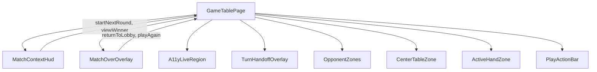

### 2.2 Actual Component Tree


### 2.3 Drift Analysis

No material architecture drift was identified in T-11 scope.

- Overlay visibility is gated by a local page signal and only opened from explicit View Winner activation.
- MatchOverOverlay remains a presentational, output-only component with no engine/router coupling.
- Play Again path calls engine initialization from page orchestration.
- Background inert and aria-hidden masking includes match-over overlay visibility.

### 2.4 Planned vs Actual Service Dependencies (if drift detected)

No meaningful service dependency drift was detected.

## 3. Findings

### RV-01: SC-30 AI-difficulty prefill assertion validates session seam state rather than lobby control state [Minor]

- **Category:** Test Quality
- **Severity:** Minor
- **Related:** T-11, SC-30, FR-4.3, US-3
- **Description:** The AI-difficulty check is satisfied through session-summary seam data after navigation.
- **Expected:** SC-30 should prove the user-visible lobby form reflects preserved settings.
- **Actual:** Session persistence is proven, but direct lobby control behavior is not.
- **Recommendation:** Add an observable lobby-control assertion for difficulty prefill.
- **Impact:** UI prefill regressions can remain undetected while session state remains correct.

### RV-02: SC-27 live-region assertion is under-specified for co-winner announcements [Minor]

- **Category:** Test Quality
- **Severity:** Minor
- **Related:** T-11, SC-27, FR-6.4, NFR-2.2, US-2
- **Description:** Current assertion accepts announcement text containing at least one expected winner name.
- **Expected:** Co-winner flows should verify all expected winner names are announced.
- **Actual:** A partial winner announcement could still pass.
- **Recommendation:** Add explicit co-winner completeness assertions in the live-region check.
- **Impact:** Accessibility regressions in co-winner messaging may not be caught.

### RV-03: SC-31 repeated-activation verification uses a proxy that may not fully prove single navigation attempt [Minor]

- **Category:** Test Quality
- **Severity:** Minor
- **Related:** T-11, SC-31, FR-4.2, US-3
- **Description:** Single-navigation confidence is inferred from history push-state count.
- **Expected:** Scenario should directly prove single effective navigation flow under rapid activation.
- **Actual:** Proxy behavior can hide duplicate attempts when routing deduplicates history writes.
- **Recommendation:** Strengthen with direct navigation-effect assertions.
- **Impact:** Edge-timing duplicate-navigation regressions may remain undetected.

### RV-04: Keyboard-navigation scenario steps depend on shared step definitions outside T-11 file [Note]

- **Category:** Test Coverage
- **Severity:** Note
- **Related:** T-11, SC-24, SC-32, SC-40
- **Description:** Keyboard step phrases are implemented in shared round-progression step definitions.
- **Expected:** Shared ownership should be explicit and maintained.
- **Actual:** Behavior works with current global step-definition configuration.
- **Recommendation:** Keep shared-step ownership documented to reduce maintenance surprise.
- **Impact:** Low, primarily maintainability clarity.

## 4. Traceability Matrix

| Finding | Severity | Category      | Related Spec                       | Status |
| ------- | -------- | ------------- | ---------------------------------- | ------ |
| RV-01   | Minor    | Test Quality  | T-11, SC-30, FR-4.3, US-3          | Open   |
| RV-02   | Minor    | Test Quality  | T-11, SC-27, FR-6.4, NFR-2.2, US-2 | Open   |
| RV-03   | Minor    | Test Quality  | T-11, SC-31, FR-4.2, US-3          | Open   |
| RV-04   | Note     | Test Coverage | T-11, SC-24, SC-32, SC-40          | Open   |

## 5. Spec Compliance Summary

| Requirement | Status     | Notes                                                                                        |
| ----------- | ---------- | -------------------------------------------------------------------------------------------- |
| FR-2.7      | ✅ Met     | View Winner transition and keyboard path are covered in scope.                               |
| FR-3.1      | ✅ Met     | Non-auto-open and explicit acknowledgement path are covered.                                 |
| FR-3.2      | ✅ Met     | Full-screen overlay behavior is covered.                                                     |
| FR-3.3      | ✅ Met     | Sole and co-winner display scenarios are covered.                                            |
| FR-3.4      | ✅ Met     | Final-score visibility checks are present.                                                   |
| FR-3.5      | ✅ Met     | Escape and outside-click non-dismissal are covered.                                          |
| FR-3.6      | ✅ Met     | Inert and aria-hidden background masking is covered.                                         |
| FR-4.1      | ✅ Met     | Return-to-lobby control presence is covered.                                                 |
| FR-4.2      | ⚠️ Partial | Navigation path is covered; repeated-activation proof strength is partial (RV-03).           |
| FR-4.3      | ⚠️ Partial | Session persistence is covered; lobby-control prefill assertion strength is partial (RV-01). |
| FR-4.4      | ✅ Met     | Keyboard path is covered.                                                                    |
| FR-5.1      | ✅ Met     | Play-again control presence is covered.                                                      |
| FR-5.2      | ✅ Met     | Same-session rematch path is covered in scope.                                               |
| FR-5.3      | ✅ Met     | Fresh-match initialization path is asserted.                                                 |
| FR-5.4      | ✅ Met     | Overlay dismissal and route continuity are asserted.                                         |
| FR-5.5      | ✅ Met     | Keyboard path is covered.                                                                    |
| FR-6.1      | ✅ Met     | Focus transfer into overlay is covered.                                                      |
| FR-6.2      | ✅ Met     | Dialog semantics and accessible naming are covered.                                          |
| FR-6.3      | ✅ Met     | Focus restoration scenarios are covered.                                                     |
| FR-6.4      | ⚠️ Partial | Announcement exists; co-winner completeness assertion is partial (RV-02).                    |
| FR-6.5      | ✅ Met     | New control labels are present in scope.                                                     |
| US-2        | ⚠️ Partial | Broadly covered; co-winner announcement assertion strength gap remains (RV-02).              |
| US-3        | ⚠️ Partial | Broadly covered; SC-30 and SC-31 assertion-strength gaps remain (RV-01, RV-03).              |
| US-4        | ✅ Met     | Rematch flow coverage is broad in T-11 scope.                                                |
| NFR-1.2     | ✅ Met     | Explicit acknowledgement and winner gating are covered.                                      |
| NFR-1.3     | ✅ Met     | Fresh rematch-state checks are present.                                                      |
| NFR-2.1     | ✅ Met     | Keyboard operability scenarios are implemented.                                              |
| NFR-2.2     | ⚠️ Partial | Winner announcement completeness for co-winner path is partial (RV-02).                      |

## 6. Task Completion Summary

| Task | Title                                                       | Status     | Findings                   |
| ---- | ----------------------------------------------------------- | ---------- | -------------------------- |
| T-11 | Cypress E2E - match-over overlay scenarios (SC-15 to SC-41) | ⚠️ Partial | RV-01, RV-02, RV-03, RV-04 |

## 7. Test Coverage Summary

| Scenario | Step Definitions | Meaningful | Findings |
| -------- | ---------------- | ---------- | -------- |
| SC-15    | ✅ Yes           | ✅ Yes     | —        |
| SC-16    | ✅ Yes           | ✅ Yes     | —        |
| SC-17    | ✅ Yes           | ✅ Yes     | —        |
| SC-18    | ✅ Yes           | ✅ Yes     | —        |
| SC-19    | ✅ Yes           | ✅ Yes     | —        |
| SC-20    | ✅ Yes           | ✅ Yes     | —        |
| SC-21    | ✅ Yes           | ✅ Yes     | —        |
| SC-22    | ✅ Yes           | ✅ Yes     | —        |
| SC-23    | ✅ Yes           | ✅ Yes     | —        |
| SC-24    | ✅ Yes           | ✅ Yes     | RV-04    |
| SC-25    | ✅ Yes           | ✅ Yes     | —        |
| SC-26    | ✅ Yes           | ✅ Yes     | —        |
| SC-27    | ✅ Yes           | ⚠️ Partial | RV-02    |
| SC-28    | ✅ Yes           | ✅ Yes     | —        |
| SC-29    | ✅ Yes           | ✅ Yes     | —        |
| SC-30    | ✅ Yes           | ⚠️ Partial | RV-01    |
| SC-31    | ✅ Yes           | ⚠️ Partial | RV-03    |
| SC-32    | ✅ Yes           | ✅ Yes     | RV-04    |
| SC-33    | ✅ Yes           | ✅ Yes     | —        |
| SC-34    | ✅ Yes           | ✅ Yes     | —        |
| SC-35    | ✅ Yes           | ✅ Yes     | —        |
| SC-36    | ✅ Yes           | ✅ Yes     | —        |
| SC-37    | ✅ Yes           | ✅ Yes     | —        |
| SC-38    | ✅ Yes           | ✅ Yes     | —        |
| SC-39    | ✅ Yes           | ✅ Yes     | —        |
| SC-40    | ✅ Yes           | ✅ Yes     | RV-04    |
| SC-41    | ✅ Yes           | ✅ Yes     | —        |

## 8. Test Quality Summary

| Test File                                                                                            | Type               | Meaningful Assertions | Issues              |
| ---------------------------------------------------------------------------------------------------- | ------------------ | --------------------- | ------------------- |
| cypress/e2e/match-over-overlay.feature                                                               | E2E                | ✅ Yes                | None                |
| cypress/e2e/match-over-overlay.ts                                                                    | E2E                | ⚠️ Partial            | RV-01, RV-02, RV-03 |
| cypress/e2e/round-progression.ts                                                                     | E2E (shared steps) | ✅ Yes                | RV-04               |
| src/app/features/game-board/game-table-page/game-table-page.match-over.spec.ts                       | Unit/Integration   | ✅ Yes                | None                |
| src/app/features/game-board/game-table-page/components/match-over-overlay/match-over-overlay.spec.ts | Unit               | ✅ Yes                | None                |

## 9. Security Cross-Reference

This section cross-references Critical and High security findings from the companion security-report.md. See docs/specs/ui/round-progression/security-report.md for the full security analysis.

No Critical or High SEC findings were reported in the current security report for this scope.

## 10. Recommendations

### Critical (blocks release)

1. None.

### Major (fix before merge)

1. None.

### Minor (improvement)

1. Strengthen SC-30 with an observable lobby-control assertion for AI-difficulty prefill.
2. Strengthen SC-27 with explicit co-winner completeness assertions.
3. Strengthen SC-31 with direct single-navigation outcome verification.

### Notes (informational)

1. Keep shared keyboard-step ownership explicit in step-definition documentation.

---

Legacy content below this divider is from prior review cycles and should be ignored for current T-11 status.

# Legacy Historical Content

**Review Mode:** Incremental (T-11: Cypress E2E - match-over overlay scenarios, RED phase, tests-only)
**Source:** docs/specs/ui/round-progression/
**Reviewed against:** proposal.md, spec.md, user-stories.md, bdd-test.md, design.md, tasks.md

## 1. Executive Summary

This review is scoped to RED-phase test artifacts for Task T-11, focused on Cypress coverage for SC-15 through SC-41 and the shared step definitions used by those scenarios. All scenarios in that range are defined and executable, but three failures are caused by test-contract mismatches rather than product behavior, and two failures are meaningful product-level RED signals. Overall, tests are close to GREEN-readiness but require RED fixes first to remove false-negative blockers.

- Total findings: 5 (0 Critical, 3 Major, 1 Minor, 1 Note)
- Spec compliance: 12 of 46 requirements fully met in this incremental scope
- Architecture alignment: minor drift (fixture and seam contract mismatch)
- Test quality: partially meaningful

## 2. Architecture Comparison

### 2.1 Planned Component Tree

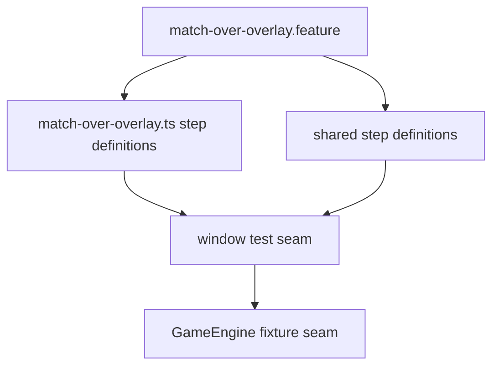

### 2.2 Actual Component Tree

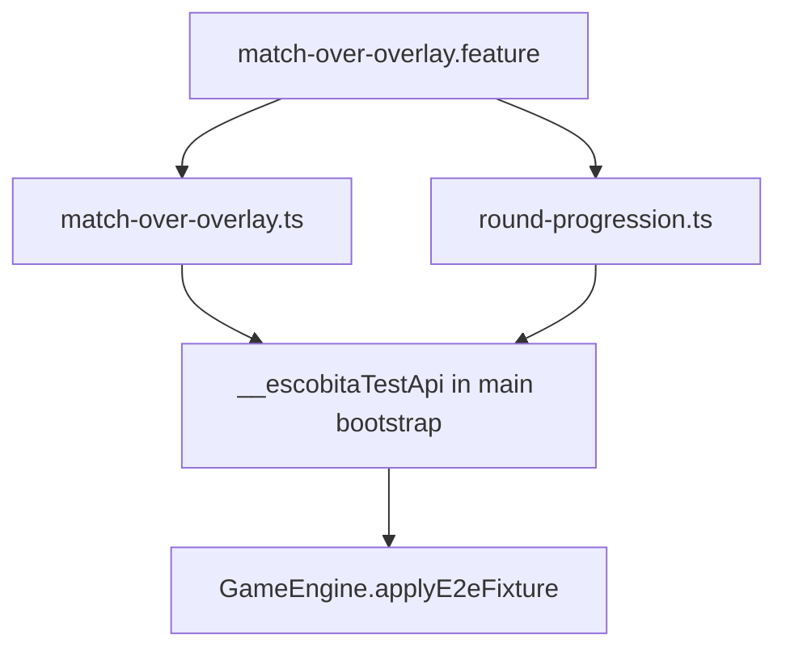

### 2.3 Drift Analysis

The scenario graph is structurally aligned with design intent: match-over scenarios are defined in one feature file, primarily implemented in one step-definition file, and reuse shared generic button-activation steps. Drift appears in contract details:

- The SC-19 co-winner scenario expects fixture name round-co-winner-visibility, but the runtime engine fixture contract does not include that identifier.
- The SC-36 session-configuration check expects readSessionConfigurationSummary in the test API, but main bootstrap exposes only applyEngineFixture and readEngineStateSummary.
- SC-20 score expectations require accumulated non-zero totals, but the round-winner fixture updates roundResult and matchWinner without setting non-zero accumulated match scores.

### 2.4 Planned vs Actual Service Dependencies (drift)

````mermaid
graph LR
    subgraph Planned
        PSTEP[T-11 Steps]
        PAPI[Test API]
        PAPI --> PFX[Fixture names include co-winner]
        PAPI --> PSEAM[Session summary seam available]
    end

    subgraph Actual
        AAPI --> ASEAM[Session summary seam missing]
    end

    PSTEP -.expected contract.-> PAPI
    ASTEP -.current contract.-> AAPI

## 3. Findings

### RV-01: SC-19 cannot execute co-winner path due fixture contract mismatch [Major]
- **Severity:** Major
- **Related:** T-11, SC-19, FR-3.1, FR-3.3, NFR-1.2, AD-1
- **Actual:** Step definition declares and invokes round-co-winner-visibility, while engine fixture type omits it and rejects unknown names.
- **Recommendation:** Unify fixture names from one shared contract source and add explicit co-winner fixture support (or rename test to supported identifier).

### RV-02: SC-36 depends on unavailable session-summary seam [Major]
- **Related:** T-11, SC-36, FR-5.2, FR-5.3, US-4, TR-2.2
- **Description:** The test step for same AI difficulty calls readSessionConfigurationSummary, which is not exposed by the runtime test API.
- **Actual:** Step throws readSessionConfigurationSummary test seam is unavailable.
- **Recommendation:** Provide a minimal guarded session-summary seam, or rewrite SC-36 to verify only observable outcomes already available through UI/state summary.
### RV-03: SC-20 score assertion is blocked by fixture-state mismatch [Major]
- **Category:** Test Quality
- **Severity:** Major
- **Related:** T-11, SC-20, FR-3.4, US-2
- **Expected:** Scenario data should deterministically represent accumulated multi-round scores, and assertions should validate expected totals.
- **Impact:** Produces false-negative RED failures and weakens confidence in SC-20 signal quality.

### RV-04: SC-23 interaction-proof is partial (attribute checks only) [Minor]
- **Category:** Test Quality
- **Related:** T-11, SC-23, FR-3.6, US-2
- **Description:** Steps for attempted interaction on background focus on inert and aria-hidden attributes, but do not assert that attempted interactions leave state unchanged.
- **Recommendation:** Add outcome checks after attempted interactions (for example no route/state/focus transition).
- **Impact:** Coverage is useful but not as behavior-strong as scenario wording implies.

### RV-05: SC-30 and SC-33 failures are meaningful RED product signals, not test defects [Note]
- **Category:** Spec Compliance
- **Severity:** Note
- **Related:** T-11, SC-30, SC-33, FR-4.3, FR-6.3, US-3
- **Description:** Current failures on lobby prefill mode and lobby primary-focus target are consistent with current application behavior and should remain RED until implementation is completed.
- **Expected:** Tests should fail for missing behavior in RED.
- **Actual:** Lobby state initializes with default mode and difficulty, and return-to-lobby path has no explicit focus handoff.
- **Recommendation:** Keep these assertions strict; address behavior in GREEN implementation rather than weakening tests.
- **Impact:** These failures provide valid implementation feedback.

## 4. Traceability Matrix

| Finding | Severity | Category | Related Spec | Status |
|---------|----------|----------|--------------|--------|
| RV-01 | Major | Test Coverage | T-11, SC-19, FR-3.1, FR-3.3, NFR-1.2 | Open |
| RV-02 | Major | Test Coverage | T-11, SC-36, FR-5.2, FR-5.3, TR-2.2 | Open |
| RV-03 | Major | Test Quality | T-11, SC-20, FR-3.4, US-2 | Open |
| RV-04 | Minor | Test Quality | T-11, SC-23, FR-3.6 | Open |
| RV-05 | Note | Spec Compliance | T-11, SC-30, SC-33, FR-4.3, FR-6.3 | Open |

## 5. Spec Compliance Summary

| Requirement | Status | Notes |
|-------------|--------|-------|
| FR-1.1 | ⚠️ Partial | Outside T-11 scope. |
| FR-1.2 | ⚠️ Partial | Outside T-11 scope. |
| FR-1.3 | ⚠️ Partial | Outside T-11 scope. |
| FR-1.4 | ⚠️ Partial | Outside T-11 scope. |
| FR-1.5 | ⚠️ Partial | Outside T-11 scope. |
| FR-2.1 | ⚠️ Partial | Outside T-11 scope. |
| FR-2.2 | ⚠️ Partial | Outside T-11 scope. |
| FR-2.3 | ⚠️ Partial | Outside T-11 scope. |
| FR-2.4 | ⚠️ Partial | Outside T-11 scope. |
| FR-2.5 | ⚠️ Partial | Outside T-11 scope. |
| FR-2.6 | ⚠️ Partial | Outside T-11 scope. |
| FR-3.2 | ✅ Met | SC-15 and SC-17 pass. |
| FR-3.3 | ⚠️ Partial | SC-18 passes; SC-19 blocked by fixture contract (RV-01). |
| FR-3.4 | ⚠️ Partial | SC-20 fails due fixture/assertion mismatch (RV-03). |
| FR-3.5 | ✅ Met | SC-21 and SC-22 pass. |
| FR-3.6 | ⚠️ Partial | SC-23 passes but interaction-proof is partial (RV-04). |
| FR-4.1 | ✅ Met | SC-28 passes. |
| FR-4.2 | ✅ Met | SC-29 and SC-31 pass. |
| FR-4.3 | ❌ Not Met | SC-30 fails (valid product RED signal, RV-05). |
| FR-4.4 | ✅ Met | SC-32 passes. |
| FR-5.1 | ✅ Met | SC-34 passes. |
| FR-5.2 | ❌ Not Met | SC-36 blocked by missing seam (RV-02). |
| FR-5.3 | ✅ Met | SC-35, SC-37, SC-39 pass. |
| FR-5.4 | ✅ Met | SC-35 and SC-38 pass. |
| FR-5.5 | ✅ Met | SC-40 passes. |
| FR-6.1 | ✅ Met | SC-26 passes. |
| FR-6.2 | ✅ Met | SC-25 passes. |
| FR-6.3 | ⚠️ Partial | SC-41 passes; SC-33 fails (RV-05). |
| FR-6.4 | ✅ Met | SC-27 passes. |
| FR-6.5 | ⚠️ Partial | Covered for tested controls in this scope; full feature coverage spans other tasks. |
| US-1 | ⚠️ Partial | Outside T-11 scope. |
| US-2 | ⚠️ Partial | SC-19 and SC-20 remain unresolved (RV-01, RV-03). |
| US-3 | ⚠️ Partial | SC-30 and SC-33 remain RED (RV-05). |
| US-4 | ⚠️ Partial | SC-36 blocked by seam mismatch (RV-02). |
| US-5 | ⚠️ Partial | Outside T-11 scope. |
| US-6 | ⚠️ Partial | Outside T-11 scope. |
| NFR-1.1 | ⚠️ Partial | Outside T-11 scope. |
| NFR-1.2 | ⚠️ Partial | SC-19 blocked (RV-01). |
| NFR-1.3 | ✅ Met | SC-37 and SC-39 pass in current run. |
| NFR-1.4 | ⚠️ Partial | Outside T-11 scope. |
| NFR-2.1 | ✅ Met | SC-24, SC-32, and SC-40 pass. |
| NFR-2.2 | ✅ Met | SC-27 passes. |
| NFR-3.1 | ⚠️ Partial | Outside T-11 scope. |
| NFR-3.2 | ⚠️ Partial | Outside T-11 scope. |

## 6. Task Completion Summary

| Task | Title | Status | Findings |
|------|-------|--------|----------|
| T-11 | Cypress E2E - match-over overlay scenarios (SC-15-SC-41) | ⚠️ Partial | RV-01, RV-02, RV-03, RV-04, RV-05 |

## 7. Test Coverage Summary (SC-15 through SC-41)

| Scenario | Step Definitions | Meaningful | Findings |
|----------|------------------|------------|----------|
| SC-15 | ✅ Yes | ✅ Yes | — |
| SC-16 | ✅ Yes | ✅ Yes | — |
| SC-17 | ✅ Yes | ✅ Yes | — |
| SC-18 | ✅ Yes | ✅ Yes | — |
| SC-19 | ✅ Yes | ❌ No | RV-01 |
| SC-20 | ✅ Yes | ⚠️ Partial | RV-03 |
| SC-21 | ✅ Yes | ✅ Yes | — |
| SC-22 | ✅ Yes | ✅ Yes | — |
| SC-23 | ✅ Yes | ⚠️ Partial | RV-04 |
| SC-24 | ✅ Yes | ✅ Yes | — |
| SC-25 | ✅ Yes | ✅ Yes | — |
| SC-26 | ✅ Yes | ✅ Yes | — |
| SC-27 | ✅ Yes | ✅ Yes | — |
| SC-28 | ✅ Yes | ✅ Yes | — |
| SC-29 | ✅ Yes | ✅ Yes | — |
| SC-30 | ✅ Yes | ✅ Yes | RV-05 |
| SC-31 | ✅ Yes | ✅ Yes | — |
| SC-32 | ✅ Yes | ✅ Yes | — |
| SC-33 | ✅ Yes | ✅ Yes | RV-05 |
| SC-34 | ✅ Yes | ✅ Yes | — |
| SC-35 | ✅ Yes | ✅ Yes | — |
| SC-36 | ✅ Yes | ❌ No | RV-02 |
| SC-37 | ✅ Yes | ✅ Yes | — |
| SC-38 | ✅ Yes | ✅ Yes | — |
| SC-39 | ✅ Yes | ✅ Yes | — |
| SC-40 | ✅ Yes | ✅ Yes | — |
| SC-41 | ✅ Yes | ✅ Yes | — |

## 8. Test Quality Summary

| Test File | Type | Meaningful Assertions | Issues |
|-----------|------|----------------------|--------|
| cypress/e2e/match-over-overlay.feature | E2E | ✅ Yes | None in feature definitions |
| cypress/e2e/match-over-overlay.ts | E2E | ⚠️ Partial | Fixture-contract mismatch, missing seam dependency, score-data mismatch, partial SC-23 interaction proof |
| cypress/e2e/round-progression.ts | E2E (shared steps) | ✅ Yes | Shared dependency for generic button activation in T-11 scenarios; no blocking defect found |

## 9. Security Cross-Reference

This review cross-references docs/specs/ui/round-progression/security-report.md.

No Critical or High SEC findings are currently reported in the available companion security report.

## 10. Recommendations

### Critical (blocks release)
1. None.

### Major (fix before GREEN implementation)
1. Resolve fixture identifier drift for SC-19 by aligning Cypress fixture names with runtime fixture contract.
2. Resolve SC-36 seam dependency by adding a guarded minimal session-summary seam or replacing the seam-based assertion with observable behavior assertions.
3. Stabilize SC-20 by using deterministic accumulated-score fixture data and asserting exact expected totals.

### Minor (improvement)
1. Strengthen SC-23 to validate interaction non-responsiveness outcomes after attempted interactions, not only inert and aria-hidden attributes.

### Notes (informational)
1. Keep SC-30 and SC-33 assertions strict; these failures currently represent valid RED behavior gaps and should be addressed in GREEN implementation.
# Review Report: Round Progression and Match Over

**Review Mode:** Incremental (T-11: Cypress E2E match-over overlay scenarios, RED re-review after fixes)
**Source:** docs/specs/ui/round-progression/
**Reviewed against:** proposal.md, spec.md, user-stories.md, bdd-test.md, design.md, tasks.md

## 1. Executive Summary

This re-review is scoped to Task T-11 RED-phase tests only, using the updated run status for match-over-overlay.feature (23 passing, 4 failing). SC-20 and SC-23 are now passing and no longer treated as open findings. Four blockers remain: two test-contract blockers (fixture and seam availability) and two implementation behavior blockers (lobby prefill mode and post-navigation focus restoration).

- Total findings: 4 (0 Critical, 4 Major, 0 Minor, 0 Note)
- Spec compliance: 18 of 46 requirements met in this incremental scope
- Architecture alignment: minor drift (test seam contract drift plus return-to-lobby behavior drift)
- Test quality: meaningful but still blocked by two seam defects

## 2. Architecture Comparison

### 2.1 Planned Component Tree

```mermaid
graph TD
    CFE[match-over-overlay.feature]
    CSD[match-over-overlay.ts step definitions]
    API[window Cypress test seam]
    ENG[GameEngine fixture seam]
    GTP[GameTablePage return-to-lobby flow]
    LOB[Lobby restore and focus behavior]

    CFE --> CSD
    CSD --> API
    API --> ENG
    CSD --> GTP
    GTP --> LOB
````

### 2.2 Actual Component Tree

```mermaid
graph TD
    CFE[match-over-overlay.feature]
    CSD[match-over-overlay.ts]
    API[__escobitaTestApi in main.ts]
    ENG[GameEngine.applyE2eFixture]
    GTP[GameTablePage.onReturnToLobby]
    LOB[Lobby defaults only]

    CFE --> CSD
    CSD --> API
    API --> ENG
    CSD --> GTP
    GTP --> LOB
```

### 2.3 Drift Analysis

The intended test and UI flow is in place, but there are four remaining drifts affecting GREEN readiness:

1. Co-winner fixture name used by SC-19 is not in the runtime fixture allow-list.
2. Session configuration summary seam used by SC-36 is not exposed in the runtime Cypress test API.
3. Return-to-lobby flow does not restore lobby mode from existing session configuration.
4. Return-to-lobby flow does not restore focus to a defined lobby primary control.

SC-20 and SC-23 drift items from the previous RED review are resolved in this pass.

### 2.4 Planned vs Actual Service Dependencies

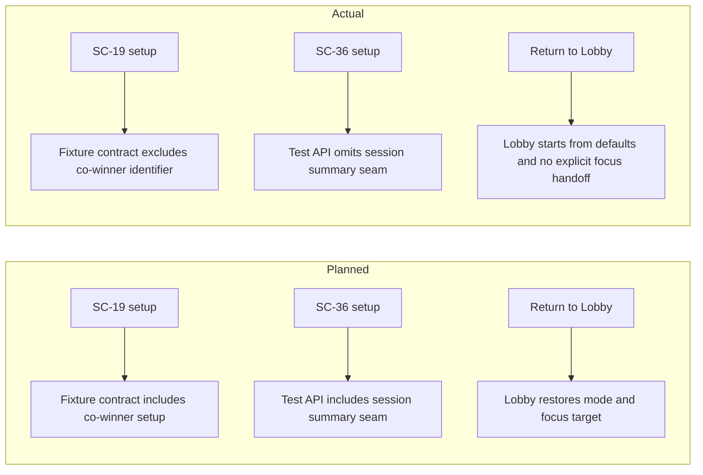

## 3. Findings

### RV-01: SC-19 cannot execute because co-winner fixture identifier is unsupported [Major]

- **Category:** Test Coverage
- **Severity:** Major
- **Related:** T-11, SC-19, FR-3.1, FR-3.3, NFR-1.2, AD-1
- **Description:** The SC-19 step requests a co-winner fixture identifier that is not accepted by the runtime fixture seam.
- **Expected:** The identifier used in step definitions must exist in the fixture contract and fixture switch handling.
- **Actual:** Step definitions reference round-co-winner-visibility, but the runtime contract only includes round-winner-visibility and other non co-winner fixtures.
- **Recommendation:** Align the fixture contract and step-definition identifier from one canonical fixture registry and add explicit co-winner fixture coverage.
- **Impact:** SC-19 is blocked before product behavior can be validated.

### RV-02: SC-36 depends on a missing runtime session-summary seam [Major]

- **Category:** Test Coverage
- **Severity:** Major
- **Related:** T-11, SC-36, FR-5.2, US-4, TR-2.2
- **Description:** The SC-36 assertion path calls a session-summary seam that is not exposed by the runtime Cypress test API.
- **Expected:** Either the seam exists (guarded for Cypress/dev only) or the scenario validates through observable UI state without seam dependency.
- **Actual:** The step calls readSessionConfigurationSummary, but runtime API exposes only applyEngineFixture and readEngineStateSummary.
- **Recommendation:** Add the missing test seam or replace the seam-dependent assertion with stable user-observable assertions.
- **Impact:** SC-36 fails for harness reasons and cannot verify FR-5.2 behavior.

### RV-03: Return-to-lobby path does not restore multiplayer mode from session configuration [Major]

- **Category:** Spec Compliance
- **Severity:** Major
- **Related:** T-11, SC-30, FR-4.3, US-3
- **Description:** Lobby is expected to re-open pre-filled with the previous session settings after Return to Lobby.
- **Expected:** Game mode and related fields should reflect preserved GameSession configuration.
- **Actual:** Lobby initializes mode as Single Player and AI difficulty as Easy defaults, with no readback from GameSession during lobby initialization.
- **Recommendation:** Initialize lobby form state from existing session configuration when present.
- **Impact:** SC-30 remains a product-side RED failure and FR-4.3 is not met.

### RV-04: Return-to-lobby path does not place focus on a lobby primary control [Major]

- **Category:** Spec Compliance
- **Severity:** Major
- **Related:** T-11, SC-33, FR-6.3, US-3
- **Description:** After Return to Lobby, focus must move to a meaningful primary control on the destination screen.
- **Expected:** Deterministic focus restoration to a lobby primary interactive control.
- **Actual:** Return-to-lobby handler performs navigation only; no explicit focus management exists in that flow, and no lobby-level focus handoff is defined.
- **Recommendation:** Add explicit post-navigation focus restoration aligned with the chosen lobby primary control policy.
- **Impact:** SC-33 remains a product-side RED failure and FR-6.3 is only partially met.

## 4. Traceability Matrix

| Finding | Severity | Category        | Related Spec                         | Status |
| ------- | -------- | --------------- | ------------------------------------ | ------ |
| RV-01   | Major    | Test Coverage   | T-11, SC-19, FR-3.1, FR-3.3, NFR-1.2 | Open   |
| RV-02   | Major    | Test Coverage   | T-11, SC-36, FR-5.2, US-4, TR-2.2    | Open   |
| RV-03   | Major    | Spec Compliance | T-11, SC-30, FR-4.3, US-3            | Open   |
| RV-04   | Major    | Spec Compliance | T-11, SC-33, FR-6.3, US-3            | Open   |

## 5. Spec Compliance Summary

| Requirement | Status     | Notes                                                                               |
| ----------- | ---------- | ----------------------------------------------------------------------------------- |
| FR-1.1      | ⚠️ Partial | Outside T-11 scope.                                                                 |
| FR-1.2      | ⚠️ Partial | Outside T-11 scope.                                                                 |
| FR-1.3      | ⚠️ Partial | Outside T-11 scope.                                                                 |
| FR-1.4      | ⚠️ Partial | Outside T-11 scope.                                                                 |
| FR-1.5      | ⚠️ Partial | Outside T-11 scope.                                                                 |
| FR-2.1      | ⚠️ Partial | Outside T-11 scope.                                                                 |
| FR-2.2      | ⚠️ Partial | Outside T-11 scope.                                                                 |
| FR-2.3      | ⚠️ Partial | Outside T-11 scope.                                                                 |
| FR-2.4      | ⚠️ Partial | Outside T-11 scope.                                                                 |
| FR-2.5      | ⚠️ Partial | Outside T-11 scope.                                                                 |
| FR-2.6      | ⚠️ Partial | Outside T-11 scope.                                                                 |
| FR-2.7      | ✅ Met     | SC-15 and SC-24 pass.                                                               |
| FR-3.1      | ⚠️ Partial | SC-16 passes; SC-19 blocked by fixture contract (RV-01).                            |
| FR-3.2      | ✅ Met     | SC-15 and SC-17 pass.                                                               |
| FR-3.3      | ⚠️ Partial | SC-18 passes; SC-19 blocked by fixture contract (RV-01).                            |
| FR-3.4      | ✅ Met     | SC-20 now passes in current run.                                                    |
| FR-3.5      | ✅ Met     | SC-21 and SC-22 pass.                                                               |
| FR-3.6      | ✅ Met     | SC-23 now passes in current run.                                                    |
| FR-4.1      | ✅ Met     | SC-28 passes.                                                                       |
| FR-4.2      | ✅ Met     | SC-29 and SC-31 pass.                                                               |
| FR-4.3      | ❌ Not Met | SC-30 fails due product behavior gap (RV-03).                                       |
| FR-4.4      | ✅ Met     | SC-32 passes.                                                                       |
| FR-5.1      | ✅ Met     | SC-34 passes.                                                                       |
| FR-5.2      | ⚠️ Partial | SC-36 blocked by missing seam (RV-02).                                              |
| FR-5.3      | ✅ Met     | SC-35, SC-37, SC-39 pass.                                                           |
| FR-5.4      | ✅ Met     | SC-35 and SC-38 pass.                                                               |
| FR-5.5      | ✅ Met     | SC-40 passes.                                                                       |
| FR-6.1      | ✅ Met     | SC-26 passes.                                                                       |
| FR-6.2      | ✅ Met     | SC-25 passes.                                                                       |
| FR-6.3      | ⚠️ Partial | SC-41 passes; SC-33 fails (RV-04).                                                  |
| FR-6.4      | ✅ Met     | SC-27 passes.                                                                       |
| FR-6.5      | ⚠️ Partial | Covered for tested controls in this scope; full feature coverage spans other tasks. |
| US-1        | ⚠️ Partial | Outside T-11 scope.                                                                 |
| US-2        | ⚠️ Partial | SC-19 remains blocked by fixture contract (RV-01).                                  |
| US-3        | ⚠️ Partial | SC-30 and SC-33 remain RED (RV-03, RV-04).                                          |
| US-4        | ⚠️ Partial | SC-36 remains blocked by seam dependency (RV-02).                                   |
| US-5        | ⚠️ Partial | Outside T-11 scope.                                                                 |
| US-6        | ⚠️ Partial | Outside T-11 scope.                                                                 |
| NFR-1.1     | ⚠️ Partial | Outside T-11 scope.                                                                 |
| NFR-1.2     | ⚠️ Partial | SC-19 blocked by fixture contract (RV-01).                                          |
| NFR-1.3     | ✅ Met     | SC-37 and SC-39 pass.                                                               |
| NFR-1.4     | ⚠️ Partial | Outside T-11 scope.                                                                 |
| NFR-2.1     | ✅ Met     | SC-24, SC-32, and SC-40 pass.                                                       |
| NFR-2.2     | ✅ Met     | SC-27 passes.                                                                       |
| NFR-3.1     | ⚠️ Partial | Outside T-11 scope.                                                                 |
| NFR-3.2     | ⚠️ Partial | Outside T-11 scope.                                                                 |

## 6. Task Completion Summary

| Task | Title                                                     | Status     | Findings                   |
| ---- | --------------------------------------------------------- | ---------- | -------------------------- |
| T-11 | Cypress E2E match-over overlay scenarios (SC-15 to SC-41) | ⚠️ Partial | RV-01, RV-02, RV-03, RV-04 |

## 7. Test Coverage Summary

| Scenario | Step Definitions | Meaningful | Findings |
| -------- | ---------------- | ---------- | -------- |
| SC-15    | ✅ Yes           | ✅ Yes     | —        |
| SC-16    | ✅ Yes           | ✅ Yes     | —        |
| SC-17    | ✅ Yes           | ✅ Yes     | —        |
| SC-18    | ✅ Yes           | ✅ Yes     | —        |
| SC-19    | ✅ Yes           | ❌ No      | RV-01    |
| SC-20    | ✅ Yes           | ✅ Yes     | —        |
| SC-21    | ✅ Yes           | ✅ Yes     | —        |
| SC-22    | ✅ Yes           | ✅ Yes     | —        |
| SC-23    | ✅ Yes           | ✅ Yes     | —        |
| SC-24    | ✅ Yes           | ✅ Yes     | —        |
| SC-25    | ✅ Yes           | ✅ Yes     | —        |
| SC-26    | ✅ Yes           | ✅ Yes     | —        |
| SC-27    | ✅ Yes           | ✅ Yes     | —        |
| SC-28    | ✅ Yes           | ✅ Yes     | —        |
| SC-29    | ✅ Yes           | ✅ Yes     | —        |
| SC-30    | ✅ Yes           | ✅ Yes     | RV-03    |
| SC-31    | ✅ Yes           | ✅ Yes     | —        |
| SC-32    | ✅ Yes           | ✅ Yes     | —        |
| SC-33    | ✅ Yes           | ✅ Yes     | RV-04    |
| SC-34    | ✅ Yes           | ✅ Yes     | —        |
| SC-35    | ✅ Yes           | ✅ Yes     | —        |
| SC-36    | ✅ Yes           | ❌ No      | RV-02    |
| SC-37    | ✅ Yes           | ✅ Yes     | —        |
| SC-38    | ✅ Yes           | ✅ Yes     | —        |
| SC-39    | ✅ Yes           | ✅ Yes     | —        |
| SC-40    | ✅ Yes           | ✅ Yes     | —        |
| SC-41    | ✅ Yes           | ✅ Yes     | —        |

## 8. Test Quality Summary

| Test File                              | Type               | Meaningful Assertions | Issues                                                                                                |
| -------------------------------------- | ------------------ | --------------------- | ----------------------------------------------------------------------------------------------------- |
| cypress/e2e/match-over-overlay.feature | E2E                | ✅ Yes                | None in feature definitions                                                                           |
| cypress/e2e/match-over-overlay.ts      | E2E                | ⚠️ Partial            | Unsupported co-winner fixture identifier and missing session-summary seam dependencies (RV-01, RV-02) |
| cypress/e2e/round-progression.ts       | E2E (shared steps) | ✅ Yes                | No blocking issue identified in this re-review scope                                                  |

## 9. Security Cross-Reference

This section cross-references Critical and High security findings from the companion security report. See docs/specs/ui/round-progression/security-report.md for the full security analysis.

No Critical or High SEC findings are currently reported in the companion security report.

## 10. Recommendations

### Critical (blocks release)

1. None.

### Major (fix before GREEN)

1. Resolve the SC-19 fixture contract mismatch by adding co-winner fixture support or aligning identifiers.
2. Resolve the SC-36 seam dependency by exposing the missing session-summary seam or replacing seam-based assertions with observable behavior checks.
3. Implement lobby prefill from session configuration for Return to Lobby to satisfy FR-4.3 (SC-30).
4. Implement deterministic focus restoration to a lobby primary control after Return to Lobby to satisfy FR-6.3 (SC-33).

### Minor (improvement)

1. None.

### Notes (informational)

1. SC-20 and SC-23 are now passing and no longer tracked as open findings in this RED re-review.

# Review Report: Round Progression and Match Over

**Review Mode:** Incremental (T-10: Cypress E2E round continuation, GREEN verification after prior fixes)
**Source:** docs/specs/ui/round-progression/
**Reviewed against:** proposal.md, spec.md, user-stories.md, bdd-test.md, design.md, tasks.md

## 1. Executive Summary

This incremental GREEN review validates Task T-10 after the previously reported major issues were addressed. The SC-05 tautology issue is resolved by checking rendered scoreboard content, SC-12 now verifies HUD output directly, and SC-42 now verifies live-region message transition. No remaining open findings were identified in the requested scope.

- Total findings: 0 (0 Critical, 0 Major, 0 Minor, 0 Note)
- Spec compliance: 15 of 46 requirements fully met in this incremental scope
- Architecture alignment: aligned
- Test quality: meaningful

## 2. Architecture Comparison

### 2.1 Planned Component Tree

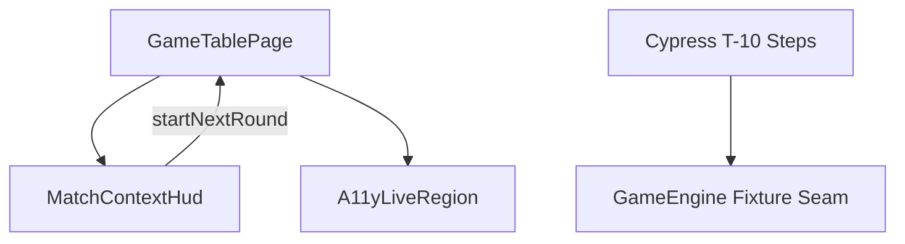

### 2.2 Actual Component Tree

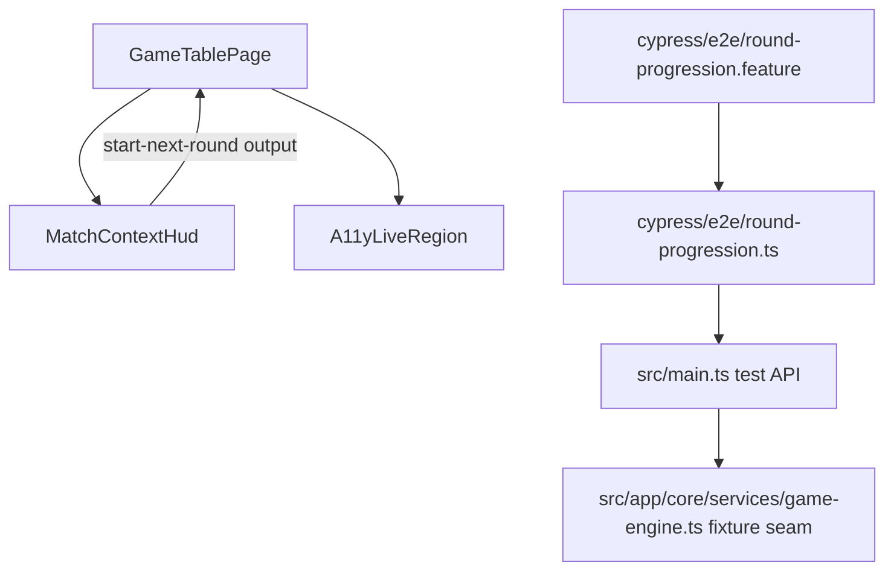

### 2.3 Drift Analysis

No structural drift was found in this incremental scope. The implementation remains consistent with the planned T-10 architecture: fixture-driven setup, HUD action-driven continuation flow, and page-level orchestration.

## 3. Findings

No remaining findings were identified for this incremental T-10 GREEN review.

Validation of prior-major closure:

- SC-05 precondition now validates rendered application state (scoreboard names), not local test memory.
- SC-12 now validates the round number via HUD rendering.
- SC-42 now verifies announcement transition by comparing pre-action and post-action live-region text.

## 4. Traceability Matrix

| Finding | Severity | Category | Related Spec | Status |
| ------- | -------- | -------- | ------------ | ------ |
| None    | None     | None     | T-10         | Closed |

## 5. Spec Compliance Summary

| Requirement | Status     | Notes                                                                                       |
| ----------- | ---------- | ------------------------------------------------------------------------------------------- |
| FR-1.1      | ✅ Met     | SC-01 is covered with meaningful assertions.                                                |
| FR-1.2      | ✅ Met     | SC-02 validates round number and top score visibility.                                      |
| FR-1.3      | ✅ Met     | SC-03, SC-04, and SC-05 validate category rendering, zero values, and configured names.     |
| FR-1.4      | ✅ Met     | SC-06 validates board zones remain rendered and inspectable.                                |
| FR-1.5      | ⚠️ Partial | Action-bar natural inactivity is not directly asserted in T-10.                             |
| FR-2.1      | ✅ Met     | SC-08 covered.                                                                              |
| FR-2.2      | ✅ Met     | SC-09 and SC-10 covered.                                                                    |
| FR-2.3      | ✅ Met     | SC-11 start-next-round path covered.                                                        |
| FR-2.4      | ✅ Met     | SC-07, SC-11, and SC-12 cover cleanup and next-round state.                                 |
| FR-2.5      | ✅ Met     | SC-13 keyboard path covered.                                                                |
| FR-2.6      | ✅ Met     | SC-14 accessible label covered.                                                             |
| FR-2.7      | ⚠️ Partial | Outside T-10 scope.                                                                         |
| FR-3.1      | ⚠️ Partial | Outside T-10 scope.                                                                         |
| FR-3.2      | ⚠️ Partial | Outside T-10 scope.                                                                         |
| FR-3.3      | ⚠️ Partial | Outside T-10 scope.                                                                         |
| FR-3.4      | ⚠️ Partial | Outside T-10 scope.                                                                         |
| FR-3.5      | ⚠️ Partial | Outside T-10 scope.                                                                         |
| FR-3.6      | ⚠️ Partial | Outside T-10 scope.                                                                         |
| FR-4.1      | ⚠️ Partial | Outside T-10 scope.                                                                         |
| FR-4.2      | ⚠️ Partial | Outside T-10 scope.                                                                         |
| FR-4.3      | ⚠️ Partial | Outside T-10 scope.                                                                         |
| FR-4.4      | ⚠️ Partial | Outside T-10 scope.                                                                         |
| FR-5.1      | ⚠️ Partial | Outside T-10 scope.                                                                         |
| FR-5.2      | ⚠️ Partial | Outside T-10 scope.                                                                         |
| FR-5.3      | ⚠️ Partial | Outside T-10 scope.                                                                         |
| FR-5.4      | ⚠️ Partial | Outside T-10 scope.                                                                         |
| FR-5.5      | ⚠️ Partial | Outside T-10 scope.                                                                         |
| FR-6.1      | ⚠️ Partial | Outside T-10 scope.                                                                         |
| FR-6.2      | ⚠️ Partial | Outside T-10 scope.                                                                         |
| FR-6.3      | ⚠️ Partial | Outside T-10 scope.                                                                         |
| FR-6.4      | ⚠️ Partial | Round-completion announcement is covered; winner announcement is outside T-10 scope.        |
| FR-6.5      | ⚠️ Partial | Start-next-round labels are covered; full feature control set is outside T-10 scope.        |
| US-1        | ✅ Met     | Round-continuation story is covered in T-10 scenarios.                                      |
| US-2        | ⚠️ Partial | Outside T-10 scope.                                                                         |
| US-3        | ⚠️ Partial | Outside T-10 scope.                                                                         |
| US-4        | ⚠️ Partial | Outside T-10 scope.                                                                         |
| US-5        | ✅ Met     | SC-06 covers board inspectability behavior.                                                 |
| US-6        | ✅ Met     | SC-03, SC-04, and SC-05 provide direct evidence.                                            |
| NFR-1.1     | ✅ Met     | Continuation-button mutual exclusivity is covered in SC-10.                                 |
| NFR-1.2     | ⚠️ Partial | Outside T-10 scope.                                                                         |
| NFR-1.3     | ⚠️ Partial | Outside T-10 scope.                                                                         |
| NFR-1.4     | ✅ Met     | Breakdown/button cleanup after Start Next Round is covered.                                 |
| NFR-2.1     | ⚠️ Partial | T-10 covers Start Next Round keyboard behavior; full feature keyboard set is outside scope. |
| NFR-2.2     | ⚠️ Partial | T-10 covers round-complete announcement; winner announcement is outside scope.              |
| NFR-3.1     | ⚠️ Partial | Outside T-10 scope.                                                                         |
| NFR-3.2     | ⚠️ Partial | Outside T-10 scope.                                                                         |

## 6. Task Completion Summary

| Task | Title                                                           | Status      | Findings |
| ---- | --------------------------------------------------------------- | ----------- | -------- |
| T-10 | Cypress E2E - round continuation scenarios (SC-01-SC-14, SC-42) | ✅ Complete | None     |

## 7. Test Coverage Summary

| Scenario | Step Definitions | Meaningful | Findings           |
| -------- | ---------------- | ---------- | ------------------ |
| SC-01    | ✅ Yes           | ✅ Yes     | -                  |
| SC-02    | ✅ Yes           | ✅ Yes     | -                  |
| SC-03    | ✅ Yes           | ✅ Yes     | -                  |
| SC-04    | ✅ Yes           | ✅ Yes     | -                  |
| SC-05    | ✅ Yes           | ✅ Yes     | -                  |
| SC-06    | ✅ Yes           | ✅ Yes     | -                  |
| SC-07    | ✅ Yes           | ✅ Yes     | -                  |
| SC-08    | ✅ Yes           | ✅ Yes     | -                  |
| SC-09    | ✅ Yes           | ✅ Yes     | -                  |
| SC-10    | ✅ Yes           | ✅ Yes     | -                  |
| SC-11    | ✅ Yes           | ✅ Yes     | -                  |
| SC-12    | ✅ Yes           | ✅ Yes     | -                  |
| SC-13    | ✅ Yes           | ✅ Yes     | -                  |
| SC-14    | ✅ Yes           | ✅ Yes     | -                  |
| SC-15    | ❌ No            | ❌ No      | Outside T-10 scope |
| SC-16    | ❌ No            | ❌ No      | Outside T-10 scope |
| SC-17    | ❌ No            | ❌ No      | Outside T-10 scope |
| SC-18    | ❌ No            | ❌ No      | Outside T-10 scope |
| SC-19    | ❌ No            | ❌ No      | Outside T-10 scope |
| SC-20    | ❌ No            | ❌ No      | Outside T-10 scope |
| SC-21    | ❌ No            | ❌ No      | Outside T-10 scope |
| SC-22    | ❌ No            | ❌ No      | Outside T-10 scope |
| SC-23    | ❌ No            | ❌ No      | Outside T-10 scope |
| SC-24    | ❌ No            | ❌ No      | Outside T-10 scope |
| SC-25    | ❌ No            | ❌ No      | Outside T-10 scope |
| SC-26    | ❌ No            | ❌ No      | Outside T-10 scope |
| SC-27    | ❌ No            | ❌ No      | Outside T-10 scope |
| SC-28    | ❌ No            | ❌ No      | Outside T-10 scope |
| SC-29    | ❌ No            | ❌ No      | Outside T-10 scope |
| SC-30    | ❌ No            | ❌ No      | Outside T-10 scope |
| SC-31    | ❌ No            | ❌ No      | Outside T-10 scope |
| SC-32    | ❌ No            | ❌ No      | Outside T-10 scope |
| SC-33    | ❌ No            | ❌ No      | Outside T-10 scope |
| SC-34    | ❌ No            | ❌ No      | Outside T-10 scope |
| SC-35    | ❌ No            | ❌ No      | Outside T-10 scope |
| SC-36    | ❌ No            | ❌ No      | Outside T-10 scope |
| SC-37    | ❌ No            | ❌ No      | Outside T-10 scope |
| SC-38    | ❌ No            | ❌ No      | Outside T-10 scope |
| SC-39    | ❌ No            | ❌ No      | Outside T-10 scope |
| SC-40    | ❌ No            | ❌ No      | Outside T-10 scope |
| SC-41    | ❌ No            | ❌ No      | Outside T-10 scope |
| SC-42    | ✅ Yes           | ✅ Yes     | -                  |

## 8. Test Quality Summary

| Test File                                                                                          | Type | Meaningful Assertions | Issues                                                |
| -------------------------------------------------------------------------------------------------- | ---- | --------------------- | ----------------------------------------------------- |
| cypress/e2e/round-progression.feature                                                              | E2E  | ✅ Yes                | None in reviewed scope                                |
| cypress/e2e/round-progression.ts                                                                   | E2E  | ✅ Yes                | None in reviewed scope                                |
| src/app/features/game-board/game-table-page/components/match-context-hud/match-context-hud.spec.ts | Unit | ✅ Yes                | Context-only cross-check; no open issue in T-10 scope |
| src/app/features/game-board/game-table-page/game-table-page.round-progression.spec.ts              | Unit | ✅ Yes                | Context-only cross-check; no open issue in T-10 scope |
| src/app/features/game-board/game-table-page/game-table-page.match-over.spec.ts                     | Unit | ✅ Yes                | Outside incremental focus; no T-10 blocker identified |

## 9. Security Cross-Reference

This section cross-references Critical and High security findings from the companion security-report.md. See docs/specs/ui/round-progression/security-report.md for the full security analysis.

No Critical or High SEC findings are currently reported for this scope.

## 10. Recommendations

### Critical (blocks release)

1. None.

### Major (fix before merge)

1. None.

### Minor (improvement)

1. None.

### Notes (informational)

1. Terminology alignment between specification wording and UI wording should remain documented as an intentional choice.

Archived legacy content below is intentionally retained only as historical context and is not part of the active T-10 review.

````text

## 1. Executive Summary

This incremental GREEN-phase review focused on Task T-10 implementation for Cypress round-continuation coverage (SC-01 through SC-14, SC-42), plus the fixture seam used by those scenarios. The test architecture is mostly aligned with the design: selectors are largely data-testid based, fixture setup is routed through a controlled runtime seam, and no compile or lint diagnostics were found in scoped files. The main issues are test-quality drift in a tautological Given step, one scenario assertion that checks engine seam state instead of the stated HUD outcome, and smaller traceability/assertion-strength gaps.

- Total findings: 5 (0 Critical, 2 Major, 2 Minor, 1 Note)
- Spec compliance: 12 of 46 requirements fully met in this incremental scope
- Architecture alignment: aligned, with minor test-traceability drift
- Test quality: partially meaningful

## 2. Architecture Comparison

### 2.1 Planned Component Tree

```mermaid
This incremental review is scoped to Task T-9 and evaluates tests only. The two T-9 unit suites provide meaningful orchestration checks for button-gating truth tables, event dispatch, explicit match-over gating, inert masking, navigation trigger, and live-region announcements. No evidence-based defects were identified in this scope. Residual risk remains in behavior areas intentionally outside T-9 scope (for example keyboard-only flows, focus restoration, and full end-to-end lifecycle checks).
    GTP[GameTablePage]
 Total findings: 0 (0 Critical, 0 Major, 0 Minor, 0 Note)
 Spec compliance: 9 of 46 requirements met
 Architecture alignment: aligned
 Test quality: meaningful

    GTP --> MCH
 No findings were identified for this T-9 tests-only review.
    CYP --> GE
    MCH -->|startNextRound| GTP
```

### 2.2 Actual Component Tree


### 2.3 Drift Analysis

No structural drift was found against the planned T-10 approach. The implementation still uses component-driven UI actions plus a fixture seam for deterministic setup. Drift appears in validation fidelity, not architecture: one Given step validates a local test variable instead of application state, and one SC-12 assertion checks seam summary data instead of the scenario-stated HUD rendering.

## 3. Findings

### RV-01: Tautological precondition assertion validates local test state, not application behavior [Major]
- **Category:** Test Quality
- **Severity:** Major
- **Related:** T-10, SC-05, FR-1.3, US-6
- **Description:** The SC-05 precondition step asserts a local variable that is assigned directly from step input values.
- **Expected:** Preconditions should either set context without assertions, or assert observable application state.
- **Actual:** Local test memory is asserted as if it were product behavior.
- **Recommendation:** Replace this assertion with an application-facing check (for example, the configured names visible in lobby/session UI state) or remove the redundant assertion and keep the scenario validation in outcome steps only.
- **Impact:** Creates false confidence and weakens diagnostic value when SC-05 fails.
- **Evidence:** cypress/e2e/round-progression.ts:70, cypress/e2e/round-progression.ts:166, cypress/e2e/round-progression.ts:167, cypress/e2e/round-progression.feature:35

### RV-02: SC-12 claims HUD validation but asserts engine seam summary instead [Major]
- **Category:** Test Quality
- **Severity:** Major
- **Related:** T-10, SC-12, FR-2.4, US-1
- **Description:** The SC-12 step text says the round number shown in the HUD is validated, but the assertion reads the runtime seam summary object.
- **Expected:** A scenario claiming HUD verification should assert HUD-rendered output directly.
- **Actual:** The check reads engine summary data through the Cypress seam.
- **Recommendation:** Add a direct HUD assertion for round number presentation and treat seam summary as supplemental state verification only.
- **Impact:** UI regressions in round-number presentation can pass while the scenario still reports green.
- **Evidence:** cypress/e2e/round-progression.feature:97, cypress/e2e/round-progression.ts:452, cypress/e2e/round-progression.ts:453

### RV-03: Scoring label wording drifts between scenario text and asserted UI label [Minor]
- **Category:** Spec Compliance
- **Severity:** Minor
- **Related:** T-10, SC-03, FR-1.3, US-6
- **Description:** SC-03 wording references Siete de Oros, while step assertions and HUD rendering use Siete de Oros.
- **Expected:** Requirement, scenario wording, and asserted UI terminology should be consistent.
- **Actual:** Test text and asserted/rendered label diverge.
- **Recommendation:** Normalize terminology across spec, feature file, and UI label so traceability is unambiguous.
- **Impact:** Increases ambiguity during triage and can mask true localization/wording regressions.
- **Evidence:** cypress/e2e/round-progression.feature:25, cypress/e2e/round-progression.ts:300, cypress/e2e/round-progression.ts:308, src/app/features/game-board/game-table-page/components/match-context-hud/match-context-hud.html:50

### RV-04: SC-42 announcement step does not verify that the message changed after the triggering action [Minor]
- **Category:** Test Quality
- **Severity:** Minor
- **Related:** T-10, SC-42, FR-6.4, NFR-2.2
- **Description:** The step captures the live-region text before round completion but does not compare pre-action and post-action values.
- **Expected:** The scenario should prove that round completion triggers a new announcement.
- **Actual:** The final check only verifies that post-action text contains broad keywords.
- **Recommendation:** Compare pre-action and post-action values and include round-specific content to confirm transition.
- **Impact:** A stale live-region message could satisfy the assertion under altered test-isolation conditions.
- **Evidence:** cypress/e2e/round-progression.ts:58, cypress/e2e/round-progression.ts:186, cypress/e2e/round-progression.ts:476

### RV-05: Selector policy is mostly strong, but a few broad body-level queries reduce intent clarity [Note]
- **Category:** Code Quality
- **Severity:** Note
- **Related:** T-10
- **Description:** Most selectors are data-testid based, but a few checks and keyboard setup steps rely on body-level querying.
- **Expected:** Prefer scoped selectors that mirror feature intent where possible.
- **Actual:** Body-level selectors are used for focus priming and mutual-exclusivity counting.
- **Recommendation:** Where practical, scope these checks to feature containers to improve readability and reduce accidental coupling.
- **Impact:** Current behavior is valid but less explicit and potentially more brittle over time.
- **Evidence:** cypress/e2e/round-progression.ts:261, cypress/e2e/round-progression.ts:284, cypress/e2e/round-progression.ts:413

## 4. Traceability Matrix

| Finding | Severity | Category | Related Spec | Status |
|---------|----------|----------|-------------|--------|
| RV-01 | Major | Test Quality | T-10, SC-05, FR-1.3, US-6 | Open |
| RV-02 | Major | Test Quality | T-10, SC-12, FR-2.4, US-1 | Open |
| RV-03 | Minor | Spec Compliance | T-10, SC-03, FR-1.3, US-6 | Open |
| RV-04 | Minor | Test Quality | T-10, SC-42, FR-6.4, NFR-2.2 | Open |
| RV-05 | Note | Code Quality | T-10 | Open |

## 5. Spec Compliance Summary

| Requirement | Status | Notes |
|-------------|--------|-------|
| FR-1.1 | ✅ Met | SC-01 coverage present in T-10 feature and steps. |
| FR-1.2 | ✅ Met | SC-02 coverage validates round and top score visibility. |
| FR-1.3 | ⚠️ Partial | Core coverage exists, but SC-03 wording drift and SC-05 tautological precondition reduce confidence (RV-01, RV-03). |
| FR-1.4 | ✅ Met | SC-06 validates board zones remain visible and not inert. |
| FR-1.5 | ⚠️ Partial | Action-bar inactive-state behavior is not directly asserted in T-10 scenarios. |
| FR-2.1 | ✅ Met | SC-08 covered. |
| FR-2.2 | ✅ Met | SC-09 and SC-10 covered. |
| FR-2.3 | ✅ Met | SC-11 action path covered. |
| FR-2.4 | ⚠️ Partial | SC-12 includes seam-driven state checks; HUD-specific assertion drift remains (RV-02). |
| FR-2.5 | ✅ Met | SC-13 keyboard operability covered. |
| FR-2.6 | ✅ Met | SC-14 Spanish accessible label covered. |
| FR-2.7 | ⚠️ Partial | View Winner transition is outside T-10 scope. |
| FR-3.1 | ⚠️ Partial | Outside T-10 scope. |
| FR-3.2 | ⚠️ Partial | Outside T-10 scope. |
| FR-3.3 | ⚠️ Partial | Outside T-10 scope. |
| FR-3.4 | ⚠️ Partial | Outside T-10 scope. |
| FR-3.5 | ⚠️ Partial | Outside T-10 scope. |
| FR-3.6 | ⚠️ Partial | Outside T-10 scope. |
| FR-4.1 | ⚠️ Partial | Outside T-10 scope. |
| FR-4.2 | ⚠️ Partial | Outside T-10 scope. |
| FR-4.3 | ⚠️ Partial | Outside T-10 scope. |
| FR-4.4 | ⚠️ Partial | Outside T-10 scope. |
| FR-5.1 | ⚠️ Partial | Outside T-10 scope. |
| FR-5.2 | ⚠️ Partial | Outside T-10 scope. |
| FR-5.3 | ⚠️ Partial | Outside T-10 scope. |
| FR-5.4 | ⚠️ Partial | Outside T-10 scope. |
| FR-5.5 | ⚠️ Partial | Outside T-10 scope. |
| FR-6.1 | ⚠️ Partial | Outside T-10 scope. |
| FR-6.2 | ⚠️ Partial | Outside T-10 scope. |
| FR-6.3 | ⚠️ Partial | Outside T-10 scope. |
| FR-6.4 | ⚠️ Partial | Round-end announcement covered, but transition-proof strength needs improvement (RV-04). |
| FR-6.5 | ⚠️ Partial | Start-next-round labeling is covered; full control set spans later tasks. |
| US-1 | ⚠️ Partial | Strong T-10 coverage, but SC-12 validation drift remains (RV-02). |
| US-2 | ⚠️ Partial | Outside T-10 scope. |
| US-3 | ⚠️ Partial | Outside T-10 scope. |
| US-4 | ⚠️ Partial | Outside T-10 scope. |
| US-5 | ✅ Met | Board inspectability path is covered in SC-06. |
| US-6 | ⚠️ Partial | Coverage present but weakened by SC-05 tautological precondition and SC-03 wording drift (RV-01, RV-03). |
| NFR-1.1 | ✅ Met | Continuation button mutual exclusivity is asserted in SC-10. |
| NFR-1.2 | ⚠️ Partial | Outside T-10 scope. |
| NFR-1.3 | ⚠️ Partial | Outside T-10 scope. |
| NFR-1.4 | ✅ Met | Post-start-next-round cleanup is asserted in SC-07 and SC-11. |
| NFR-2.1 | ✅ Met | Keyboard operability and labeling covered in SC-13 and SC-14. |
| NFR-2.2 | ⚠️ Partial | Announcement exists but transition-strength gap remains for SC-42 (RV-04). |
| NFR-3.1 | ⚠️ Partial | Outside T-10 scope. |
| NFR-3.2 | ⚠️ Partial | Outside T-10 scope. |

## 6. Task Completion Summary

| Task | Title | Status | Findings |
|------|-------|--------|----------|
| T-10 | Cypress E2E - round continuation scenarios (SC-01-SC-14, SC-42) | ⚠️ Partial | RV-01, RV-02, RV-03, RV-04, RV-05 |

## 7. Test Coverage Summary

| Scenario | Step Definitions | Meaningful | Findings |
|----------|-----------------|------------|----------|
| SC-01 | ✅ Yes | ✅ Yes | - |
| SC-02 | ✅ Yes | ✅ Yes | - |
| SC-03 | ✅ Yes | ⚠️ Partial | RV-03 |
| SC-04 | ✅ Yes | ✅ Yes | - |
| SC-05 | ✅ Yes | ⚠️ Partial | RV-01 |
| SC-06 | ✅ Yes | ✅ Yes | - |
| SC-07 | ✅ Yes | ✅ Yes | - |
| SC-08 | ✅ Yes | ✅ Yes | - |
| SC-09 | ✅ Yes | ✅ Yes | - |
| SC-10 | ✅ Yes | ✅ Yes | - |
| SC-11 | ✅ Yes | ✅ Yes | - |
| SC-12 | ✅ Yes | ⚠️ Partial | RV-02 |
| SC-13 | ✅ Yes | ⚠️ Partial | RV-05 |
| SC-14 | ✅ Yes | ✅ Yes | - |
| SC-15 | ❌ No (T-10 scope) | ❌ No (T-10 scope) | Out of scope |
| SC-16 | ❌ No (T-10 scope) | ❌ No (T-10 scope) | Out of scope |
| SC-17 | ❌ No (T-10 scope) | ❌ No (T-10 scope) | Out of scope |
| SC-18 | ❌ No (T-10 scope) | ❌ No (T-10 scope) | Out of scope |
| SC-19 | ❌ No (T-10 scope) | ❌ No (T-10 scope) | Out of scope |
| SC-20 | ❌ No (T-10 scope) | ❌ No (T-10 scope) | Out of scope |
| SC-21 | ❌ No (T-10 scope) | ❌ No (T-10 scope) | Out of scope |
| SC-22 | ❌ No (T-10 scope) | ❌ No (T-10 scope) | Out of scope |
| SC-23 | ❌ No (T-10 scope) | ❌ No (T-10 scope) | Out of scope |
| SC-24 | ❌ No (T-10 scope) | ❌ No (T-10 scope) | Out of scope |
| SC-25 | ❌ No (T-10 scope) | ❌ No (T-10 scope) | Out of scope |
| SC-26 | ❌ No (T-10 scope) | ❌ No (T-10 scope) | Out of scope |
| SC-27 | ❌ No (T-10 scope) | ❌ No (T-10 scope) | Out of scope |
| SC-28 | ❌ No (T-10 scope) | ❌ No (T-10 scope) | Out of scope |
| SC-29 | ❌ No (T-10 scope) | ❌ No (T-10 scope) | Out of scope |
| SC-30 | ❌ No (T-10 scope) | ❌ No (T-10 scope) | Out of scope |
| SC-31 | ❌ No (T-10 scope) | ❌ No (T-10 scope) | Out of scope |
| SC-32 | ❌ No (T-10 scope) | ❌ No (T-10 scope) | Out of scope |
| SC-33 | ❌ No (T-10 scope) | ❌ No (T-10 scope) | Out of scope |
| SC-34 | ❌ No (T-10 scope) | ❌ No (T-10 scope) | Out of scope |
| SC-35 | ❌ No (T-10 scope) | ❌ No (T-10 scope) | Out of scope |
| SC-36 | ❌ No (T-10 scope) | ❌ No (T-10 scope) | Out of scope |
| SC-37 | ❌ No (T-10 scope) | ❌ No (T-10 scope) | Out of scope |
| SC-38 | ❌ No (T-10 scope) | ❌ No (T-10 scope) | Out of scope |
| SC-39 | ❌ No (T-10 scope) | ❌ No (T-10 scope) | Out of scope |
| SC-40 | ❌ No (T-10 scope) | ❌ No (T-10 scope) | Out of scope |
| SC-41 | ❌ No (T-10 scope) | ❌ No (T-10 scope) | Out of scope |
| SC-42 | ✅ Yes | ⚠️ Partial | RV-04 |

## 8. Test Quality Summary

| Test File | Type | Meaningful Assertions | Issues |
|-----------|------|----------------------|--------|
| cypress/e2e/round-progression.feature | E2E Feature | ⚠️ Partial | SC-03 wording drift with asserted label (RV-03). |
| cypress/e2e/round-progression.ts | E2E Step Definitions | ⚠️ Partial | Tautological precondition (RV-01), HUD-vs-seam mismatch in SC-12 (RV-02), announcement transition gap (RV-04), broad body selectors (RV-05). |

## 9. Security Cross-Reference

This review cross-referenced docs/specs/ui/round-progression/security-report.md.

No Critical or High SEC findings are currently reported there for T-10 scope.

## 10. Recommendations

### Critical (blocks release)
1. None.

### Major (fix before merge)
1. Replace the SC-05 tautological precondition assertion with an application-observable assertion, or remove it and keep outcome verification in meaningful Then steps.
2. Update SC-12 verification so the HUD claim is validated through HUD-rendered output, with seam summary checks kept as supplemental evidence only.

### Minor (improvement)
1. Align Siete category wording across bdd-test.md, round-progression.feature, step assertions, and HUD text.
2. Strengthen SC-42 by asserting pre-action and post-action live-region transition, not only keyword presence.

### Notes (informational)
1. Prefer scoped feature-container selectors over body-level selectors when practical to improve intent clarity and long-term maintainability.# Review Report: Round Progression and Match Over

**Review Mode:** Incremental (T-9: Unit tests - GameTablePage round progression and match-over flows, tests-only RED phase)
**Source:** docs/specs/ui/round-progression/
**Reviewed against:** proposal.md, spec.md, user-stories.md, bdd-test.md, design.md, tasks.md

## 1. Executive Summary

This incremental review is scoped to Task T-9 and evaluates tests only. The two T-9 unit suites provide meaningful orchestration checks for button-gating truth tables, event dispatch, explicit match-over gating, inert masking, navigation trigger, and live-region announcements. No evidence-based defects were identified in this scope. Residual risk remains in behavior areas intentionally outside T-9 scope (for example keyboard-only flows, focus restoration, and full end-to-end lifecycle checks).

- Total findings: 0 (0 Critical, 0 Major, 0 Minor, 0 Note)
- Spec compliance: 9 of 46 requirements met
- Architecture alignment: aligned
- Test quality: meaningful

## 2. Architecture Comparison

### 2.1 Planned Component Tree

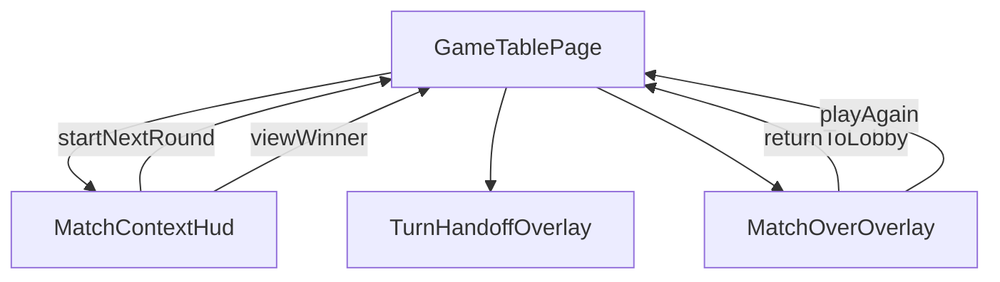

### 2.2 Actual Component Tree


### 2.3 Drift Analysis

No architecture drift was found in T-9 scope. The tested orchestration paths are consistent with AD-4, AD-5, and AD-6.

## 3. Findings

No findings were identified for this T-9 tests-only review.

## 4. Traceability Matrix

| Finding | Severity | Category | Related Spec | Status |
|---------|----------|----------|-------------|--------|
| None | None | None | T-9 | Closed |

## 5. Spec Compliance Summary

| Requirement | Status | Notes |
|-------------|--------|-------|
| FR-1.1 | Partial | Round-complete state entry is not directly asserted as a full UI state transition in T-9 tests. |
| FR-1.2 | Partial | No direct assertion on round number and top-score visibility in HUD rendering. |
| FR-1.3 | Partial | Player-name resolution is asserted; full breakdown presentation semantics are outside T-9 scope. |
| FR-1.4 | Partial | Board inspectability assertions are outside T-9 scope. |
| FR-1.5 | Partial | Natural inactivity of action controls is outside T-9 scope. |
| FR-2.1 | Partial | Start Next Round visibility logic is asserted via computed truth-table checks. |
| FR-2.2 | Partial | View Winner replacement logic is asserted via computed truth-table checks. |
| FR-2.3 | Met | Start Next Round dispatch path is directly asserted. |
| FR-2.4 | Partial | Post-dispatch UI cleanup is asserted; full board redeal details are outside T-9 scope. |
| FR-2.5 | Partial | Keyboard reachability for Start Next Round is outside T-9 scope. |
| FR-2.6 | Partial | Start Next Round accessible-label checks are outside T-9 scope. |
| FR-2.7 | Partial | View Winner activation path is asserted; keyboard and accessibility specifics are outside T-9 scope. |
| FR-3.1 | Met | Explicit overlay gate behavior is asserted (hidden before View Winner, visible after activation). |
| FR-3.2 | Partial | Overlay visibility is asserted, but full-screen layering semantics are not directly asserted in T-9. |
| FR-3.3 | Partial | Winner-name prominence rendering is outside T-9 scope. |
| FR-3.4 | Partial | Final accumulated-score rendering is outside T-9 scope. |
| FR-3.5 | Partial | Escape and outside-click non-dismissal checks are outside T-9 scope. |
| FR-3.6 | Met | Inert and aria-hidden masking is asserted for match-over and handoff-active conditions. |
| FR-4.1 | Partial | Return to Lobby control presence is outside T-9 scope. |
| FR-4.2 | Met | Root-route navigation trigger is directly asserted. |
| FR-4.3 | Partial | Session preservation after navigation is outside T-9 scope. |
| FR-4.4 | Partial | Keyboard operability for Return to Lobby is outside T-9 scope. |
| FR-5.1 | Partial | Play Again control presence is outside T-9 scope. |
| FR-5.2 | Partial | Same-configuration rematch semantics are outside T-9 scope. |
| FR-5.3 | Partial | Unconditional init call with non-null state is asserted; full fresh-state outcomes are not. |
| FR-5.4 | Partial | Overlay dismissal is asserted; full board-ready behavior is not fully asserted. |
| FR-5.5 | Partial | Keyboard operability for Play Again is outside T-9 scope. |
| FR-6.1 | Partial | Focus transfer into overlay is outside T-9 scope. |
| FR-6.2 | Partial | Modal role and name checks are outside T-9 scope. |
| FR-6.3 | Partial | Focus restoration targets are outside T-9 scope. |
| FR-6.4 | Met | Live-region messages for round completion and winner announcement are asserted. |
| FR-6.5 | Partial | Broad control-label coverage is outside T-9 scope. |
| US-1 | Partial | Core round-progression orchestration is covered, but full user-flow outcomes are incomplete. |
| US-2 | Partial | View Winner trigger and masking paths are covered; full overlay lifecycle is incomplete. |
| US-3 | Partial | Navigation trigger is covered; session and focus post-conditions are outside T-9 scope. |
| US-4 | Partial | Play Again orchestration is covered; full rematch outcome validation is incomplete. |
| US-5 | Partial | Board inspection behavior is outside T-9 scope. |
| US-6 | Partial | Name-resolution logic is covered; full breakdown UX behavior is outside T-9 scope. |
| NFR-1.1 | Met | Mutual exclusivity logic for continuation controls is asserted via truth-table tests. |
| NFR-1.2 | Met | Non-auto-open overlay gate is directly asserted in T-9 scope. |
| NFR-1.3 | Partial | Fresh rematch correctness is only partially evidenced through init call assertions. |
| NFR-1.4 | Met | Round-complete cleanup after Start Next Round is directly asserted in T-9 scope. |
| NFR-2.1 | Partial | Keyboard interaction coverage is outside T-9 scope. |
| NFR-2.2 | Met | Round-completion and winner announcements are directly asserted in T-9 scope. |
| NFR-3.1 | Partial | Self-contained overlay design is outside direct T-9 test scope. |
| NFR-3.2 | Partial | Typed HUD contract maintainability is outside direct T-9 test scope. |

## 6. Task Completion Summary

| Task | Title | Status | Findings |
|------|-------|--------|----------|
| T-9 | Unit tests - GameTablePage round progression and match-over flows | Complete | None |

## 7. Test Coverage Summary

| Scenario | Step Definitions | Meaningful | Findings |
|----------|------------------|------------|----------|
| SC-01 | No | No | Out of T-9 scope |
| SC-02 | No | No | Out of T-9 scope |
| SC-03 | No | Partial | Name-resolution behavior is partially covered via roundScoreBreakdown transformation |
| SC-04 | No | No | Out of T-9 scope |
| SC-05 | No | Partial | Player-name mapping by playerId is covered in roundScoreBreakdown assertion |
| SC-06 | No | No | Out of T-9 scope |
| SC-07 | No | Yes | Round-complete artifacts removal after Start Next Round is directly asserted |
| SC-08 | No | Partial | Start Next Round gate logic is covered via truth-table assertions |
| SC-09 | No | Partial | Start Next Round hidden-with-winner logic is covered via truth-table assertions |
| SC-10 | No | Partial | View Winner replacement logic is covered via truth-table assertions |
| SC-11 | No | Yes | Dispatch and post-dispatch cleanup are directly asserted |
| SC-12 | No | No | Out of T-9 scope |
| SC-13 | No | No | Out of T-9 scope |
| SC-14 | No | No | Out of T-9 scope |
| SC-15 | No | Yes | View Winner activation path to overlay visibility is directly asserted |
| SC-16 | No | Yes | Non-auto-open behavior before View Winner activation is directly asserted |
| SC-17 | No | Partial | Overlay presence is asserted, full-screen layering is not |
| SC-18 | No | No | Out of T-9 scope |
| SC-19 | No | No | Out of T-9 scope |
| SC-20 | No | No | Out of T-9 scope |
| SC-21 | No | No | Out of T-9 scope |
| SC-22 | No | No | Out of T-9 scope |
| SC-23 | No | Yes | Inert and aria-hidden background masking is directly asserted |
| SC-24 | No | No | Out of T-9 scope |
| SC-25 | No | No | Out of T-9 scope |
| SC-26 | No | No | Out of T-9 scope |
| SC-27 | No | Yes | Winner announcement message content is directly asserted |
| SC-28 | No | No | Out of T-9 scope |
| SC-29 | No | Yes | Router navigation trigger to root is directly asserted |
| SC-30 | No | No | Out of T-9 scope |
| SC-31 | No | No | Out of T-9 scope |
| SC-32 | No | No | Out of T-9 scope |
| SC-33 | No | No | Out of T-9 scope |
| SC-34 | No | No | Out of T-9 scope |
| SC-35 | No | Partial | Overlay dismissal is asserted; full route-stability and board-ready checks are not |
| SC-36 | No | No | Out of T-9 scope |
| SC-37 | No | No | Out of T-9 scope |
| SC-38 | No | No | Out of T-9 scope |
| SC-39 | No | Yes | Non-null-state Play Again init trigger is directly asserted |
| SC-40 | No | No | Out of T-9 scope |
| SC-41 | No | No | Out of T-9 scope |
| SC-42 | No | Yes | Round completion live-region announcement is directly asserted |

## 8. Test Quality Summary

| Test File | Type | Meaningful Assertions | Issues |
|-----------|------|----------------------|--------|
| src/app/features/game-board/game-table-page/game-table-page.round-progression.spec.ts | Unit | Yes | None in reviewed scope |
| src/app/features/game-board/game-table-page/game-table-page.match-over.spec.ts | Unit | Yes | None in reviewed scope |
| src/app/features/game-board/game-table-page/components/match-context-hud/match-context-hud.spec.ts | Unit | Yes | Context-only review; outside T-9 acceptance scope |
| src/app/features/game-board/game-table-page/components/match-over-overlay/match-over-overlay.spec.ts | Unit | Yes | Context-only review; outside T-9 acceptance scope |

## 9. Security Cross-Reference

This section cross-references Critical and High security findings from the companion security report. See docs/specs/ui/round-progression/security-report.md for the full security analysis.

No Critical or High SEC findings are present in the currently available companion security report.

## 10. Recommendations

### Critical (blocks release)
1. None.

### Major (fix before merge)
1. None.

### Minor (improvement)
1. Add focused keyboard and focus-transition assertions at unit or integration level if earlier signal is desired before full E2E coverage.

### Notes (informational)
1. This review is read-only and based on static inspection of tests and related orchestration artifacts.

Legacy appended blocks from prior runs follow below and are out of scope for this T-9 report.
# Review Report: Round Progression and Match Over

**Review Mode:** Incremental (T-9: Unit tests - GameTablePage round progression and match-over flows, tests-only RED phase)
**Source:** docs/specs/ui/round-progression/
**Reviewed against:** proposal.md, spec.md, user-stories.md, bdd-test.md, design.md, tasks.md

## 1. Executive Summary

This incremental review is scoped to Task T-9 and evaluates test artifacts only, centered on the two GameTablePage unit suites for round progression and match-over orchestration. Coverage is strong for core orchestration assertions (truth tables, event dispatch, inert masking, navigation trigger, and live-region messages), but one test currently over-claims SC-37 behavior by asserting a state reset produced by the test stub itself rather than by real runtime behavior. In this scope, architecture remains aligned with the design.

- Total findings: 1 (0 Critical, 1 Major, 0 Minor, 0 Note)
- Spec compliance: 5 of 46 requirements fully met in this incremental scope
- Architecture alignment: aligned (with one scenario-traceability drift in test intent)
- Test quality: partially meaningful

## 2. Architecture Comparison

### 2.1 Planned Component Tree

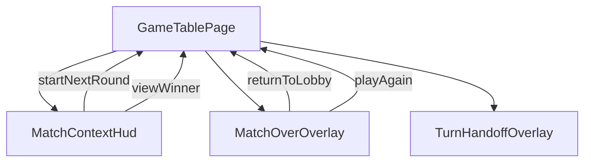

### 2.2 Actual Component Tree

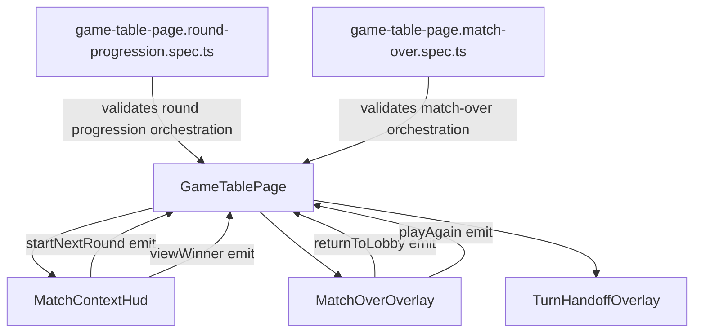

### 2.3 Drift Analysis

No structural drift was found between planned and actual component/service/routing architecture in T-9 scope. The observed mismatch is in test traceability intent: one assertion is mapped to SC-37 (fresh state reset) but relies on a mocked state mutation owned by the test double rather than proving runtime behavior.

## 3. Findings

### RV-01: SC-37 coverage is over-claimed by a mock-side-effect assertion [Major]
- **Category:** Test Quality
- **Severity:** Major
- **Related:** T-9, SC-37, FR-5.3, NFR-1.3, TR-2.2
- **Description:** The T-9 match-over suite asserts that round number resets to 1 after Play Again, but this value is produced by the test stub implementation of the engine initialization method.
- **Expected:** For Task T-9 at page orchestration level, tests should verify that Play Again unconditionally triggers initialization with current session configuration and clears local overlay state. Match reset semantics should be validated where real engine behavior is under test.
- **Actual:** The suite uses a mocked initializer that sets round state, then asserts that mocked state as evidence for SC-37.
- **Recommendation:** Keep page-level assertions focused on orchestration contract and relocate full fresh-state semantics to engine/e2e coverage where state transitions are exercised without mock tautology.
- **Impact:** This can create false confidence that SC-37 is fully validated in T-9 when the asserted reset behavior is owned by the test double.

## 4. Traceability Matrix

| Finding | Severity | Category | Related Spec | Status |
|---------|----------|----------|-------------|--------|
| RV-01 | Major | Test Quality | T-9, SC-37, FR-5.3, NFR-1.3, TR-2.2 | Open |

## 5. Spec Compliance Summary

| Requirement | Status | Notes |
|-------------|--------|-------|
| FR-1.1 | ⚠️ Partial | Round-complete lifecycle transition is only partially covered through signal gating checks. |
| FR-1.2 | ⚠️ Partial | No direct assertion on round number and top-score display in T-9 tests. |
| FR-1.3 | ⚠️ Partial | Name resolution is asserted, but full category rendering semantics are outside these suites. |
| FR-1.4 | ⚠️ Partial | Board inspectability is outside T-9 scope. |
| FR-1.5 | ⚠️ Partial | Action bar natural inactivity behavior is outside T-9 scope. |
| FR-2.1 | ⚠️ Partial | Visibility logic is covered at computed level, not full UI reachability. |
| FR-2.2 | ⚠️ Partial | Mutual gate logic is covered at computed level, not full UI lifecycle. |
| FR-2.3 | ✅ Met | Start-next-round orchestration event dispatch is directly asserted. |
| FR-2.4 | ⚠️ Partial | Full new-round board deal verification is outside T-9 scope. |
| FR-2.5 | ⚠️ Partial | Keyboard path coverage for Start Next Round is outside T-9 scope. |
| FR-2.6 | ⚠️ Partial | Accessible label verification for Start Next Round is outside T-9 scope. |
| FR-2.7 | ⚠️ Partial | View Winner transition trigger is asserted, but keyboard/label aspects are outside T-9 scope. |
| FR-3.1 | ⚠️ Partial | Explicit View Winner trigger path is covered; non-auto-open path is not asserted in T-9 suites. |
| FR-3.2 | ⚠️ Partial | Overlay activation is asserted, but full-screen layering semantics are not directly asserted. |
| FR-3.3 | ⚠️ Partial | Winner prominence rendering is outside T-9 scope. |
| FR-3.4 | ⚠️ Partial | Final accumulated score rendering is outside T-9 scope. |
| FR-3.5 | ⚠️ Partial | Escape/outside-click non-dismissal is outside T-9 scope. |
| FR-3.6 | ✅ Met | Background inert and aria-hidden masking is asserted for match-over and handoff overlay paths. |
| FR-4.1 | ⚠️ Partial | Return-to-lobby action presence is outside T-9 scope. |
| FR-4.2 | ✅ Met | Navigation to root route is directly asserted. |
| FR-4.3 | ⚠️ Partial | Session preservation after navigation is outside T-9 scope. |
| FR-4.4 | ⚠️ Partial | Keyboard operability for Return to Lobby is outside T-9 scope. |
| FR-5.1 | ⚠️ Partial | Play Again control presence is outside T-9 scope. |
| FR-5.2 | ⚠️ Partial | Same-session rematch semantics are outside T-9 scope. |
| FR-5.3 | ⚠️ Partial | Init call path is asserted, but fresh-state semantics are partially over-claimed (RV-01). |
| FR-5.4 | ⚠️ Partial | Overlay dismissal is asserted, but full board-ready lifecycle is not fully asserted. |
| FR-5.5 | ⚠️ Partial | Keyboard operability for Play Again is outside T-9 scope. |
| FR-6.1 | ⚠️ Partial | Focus transition into overlay is outside T-9 scope. |
| FR-6.2 | ⚠️ Partial | Modal role/name assertions are outside T-9 scope. |
| FR-6.3 | ⚠️ Partial | Focus restoration targets are outside T-9 scope. |
| FR-6.4 | ✅ Met | Live-region announcements for round completion and winner declaration are asserted. |
| FR-6.5 | ⚠️ Partial | Full control-label coverage is outside T-9 scope. |
| US-1 | ⚠️ Partial | Core round-progression orchestration is covered; full user flow remains outside T-9 scope. |
| US-2 | ⚠️ Partial | View Winner and overlay/inert orchestration are covered; full overlay UX semantics are outside T-9 scope. |
| US-3 | ⚠️ Partial | Root navigation trigger is covered; full lobby-return behavior is outside T-9 scope. |
| US-4 | ⚠️ Partial | Play Again orchestration is covered; full rematch behavior is partially over-claimed (RV-01). |
| US-5 | ⚠️ Partial | Board inspection behavior is outside T-9 scope. |
| US-6 | ⚠️ Partial | Name-resolution transform is covered; full breakdown UX behavior is outside T-9 scope. |
| NFR-1.1 | ✅ Met | Truth-table tests cover mutual exclusivity of continuation gates. |
| NFR-1.2 | ⚠️ Partial | Explicit-acknowledgment and non-auto-open are not fully asserted in T-9 suites. |
| NFR-1.3 | ⚠️ Partial | Rematch reset correctness is only partially evidenced because of mock tautology risk (RV-01). |
| NFR-1.4 | ⚠️ Partial | Round-complete cleanup after Start Next Round is not directly asserted in T-9 suites. |
| NFR-2.1 | ⚠️ Partial | Keyboard reachability assertions are outside T-9 scope. |
| NFR-2.2 | ⚠️ Partial | Announcements are partially covered; broader live-region consistency is outside T-9 scope. |
| NFR-3.1 | ⚠️ Partial | Component isolation requirement is outside T-9 scope. |
| NFR-3.2 | ⚠️ Partial | HUD contract typing maintainability is outside T-9 scope. |

## 6. Task Completion Summary

| Task | Title | Status | Findings |
|------|-------|--------|----------|
| T-9 | Unit tests - GameTablePage round progression and match-over flows | ⚠️ Partial | RV-01 |

## 7. Test Coverage Summary

| Scenario | Step Definitions | Meaningful | Findings |
|----------|-----------------|------------|----------|
| SC-01 | ❌ No | ❌ No | Out of T-9 scope |
| SC-02 | ❌ No | ❌ No | Out of T-9 scope |
| SC-03 | ❌ No | ⚠️ Partial | Name resolution is covered, full breakdown presentation is outside scope |
| SC-04 | ❌ No | ❌ No | Out of T-9 scope |
| SC-05 | ❌ No | ⚠️ Partial | Player name mapping is asserted through roundScoreBreakdown transformation |
| SC-06 | ❌ No | ❌ No | Out of T-9 scope |
| SC-07 | ❌ No | ❌ No | Breakdown/button disappearance after continuation is not directly asserted |
| SC-08 | ❌ No | ⚠️ Partial | Start Next Round gate logic is asserted at computed level |
| SC-09 | ❌ No | ⚠️ Partial | Hidden path for Start Next Round with winner is asserted at computed level |
| SC-10 | ❌ No | ⚠️ Partial | View Winner mutual exclusivity is asserted at computed level |
| SC-11 | ❌ No | ⚠️ Partial | Event dispatch is asserted; post-dispatch UI cleanup is not |
| SC-12 | ❌ No | ❌ No | Out of T-9 scope |
| SC-13 | ❌ No | ❌ No | Out of T-9 scope |
| SC-14 | ❌ No | ❌ No | Out of T-9 scope |
| SC-15 | ❌ No | ✅ Yes | View Winner trigger causes overlay activation |
| SC-16 | ❌ No | ❌ No | Out of T-9 scope |
| SC-17 | ❌ No | ⚠️ Partial | Overlay visibility is asserted, full-screen layering is not directly asserted |
| SC-18 | ❌ No | ❌ No | Out of T-9 scope |
| SC-19 | ❌ No | ❌ No | Out of T-9 scope |
| SC-20 | ❌ No | ❌ No | Out of T-9 scope |
| SC-21 | ❌ No | ❌ No | Out of T-9 scope |
| SC-22 | ❌ No | ❌ No | Out of T-9 scope |
| SC-23 | ❌ No | ✅ Yes | Inert and aria-hidden masking is directly asserted |
| SC-24 | ❌ No | ❌ No | Out of T-9 scope |
| SC-25 | ❌ No | ❌ No | Out of T-9 scope |
| SC-26 | ❌ No | ❌ No | Out of T-9 scope |
| SC-27 | ❌ No | ✅ Yes | Live-region winner announcement is directly asserted |
| SC-28 | ❌ No | ❌ No | Out of T-9 scope |
| SC-29 | ❌ No | ✅ Yes | Root navigation call is directly asserted |
| SC-30 | ❌ No | ❌ No | Out of T-9 scope |
| SC-31 | ❌ No | ❌ No | Out of T-9 scope |
| SC-32 | ❌ No | ❌ No | Out of T-9 scope |
| SC-33 | ❌ No | ❌ No | Out of T-9 scope |
| SC-34 | ❌ No | ❌ No | Out of T-9 scope |
| SC-35 | ❌ No | ⚠️ Partial | Overlay dismissal is asserted; full route-stability and board readiness are not |
| SC-36 | ❌ No | ❌ No | Out of T-9 scope |
| SC-37 | ❌ No | ⚠️ Partial | Round reset assertion depends on mock side effect (RV-01) |
| SC-38 | ❌ No | ❌ No | Out of T-9 scope |
| SC-39 | ❌ No | ✅ Yes | Non-null-state Play Again init trigger is directly asserted |
| SC-40 | ❌ No | ❌ No | Out of T-9 scope |
| SC-41 | ❌ No | ❌ No | Out of T-9 scope |
| SC-42 | ❌ No | ✅ Yes | Round-complete live announcement is directly asserted |

## 8. Test Quality Summary

| Test File | Type | Meaningful Assertions | Issues |
|-----------|------|----------------------|--------|
| src/app/features/game-board/game-table-page/game-table-page.round-progression.spec.ts | Unit | ✅ Yes | None identified in T-9 scope |
| src/app/features/game-board/game-table-page/game-table-page.match-over.spec.ts | Unit | ⚠️ Partial | SC-37 mapping includes a mock-side-effect assertion that overstates runtime reset confidence (RV-01) |

## 9. Security Cross-Reference

This section cross-references Critical and High security findings from the companion security report. See docs/specs/ui/round-progression/security-report.md for the full security analysis.

No Critical or High SEC findings are present in the currently available companion security report.

## 10. Recommendations

### Critical (blocks release)
1. None.

### Major (fix before merge)
1. Re-scope SC-37 evidence in T-9 so page-level tests verify orchestration contract only, while fresh-state reset semantics are validated in engine/e2e layers without mock tautology.

### Minor (improvement)
1. Add explicit post-start-next-round UI cleanup assertions in T-9 for stronger SC-11 traceability.

### Notes (informational)
1. This review is read-only and does not include runtime test execution evidence.
2. Security cross-reference uses the latest available companion report in scope.

<!-- Duplicate legacy report content below this line is a prior tooling artifact and is intentionally ignored for this T-9 review.
# Review Report: Round Progression and Match Over

**Review Mode:** Incremental (T-9: Unit tests - GameTablePage round progression and match-over flows, tests-only RED phase)
**Source:** docs/specs/ui/round-progression/
**Reviewed against:** proposal.md, spec.md, user-stories.md, bdd-test.md, design.md, tasks.md

## 1. Executive Summary

This incremental review is scoped to Task T-9 and evaluates test artifacts only, centered on the two GameTablePage unit suites for round progression and match-over orchestration. Coverage is strong for core orchestration assertions (truth tables, event dispatch, inert masking, navigation trigger, and live-region messages), but one test currently over-claims SC-37 behavior by asserting a state reset produced by the test stub itself rather than by real runtime behavior. In this scope, architecture remains aligned with the design.

- Total findings: 1 (0 Critical, 1 Major, 0 Minor, 0 Note)
- Spec compliance: 5 of 46 requirements fully met in this incremental scope
- Architecture alignment: aligned (with one scenario-traceability drift in test intent)
- Test quality: partially meaningful

## 2. Architecture Comparison

### 2.1 Planned Component Tree


### 2.2 Actual Component Tree


### 2.3 Drift Analysis

No structural drift was found between planned and actual component/service/routing architecture in T-9 scope. The observed mismatch is in test traceability intent: one assertion is mapped to SC-37 (fresh state reset) but relies on a mocked state mutation owned by the test double rather than proving runtime behavior.

## 3. Findings

### RV-01: SC-37 coverage is over-claimed by a mock-side-effect assertion [Major]
- **Category:** Test Quality
- **Severity:** Major
- **Related:** T-9, SC-37, FR-5.3, NFR-1.3, TR-2.2
- **Description:** The T-9 match-over suite asserts that round number resets to 1 after Play Again, but this value is produced by the test stub implementation of the engine initialization method.
- **Expected:** For Task T-9 at page orchestration level, tests should verify that Play Again unconditionally triggers initialization with current session configuration and clears local overlay state. Match reset semantics should be validated where real engine behavior is under test.
- **Actual:** The suite uses a mocked initializer that sets round state, then asserts that mocked state as evidence for SC-37.
- **Recommendation:** Keep page-level assertions focused on orchestration contract and relocate full fresh-state semantics to engine/e2e coverage where state transitions are exercised without mock tautology.
- **Impact:** This can create false confidence that SC-37 is fully validated in T-9 when the asserted reset behavior is owned by the test double.

## 4. Traceability Matrix

| Finding | Severity | Category | Related Spec | Status |
|---------|----------|----------|-------------|--------|
| RV-01 | Major | Test Quality | T-9, SC-37, FR-5.3, NFR-1.3, TR-2.2 | Open |

## 5. Spec Compliance Summary

| Requirement | Status | Notes |
|-------------|--------|-------|
| FR-1.1 | ⚠️ Partial | Round-complete lifecycle transition is only partially covered through signal gating checks. |
| FR-1.2 | ⚠️ Partial | No direct assertion on round number and top-score display in T-9 tests. |
| FR-1.3 | ⚠️ Partial | Name resolution is asserted, but full category rendering semantics are outside these suites. |
| FR-1.4 | ⚠️ Partial | Board inspectability is outside T-9 scope. |
| FR-1.5 | ⚠️ Partial | Action bar natural inactivity behavior is outside T-9 scope. |
| FR-2.1 | ⚠️ Partial | Visibility logic is covered at computed level, not full UI reachability. |
| FR-2.2 | ⚠️ Partial | Mutual gate logic is covered at computed level, not full UI lifecycle. |
| FR-2.3 | ✅ Met | Start-next-round orchestration event dispatch is directly asserted. |
| FR-2.4 | ⚠️ Partial | Full new-round board deal verification is outside T-9 scope. |
| FR-2.5 | ⚠️ Partial | Keyboard path coverage for Start Next Round is outside T-9 scope. |
| FR-2.6 | ⚠️ Partial | Accessible label verification for Start Next Round is outside T-9 scope. |
| FR-2.7 | ⚠️ Partial | View Winner transition trigger is asserted, but keyboard/label aspects are outside T-9 scope. |
| FR-3.1 | ⚠️ Partial | Explicit View Winner trigger path is covered; non-auto-open path is not asserted in T-9 suites. |
| FR-3.2 | ⚠️ Partial | Overlay activation is asserted, but full-screen layering semantics are not directly asserted. |
| FR-3.3 | ⚠️ Partial | Winner prominence rendering is outside T-9 scope. |
| FR-3.4 | ⚠️ Partial | Final accumulated score rendering is outside T-9 scope. |
| FR-3.5 | ⚠️ Partial | Escape/outside-click non-dismissal is outside T-9 scope. |
| FR-3.6 | ✅ Met | Background inert and aria-hidden masking is asserted for match-over and handoff overlay paths. |
| FR-4.1 | ⚠️ Partial | Return-to-lobby action presence is outside T-9 scope. |
| FR-4.2 | ✅ Met | Navigation to root route is directly asserted. |
| FR-4.3 | ⚠️ Partial | Session preservation after navigation is outside T-9 scope. |
| FR-4.4 | ⚠️ Partial | Keyboard operability for Return to Lobby is outside T-9 scope. |
| FR-5.1 | ⚠️ Partial | Play Again control presence is outside T-9 scope. |
| FR-5.2 | ⚠️ Partial | Same-session rematch semantics are outside T-9 scope. |
| FR-5.3 | ⚠️ Partial | Init call path is asserted, but fresh-state semantics are partially over-claimed (RV-01). |
| FR-5.4 | ⚠️ Partial | Overlay dismissal is asserted, but full board-ready lifecycle is not fully asserted. |
| FR-5.5 | ⚠️ Partial | Keyboard operability for Play Again is outside T-9 scope. |
| FR-6.1 | ⚠️ Partial | Focus transition into overlay is outside T-9 scope. |
| FR-6.2 | ⚠️ Partial | Modal role/name assertions are outside T-9 scope. |
| FR-6.3 | ⚠️ Partial | Focus restoration targets are outside T-9 scope. |
| FR-6.4 | ✅ Met | Live-region announcements for round completion and winner declaration are asserted. |
| FR-6.5 | ⚠️ Partial | Full control-label coverage is outside T-9 scope. |
| US-1 | ⚠️ Partial | Core round-progression orchestration is covered; full user flow remains outside T-9 scope. |
| US-2 | ⚠️ Partial | View Winner and overlay/inert orchestration are covered; full overlay UX semantics are outside T-9 scope. |
| US-3 | ⚠️ Partial | Root navigation trigger is covered; full lobby-return behavior is outside T-9 scope. |
| US-4 | ⚠️ Partial | Play Again orchestration is covered; full rematch behavior is partially over-claimed (RV-01). |
| US-5 | ⚠️ Partial | Board inspection behavior is outside T-9 scope. |
| US-6 | ⚠️ Partial | Name-resolution transform is covered; full breakdown UX behavior is outside T-9 scope. |
| NFR-1.1 | ✅ Met | Truth-table tests cover mutual exclusivity of continuation gates. |
| NFR-1.2 | ⚠️ Partial | Explicit-acknowledgment and non-auto-open are not fully asserted in T-9 suites. |
| NFR-1.3 | ⚠️ Partial | Rematch reset correctness is only partially evidenced because of mock tautology risk (RV-01). |
| NFR-1.4 | ⚠️ Partial | Round-complete cleanup after Start Next Round is not directly asserted in T-9 suites. |
| NFR-2.1 | ⚠️ Partial | Keyboard reachability assertions are outside T-9 scope. |
| NFR-2.2 | ⚠️ Partial | Announcements are partially covered; broader live-region consistency is outside T-9 scope. |
| NFR-3.1 | ⚠️ Partial | Component isolation requirement is outside T-9 scope. |
| NFR-3.2 | ⚠️ Partial | HUD contract typing maintainability is outside T-9 scope. |

## 6. Task Completion Summary

| Task | Title | Status | Findings |
|------|-------|--------|----------|
| T-9 | Unit tests - GameTablePage round progression and match-over flows | ⚠️ Partial | RV-01 |

## 7. Test Coverage Summary

| Scenario | Step Definitions | Meaningful | Findings |
|----------|-----------------|------------|----------|
| SC-01 | ❌ No | ❌ No | Out of T-9 scope |
| SC-02 | ❌ No | ❌ No | Out of T-9 scope |
| SC-03 | ❌ No | ⚠️ Partial | Name resolution is covered, full breakdown presentation is outside scope |
| SC-04 | ❌ No | ❌ No | Out of T-9 scope |
| SC-05 | ❌ No | ⚠️ Partial | Player name mapping is asserted through roundScoreBreakdown transformation |
| SC-06 | ❌ No | ❌ No | Out of T-9 scope |
| SC-07 | ❌ No | ❌ No | Breakdown/button disappearance after continuation is not directly asserted |
| SC-08 | ❌ No | ⚠️ Partial | Start Next Round gate logic is asserted at computed level |
| SC-09 | ❌ No | ⚠️ Partial | Hidden path for Start Next Round with winner is asserted at computed level |
| SC-10 | ❌ No | ⚠️ Partial | View Winner mutual exclusivity is asserted at computed level |
| SC-11 | ❌ No | ⚠️ Partial | Event dispatch is asserted; post-dispatch UI cleanup is not |
| SC-12 | ❌ No | ❌ No | Out of T-9 scope |
| SC-13 | ❌ No | ❌ No | Out of T-9 scope |
| SC-14 | ❌ No | ❌ No | Out of T-9 scope |
| SC-15 | ❌ No | ✅ Yes | View Winner trigger causes overlay activation |
| SC-16 | ❌ No | ❌ No | Out of T-9 scope |
| SC-17 | ❌ No | ⚠️ Partial | Overlay visibility is asserted, full-screen layering is not directly asserted |
| SC-18 | ❌ No | ❌ No | Out of T-9 scope |
| SC-19 | ❌ No | ❌ No | Out of T-9 scope |
| SC-20 | ❌ No | ❌ No | Out of T-9 scope |
| SC-21 | ❌ No | ❌ No | Out of T-9 scope |
| SC-22 | ❌ No | ❌ No | Out of T-9 scope |
| SC-23 | ❌ No | ✅ Yes | Inert and aria-hidden masking is directly asserted |
| SC-24 | ❌ No | ❌ No | Out of T-9 scope |
| SC-25 | ❌ No | ❌ No | Out of T-9 scope |
| SC-26 | ❌ No | ❌ No | Out of T-9 scope |
| SC-27 | ❌ No | ✅ Yes | Live-region winner announcement is directly asserted |
| SC-28 | ❌ No | ❌ No | Out of T-9 scope |
| SC-29 | ❌ No | ✅ Yes | Root navigation call is directly asserted |
| SC-30 | ❌ No | ❌ No | Out of T-9 scope |
| SC-31 | ❌ No | ❌ No | Out of T-9 scope |
| SC-32 | ❌ No | ❌ No | Out of T-9 scope |
| SC-33 | ❌ No | ❌ No | Out of T-9 scope |
| SC-34 | ❌ No | ❌ No | Out of T-9 scope |
| SC-35 | ❌ No | ⚠️ Partial | Overlay dismissal is asserted; full route-stability and board readiness are not |
| SC-36 | ❌ No | ❌ No | Out of T-9 scope |
| SC-37 | ❌ No | ⚠️ Partial | Round reset assertion depends on mock side effect (RV-01) |
| SC-38 | ❌ No | ❌ No | Out of T-9 scope |
| SC-39 | ❌ No | ✅ Yes | Non-null-state Play Again init trigger is directly asserted |
| SC-40 | ❌ No | ❌ No | Out of T-9 scope |
| SC-41 | ❌ No | ❌ No | Out of T-9 scope |
| SC-42 | ❌ No | ✅ Yes | Round-complete live announcement is directly asserted |

## 8. Test Quality Summary

| Test File | Type | Meaningful Assertions | Issues |
|-----------|------|----------------------|--------|
| src/app/features/game-board/game-table-page/game-table-page.round-progression.spec.ts | Unit | ✅ Yes | None identified in T-9 scope |
| src/app/features/game-board/game-table-page/game-table-page.match-over.spec.ts | Unit | ⚠️ Partial | SC-37 mapping includes a mock-side-effect assertion that overstates runtime reset confidence (RV-01) |

## 9. Security Cross-Reference

This section cross-references Critical and High security findings from the companion security report. See docs/specs/ui/round-progression/security-report.md for the full security analysis.

No Critical or High SEC findings are present in the currently available companion security report.

## 10. Recommendations

### Critical (blocks release)
1. None.

### Major (fix before merge)
1. Re-scope SC-37 evidence in T-9 so page-level tests verify orchestration contract only, while fresh-state reset semantics are validated in engine/e2e layers without mock tautology.

### Minor (improvement)
1. Add explicit post-start-next-round UI cleanup assertions in T-9 for stronger SC-11 traceability.

### Notes (informational)
1. This review is read-only and does not include runtime test execution evidence.
2. Security cross-reference uses the latest available companion report in scope.# Review Report: Round Progression and Match Over

Authoritative scope note: the first T-8 report block in this file is the active review output for this run.

**Review Mode:** Incremental (T-8: Unit tests - MatchOverOverlay)
**Source:** docs/specs/ui/round-progression/
**Reviewed against:** proposal.md, spec.md, user-stories.md, bdd-test.md, design.md, tasks.md

## 1. Executive Summary

This incremental review assessed Task T-8, focused on the MatchOverOverlay unit-test implementation and the corresponding overlay component contract. In this scoped review, the unit tests are behavior-oriented and cover winner rendering, co-winner rendering, accumulated score rendering, dialog semantics, non-dismissal paths for Escape and backdrop-shell clicks, and explicit action outputs. No evidence-based defects were identified in T-8 scope.

- Total findings: 0 (0 Critical, 0 Major, 0 Minor, 0 Note)
- Spec compliance: 7 of 46 requirements met in this incremental scope
- Architecture alignment: aligned
- Test quality: meaningful

## 2. Architecture Comparison

### 2.1 Planned Component Tree

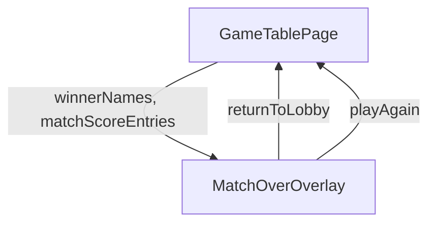

### 2.2 Actual Component Tree

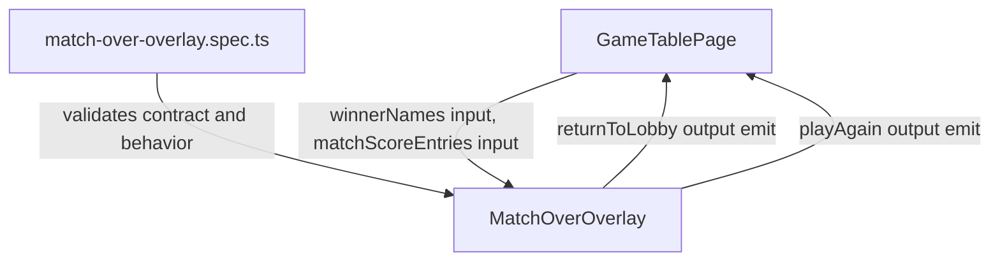

### 2.3 Drift Analysis

No architecture drift was identified in T-8 scope. The component remains presentational, input-driven, and output-driven, consistent with AD-3 and TR-1.2.

### 2.4 Planned vs Actual Service Dependencies (if drift detected)

No service dependency drift was detected in this incremental scope. MatchOverOverlay remains free of injected runtime service dependencies.

## 3. Findings

No findings were identified for Task T-8 scope.

## 4. Traceability Matrix

| Finding | Severity | Category | Related Spec | Status |
|---------|----------|----------|-------------|--------|
| None | None | None | T-8 | Closed |

## 5. Spec Compliance Summary

| Requirement | Status | Notes |
|-------------|--------|-------|
| FR-1.1 | Partial | Round-complete lifecycle gating is outside T-8 scope. |
| FR-1.2 | Partial | Round-number/top-score HUD behavior is outside T-8 scope. |
| FR-1.3 | Partial | Round score breakdown behavior is outside T-8 scope. |
| FR-1.4 | Partial | Board-zone visibility behavior is outside T-8 scope. |
| FR-1.5 | Partial | Action-bar inactive-state behavior is outside T-8 scope. |
| FR-2.1 | Partial | Start Next Round visibility behavior is outside T-8 scope. |
| FR-2.2 | Partial | View Winner replacement behavior is outside T-8 scope. |
| FR-2.3 | Partial | startNextRound orchestration is outside T-8 scope. |
| FR-2.4 | Partial | New-round board transition is outside T-8 scope. |
| FR-2.5 | Partial | Start Next Round keyboard-path validation is outside T-8 scope. |
| FR-2.6 | Partial | Start Next Round accessible-label validation is outside T-8 scope. |
| FR-2.7 | Partial | View Winner transition orchestration is outside T-8 scope. |
| FR-3.1 | Partial | Explicit player acknowledgment gate is orchestrated in parent scope. |
| FR-3.2 | Partial | Overlay shell exists with full-screen styling hooks; full route-level layering behavior is outside T-8 scope. |
| FR-3.3 | Met | Unit tests verify sole-winner and co-winner name rendering behavior. |
| FR-3.4 | Met | Unit tests verify accumulated match-score rows are rendered for all provided players. |
| FR-3.5 | Met | Unit tests verify no dismissal output is emitted on Escape and backdrop-shell click. |
| FR-3.6 | Partial | Background inert and aria-hidden behavior is parent-template orchestration, outside T-8 scope. |
| FR-4.1 | Met | Unit tests verify explicit Return to Lobby action is present with label. |
| FR-4.2 | Partial | Router navigation behavior is outside T-8 scope. |
| FR-4.3 | Partial | Session-preservation behavior is outside T-8 scope. |
| FR-4.4 | Partial | Return to Lobby keyboard reachability is outside T-8 scope. |
| FR-5.1 | Met | Unit tests verify explicit Play Again action is present with label. |
| FR-5.2 | Partial | Same-configuration rematch behavior is outside T-8 scope. |
| FR-5.3 | Partial | Unconditional initGame orchestration is outside T-8 scope. |
| FR-5.4 | Partial | Overlay-dismiss plus fresh-board transition is outside T-8 scope. |
| FR-5.5 | Partial | Play Again keyboard reachability is outside T-8 scope. |
| FR-6.1 | Partial | Focus handoff into overlay is outside T-8 scope. |
| FR-6.2 | Met | Unit tests verify dialog semantics and accessible naming attributes. |
| FR-6.3 | Partial | Focus restoration after exit actions is outside T-8 scope. |
| FR-6.4 | Partial | Live-region winner announcements are outside T-8 scope. |
| FR-6.5 | Partial | This task validates overlay action labels only; full-feature control coverage is outside T-8 scope. |
| US-1 | Partial | Round continuation flow is outside T-8 scope. |
| US-2 | Partial | Overlay content and semantics are covered; gating, inert-background, and focus-flow orchestration are outside T-8 scope. |
| US-3 | Partial | Return-to-lobby button presence is covered; navigation and session behavior are outside T-8 scope. |
| US-4 | Partial | Play Again button presence is covered; full rematch lifecycle behavior is outside T-8 scope. |
| US-5 | Partial | Board-inspection behavior is outside T-8 scope. |
| US-6 | Partial | Round score-breakdown behavior is outside T-8 scope. |
| NFR-1.1 | Partial | Mutual exclusivity of continuation buttons is outside T-8 scope. |
| NFR-1.2 | Partial | Match-over acknowledgment gate and winner-null visibility constraints are outside T-8 scope. |
| NFR-1.3 | Partial | Fresh rematch correctness is outside T-8 scope. |
| NFR-1.4 | Partial | Post-start-next-round HUD clearing behavior is outside T-8 scope. |
| NFR-2.1 | Partial | Keyboard operability of all new controls is outside T-8 scope. |
| NFR-2.2 | Partial | Live-region consistency behavior is outside T-8 scope. |
| NFR-3.1 | Met | Overlay remains self-contained and testable via inputs and outputs only. |
| NFR-3.2 | Partial | HUD score-breakdown contract typing is outside T-8 scope. |

## 6. Task Completion Summary

| Task | Title | Status | Findings |
|------|-------|--------|----------|
| T-8 | Unit tests - MatchOverOverlay | Complete | None |

## 7. Test Coverage Summary

| Scenario | Step Definitions | Meaningful | Findings |
|----------|-----------------|------------|----------|
| SC-01 | No | No | Out of T-8 scope |
| SC-02 | No | No | Out of T-8 scope |
| SC-03 | No | No | Out of T-8 scope |
| SC-04 | No | No | Out of T-8 scope |
| SC-05 | No | No | Out of T-8 scope |
| SC-06 | No | No | Out of T-8 scope |
| SC-07 | No | No | Out of T-8 scope |
| SC-08 | No | No | Out of T-8 scope |
| SC-09 | No | No | Out of T-8 scope |
| SC-10 | No | No | Out of T-8 scope |
| SC-11 | No | No | Out of T-8 scope |
| SC-12 | No | No | Out of T-8 scope |
| SC-13 | No | No | Out of T-8 scope |
| SC-14 | No | No | Out of T-8 scope |
| SC-15 | No | No | Out of T-8 scope |
| SC-16 | No | No | Out of T-8 scope |
| SC-17 | No | Partial | Unit test verifies overlay shell hook presence; full route-level layering remains outside this scope. |
| SC-18 | No | Yes | Sole winner rendering is directly asserted. |
| SC-19 | No | Yes | Co-winner rendering and equal presentation hooks are directly asserted. |
| SC-20 | No | Yes | Accumulated match-score rendering is directly asserted. |
| SC-21 | No | Yes | Escape non-dismissal output behavior is directly asserted. |
| SC-22 | No | Yes | Backdrop-shell click non-dismissal output behavior is directly asserted. |
| SC-23 | No | No | Inert and aria-hidden background behavior is outside T-8 scope. |
| SC-24 | No | No | View Winner keyboard behavior is outside T-8 scope. |
| SC-25 | No | Yes | Dialog role and accessible naming behavior is directly asserted. |
| SC-26 | No | No | Focus-entry orchestration is outside T-8 scope. |
| SC-27 | No | No | Live-region winner announcement behavior is outside T-8 scope. |
| SC-28 | No | Yes | Return to Lobby action presence is directly asserted. |
| SC-29 | No | Partial | Component output emission is asserted; router navigation behavior is outside T-8 scope. |
| SC-30 | No | No | Session prefill behavior is outside T-8 scope. |
| SC-31 | No | No | Repeated navigation guard behavior is outside T-8 scope. |
| SC-32 | No | No | Return to Lobby keyboard behavior is outside T-8 scope. |
| SC-33 | No | No | Lobby focus placement is outside T-8 scope. |
| SC-34 | No | Yes | Play Again action presence is directly asserted. |
| SC-35 | No | Partial | Component output emission is asserted; full overlay-dismiss plus new-board lifecycle is outside T-8 scope. |
| SC-36 | No | No | Same-configuration rematch behavior is outside T-8 scope. |
| SC-37 | No | No | Round reset and score reset behavior is outside T-8 scope. |
| SC-38 | No | No | Post-rematch board interactivity is outside T-8 scope. |
| SC-39 | No | No | initGame guard-bypass behavior is outside T-8 scope. |
| SC-40 | No | No | Play Again keyboard behavior is outside T-8 scope. |
| SC-41 | No | No | Focus-return to Submit Play is outside T-8 scope. |
| SC-42 | No | No | Round-complete live-region behavior is outside T-8 scope. |

## 8. Test Quality Summary

| Test File | Type | Meaningful Assertions | Issues |
|-----------|------|----------------------|--------|
| src/app/features/game-board/game-table-page/components/match-over-overlay/match-over-overlay.spec.ts | Unit | Yes | None identified in T-8 scope. |

## 9. Security Cross-Reference

This section cross-references Critical and High security findings from the companion security-report.md. See docs/specs/ui/round-progression/security-report.md for full security analysis.

No Critical or High SEC findings are currently present in the available companion security report.

## 10. Recommendations

### Critical (blocks release)
1. None.

### Major (fix before merge)
1. None.

### Minor (improvement)
1. None.

### Notes (informational)
1. Keep scenario-to-test traceability comments in match-over-overlay.spec.ts synchronized with bdd-test.md when scenario ownership changes.
2. Attach targeted Vitest execution evidence in delivery workflow when closing T-8 acceptance.
# Review Report: Round Progression and Match Over

**Review Mode:** Incremental (T-8: Unit tests - MatchOverOverlay)
**Source:** docs/specs/ui/round-progression/
**Reviewed against:** proposal.md, spec.md, user-stories.md, bdd-test.md, design.md, tasks.md

## 1. Executive Summary

This incremental review assessed Task T-8, focused on the MatchOverOverlay unit-test implementation and the corresponding overlay component contract. In this scoped review, the unit tests are behavior-oriented and cover winner rendering, co-winner rendering, accumulated score rendering, dialog semantics, non-dismissal paths for Escape and backdrop-shell clicks, and explicit action outputs. No evidence-based defects were identified in T-8 scope.

- Total findings: 0 (0 Critical, 0 Major, 0 Minor, 0 Note)
- Spec compliance: 7 of 46 requirements met in this incremental scope
- Architecture alignment: aligned
- Test quality: meaningful

## 2. Architecture Comparison

### 2.1 Planned Component Tree


### 2.2 Actual Component Tree


### 2.3 Drift Analysis

No architecture drift was identified in T-8 scope. The component remains presentational, input-driven, and output-driven, consistent with AD-3 and TR-1.2.

### 2.4 Planned vs Actual Service Dependencies (if drift detected)

No service dependency drift was detected in this incremental scope. MatchOverOverlay remains free of injected runtime service dependencies.

## 3. Findings

No findings were identified for Task T-8 scope.

## 4. Traceability Matrix

| Finding | Severity | Category | Related Spec | Status |
|---------|----------|----------|-------------|--------|
| None | None | None | T-8 | Closed |

## 5. Spec Compliance Summary

| Requirement | Status | Notes |
|-------------|--------|-------|
| FR-1.1 | Partial | Round-complete lifecycle gating is outside T-8 scope. |
| FR-1.2 | Partial | Round-number/top-score HUD behavior is outside T-8 scope. |
| FR-1.3 | Partial | Round score breakdown behavior is outside T-8 scope. |
| FR-1.4 | Partial | Board-zone visibility behavior is outside T-8 scope. |
| FR-1.5 | Partial | Action-bar inactive-state behavior is outside T-8 scope. |
| FR-2.1 | Partial | Start Next Round visibility behavior is outside T-8 scope. |
| FR-2.2 | Partial | View Winner replacement behavior is outside T-8 scope. |
| FR-2.3 | Partial | startNextRound orchestration is outside T-8 scope. |
| FR-2.4 | Partial | New-round board transition is outside T-8 scope. |
| FR-2.5 | Partial | Start Next Round keyboard-path validation is outside T-8 scope. |
| FR-2.6 | Partial | Start Next Round accessible-label validation is outside T-8 scope. |
| FR-2.7 | Partial | View Winner transition orchestration is outside T-8 scope. |
| FR-3.1 | Partial | Explicit player acknowledgment gate is orchestrated in parent scope. |
| FR-3.2 | Partial | Overlay shell exists with full-screen styling hooks; full route-level layering behavior is outside T-8 scope. |
| FR-3.3 | Met | Unit tests verify sole-winner and co-winner name rendering behavior. |
| FR-3.4 | Met | Unit tests verify accumulated match-score rows are rendered for all provided players. |
| FR-3.5 | Met | Unit tests verify no dismissal output is emitted on Escape and backdrop-shell click. |
| FR-3.6 | Partial | Background inert and aria-hidden behavior is parent-template orchestration, outside T-8 scope. |
| FR-4.1 | Met | Unit tests verify explicit Return to Lobby action is present with label. |
| FR-4.2 | Partial | Router navigation behavior is outside T-8 scope. |
| FR-4.3 | Partial | Session-preservation behavior is outside T-8 scope. |
| FR-4.4 | Partial | Return to Lobby keyboard reachability is outside T-8 scope. |
| FR-5.1 | Met | Unit tests verify explicit Play Again action is present with label. |
| FR-5.2 | Partial | Same-configuration rematch behavior is outside T-8 scope. |
| FR-5.3 | Partial | Unconditional initGame orchestration is outside T-8 scope. |
| FR-5.4 | Partial | Overlay-dismiss plus fresh-board transition is outside T-8 scope. |
| FR-5.5 | Partial | Play Again keyboard reachability is outside T-8 scope. |
| FR-6.1 | Partial | Focus handoff into overlay is outside T-8 scope. |
| FR-6.2 | Met | Unit tests verify dialog semantics and accessible naming attributes. |
| FR-6.3 | Partial | Focus restoration after exit actions is outside T-8 scope. |
| FR-6.4 | Partial | Live-region winner announcements are outside T-8 scope. |
| FR-6.5 | Partial | This task validates overlay action labels only; full-feature control coverage is outside T-8 scope. |
| US-1 | Partial | Round continuation flow is outside T-8 scope. |
| US-2 | Partial | Overlay content/semantics are covered; gating, inert-background, and focus-flow orchestration are outside T-8 scope. |
| US-3 | Partial | Return-to-lobby button presence is covered; navigation/session behavior is outside T-8 scope. |
| US-4 | Partial | Play Again button presence is covered; full rematch lifecycle behavior is outside T-8 scope. |
| US-5 | Partial | Board-inspection behavior is outside T-8 scope. |
| US-6 | Partial | Round score-breakdown behavior is outside T-8 scope. |
| NFR-1.1 | Partial | Mutual exclusivity of continuation buttons is outside T-8 scope. |
| NFR-1.2 | Partial | Match-over acknowledgment gate and winner-null visibility constraints are outside T-8 scope. |
| NFR-1.3 | Partial | Fresh rematch correctness is outside T-8 scope. |
| NFR-1.4 | Partial | Post-start-next-round HUD clearing behavior is outside T-8 scope. |
| NFR-2.1 | Partial | Keyboard operability of all new controls is outside T-8 scope. |
| NFR-2.2 | Partial | Live-region consistency behavior is outside T-8 scope. |
| NFR-3.1 | Met | Overlay remains self-contained and testable via inputs and outputs only. |
| NFR-3.2 | Partial | HUD score-breakdown contract typing is outside T-8 scope. |

## 6. Task Completion Summary

| Task | Title | Status | Findings |
|------|-------|--------|----------|
| T-8 | Unit tests - MatchOverOverlay | Complete | None |

## 7. Test Coverage Summary

| Scenario | Step Definitions | Meaningful | Findings |
|----------|-----------------|------------|----------|
| SC-01 | No | No | Out of T-8 scope |
| SC-02 | No | No | Out of T-8 scope |
| SC-03 | No | No | Out of T-8 scope |
| SC-04 | No | No | Out of T-8 scope |
| SC-05 | No | No | Out of T-8 scope |
| SC-06 | No | No | Out of T-8 scope |
| SC-07 | No | No | Out of T-8 scope |
| SC-08 | No | No | Out of T-8 scope |
| SC-09 | No | No | Out of T-8 scope |
| SC-10 | No | No | Out of T-8 scope |
| SC-11 | No | No | Out of T-8 scope |
| SC-12 | No | No | Out of T-8 scope |
| SC-13 | No | No | Out of T-8 scope |
| SC-14 | No | No | Out of T-8 scope |
| SC-15 | No | No | Out of T-8 scope |
| SC-16 | No | No | Out of T-8 scope |
| SC-17 | No | Partial | Unit test verifies overlay shell hook presence; full route-level layering remains outside this scope |
| SC-18 | No | Yes | Sole winner rendering is directly asserted |
| SC-19 | No | Yes | Co-winner rendering and equal presentation hooks are directly asserted |
| SC-20 | No | Yes | Accumulated match-score rendering is directly asserted |
| SC-21 | No | Yes | Escape non-dismissal output behavior is directly asserted |
| SC-22 | No | Yes | Backdrop-shell click non-dismissal output behavior is directly asserted |
| SC-23 | No | No | Inert and aria-hidden background behavior is outside T-8 scope |
| SC-24 | No | No | View Winner keyboard behavior is outside T-8 scope |
| SC-25 | No | Yes | Dialog role and accessible naming behavior is directly asserted |
| SC-26 | No | No | Focus-entry orchestration is outside T-8 scope |
| SC-27 | No | No | Live-region winner announcement behavior is outside T-8 scope |
| SC-28 | No | Yes | Return to Lobby action presence is directly asserted |
| SC-29 | No | Partial | Component output emission is asserted; router navigation behavior is outside T-8 scope |
| SC-30 | No | No | Session prefill behavior is outside T-8 scope |
| SC-31 | No | No | Repeated navigation guard behavior is outside T-8 scope |
| SC-32 | No | No | Return to Lobby keyboard behavior is outside T-8 scope |
| SC-33 | No | No | Lobby focus placement is outside T-8 scope |
| SC-34 | No | Yes | Play Again action presence is directly asserted |
| SC-35 | No | Partial | Component output emission is asserted; full overlay-dismiss plus new-board lifecycle is outside T-8 scope |
| SC-36 | No | No | Same-configuration rematch behavior is outside T-8 scope |
| SC-37 | No | No | Round reset and score reset behavior is outside T-8 scope |
| SC-38 | No | No | Post-rematch board interactivity is outside T-8 scope |
| SC-39 | No | No | initGame guard-bypass behavior is outside T-8 scope |
| SC-40 | No | No | Play Again keyboard behavior is outside T-8 scope |
| SC-41 | No | No | Focus-return to Submit Play is outside T-8 scope |
| SC-42 | No | No | Round-complete live-region behavior is outside T-8 scope |

## 8. Test Quality Summary

| Test File | Type | Meaningful Assertions | Issues |
|-----------|------|----------------------|--------|
| src/app/features/game-board/game-table-page/components/match-over-overlay/match-over-overlay.spec.ts | Unit | Yes | None identified in T-8 scope |

## 9. Security Cross-Reference

This section cross-references Critical and High security findings from the companion security-report.md. See docs/specs/ui/round-progression/security-report.md for full security analysis.

No Critical or High SEC findings are currently present in the available companion security report.

## 10. Recommendations

### Critical (blocks release)
1. None.

### Major (fix before merge)
1. None.

### Minor (improvement)
1. None.

### Notes (informational)
1. Keep scenario-to-test traceability comments in match-over-overlay.spec.ts synchronized with bdd-test.md when scenario ownership changes.
2. Attach targeted Vitest execution evidence in delivery workflow when closing T-8 acceptance.# Review Report: Round Progression and Match Over

**Review Mode:** Incremental (T-7: Unit tests - MatchContextHud updates)
**Source:** docs/specs/ui/round-progression/
**Reviewed against:** proposal.md, spec.md, user-stories.md, bdd-test.md, design.md, tasks.md

## 1. Executive Summary

This incremental review assessed Task T-7 implementation quality against planned behavior for MatchContextHud unit tests. In T-7 scope, no evidence-based implementation defects or test-quality anti-patterns were identified. Assertions are behavior-oriented and cover breakdown rendering, zero-value visibility, continuation button gating, output emission, keyboard operability, and Spanish accessibility labels. Residual risk is limited to runtime execution evidence, which was not exercised in this read-only review mode.

- Total findings: 0 (0 Critical, 0 Major, 0 Minor, 0 Note)
- Spec compliance: 6 of 46 requirements met in this incremental scope
- Architecture alignment: aligned
- Test quality: meaningful

## 2. Architecture Comparison

### 2.1 Planned Component Tree

```mermaid
graph TD
    GTP["GameTablePage"]
    MCH["MatchContextHud"]

    GTP -->|showStartNextRound, showViewWinner, roundScoreBreakdown, matchWinner| MCH
    MCH -->|startNextRound output| GTP
    MCH -->|viewWinner output| GTP
```

### 2.2 Actual Component Tree

```mermaid
graph TD
    GTP["GameTablePage"]
    MCH["MatchContextHud"]

    GTP -->|showStartNextRoundButton(), showViewWinnerButton(), roundScoreBreakdown(), matchWinner()| MCH
    MCH -->|startNextRound emit| GTP
    MCH -->|viewWinner emit| GTP
```

### 2.3 Drift Analysis

No architecture drift was identified in T-7 scope. The observed parent-child contract remains consistent with AD-2 and TR-1.1: GameTablePage provides state as inputs, and MatchContextHud emits continuation actions as outputs.

### 2.4 Planned vs Actual Service Dependencies (if drift detected)

No meaningful service dependency drift was detected in this incremental scope.

## 3. Findings

No findings were identified for Task T-7 scope.

## 4. Traceability Matrix

| Finding | Severity | Category | Related Spec | Status |
|---------|----------|----------|-------------|--------|
| None | None | None | T-7 | Closed |

## 5. Spec Compliance Summary

| Requirement | Status | Notes |
|-------------|--------|-------|
| FR-1.1 | ⚠️ Partial | Full round-complete lifecycle is outside T-7 unit-test scope. |
| FR-1.2 | ✅ Met | Round number and top-score display are asserted in the HUD test suite. |
| FR-1.3 | ⚠️ Partial | Breakdown categories, zero values, and player-name rendering are asserted; playerId-to-name resolution belongs to parent orchestration scope. |
| FR-1.4 | ⚠️ Partial | Board-zone visibility is outside T-7 scope. |
| FR-1.5 | ⚠️ Partial | Action-bar inactivity behavior is outside T-7 scope. |
| FR-2.1 | ⚠️ Partial | Start Next Round rendering by input is covered; engine-signal gating belongs to parent scope. |
| FR-2.2 | ⚠️ Partial | View Winner rendering and mutual exclusion are covered at HUD level; winner-signal orchestration is parent scope. |
| FR-2.3 | ⚠️ Partial | Engine startNextRound call is outside HUD unit-test scope; T-7 validates output emission. |
| FR-2.4 | ⚠️ Partial | New-round board transition is outside T-7 scope. |
| FR-2.5 | ✅ Met | Keyboard focusability and Enter activation are asserted for Start Next Round. |
| FR-2.6 | ✅ Met | Spanish accessible label is asserted for Start Next Round. |
| FR-2.7 | ⚠️ Partial | View Winner keyboard operability and output emission are covered; overlay transition is outside T-7 scope. |
| FR-3.1 | ⚠️ Partial | Match-over gate behavior is outside T-7 scope. |
| FR-3.2 | ⚠️ Partial | Full-screen overlay rendering is outside T-7 scope. |
| FR-3.3 | ⚠️ Partial | Winner/co-winner overlay presentation is outside T-7 scope. |
| FR-3.4 | ⚠️ Partial | Final accumulated match-score overlay behavior is outside T-7 scope. |
| FR-3.5 | ⚠️ Partial | Overlay dismissal constraints are outside T-7 scope. |
| FR-3.6 | ⚠️ Partial | Background inert and aria-hidden masking is outside T-7 scope. |
| FR-4.1 | ⚠️ Partial | Return to Lobby overlay action is outside T-7 scope. |
| FR-4.2 | ⚠️ Partial | Root-route navigation behavior is outside T-7 scope. |
| FR-4.3 | ⚠️ Partial | Session-preservation behavior is outside T-7 scope. |
| FR-4.4 | ⚠️ Partial | Return to Lobby keyboard behavior is outside T-7 scope. |
| FR-5.1 | ⚠️ Partial | Play Again overlay action is outside T-7 scope. |
| FR-5.2 | ⚠️ Partial | Same-configuration rematch behavior is outside T-7 scope. |
| FR-5.3 | ⚠️ Partial | Unconditional initGame orchestration is outside T-7 scope. |
| FR-5.4 | ⚠️ Partial | Overlay-dismiss and fresh-board transition is outside T-7 scope. |
| FR-5.5 | ⚠️ Partial | Play Again keyboard behavior is outside T-7 scope. |
| FR-6.1 | ⚠️ Partial | Overlay focus-entry behavior is outside T-7 scope. |
| FR-6.2 | ⚠️ Partial | Overlay role and naming semantics are outside T-7 scope. |
| FR-6.3 | ⚠️ Partial | Focus-restoration behavior is outside T-7 scope. |
| FR-6.4 | ⚠️ Partial | Live-region orchestration is outside T-7 scope. |
| FR-6.5 | ✅ Met | New continuation controls expose meaningful Spanish labels. |
| US-1 | ⚠️ Partial | HUD continuation and accessibility behaviors are covered; end-to-end round progression is outside T-7 scope. |
| US-2 | ⚠️ Partial | View Winner trigger behavior is covered; overlay lifecycle is outside T-7 scope. |
| US-3 | ⚠️ Partial | Outside T-7 scope. |
| US-4 | ⚠️ Partial | Outside T-7 scope. |
| US-5 | ⚠️ Partial | Board-inspection behavior is outside T-7 scope. |
| US-6 | ⚠️ Partial | Breakdown content behavior is covered; full lifecycle and orchestration behavior is outside T-7 scope. |
| NFR-1.1 | ✅ Met | Continuation controls are asserted as mutually exclusive. |
| NFR-1.2 | ⚠️ Partial | Overlay acknowledgment and visibility gate behavior is outside T-7 scope. |
| NFR-1.3 | ⚠️ Partial | Fresh rematch-state validation is outside T-7 scope. |
| NFR-1.4 | ⚠️ Partial | Full post-start-next-round lifecycle behavior is outside T-7 scope. |
| NFR-2.1 | ✅ Met | Keyboard reachability and operability are asserted for both continuation controls. |
| NFR-2.2 | ⚠️ Partial | Live-region behavior is outside T-7 scope. |
| NFR-3.1 | ⚠️ Partial | MatchOverOverlay self-containment is outside T-7 scope. |
| NFR-3.2 | ⚠️ Partial | Contract-decoupling checks for HUD input model are outside T-7 scope. |

## 6. Task Completion Summary

| Task | Title | Status | Findings |
|------|-------|--------|----------|
| T-7 | Unit tests - MatchContextHud updates | ✅ Complete | None |

## 7. Test Coverage Summary

| Scenario | Step Definitions | Meaningful | Findings |
|----------|-----------------|------------|----------|
| SC-01 | ❌ No | ❌ No | Out of T-7 scope |
| SC-02 | ❌ No | ✅ Yes | — |
| SC-03 | ❌ No | ✅ Yes | — |
| SC-04 | ❌ No | ✅ Yes | — |
| SC-05 | ❌ No | ✅ Yes | — |
| SC-06 | ❌ No | ❌ No | Out of T-7 scope |
| SC-07 | ❌ No | ⚠️ Partial | Breakdown absence is covered, full transition orchestration is outside scope |
| SC-08 | ❌ No | ⚠️ Partial | Visibility by HUD input is covered, full state-gate orchestration is outside scope |
| SC-09 | ❌ No | ⚠️ Partial | Hidden-path by HUD input is covered, winner-signal orchestration is outside scope |
| SC-10 | ❌ No | ⚠️ Partial | Mutual exclusivity and View Winner rendering are covered at HUD level |
| SC-11 | ❌ No | ⚠️ Partial | Output emission is covered, engine call path is outside scope |
| SC-12 | ❌ No | ❌ No | Out of T-7 scope |
| SC-13 | ❌ No | ✅ Yes | — |
| SC-14 | ❌ No | ✅ Yes | — |
| SC-15 | ❌ No | ⚠️ Partial | View Winner output emission is covered, overlay transition is outside scope |
| SC-16 | ❌ No | ❌ No | Out of T-7 scope |
| SC-17 | ❌ No | ❌ No | Out of T-7 scope |
| SC-18 | ❌ No | ❌ No | Out of T-7 scope |
| SC-19 | ❌ No | ❌ No | Out of T-7 scope |
| SC-20 | ❌ No | ❌ No | Out of T-7 scope |
| SC-21 | ❌ No | ❌ No | Out of T-7 scope |
| SC-22 | ❌ No | ❌ No | Out of T-7 scope |
| SC-23 | ❌ No | ❌ No | Out of T-7 scope |
| SC-24 | ❌ No | ✅ Yes | — |
| SC-25 | ❌ No | ❌ No | Out of T-7 scope |
| SC-26 | ❌ No | ❌ No | Out of T-7 scope |
| SC-27 | ❌ No | ❌ No | Out of T-7 scope |
| SC-28 | ❌ No | ❌ No | Out of T-7 scope |
| SC-29 | ❌ No | ❌ No | Out of T-7 scope |
| SC-30 | ❌ No | ❌ No | Out of T-7 scope |
| SC-31 | ❌ No | ❌ No | Out of T-7 scope |
| SC-32 | ❌ No | ❌ No | Out of T-7 scope |
| SC-33 | ❌ No | ❌ No | Out of T-7 scope |
| SC-34 | ❌ No | ❌ No | Out of T-7 scope |
| SC-35 | ❌ No | ❌ No | Out of T-7 scope |
| SC-36 | ❌ No | ❌ No | Out of T-7 scope |
| SC-37 | ❌ No | ❌ No | Out of T-7 scope |
| SC-38 | ❌ No | ❌ No | Out of T-7 scope |
| SC-39 | ❌ No | ❌ No | Out of T-7 scope |
| SC-40 | ❌ No | ❌ No | Out of T-7 scope |
| SC-41 | ❌ No | ❌ No | Out of T-7 scope |
| SC-42 | ❌ No | ❌ No | Out of T-7 scope |

## 8. Test Quality Summary

| Test File | Type | Meaningful Assertions | Issues |
|-----------|------|----------------------|--------|
| src/app/features/game-board/game-table-page/components/match-context-hud/match-context-hud.spec.ts | Unit | ✅ Yes | None identified in T-7 scope |

## 9. Security Cross-Reference

This section cross-references Critical and High security findings from the companion security-report.md. See docs/specs/ui/round-progression/security-report.md for the full security analysis.

No Critical or High security findings were reported for incremental T-7 scope.

## 10. Recommendations

### Critical (blocks release)
1. None.

### Major (fix before merge)
1. None.

### Minor (improvement)
1. None.

### Notes (informational)
1. Attach targeted Vitest execution evidence for T-7 acceptance closure in the implementation workflow.
2. Keep scenario traceability comments in the unit suite synchronized with bdd-test.md when tests are renamed or re-scoped.

<div hidden>
<summary>Legacy Draft Artifacts (collapsed)</summary>

# Review Report: Round Progression and Match Over

**Review Mode:** Incremental (T-7: Unit tests - MatchContextHud updates)
**Source:** docs/specs/ui/round-progression/
**Reviewed against:** proposal.md, spec.md, user-stories.md, bdd-test.md, design.md, tasks.md

## 1. Executive Summary

This incremental review validates Task T-7 implementation for MatchContextHud unit tests against the feature specification and design. The test suite is behavior-focused and covers the core T-7 goals: breakdown rendering, zero-value visibility, continuation button visibility, keyboard operation, output emission, and Spanish accessibility labels. One minor traceability gap remains in SC-19 mapping, where HUD-level coverage is currently tagged against an overlay-specific scenario, and runtime execution evidence for the explicit vitest acceptance criterion was not part of this read-only review activity.

- Total findings: 2 (0 Critical, 0 Major, 1 Minor, 1 Note)
- Spec compliance: 8 of 46 requirements fully met in this incremental scope
- Architecture alignment: aligned
- Test quality: partially meaningful

## 2. Architecture Comparison

### 2.1 Planned Component Tree

```mermaid
graph TD
    GTP["GameTablePage\nSmart container"]
    MCH["MatchContextHud\nPresentational"]

    GTP -->|"showStartNextRound, showViewWinner, roundScoreBreakdown, matchWinner"| MCH
    MCH -->|"startNextRound"| GTP
     This incremental review validates Task T-7 implementation for MatchContextHud unit tests against the feature specification and design. The test suite is behavior-focused and covers the core T-7 goals: breakdown rendering, zero-value visibility, continuation button visibility, keyboard operation, output emission, and Spanish accessibility labels. One minor traceability gap remains for the dedicated SC-05 name-mapping requirement, and runtime execution evidence for the explicit vitest acceptance criterion was not part of this read-only review activity.
```
     Total findings: 2 (0 Critical, 0 Major, 1 Minor, 1 Note)
     Spec compliance: 8 of 46 requirements fully met in this incremental scope
     Architecture alignment: aligned
     Test quality: partially meaningful
graph TD
    GTP["GameTablePage"]
     ### RV-01: SC-19 traceability mapping in T-7 is misaligned with scenario scope [Minor]
     **Category:** Test Coverage
     **Severity:** Minor
     **Related:** T-7, FR-3.3, US-2, SC-19
     **Description:** The T-7 unit suite includes a co-winner name assertion in MatchContextHud and tags it to SC-19.
     **Expected:** SC-19 verifies overlay behavior, specifically equal prominence of co-winner names in MatchOverOverlay, not HUD-level winner text.
     **Actual:** The mapped test validates HUD output rather than the overlay presentation semantics required by SC-19.
     **Recommendation:** Re-map this assertion to a HUD-appropriate traceability target and keep SC-19 coverage anchored to overlay-level tests.
     **Impact:** Traceability can overstate scenario coverage and blur ownership between T-7 and overlay tasks.
No component-structure drift was identified in T-7 scope. The implemented parent-child contract matches AD-2 and TR-1.1: GameTablePage remains the orchestrator, while MatchContextHud receives state as inputs and emits continuation actions as outputs.
     ### RV-02: T-7 acceptance requires vitest run evidence that is not present in this review activity [Note]
     **Category:** Spec Compliance
     **Severity:** Note
     **Related:** T-7
     **Description:** Task T-7 acceptance criteria include passing vitest execution.
     **Expected:** Acceptance closure should include execution evidence for the relevant unit tests.
     **Actual:** This review was read-only and static; no execution artifact was available in-scope.
     **Recommendation:** Attach targeted vitest execution evidence in the implementation workflow before final closure.
     **Impact:** Runtime pass/fail status cannot be confirmed from this report alone.
 This incremental review validates Task T-7 implementation for MatchContextHud unit tests against the feature specification and design. The test suite is behavior-focused and covers the core T-7 goals: breakdown rendering, zero-value visibility, continuation button visibility, keyboard operation, output emission, and Spanish accessibility labels. One minor traceability gap remains for the dedicated SC-05 name-mapping requirement, and runtime execution evidence for the explicit vitest acceptance criterion was not part of this read-only review activity.
 Total findings: 2 (0 Critical, 0 Major, 1 Minor, 1 Note)
 Spec compliance: 8 of 46 requirements fully met in this incremental scope
 Architecture alignment: aligned
 Test quality: partially meaningful
- **Recommendation:** Add a dedicated SC-05 test that asserts all expected names and absence of unexpected names.
- **Impact:** A player-name resolution regression could pass despite appearing compliant at a high level.
- **Recommendation:** Attach targeted vitest execution evidence in the implementation workflow before final closure.

## 5. Spec Compliance Summary

| Requirement | Status | Notes |
|-------------|--------|-------|
| FR-1.1 | Partial | Full round-complete lifecycle is outside T-7 unit-test scope. |
| FR-1.2 | Met | Round number and top-score assertions are present. |
| FR-1.3 | Partial | Breakdown categories are covered, but SC-05 name-mapping coverage is incomplete (RV-01). |
| FR-1.4 | Partial | Board-zone visibility is outside T-7 scope. |
| FR-1.5 | Partial | Action-bar inactivity behavior is outside T-7 scope. |
| FR-2.1 | Met | Start Next Round visibility behavior is asserted. |
| FR-2.2 | Met | View Winner visibility and mutual exclusivity behavior are asserted. |
| FR-2.3 | Partial | Engine method invocation is orchestrated in parent scope; T-7 validates child output emission. |
| FR-2.4 | Partial | Post-action board transition is outside T-7 scope. |
| FR-2.5 | Met | Keyboard reachability and Enter-key operation are asserted. |
| FR-2.6 | Met | Spanish accessible label for Start Next Round is asserted. |
| FR-2.7 | Partial | View Winner keyboard/event behavior is asserted; overlay transition is outside T-7 scope. |
| FR-3.1 | Partial | Match-over gating behavior is outside T-7 scope. |
| FR-3.2 | Partial | Match-over overlay rendering is outside T-7 scope. |
| FR-3.3 | Partial | Overlay winner-presentation behavior is outside T-7 scope. |
| FR-3.4 | Partial | Match-score overlay behavior is outside T-7 scope. |
| FR-3.5 | Partial | Overlay dismiss constraints are outside T-7 scope. |
| FR-3.6 | Partial | Background inert and aria-hidden masking is outside T-7 scope. |
| FR-4.1 | Partial | Return to Lobby control behavior is outside T-7 scope. |
| FR-4.2 | Partial | Lobby navigation behavior is outside T-7 scope. |
| FR-4.3 | Partial | Session preservation behavior is outside T-7 scope. |
| FR-4.4 | Partial | Return to Lobby keyboard-path behavior is outside T-7 scope. |
| FR-5.1 | Partial | Play Again control behavior is outside T-7 scope. |
| FR-5.2 | Partial | Play Again configuration reuse behavior is outside T-7 scope. |
| FR-5.3 | Partial | Unconditional initGame behavior is outside T-7 scope. |
| FR-5.4 | Partial | Overlay-dismiss and reset transition is outside T-7 scope. |
| FR-5.5 | Partial | Play Again keyboard-path behavior is outside T-7 scope. |
| FR-6.1 | Partial | Overlay focus-entry behavior is outside T-7 scope. |
| FR-6.2 | Partial | Overlay dialog semantics are outside T-7 scope. |
| FR-6.3 | Partial | Focus-restoration behavior is outside T-7 scope. |
| FR-6.4 | Partial | Live-region orchestration is outside T-7 scope. |
| FR-6.5 | Met | New continuation controls carry Spanish accessible labels. |
| US-1 | Partial | Key continuation-control behavior is covered; end-to-end round progression is outside T-7 scope. |
| US-2 | Partial | View Winner trigger behavior is covered; overlay flow is outside T-7 scope. |
| US-3 | Partial | Outside T-7 scope. |
| US-4 | Partial | Outside T-7 scope. |
| US-5 | Partial | Outside T-7 scope. |
| US-6 | Partial | Breakdown/category behavior is covered; full name-mapping traceability remains partial (RV-01). |
| NFR-1.1 | Met | Continuation controls are asserted as mutually exclusive. |
| NFR-1.2 | Partial | Overlay-gate correctness is outside T-7 scope. |
| NFR-1.3 | Partial | Fresh-rematch correctness is outside T-7 scope. |
| NFR-1.4 | Partial | Empty-breakdown absence is covered; full transition lifecycle is outside T-7 scope. |
| NFR-2.1 | Met | Keyboard operability checks exist for both continuation controls. |
| NFR-2.2 | Partial | Live-region consistency is outside T-7 scope. |
| NFR-3.1 | Partial | Outside T-7 scope. |
| NFR-3.2 | Partial | Outside T-7 scope. |

## 6. Task Completion Summary

| Task | Title | Status | Findings |
|------|-------|--------|----------|
| T-7 | Unit tests - MatchContextHud updates | Partial | RV-01, RV-02 |

## 7. Test Coverage Summary

| Scenario | Step Definitions | Meaningful | Findings |
|----------|-----------------|------------|----------|
| SC-01 | No | No | Out of T-7 scope |
| SC-02 | No | Yes | - |
| SC-03 | No | Yes | - |
| SC-04 | No | Yes | - |
| SC-05 | No | Partial | RV-01 |
| SC-06 | No | No | Out of T-7 scope |
| SC-07 | No | Partial | Unit test checks empty-breakdown absence, not full continuation transition |
| SC-08 | No | Yes | - |
| SC-09 | No | Partial | Visibility false-case is covered, winner-driven orchestration is outside component scope |
| SC-10 | No | Yes | - |
| SC-11 | No | Yes | - |
| SC-12 | No | No | Out of T-7 scope |
| SC-13 | No | Yes | - |
| SC-14 | No | Yes | - |
| SC-15 | No | Yes | - |
| SC-16 | No | No | Out of T-7 scope |
| SC-17 | No | No | Out of T-7 scope |
| SC-18 | No | No | Out of T-7 scope |
| SC-19 | No | No | Overlay-specific winner-presentation checks are outside T-7 scope |
| SC-20 | No | No | Out of T-7 scope |
| SC-21 | No | No | Out of T-7 scope |
| SC-22 | No | No | Out of T-7 scope |
| SC-23 | No | No | Out of T-7 scope |
| SC-24 | No | Yes | - |
| SC-25 | No | No | Out of T-7 scope |
| SC-26 | No | No | Out of T-7 scope |
| SC-27 | No | No | Out of T-7 scope |
| SC-28 | No | No | Out of T-7 scope |
| SC-29 | No | No | Out of T-7 scope |
| SC-30 | No | No | Out of T-7 scope |
| SC-31 | No | No | Out of T-7 scope |
| SC-32 | No | No | Out of T-7 scope |
| SC-33 | No | No | Out of T-7 scope |
| SC-34 | No | No | Out of T-7 scope |
| SC-35 | No | No | Out of T-7 scope |
| SC-36 | No | No | Out of T-7 scope |
| SC-37 | No | No | Out of T-7 scope |
| SC-38 | No | No | Out of T-7 scope |
| SC-39 | No | No | Out of T-7 scope |
| SC-40 | No | No | Out of T-7 scope |
| SC-41 | No | No | Out of T-7 scope |
| SC-42 | No | No | Out of T-7 scope |

## 8. Test Quality Summary

| Test File | Type | Meaningful Assertions | Issues |
|-----------|------|----------------------|--------|
| src/app/features/game-board/game-table-page/components/match-context-hud/match-context-hud.spec.ts | Unit | Partial | SC-05 dedicated name-mapping assertion gap (RV-01); vitest execution evidence not present in this review activity (RV-02) |

## 9. Security Cross-Reference

This section cross-references Critical and High security findings from the companion security-report.md. See docs/specs/ui/round-progression/security-report.md for the full security analysis.

No Critical or High security findings were reported in the available security report for incremental T-7 scope.

## 10. Recommendations

### Critical (blocks release)
1. None.

### Major (fix before merge)
1. None.

### Minor (improvement)
1. Add a dedicated SC-05 assertion set in MatchContextHud unit tests that verifies all configured player names are present and unexpected names are absent.

### Notes (informational)
1. Attach targeted vitest run evidence for T-7 acceptance closure.

</details>

# Review Report: Round Progression and Match Over

**Review Mode:** Incremental (T-7: Unit tests - MatchContextHud updates)
**Source:** docs/specs/ui/round-progression/
**Reviewed against:** proposal.md, spec.md, user-stories.md, bdd-test.md, design.md, tasks.md

## 1. Executive Summary

This incremental review validates Task T-7 implementation for MatchContextHud unit tests against the feature specification and design. The test suite is behavior-focused and covers the core T-7 goals: breakdown rendering, zero-value visibility, continuation button visibility, keyboard operation, output emission, and Spanish accessibility labels. One minor traceability gap remains for the dedicated SC-05 name-mapping requirement, and runtime execution evidence for the explicit vitest acceptance criterion was not part of this read-only review activity.

- Total findings: 2 (0 Critical, 0 Major, 1 Minor, 1 Note)
- Spec compliance: 8 of 46 requirements fully met in this incremental scope
- Architecture alignment: aligned
- Test quality: partially meaningful

## 2. Architecture Comparison

### 2.1 Planned Component Tree

```mermaid
graph TD
    GTP["GameTablePage\nSmart container"]
    MCH["MatchContextHud\nPresentational"]

    GTP -->|"showStartNextRound, showViewWinner, roundScoreBreakdown, matchWinner"| MCH
    MCH -->|"startNextRound"| GTP
    MCH -->|"viewWinner"| GTP
```

### 2.2 Actual Component Tree

```mermaid
graph TD
    GTP["GameTablePage"]
    MCH["MatchContextHud"]

    GTP -->|"showStartNextRoundButton(), showViewWinnerButton(), roundScoreBreakdown(), matchWinner()"| MCH
    MCH -->|"startNextRound output emit"| GTP
    MCH -->|"viewWinner output emit"| GTP
```

### 2.3 Drift Analysis

No component-structure drift was identified in T-7 scope. The implemented parent-child contract matches AD-2 and TR-1.1: GameTablePage remains the orchestrator, while MatchContextHud receives state as inputs and emits continuation actions as outputs.

### 2.4 Planned vs Actual Service Dependencies (if drift detected)

No meaningful service dependency drift was detected in this incremental scope.

## 3. Findings

### RV-01: SC-19 traceability mapping in T-7 is misaligned with scenario scope [Minor]
- **Category:** Test Coverage
- **Severity:** Minor
- **Related:** T-7, FR-3.3, US-2, SC-19
- **Description:** The T-7 unit suite includes a co-winner name assertion in MatchContextHud and tags it to SC-19.
- **Expected:** SC-19 verifies overlay behavior, specifically equal prominence of co-winner names in MatchOverOverlay, not HUD-level winner text.
- **Actual:** The mapped test validates HUD output rather than the overlay presentation semantics required by SC-19.
- **Recommendation:** Re-map this assertion to a HUD-appropriate traceability target and keep SC-19 coverage anchored to overlay-level tests.
- **Impact:** Traceability can overstate scenario coverage and blur ownership between T-7 and overlay tasks.

### RV-02: T-7 acceptance requires vitest run evidence that is not present in this review activity [Note]
- **Category:** Spec Compliance
- **Severity:** Note
- **Related:** T-7
- **Description:** Task T-7 acceptance criteria include passing vitest execution.
- **Expected:** Acceptance closure should include execution evidence for the relevant unit tests.
- **Actual:** This review was read-only and static; no execution artifact was available in-scope.
- **Recommendation:** Attach targeted vitest execution evidence in the implementation workflow before final closure.
- **Impact:** Runtime pass/fail status cannot be confirmed from this report alone.

## 4. Traceability Matrix

| Finding | Severity | Category | Related Spec | Status |
|---------|----------|----------|-------------|--------|
| RV-01 | Minor | Test Coverage | T-7, FR-3.3, US-2, SC-19 | Open |
| RV-02 | Note | Spec Compliance | T-7 | Open |

## 5. Spec Compliance Summary

| Requirement | Status | Notes |
|-------------|--------|-------|
| FR-1.1 | Partial | Full round-complete lifecycle is outside T-7 unit-test scope. |
| FR-1.2 | Met | Round number and top-score assertions are present. |
| FR-1.3 | Met | Breakdown categories and name-rendering assertions are present in T-7 scope. |
| FR-1.4 | Partial | Board-zone visibility is outside T-7 scope. |
| FR-1.5 | Partial | Action-bar inactivity behavior is outside T-7 scope. |
| FR-2.1 | Met | Start Next Round visibility behavior is asserted. |
| FR-2.2 | Met | View Winner visibility and mutual exclusivity behavior are asserted. |
| FR-2.3 | Partial | Engine method invocation is orchestrated in parent scope; T-7 validates child output emission. |
| FR-2.4 | Partial | Post-action board transition is outside T-7 scope. |
| FR-2.5 | Met | Keyboard reachability and Enter-key operation are asserted for Start Next Round. |
| FR-2.6 | Met | Spanish accessible label for Start Next Round is asserted. |
| FR-2.7 | Partial | View Winner keyboard/event behavior is asserted; overlay transition is outside T-7 scope. |
| FR-3.1 | Partial | Match-over gating behavior is outside T-7 scope. |
| FR-3.2 | Partial | Match-over overlay rendering is outside T-7 scope. |
| FR-3.3 | Partial | Overlay winner-presentation behavior is outside T-7 scope. |
| FR-3.4 | Partial | Match-score overlay behavior is outside T-7 scope. |
| FR-3.5 | Partial | Overlay dismiss constraints are outside T-7 scope. |
| FR-3.6 | Partial | Background inert and aria-hidden masking is outside T-7 scope. |
| FR-4.1 | Partial | Return to Lobby control behavior is outside T-7 scope. |
| FR-4.2 | Partial | Lobby navigation behavior is outside T-7 scope. |
| FR-4.3 | Partial | Session preservation behavior is outside T-7 scope. |
| FR-4.4 | Partial | Return to Lobby keyboard-path behavior is outside T-7 scope. |
| FR-5.1 | Partial | Play Again control behavior is outside T-7 scope. |
| FR-5.2 | Partial | Play Again configuration reuse behavior is outside T-7 scope. |
| FR-5.3 | Partial | Unconditional initGame behavior is outside T-7 scope. |
| FR-5.4 | Partial | Overlay-dismiss and reset transition is outside T-7 scope. |
| FR-5.5 | Partial | Play Again keyboard-path behavior is outside T-7 scope. |
| FR-6.1 | Partial | Overlay focus-entry behavior is outside T-7 scope. |
| FR-6.2 | Partial | Overlay dialog semantics are outside T-7 scope. |
| FR-6.3 | Partial | Focus-restoration behavior is outside T-7 scope. |
| FR-6.4 | Partial | Live-region orchestration is outside T-7 scope. |
| FR-6.5 | Met | New continuation controls carry Spanish accessible labels. |
| US-1 | Partial | Key continuation-control behavior is covered; end-to-end round progression is outside T-7 scope. |
| US-2 | Partial | View Winner trigger behavior is covered; overlay flow is outside T-7 scope. |
| US-3 | Partial | Outside T-7 scope. |
| US-4 | Partial | Outside T-7 scope. |
| US-5 | Partial | Outside T-7 scope. |
| US-6 | Partial | Breakdown/category behavior is covered in HUD scope; full lifecycle behavior remains outside T-7 scope. |
| NFR-1.1 | Met | Continuation controls are asserted as mutually exclusive. |
| NFR-1.2 | Partial | Overlay-gate correctness is outside T-7 scope. |
| NFR-1.3 | Partial | Fresh-rematch correctness is outside T-7 scope. |
| NFR-1.4 | Partial | Empty-breakdown absence is covered; full transition lifecycle is outside T-7 scope. |
| NFR-2.1 | Met | Keyboard operability checks exist for both continuation controls. |
| NFR-2.2 | Partial | Live-region consistency is outside T-7 scope. |
| NFR-3.1 | Partial | Outside T-7 scope. |
| NFR-3.2 | Partial | Outside T-7 scope. |

## 6. Task Completion Summary

| Task | Title | Status | Findings |
|------|-------|--------|----------|
| T-7 | Unit tests - MatchContextHud updates | Partial | RV-01, RV-02 |

## 7. Test Coverage Summary

| Scenario | Step Definitions | Meaningful | Findings |
|----------|-----------------|------------|----------|
| SC-01 | No | No | Out of T-7 scope |
| SC-02 | No | Yes | - |
| SC-03 | No | Yes | - |
| SC-04 | No | Yes | - |
| SC-05 | No | Yes | - |
| SC-06 | No | No | Out of T-7 scope |
| SC-07 | No | Partial | Unit test checks empty-breakdown absence, not full continuation transition |
| SC-08 | No | Yes | - |
| SC-09 | No | Partial | Visibility false-case is covered, winner-driven orchestration is outside component scope |
| SC-10 | No | Yes | - |
| SC-11 | No | Yes | - |
| SC-12 | No | No | Out of T-7 scope |
| SC-13 | No | Yes | - |
| SC-14 | No | Yes | - |
| SC-15 | No | Yes | - |
| SC-16 | No | No | Out of T-7 scope |
| SC-17 | No | No | Out of T-7 scope |
| SC-18 | No | No | Out of T-7 scope |
| SC-19 | No | Partial | RV-01 |
| SC-20 | No | No | Out of T-7 scope |
| SC-21 | No | No | Out of T-7 scope |
| SC-22 | No | No | Out of T-7 scope |
| SC-23 | No | No | Out of T-7 scope |
| SC-24 | No | Yes | - |
| SC-25 | No | No | Out of T-7 scope |
| SC-26 | No | No | Out of T-7 scope |
| SC-27 | No | No | Out of T-7 scope |
| SC-28 | No | No | Out of T-7 scope |
| SC-29 | No | No | Out of T-7 scope |
| SC-30 | No | No | Out of T-7 scope |
| SC-31 | No | No | Out of T-7 scope |
| SC-32 | No | No | Out of T-7 scope |
| SC-33 | No | No | Out of T-7 scope |
| SC-34 | No | No | Out of T-7 scope |
| SC-35 | No | No | Out of T-7 scope |
| SC-36 | No | No | Out of T-7 scope |
| SC-37 | No | No | Out of T-7 scope |
| SC-38 | No | No | Out of T-7 scope |
| SC-39 | No | No | Out of T-7 scope |
| SC-40 | No | No | Out of T-7 scope |
| SC-41 | No | No | Out of T-7 scope |
| SC-42 | No | No | Out of T-7 scope |

## 8. Test Quality Summary

| Test File | Type | Meaningful Assertions | Issues |
|-----------|------|----------------------|--------|
| src/app/features/game-board/game-table-page/components/match-context-hud/match-context-hud.spec.ts | Unit | Partial | SC-19 traceability mapping drift in HUD scope (RV-01); vitest execution evidence not present in this review activity (RV-02) |

## 9. Security Cross-Reference

This section cross-references Critical and High security findings from the companion security-report.md. See docs/specs/ui/round-progression/security-report.md for the full security analysis.

No Critical or High security findings were reported in the available security report for incremental T-7 scope.

## 10. Recommendations

### Critical (blocks release)
1. None.

### Major (fix before merge)
1. None.

### Minor (improvement)
1. Re-align SC-19 traceability to overlay-level coverage and map HUD co-winner assertions to HUD-specific requirements.

### Notes (informational)
1. Attach targeted vitest run evidence for T-7 acceptance closure.

<!-- Legacy draft artifacts retained below

# Review Report: Round Progression and Match Over

**Review Mode:** Incremental (T-7: Unit tests - MatchContextHud updates)
**Source:** `docs/specs/ui/round-progression/`
**Reviewed against:** proposal.md, spec.md, user-stories.md, bdd-test.md, design.md, tasks.md

## 1. Executive Summary

This incremental review assessed Task T-7 implementation quality and traceability for MatchContextHud unit tests. The suite includes meaningful behavioral assertions for score breakdown rendering, zero-value category visibility, continuation button gating, output emission, and Spanish accessibility labels. One coverage gap remains in keyboard reachability depth, and test-execution evidence for T-7 acceptance closure is not included in the reviewed artifact.

- Total findings: 2 (0 Critical, 0 Major, 1 Minor, 1 Note)
- Spec compliance: 7 of 46 requirements met (incremental T-7 scope)
- Architecture alignment: aligned (no drift in T-7 scope)
- Test quality: meaningful, with one accessibility coverage gap

## 2. Architecture Comparison

### 2.1 Planned Component Tree

```mermaid
graph TD
    GTP[GameTablePage]
    MCH[MatchContextHud]

    GTP -->|showStartNextRound, showViewWinner, roundScoreBreakdown, matchWinner| MCH
    MCH -->|startNextRound output| GTP
    MCH -->|viewWinner output| GTP
```

### 2.2 Actual Component Tree

```mermaid
graph TD
    GTP[GameTablePage]
    MCH[MatchContextHud]

    GTP -->|showStartNextRoundSignal, showViewWinnerSignal, roundScoreBreakdownSignal, matchWinnerSignal| MCH
    MCH -->|startNextRound emit| GTP
    MCH -->|viewWinner emit| GTP
```

### 2.3 Drift Analysis

No architecture drift was identified for T-7 scope. The component interaction model and event contracts exercised by unit tests remain aligned with AD-2 and TR-1.1.

### 2.4 Planned vs Actual Service Dependencies (if drift detected)

No meaningful service dependency drift was detected in this incremental scope.

## 3. Findings

### RV-01: Keyboard reachability coverage is incomplete for continuation controls [Minor]
- **Category:** Test Coverage
- **Severity:** Minor
- **Related:** T-7, FR-2.5, FR-2.7, NFR-2.1, SC-13, SC-24
- **Description:** The T-7 tests validate Enter-key activation for both continuation buttons but do not verify keyboard focus reachability.
- **Expected:** SC-13 and SC-24 require both focus reachability and keyboard activation.
- **Actual:** Tests assert activation behavior only; they do not assert that the controls receive focus through keyboard navigation.
- **Recommendation:** Add assertions that each button is keyboard-focusable and receives focus before activation.
- **Impact:** Focusability regressions could pass the current suite while accessibility requirements degrade.
### RV-02: T-7 acceptance closure lacks explicit test-run evidence in this review artifact [Note]

- **Category:** Test Coverage
- **Severity:** Note
- **Related:** T-7
- **Description:** T-7 acceptance requires passing `vitest run`, but no execution evidence is attached in the reviewed material.
- **Expected:** Acceptance closure includes test-run evidence tied to T-7.
- **Actual:** The review could only validate static test quality and traceability.
- **Recommendation:** Attach targeted Vitest execution evidence in developer workflow for final acceptance.
- **Impact:** Runtime pass/fail status remains unverified in this document.
## 4. Traceability Matrix

| Finding | Severity | Category | Related Spec | Status |
|---------|----------|----------|-------------|--------|
| RV-01 | Minor | Test Coverage | T-7, FR-2.5, FR-2.7, NFR-2.1, SC-13, SC-24 | Open |
| RV-02 | Note | Test Coverage | T-7 | Open |
## 5. Spec Compliance Summary

| Requirement | Status | Notes |
|-------------|--------|-------|
| FR-1.1 | ⚠️ Partial | Round-complete lifecycle is outside T-7 unit-test scope. |
| FR-1.2 | ✅ Met | Round number and top score are asserted in MatchContextHud tests. |
| FR-1.3 | ✅ Met | Breakdown structure and zero-value category rendering are asserted. |
| FR-1.4 | ⚠️ Partial | Board-zone visibility is outside T-7 scope. |
| FR-1.5 | ⚠️ Partial | Action-bar inactivity is outside T-7 scope. |
| FR-2.1 | ✅ Met | Start Next Round visibility gating is asserted. |
| FR-2.2 | ✅ Met | View Winner visibility and mutual exclusivity are asserted. |
| FR-2.3 | ⚠️ Partial | Engine `startNextRound()` dispatch belongs to parent orchestration tests. |
| FR-2.4 | ⚠️ Partial | New-round board transition is outside T-7 scope. |
| FR-2.5 | ⚠️ Partial | Keyboard activation is tested; keyboard focus reachability is not (RV-01). |
| FR-2.6 | ✅ Met | Spanish accessible label is asserted for Start Next Round. |
| FR-2.7 | ⚠️ Partial | View Winner emission is tested; keyboard focus reachability is incomplete (RV-01). |
| FR-3.1 | ⚠️ Partial | Overlay gating is outside T-7 scope. |
| FR-3.2 | ⚠️ Partial | Overlay rendering is outside T-7 scope. |
| FR-3.3 | ⚠️ Partial | Co-winner name text is asserted in HUD; overlay prominence behavior is outside T-7 scope. |
| FR-3.4 | ⚠️ Partial | Final accumulated score display is outside T-7 scope. |
| FR-3.5 | ⚠️ Partial | Overlay dismissal constraints are outside T-7 scope. |
| FR-3.6 | ⚠️ Partial | Inert and `aria-hidden` overlay masking is outside T-7 scope. |
| FR-4.1 | ⚠️ Partial | Return to Lobby action is outside T-7 scope. |
| FR-4.2 | ⚠️ Partial | Lobby navigation is outside T-7 scope. |
| FR-4.3 | ⚠️ Partial | Session preservation on lobby return is outside T-7 scope. |
| FR-4.4 | ⚠️ Partial | Return to Lobby keyboard path is outside T-7 scope. |
| FR-5.1 | ⚠️ Partial | Play Again action is outside T-7 scope. |
| FR-5.2 | ⚠️ Partial | Play Again configuration reuse is outside T-7 scope. |
| FR-5.3 | ⚠️ Partial | Unconditional `initGame()` call is outside T-7 scope. |
| FR-5.4 | ⚠️ Partial | Overlay dismissal after rematch is outside T-7 scope. |
| FR-5.5 | ⚠️ Partial | Play Again keyboard path is outside T-7 scope. |
| FR-6.1 | ⚠️ Partial | Overlay focus transfer is outside T-7 scope. |
| FR-6.2 | ⚠️ Partial | Overlay modal semantics are outside T-7 scope. |
| FR-6.3 | ⚠️ Partial | Focus restoration after dismissal is outside T-7 scope. |
| FR-6.4 | ⚠️ Partial | Live-region round/winner announcements are outside T-7 scope. |
| FR-6.5 | ✅ Met | Spanish accessible labels are asserted for both continuation controls. |
| US-1 | ⚠️ Partial | Continuation controls are tested; full progression flow is out of scope. |
| US-2 | ⚠️ Partial | View Winner trigger is tested; overlay behavior is out of scope. |
| US-3 | ⚠️ Partial | Out of T-7 scope. |
| US-4 | ⚠️ Partial | Out of T-7 scope. |
| US-5 | ⚠️ Partial | Out of T-7 scope. |
| US-6 | ⚠️ Partial | Breakdown rendering is covered; full lifecycle visibility is outside T-7 scope. |
| NFR-1.1 | ✅ Met | Mutual exclusivity behavior is explicitly asserted. |
| NFR-1.2 | ⚠️ Partial | Overlay gating correctness is outside T-7 scope. |
| NFR-1.3 | ⚠️ Partial | Rematch reset correctness is outside T-7 scope. |
| NFR-1.4 | ⚠️ Partial | Breakdown absence is tested when input is empty; engine transition behavior is outside scope. |
| NFR-2.1 | ⚠️ Partial | Keyboard operability is tested; keyboard reachability focus assertions are incomplete (RV-01). |
| NFR-2.2 | ⚠️ Partial | Live-region consistency is outside T-7 scope. |
| NFR-3.1 | ⚠️ Partial | Out of T-7 scope. |
| NFR-3.2 | ⚠️ Partial | Out of T-7 scope. |
## 6. Task Completion Summary

| Task | Title | Status | Findings |
|------|-------|--------|----------|
| T-7 | Unit tests - MatchContextHud updates | ⚠️ Partial | RV-01, RV-02 |
## 7. Test Coverage Summary

| Scenario | Step Definitions | Meaningful | Findings |
|----------|-----------------|------------|----------|
| SC-01 | ❌ No | ❌ No | Out of T-7 scope |
| SC-02 | ❌ No | ✅ Yes | — |
| SC-03 | ❌ No | ✅ Yes | — |
| SC-04 | ❌ No | ✅ Yes | — |
| SC-05 | ❌ No | ⚠️ Partial | — |
| SC-06 | ❌ No | ❌ No | Out of T-7 scope |
| SC-07 | ❌ No | ⚠️ Partial | — |
| SC-08 | ❌ No | ✅ Yes | — |
| SC-09 | ❌ No | ✅ Yes | — |
| SC-10 | ❌ No | ✅ Yes | — |
| SC-11 | ❌ No | ✅ Yes | — |
| SC-12 | ❌ No | ❌ No | Out of T-7 scope |
| SC-13 | ❌ No | ⚠️ Partial | RV-01 |
| SC-14 | ❌ No | ✅ Yes | — |
| SC-15 | ❌ No | ✅ Yes | — |
| SC-16 | ❌ No | ❌ No | Out of T-7 scope |
| SC-17 | ❌ No | ❌ No | Out of T-7 scope |
| SC-18 | ❌ No | ❌ No | Out of T-7 scope |
| SC-19 | ❌ No | ⚠️ Partial | — |
| SC-20 | ❌ No | ❌ No | Out of T-7 scope |
| SC-21 | ❌ No | ❌ No | Out of T-7 scope |
| SC-22 | ❌ No | ❌ No | Out of T-7 scope |
| SC-23 | ❌ No | ❌ No | Out of T-7 scope |
| SC-24 | ❌ No | ⚠️ Partial | RV-01 |
| SC-25 | ❌ No | ❌ No | Out of T-7 scope |
| SC-26 | ❌ No | ❌ No | Out of T-7 scope |
| SC-27 | ❌ No | ❌ No | Out of T-7 scope |
| SC-28 | ❌ No | ❌ No | Out of T-7 scope |
| SC-29 | ❌ No | ❌ No | Out of T-7 scope |
| SC-30 | ❌ No | ❌ No | Out of T-7 scope |
| SC-31 | ❌ No | ❌ No | Out of T-7 scope |
| SC-32 | ❌ No | ❌ No | Out of T-7 scope |
| SC-33 | ❌ No | ❌ No | Out of T-7 scope |
| SC-34 | ❌ No | ❌ No | Out of T-7 scope |
| SC-35 | ❌ No | ❌ No | Out of T-7 scope |
| SC-36 | ❌ No | ❌ No | Out of T-7 scope |
| SC-37 | ❌ No | ❌ No | Out of T-7 scope |
| SC-38 | ❌ No | ❌ No | Out of T-7 scope |
| SC-39 | ❌ No | ❌ No | Out of T-7 scope |
| SC-40 | ❌ No | ❌ No | Out of T-7 scope |
| SC-41 | ❌ No | ❌ No | Out of T-7 scope |
| SC-42 | ❌ No | ❌ No | Out of T-7 scope |
## 8. Test Quality Summary

| Test File | Type | Meaningful Assertions | Issues |
|-----------|------|----------------------|--------|
| src/app/features/game-board/game-table-page/components/match-context-hud/match-context-hud.spec.ts | Unit | ✅ Yes | Keyboard focus reachability assertions missing for SC-13 and SC-24 (RV-01); no run evidence attached (RV-02) |
## 9. Security Cross-Reference

This section cross-references Critical and High security findings from the companion `security-report.md`. See `docs/specs/ui/round-progression/security-report.md` for the full security analysis.
No Critical or High security findings were reported in the available security report for incremental T-7 scope.

## 10. Recommendations

### Critical (blocks release)
1. None.

### Major (fix before merge)
1. None.
### Minor (improvement)
1. Add keyboard focus reachability assertions for both continuation controls, in addition to Enter-key activation checks.

### Notes (informational)
1. Attach targeted Vitest execution evidence to close T-7 acceptance criteria requiring passing test runs.
<details>
<summary>Legacy Draft Artifacts (collapsed)</summary>

# Review Report: Round Progression and Match Over

**Review Mode:** Incremental (T-7: Unit tests - MatchContextHud updates)
**Source:** `docs/specs/ui/round-progression/`
**Reviewed against:** proposal.md, spec.md, user-stories.md, bdd-test.md, design.md, tasks.md

## 1. Executive Summary

This incremental review assessed Task T-7 implementation quality and traceability for MatchContextHud unit tests. The suite includes meaningful behavioral assertions for score breakdown rendering, zero-value category visibility, continuation button gating, output emission, and Spanish accessibility labels. One coverage gap remains in keyboard reachability depth, and test-execution evidence for T-7 acceptance closure is not included in the reviewed artifact.

- Total findings: 2 (0 Critical, 0 Major, 1 Minor, 1 Note)
- Spec compliance: 7 of 46 requirements met (incremental T-7 scope)
- Architecture alignment: aligned (no drift in T-7 scope)
- Test quality: meaningful, with one accessibility coverage gap

## 2. Architecture Comparison

### 2.1 Planned Component Tree

```mermaid
graph TD
    GTP[GameTablePage]
    MCH[MatchContextHud]

    GTP -->|showStartNextRound, showViewWinner, roundScoreBreakdown, matchWinner| MCH
    MCH -->|startNextRound output| GTP
    MCH -->|viewWinner output| GTP
```

### 2.2 Actual Component Tree

```mermaid
graph TD
    GTP[GameTablePage]
    MCH[MatchContextHud]

    GTP -->|showStartNextRoundSignal, showViewWinnerSignal, roundScoreBreakdownSignal, matchWinnerSignal| MCH
    MCH -->|startNextRound emit| GTP
    MCH -->|viewWinner emit| GTP
```

### 2.3 Drift Analysis

No architecture drift was identified for T-7 scope. The component interaction model and event contracts exercised by unit tests remain aligned with AD-2 and TR-1.1.

### 2.4 Planned vs Actual Service Dependencies (if drift detected)

No meaningful service dependency drift was detected in this incremental scope.

## 3. Findings

### RV-01: Keyboard reachability coverage is incomplete for continuation controls [Minor]
- **Category:** Test Coverage
- **Severity:** Minor
- **Related:** T-7, FR-2.5, FR-2.7, NFR-2.1, SC-13, SC-24
- **Description:** The T-7 tests validate Enter-key activation for both continuation buttons but do not verify keyboard focus reachability.
- **Expected:** SC-13 and SC-24 require both focus reachability and keyboard activation.
- **Actual:** Tests assert activation behavior only; they do not assert that the controls receive focus through keyboard navigation.
- **Recommendation:** Add assertions that each button is keyboard-focusable and receives focus before activation.
- **Impact:** Focusability regressions could pass the current suite while accessibility requirements degrade.

### RV-02: T-7 acceptance closure lacks explicit test-run evidence in this review artifact [Note]
- **Category:** Test Coverage
- **Severity:** Note
- **Related:** T-7
- **Description:** T-7 acceptance requires passing `vitest run`, but no execution evidence is attached in the reviewed material.
- **Expected:** Acceptance closure includes test-run evidence tied to T-7.
- **Actual:** The review could only validate static test quality and traceability.
- **Recommendation:** Attach targeted Vitest execution evidence in developer workflow for final acceptance.
- **Impact:** Runtime pass/fail status remains unverified in this document.

## 4. Traceability Matrix

| Finding | Severity | Category | Related Spec | Status |
|---------|----------|----------|-------------|--------|
| RV-01 | Minor | Test Coverage | T-7, FR-2.5, FR-2.7, NFR-2.1, SC-13, SC-24 | Open |
| RV-02 | Note | Test Coverage | T-7 | Open |

## 5. Spec Compliance Summary

| Requirement | Status | Notes |
|-------------|--------|-------|
| FR-1.1 | ⚠️ Partial | Round-complete lifecycle is outside T-7 unit-test scope. |
| FR-1.2 | ✅ Met | Round number and top score are asserted in MatchContextHud tests. |
| FR-1.3 | ✅ Met | Breakdown structure and zero-value category rendering are asserted. |
| FR-1.4 | ⚠️ Partial | Board-zone visibility is outside T-7 scope. |
| FR-1.5 | ⚠️ Partial | Action-bar inactivity is outside T-7 scope. |
| FR-2.1 | ✅ Met | Start Next Round visibility gating is asserted. |
| FR-2.2 | ✅ Met | View Winner visibility and mutual exclusivity are asserted. |
| FR-2.3 | ⚠️ Partial | Engine `startNextRound()` dispatch belongs to parent orchestration tests. |
| FR-2.4 | ⚠️ Partial | New-round board transition is outside T-7 scope. |
| FR-2.5 | ⚠️ Partial | Keyboard activation is tested; keyboard focus reachability is not (RV-01). |
| FR-2.6 | ✅ Met | Spanish accessible label is asserted for Start Next Round. |
| FR-2.7 | ⚠️ Partial | View Winner emission is tested; keyboard focus reachability is incomplete (RV-01). |
| FR-3.1 | ⚠️ Partial | Overlay gating is outside T-7 scope. |
| FR-3.2 | ⚠️ Partial | Overlay rendering is outside T-7 scope. |
| FR-3.3 | ⚠️ Partial | Co-winner name text is asserted in HUD; overlay prominence behavior is outside T-7 scope. |
| FR-3.4 | ⚠️ Partial | Final accumulated score display is outside T-7 scope. |
| FR-3.5 | ⚠️ Partial | Overlay dismissal constraints are outside T-7 scope. |
| FR-3.6 | ⚠️ Partial | Inert and `aria-hidden` overlay masking is outside T-7 scope. |
| FR-4.1 | ⚠️ Partial | Return to Lobby action is outside T-7 scope. |
| FR-4.2 | ⚠️ Partial | Lobby navigation is outside T-7 scope. |
| FR-4.3 | ⚠️ Partial | Session preservation on lobby return is outside T-7 scope. |
| FR-4.4 | ⚠️ Partial | Return to Lobby keyboard path is outside T-7 scope. |
| FR-5.1 | ⚠️ Partial | Play Again action is outside T-7 scope. |
| FR-5.2 | ⚠️ Partial | Play Again configuration reuse is outside T-7 scope. |
| FR-5.3 | ⚠️ Partial | Unconditional `initGame()` call is outside T-7 scope. |
| FR-5.4 | ⚠️ Partial | Overlay dismissal after rematch is outside T-7 scope. |
| FR-5.5 | ⚠️ Partial | Play Again keyboard path is outside T-7 scope. |
| FR-6.1 | ⚠️ Partial | Overlay focus transfer is outside T-7 scope. |
| FR-6.2 | ⚠️ Partial | Overlay modal semantics are outside T-7 scope. |
| FR-6.3 | ⚠️ Partial | Focus restoration after dismissal is outside T-7 scope. |
| FR-6.4 | ⚠️ Partial | Live-region round/winner announcements are outside T-7 scope. |
| FR-6.5 | ✅ Met | Spanish accessible labels are asserted for both continuation controls. |
| US-1 | ⚠️ Partial | Continuation controls are tested; full progression flow is out of scope. |
| US-2 | ⚠️ Partial | View Winner trigger is tested; overlay behavior is out of scope. |
| US-3 | ⚠️ Partial | Out of T-7 scope. |
| US-4 | ⚠️ Partial | Out of T-7 scope. |
| US-5 | ⚠️ Partial | Out of T-7 scope. |
| US-6 | ⚠️ Partial | Breakdown rendering is covered; full lifecycle visibility is outside T-7 scope. |
| NFR-1.1 | ✅ Met | Mutual exclusivity behavior is explicitly asserted. |
| NFR-1.2 | ⚠️ Partial | Overlay gating correctness is outside T-7 scope. |
| NFR-1.3 | ⚠️ Partial | Rematch reset correctness is outside T-7 scope. |
| NFR-1.4 | ⚠️ Partial | Breakdown absence is tested when input is empty; engine transition behavior is outside scope. |
| NFR-2.1 | ⚠️ Partial | Keyboard operability is tested; keyboard reachability focus assertions are incomplete (RV-01). |
| NFR-2.2 | ⚠️ Partial | Live-region consistency is outside T-7 scope. |
| NFR-3.1 | ⚠️ Partial | Out of T-7 scope. |
| NFR-3.2 | ⚠️ Partial | Out of T-7 scope. |

## 6. Task Completion Summary

| Task | Title | Status | Findings |
|------|-------|--------|----------|
| T-7 | Unit tests - MatchContextHud updates | ⚠️ Partial | RV-01, RV-02 |

## 7. Test Coverage Summary

| Scenario | Step Definitions | Meaningful | Findings |
|----------|-----------------|------------|----------|
| SC-01 | ❌ No | ❌ No | Out of T-7 scope |
| SC-02 | ❌ No | ✅ Yes | — |
| SC-03 | ❌ No | ✅ Yes | — |
| SC-04 | ❌ No | ✅ Yes | — |
| SC-05 | ❌ No | ⚠️ Partial | — |
| SC-06 | ❌ No | ❌ No | Out of T-7 scope |
| SC-07 | ❌ No | ⚠️ Partial | — |
| SC-08 | ❌ No | ✅ Yes | — |
| SC-09 | ❌ No | ✅ Yes | — |
| SC-10 | ❌ No | ✅ Yes | — |
| SC-11 | ❌ No | ✅ Yes | — |
| SC-12 | ❌ No | ❌ No | Out of T-7 scope |
| SC-13 | ❌ No | ⚠️ Partial | RV-01 |
| SC-14 | ❌ No | ✅ Yes | — |
| SC-15 | ❌ No | ✅ Yes | — |
| SC-16 | ❌ No | ❌ No | Out of T-7 scope |
| SC-17 | ❌ No | ❌ No | Out of T-7 scope |
| SC-18 | ❌ No | ❌ No | Out of T-7 scope |
| SC-19 | ❌ No | ⚠️ Partial | — |
| SC-20 | ❌ No | ❌ No | Out of T-7 scope |
| SC-21 | ❌ No | ❌ No | Out of T-7 scope |
| SC-22 | ❌ No | ❌ No | Out of T-7 scope |
| SC-23 | ❌ No | ❌ No | Out of T-7 scope |
| SC-24 | ❌ No | ⚠️ Partial | RV-01 |
| SC-25 | ❌ No | ❌ No | Out of T-7 scope |
| SC-26 | ❌ No | ❌ No | Out of T-7 scope |
| SC-27 | ❌ No | ❌ No | Out of T-7 scope |
| SC-28 | ❌ No | ❌ No | Out of T-7 scope |
| SC-29 | ❌ No | ❌ No | Out of T-7 scope |
| SC-30 | ❌ No | ❌ No | Out of T-7 scope |
| SC-31 | ❌ No | ❌ No | Out of T-7 scope |
| SC-32 | ❌ No | ❌ No | Out of T-7 scope |
| SC-33 | ❌ No | ❌ No | Out of T-7 scope |
| SC-34 | ❌ No | ❌ No | Out of T-7 scope |
| SC-35 | ❌ No | ❌ No | Out of T-7 scope |
| SC-36 | ❌ No | ❌ No | Out of T-7 scope |
| SC-37 | ❌ No | ❌ No | Out of T-7 scope |
| SC-38 | ❌ No | ❌ No | Out of T-7 scope |
| SC-39 | ❌ No | ❌ No | Out of T-7 scope |
| SC-40 | ❌ No | ❌ No | Out of T-7 scope |
| SC-41 | ❌ No | ❌ No | Out of T-7 scope |
| SC-42 | ❌ No | ❌ No | Out of T-7 scope |

## 8. Test Quality Summary

| Test File | Type | Meaningful Assertions | Issues |
|-----------|------|----------------------|--------|
| src/app/features/game-board/game-table-page/components/match-context-hud/match-context-hud.spec.ts | Unit | ✅ Yes | Keyboard focus reachability assertions missing for SC-13 and SC-24 (RV-01); no run evidence attached (RV-02) |

## 9. Security Cross-Reference

This section cross-references Critical and High security findings from the companion `security-report.md`. See `docs/specs/ui/round-progression/security-report.md` for the full security analysis.

No Critical or High security findings were reported in the available security report for incremental T-7 scope.

## 10. Recommendations

### Critical (blocks release)
1. None.

### Major (fix before merge)
1. None.

### Minor (improvement)
1. Add keyboard focus reachability assertions for both continuation controls, in addition to Enter-key activation checks.

### Notes (informational)
1. Attach targeted Vitest execution evidence to close T-7 acceptance criteria requiring passing test runs.# Review Report: Round Progression and Match Over

**Review Mode:** Incremental (T-7: Unit tests - MatchContextHud updates)
**Source:** docs/specs/ui/round-progression/
**Reviewed against:** proposal.md, spec.md, user-stories.md, bdd-test.md, design.md, tasks.md

## 1. Executive Summary

This incremental review focused on task T-7 and validated the MatchContextHud unit-test updates against the round-progression specifications. The test suite contains meaningful assertions for breakdown rendering, zero-value visibility, continuation button gating, output emission, and Spanish accessibility labels. The main issue is traceability label drift in test metadata, plus missing run evidence for the explicit vitest pass acceptance criterion.

- Total findings: 2 (0 Critical, 0 Major, 1 Minor, 1 Note)
- Spec compliance: 7 of 46 requirements met in this incremental scope
- Architecture alignment: aligned (T-7 scope)
- Test quality: meaningful, with traceability metadata drift

## 2. Architecture Comparison

### 2.1 Planned Component Tree

```mermaid
graph TD
    GTP[GameTablePage]
    MCH[MatchContextHud]

    GTP -->|showStartNextRound, showViewWinner, roundScoreBreakdown, matchWinner| MCH
    MCH -->|startNextRound, viewWinner| GTP
```

### 2.2 Actual Component Tree

```mermaid
graph TD
    GTP[GameTablePage]
    MCH[MatchContextHud]

    GTP -->|showStartNextRoundButton(), showViewWinnerButton(), roundScoreBreakdown(), matchWinner()| MCH
    MCH -->|startNextRound emit, viewWinner emit| GTP
```

### 2.3 Drift Analysis

No architecture drift was found for this task scope. GameTablePage bindings and MatchContextHud outputs match AD-2 and TR-1.1 expectations for the continuation controls exercised by T-7 tests.

### 2.4 Planned vs Actual Service Dependencies (if drift detected)

No meaningful service dependency drift was detected in this incremental scope.

## 3. Findings

### RV-01: Test traceability identifiers in MatchContextHud spec are stale or mismatched [Minor]
- **Category:** Spec Compliance
- **Severity:** Minor
- **Related:** T-7, FR-1.3, FR-2.1, FR-2.2, SC-03, SC-04, SC-08, SC-09, SC-10, SC-11, SC-14, SC-15, SC-24
- **Description:** The spec header and multiple test names contain references that do not match the current round-progression matrix (for example FR-4.6, FR-8.5, US-8, and mismatched SC mappings).
- **Expected:** Test metadata should map to active FR/US/SC identifiers from the current feature spec set.
- **Actual:** Several labels appear inherited from older contexts.
- **Recommendation:** Normalize suite-level coverage comments and individual test labels to the current traceability set.
- **Impact:** Requirement and scenario coverage audits can be misleading.

### RV-02: T-7 acceptance evidence for vitest pass is not present in this review artifact [Note]
- **Category:** Test Coverage
- **Severity:** Note
- **Related:** T-7
- **Description:** Task acceptance requires passing vitest execution, but no run artifact is present in this review output.
- **Expected:** Evidence of passing test execution should be attached for acceptance closure.
- **Actual:** Static test-structure review only.
- **Recommendation:** Run targeted vitest scope in developer flow and attach result evidence.
- **Impact:** Residual uncertainty on runtime pass/fail status.

## 4. Traceability Matrix

| Finding | Severity | Category | Related Spec | Status |
|---------|----------|----------|-------------|--------|
| RV-01 | Minor | Spec Compliance | T-7, FR-1.3, FR-2.1, FR-2.2, SC-03, SC-04, SC-08, SC-09, SC-10, SC-11, SC-14, SC-15, SC-24 | Open |
| RV-02 | Note | Test Coverage | T-7 | Open |

## 5. Spec Compliance Summary

| Requirement | Status | Notes |
|-------------|--------|-------|
| FR-1.1 | ⚠️ Partial | Out of T-7 scope. |
| FR-1.2 | ✅ Met | Round outcome indicator assertions include round number and top score. |
| FR-1.3 | ✅ Met | Breakdown and zero-value category assertions are present. |
| FR-1.4 | ⚠️ Partial | Out of T-7 scope. |
| FR-1.5 | ⚠️ Partial | Out of T-7 scope. |
| FR-2.1 | ✅ Met | Start Next Round visibility behavior is asserted. |
| FR-2.2 | ✅ Met | View Winner behavior and button exclusivity are asserted. |
| FR-2.3 | ⚠️ Partial | Engine dispatch is out of T-7 scope. |
| FR-2.4 | ⚠️ Partial | Transition-state effects are out of T-7 scope. |
| FR-2.5 | ✅ Met | Start Next Round Enter-key activation is asserted. |
| FR-2.6 | ✅ Met | Spanish accessible label for Start Next Round is asserted. |
| FR-2.7 | ⚠️ Partial | View Winner emission is tested; overlay transition is out of T-7 scope. |
| FR-3.1 | ⚠️ Partial | Out of T-7 scope. |
| FR-3.2 | ⚠️ Partial | Out of T-7 scope. |
| FR-3.3 | ⚠️ Partial | Out of T-7 scope. |
| FR-3.4 | ⚠️ Partial | Out of T-7 scope. |
| FR-3.5 | ⚠️ Partial | Out of T-7 scope. |
| FR-3.6 | ⚠️ Partial | Out of T-7 scope. |
| FR-4.1 | ⚠️ Partial | Out of T-7 scope. |
| FR-4.2 | ⚠️ Partial | Out of T-7 scope. |
| FR-4.3 | ⚠️ Partial | Out of T-7 scope. |
| FR-4.4 | ⚠️ Partial | Out of T-7 scope. |
| FR-5.1 | ⚠️ Partial | Out of T-7 scope. |
| FR-5.2 | ⚠️ Partial | Out of T-7 scope. |
| FR-5.3 | ⚠️ Partial | Out of T-7 scope. |
| FR-5.4 | ⚠️ Partial | Out of T-7 scope. |
| FR-5.5 | ⚠️ Partial | Out of T-7 scope. |
| FR-6.1 | ⚠️ Partial | Out of T-7 scope. |
| FR-6.2 | ⚠️ Partial | Out of T-7 scope. |
| FR-6.3 | ⚠️ Partial | Out of T-7 scope. |
| FR-6.4 | ⚠️ Partial | Out of T-7 scope. |
| FR-6.5 | ✅ Met | Spanish labels are asserted for both continuation controls. |
| US-1 | ⚠️ Partial | Partial HUD control coverage only. |
| US-2 | ⚠️ Partial | View Winner trigger coverage only. |
| US-3 | ⚠️ Partial | Out of T-7 scope. |
| US-4 | ⚠️ Partial | Out of T-7 scope. |
| US-5 | ⚠️ Partial | Out of T-7 scope. |
| US-6 | ⚠️ Partial | Breakdown coverage exists, full lifecycle is out of T-7 scope. |
| NFR-1.1 | ✅ Met | Mutual exclusivity of continuation controls is asserted. |
| NFR-1.2 | ⚠️ Partial | Out of T-7 scope. |
| NFR-1.3 | ⚠️ Partial | Out of T-7 scope. |
| NFR-1.4 | ⚠️ Partial | Breakdown-empty case is covered; full transition flow is out of scope. |
| NFR-2.1 | ⚠️ Partial | Enter-key activation is covered; full keyboard journey is out of scope. |
| NFR-2.2 | ⚠️ Partial | Out of T-7 scope. |
| NFR-3.1 | ⚠️ Partial | Out of T-7 scope. |
| NFR-3.2 | ⚠️ Partial | Out of T-7 scope. |

## 6. Task Completion Summary

| Task | Title | Status | Findings |
|------|-------|--------|----------|
| T-7 | Unit tests - MatchContextHud updates | ⚠️ Partial | RV-01, RV-02 |

## 7. Test Coverage Summary

| Scenario | Step Definitions | Meaningful | Findings |
|----------|-----------------|------------|----------|
| SC-01 | ❌ No | ❌ No | Out of T-7 scope |
| SC-02 | ❌ No | ❌ No | Out of T-7 scope |
| SC-03 | ❌ No | ✅ Yes | RV-01 |
| SC-04 | ❌ No | ✅ Yes | RV-01 |
| SC-05 | ❌ No | ⚠️ Partial | RV-01 |
| SC-06 | ❌ No | ❌ No | Out of T-7 scope |
| SC-07 | ❌ No | ⚠️ Partial | RV-01 |
| SC-08 | ❌ No | ✅ Yes | RV-01 |
| SC-09 | ❌ No | ✅ Yes | RV-01 |
| SC-10 | ❌ No | ✅ Yes | RV-01 |
| SC-11 | ❌ No | ✅ Yes | RV-01 |
| SC-12 | ❌ No | ❌ No | Out of T-7 scope |
| SC-13 | ❌ No | ⚠️ Partial | Out of T-7 scope |
| SC-14 | ❌ No | ✅ Yes | RV-01 |
| SC-15 | ❌ No | ✅ Yes | RV-01 |
| SC-16 | ❌ No | ❌ No | Out of T-7 scope |
| SC-17 | ❌ No | ❌ No | Out of T-7 scope |
| SC-18 | ❌ No | ❌ No | Out of T-7 scope |
| SC-19 | ❌ No | ❌ No | Out of T-7 scope |
| SC-20 | ❌ No | ❌ No | Out of T-7 scope |
| SC-21 | ❌ No | ❌ No | Out of T-7 scope |
| SC-22 | ❌ No | ❌ No | Out of T-7 scope |
| SC-23 | ❌ No | ❌ No | Out of T-7 scope |
| SC-24 | ❌ No | ⚠️ Partial | RV-01 |
| SC-25 | ❌ No | ❌ No | Out of T-7 scope |
| SC-26 | ❌ No | ❌ No | Out of T-7 scope |
| SC-27 | ❌ No | ❌ No | Out of T-7 scope |
| SC-28 | ❌ No | ❌ No | Out of T-7 scope |
| SC-29 | ❌ No | ❌ No | RV-01 |
| SC-30 | ❌ No | ❌ No | Out of T-7 scope |
| SC-31 | ❌ No | ❌ No | Out of T-7 scope |
| SC-32 | ❌ No | ❌ No | Out of T-7 scope |
| SC-33 | ❌ No | ❌ No | Out of T-7 scope |
| SC-34 | ❌ No | ❌ No | Out of T-7 scope |
| SC-35 | ❌ No | ❌ No | Out of T-7 scope |
| SC-36 | ❌ No | ❌ No | Out of T-7 scope |
| SC-37 | ❌ No | ❌ No | Out of T-7 scope |
| SC-38 | ❌ No | ❌ No | Out of T-7 scope |
| SC-39 | ❌ No | ❌ No | Out of T-7 scope |
| SC-40 | ❌ No | ❌ No | Out of T-7 scope |
| SC-41 | ❌ No | ❌ No | Out of T-7 scope |
| SC-42 | ❌ No | ❌ No | Out of T-7 scope |

## 8. Test Quality Summary

| Test File | Type | Meaningful Assertions | Issues |
|-----------|------|----------------------|--------|
| src/app/features/game-board/game-table-page/components/match-context-hud/match-context-hud.spec.ts | Unit | ✅ Yes | RV-01 traceability metadata drift; RV-02 missing run evidence |

## 9. Security Cross-Reference

This section cross-references Critical and High security findings from the companion security report. See docs/specs/ui/round-progression/security-report.md for full security analysis.

No Critical or High security findings were reported in the available security report.

## 10. Recommendations

### Critical (blocks release)
1. None.

### Major (fix before merge)
1. None.

### Minor (improvement)
1. Align MatchContextHud unit-test FR/US/SC labels with the round-progression traceability matrix.

### Notes (informational)
1. Attach targeted vitest execution evidence to close T-7 acceptance criteria.
2. Run a mode-aligned T-7 security companion review for strict parity with this report mode.

<!-- Legacy report content intentionally preserved below.
# Review Report: Round Progression and Match Over (T7 Draft)

**Review Mode:** Incremental (T-6: Wire match-over overlay flow in GameTablePage)
**Source:** `docs/specs/ui/round-progression/`
**Reviewed against:** proposal.md, spec.md, user-stories.md, bdd-test.md, design.md, tasks.md

## 1. Executive Summary

The T-6 implementation is aligned with the planned orchestration design. `GameTablePage` gates overlay visibility through local UI state, wires overlay actions to engine/router flows, extends inert and `aria-hidden` masking to match-over state, and announces winners through the live region. Unit coverage for the T-6 path is behavior-focused and meaningful, with no superficial assertion patterns found in reviewed files.

Clarification during review confirmed SC-31, SC-32, SC-33, and SC-40 are intentionally deferred to T-11 E2E completion, so they are tracked as deferred scope rather than implementation defects.

- Total findings: 1 (0 Critical, 0 Major, 0 Minor, 1 Note)
- Spec compliance: 26 of 46 requirements fully met in this incremental scope
- Architecture alignment: aligned
- Test quality: meaningful (unit scope), with deferred scenario-level E2E traceability

## 2. Architecture Comparison

### 2.1 Planned Component Tree

```mermaid
graph TD
    GTP[GameTablePage]
    MCH[MatchContextHud]
    MOO[MatchOverOverlay]
    ALR[A11yLiveRegion]
    THO[TurnHandoffOverlay]
    OZ[OpponentZones]
    CTZ[CenterTableZone]
    AHZ[ActiveHandZone]
    PAB[PlayActionBar]

    GTP --> MCH
    GTP --> MOO
    GTP --> ALR
    GTP --> THO
    GTP --> OZ
    GTP --> CTZ
    GTP --> AHZ
    GTP --> PAB

    MCH -->|viewWinner| GTP
    MCH -->|startNextRound| GTP
    MOO -->|returnToLobby| GTP
    MOO -->|playAgain| GTP
```

### 2.2 Actual Component Tree

```mermaid
graph TD
    GTP[GameTablePage]
    MCH[MatchContextHud]
    MOO[MatchOverOverlay]
    ALR[A11yLiveRegion]
    THO[TurnHandoffOverlay]
    OZ[OpponentZones]
    CTZ[CenterTableZone]
    AHZ[ActiveHandZone]
    PAB[PlayActionBar]

    GTP --> MCH
    GTP --> MOO
    GTP --> ALR
    GTP --> THO
    GTP --> OZ
    GTP --> CTZ
    GTP --> AHZ
    GTP --> PAB

    MCH -->|viewWinner| GTP
    MCH -->|startNextRound| GTP
    MOO -->|returnToLobby| GTP
    MOO -->|playAgain| GTP
```

### 2.3 Drift Analysis

No structural drift was observed for T-6. The implementation reflects AD-4, AD-5, and AD-6:

- Overlay visibility is gated by local UI signal (`showMatchOverOverlay`) and not auto-derived from `matchWinner`.
- View Winner, Play Again, and Return to Lobby are orchestrated in `GameTablePage`.
- Background wrappers and action bar receive inert and `aria-hidden` when either overlay state is active.

### 2.4 Planned vs Actual Service Dependencies (if drift detected)

No meaningful service dependency drift was detected in this incremental scope.

## 3. Findings

### RV-01: Scenario-level E2E traceability for selected accessibility/resilience cases is deferred to T-11 [Note]
- **Category:** Test Coverage
- **Severity:** Note
- **Related:** T-6, T-11, SC-31, SC-32, SC-33, SC-40, FR-4.4, FR-5.5, FR-6.3, NFR-2.1
- **Description:** Dedicated Cypress feature/step-definition artifacts for these scenarios are not yet present under this feature stream.
- **Expected:** Full scenario-level BDD traceability is completed in T-11.
- **Actual:** Coverage exists primarily in unit tests for T-6 and not as dedicated BDD E2E scenarios for the deferred set.
- **Recommendation:** Keep explicit traceability closure in T-11 and verify those scenarios there as planned.
- **Impact:** No current T-6 implementation blocker; residual risk is limited to deferred end-to-end confidence.

## 4. Traceability Matrix

| Finding | Severity | Category | Related Spec | Status |
|---------|----------|----------|-------------|--------|
| RV-01 | Note | Test Coverage | T-6, T-11, SC-31, SC-32, SC-33, SC-40, FR-4.4, FR-5.5, FR-6.3 | Deferred |

## 5. Spec Compliance Summary

| Requirement | Status | Notes |
|-------------|--------|-------|
| FR-1.1 | ⚠️ Partial | Not primary T-6 scope in this incremental review. |
| FR-1.2 | ⚠️ Partial | Verified in related HUD behavior, not central to T-6 findings. |
| FR-1.3 | ⚠️ Partial | Implemented through prior tasks; not re-reviewed in depth for T-6. |
| FR-1.4 | ⚠️ Partial | Not a primary T-6 delta; board rendering is present. |
| FR-1.5 | ⚠️ Partial | Not a primary T-6 delta. |
| FR-2.1 | ⚠️ Partial | Prior-task behavior exists; not central to T-6 findings. |
| FR-2.2 | ⚠️ Partial | Prior-task behavior exists; not central to T-6 findings. |
| FR-2.3 | ⚠️ Partial | Prior-task wiring exists; outside T-6 delta. |
| FR-2.4 | ⚠️ Partial | Prior-task transition behavior exists; outside T-6 delta. |
| FR-2.5 | ⚠️ Partial | Start Next Round keyboard coverage is outside T-6 focus. |
| FR-2.6 | ⚠️ Partial | Start Next Round labeling is outside T-6 focus. |
| FR-2.7 | ✅ Met | View Winner pathway is wired and unit-tested. |
| FR-3.1 | ✅ Met | Overlay remains gated by explicit View Winner action and does not auto-open. |
| FR-3.2 | ✅ Met | Overlay renders as full-screen modal layer in implementation and tests. |
| FR-3.3 | ✅ Met | Winner names are shaped and rendered via parent-to-overlay bindings. |
| FR-3.4 | ✅ Met | Accumulated match scores are shaped and rendered in overlay. |
| FR-3.5 | ✅ Met | Overlay is output-driven and not dismissible by Escape/outside click. |
| FR-3.6 | ✅ Met | Inert and aria-hidden masking is applied while overlay is visible. |
| FR-4.1 | ✅ Met | Return to Lobby action exists and emits correctly. |
| FR-4.2 | ✅ Met | Return to Lobby navigates to root route. |
| FR-4.3 | ✅ Met | Session configuration is preserved on return path. |
| FR-4.4 | ⚠️ Partial | Keyboard journey for Return to Lobby is deferred to E2E scope. |
| FR-5.1 | ✅ Met | Play Again action exists and emits correctly. |
| FR-5.2 | ✅ Met | Play Again uses current session configuration for rematch. |
| FR-5.3 | ✅ Met | Play Again calls `initGame(configuration)` directly and bypasses bootstrap guard path. |
| FR-5.4 | ✅ Met | Overlay is dismissed and board returns to fresh round state on Play Again. |
| FR-5.5 | ⚠️ Partial | Keyboard journey for Play Again is deferred to E2E scope. |
| FR-6.1 | ✅ Met | Focus is moved into overlay when it appears. |
| FR-6.2 | ✅ Met | Overlay has dialog role and accessible naming. |
| FR-6.3 | ⚠️ Partial | Submit-play focus return is covered; lobby-primary focus remains deferred to E2E. |
| FR-6.4 | ✅ Met | Live-region announcement is emitted on winner reveal and round completion. |
| FR-6.5 | ✅ Met | New interactive controls use meaningful Spanish labels. |
| US-1 | ⚠️ Partial | Mostly covered by T-2 to T-4 scope, not this incremental focus. |
| US-2 | ✅ Met | Match-over flow and winner acknowledgement pathway are implemented. |
| US-3 | ⚠️ Partial | Core navigation flow implemented; full keyboard/focus E2E remains deferred. |
| US-4 | ✅ Met | Play Again rematch flow is implemented and tested in unit scope. |
| US-5 | ⚠️ Partial | Outside primary T-6 scope. |
| US-6 | ⚠️ Partial | Outside primary T-6 scope. |
| NFR-1.1 | ✅ Met | Mutual exclusivity behavior remains enforced by derived visibility signals. |
| NFR-1.2 | ✅ Met | Overlay gating behavior honors explicit acknowledgement requirement. |
| NFR-1.3 | ✅ Met | Rematch flow resets to fresh state in the main path. |
| NFR-1.4 | ✅ Met | Round-result controls are cleared through next-round transitions. |
| NFR-2.1 | ⚠️ Partial | Some keyboard unit coverage exists; complete scenario journey deferred to E2E. |
| NFR-2.2 | ✅ Met | Live-region announcement patterns are present and tested. |
| NFR-3.1 | ✅ Met | MatchOverOverlay remains presentational and dependency-free. |
| NFR-3.2 | ✅ Met | Typed view-model boundaries remain in place. |

## 6. Task Completion Summary

| Task | Title | Status | Findings |
|------|-------|--------|----------|
| T-6 | Wire match-over overlay flow in GameTablePage | ✅ Complete | RV-01 (deferred scope note) |

## 7. Test Coverage Summary

| Scenario | Step Definitions | Meaningful | Findings |
|----------|-----------------|------------|----------|
| SC-01 | ❌ No | ❌ No | — |
| SC-02 | ❌ No | ❌ No | — |
| SC-03 | ❌ No | ✅ Yes | — |
| SC-04 | ❌ No | ✅ Yes | — |
| SC-05 | ❌ No | ✅ Yes | — |
| SC-06 | ❌ No | ⚠️ Partial | — |
| SC-07 | ❌ No | ✅ Yes | — |
| SC-08 | ❌ No | ✅ Yes | — |
| SC-09 | ❌ No | ✅ Yes | — |
| SC-10 | ❌ No | ✅ Yes | — |
| SC-11 | ❌ No | ✅ Yes | — |
| SC-12 | ❌ No | ✅ Yes | — |
| SC-13 | ❌ No | ✅ Yes | — |
| SC-14 | ❌ No | ✅ Yes | — |
| SC-15 | ❌ No | ✅ Yes | — |
| SC-16 | ❌ No | ✅ Yes | — |
| SC-17 | ❌ No | ✅ Yes | — |
| SC-18 | ❌ No | ✅ Yes | — |
| SC-19 | ❌ No | ✅ Yes | — |
| SC-20 | ❌ No | ✅ Yes | — |
| SC-21 | ❌ No | ✅ Yes | — |
| SC-22 | ❌ No | ✅ Yes | — |
| SC-23 | ❌ No | ✅ Yes | — |
| SC-24 | ❌ No | ✅ Yes | — |
| SC-25 | ❌ No | ✅ Yes | — |
| SC-26 | ❌ No | ✅ Yes | — |
| SC-27 | ❌ No | ✅ Yes | — |
| SC-28 | ❌ No | ✅ Yes | — |
| SC-29 | ❌ No | ✅ Yes | — |
| SC-30 | ❌ No | ✅ Yes | — |
| SC-31 | ❌ No | ❌ No | RV-01 |
| SC-32 | ❌ No | ❌ No | RV-01 |
| SC-33 | ❌ No | ❌ No | RV-01 |
| SC-34 | ❌ No | ✅ Yes | — |
| SC-35 | ❌ No | ✅ Yes | — |
| SC-36 | ❌ No | ✅ Yes | — |
| SC-37 | ❌ No | ✅ Yes | — |
| SC-38 | ❌ No | ✅ Yes | — |
| SC-39 | ❌ No | ✅ Yes | — |
| SC-40 | ❌ No | ❌ No | RV-01 |
| SC-41 | ❌ No | ✅ Yes | — |
| SC-42 | ❌ No | ✅ Yes | — |

## 8. Test Quality Summary

| Test File | Type | Meaningful Assertions | Issues |
|-----------|------|----------------------|--------|
| src/app/features/game-board/game-table-page/game-table-page.spec.ts | Unit | ✅ Yes | None in reviewed T-6 scope. |
| src/app/features/game-board/game-table-page/components/match-over-overlay/match-over-overlay.spec.ts | Unit | ✅ Yes | None observed in reviewed scope. |
| src/app/features/game-board/game-table-page/components/match-context-hud/match-context-hud.spec.ts | Unit | ✅ Yes | None observed in reviewed scope. |
| cypress/e2e/game-table.ts | E2E | ⚠️ Partial | Generic scenarios are present, but feature-specific SC traceability for round-progression/match-over remains deferred (RV-01). |
| cypress/e2e/game-table-engine-session.ts | E2E | ⚠️ Partial | Not dedicated to round-progression SC traceability. |

## 9. Security Cross-Reference

This section cross-references Critical and High security findings from the companion `security-report.md`. See `docs/specs/ui/round-progression/security-report.md` for the full security analysis.

No Critical or High security findings were reported in `security-report.md`.

## 10. Recommendations

### Critical (blocks release)
1. None.

### Major (fix before merge)
1. None.

### Minor (improvement)
1. None.

### Notes (informational)
1. Complete T-11 with explicit SC-31, SC-32, SC-33, and SC-40 E2E traceability closure, as confirmed deferred during this review.

<!-- Superseded historical draft

**Review Mode:** Incremental (T-6: Wire match-over overlay flow in GameTablePage) — tests-only (RED phase, rerun after test updates)
**Source:** docs/specs/ui/round-progression/
**Reviewed against:** proposal.md, spec.md, user-stories.md, bdd-test.md, design.md, tasks.md

## 1. Executive Summary

This rerun reviewed T-6 test artifacts only in RED phase after recent test updates. The newly added parent-level tests in GameTablePage close the previous major concerns around winner/score binding and post-rematch interactivity assertion depth. The updated test set is now broadly behavior-driven and aligned with T-6 intent, with two remaining minor coverage gaps and one deferred E2E note.

- Total findings: 3 (0 Critical, 0 Major, 2 Minor, 1 Note)
- Spec compliance (tests-only evidence): 22 of 46 requirements fully evidenced by current RED tests
- Architecture alignment: significant runtime drift is expected in RED phase (tests lead implementation)
- Test quality: meaningful, with targeted negative-path and layering-evidence gaps

## 2. Architecture Comparison

### 2.1 Planned Component Tree

```mermaid
graph TD
        GTP[GameTablePage]
        MCH[MatchContextHud]
        MOO[MatchOverOverlay]
        ALR[A11yLiveRegion]
        OZ[OpponentZones]
        CTZ[CenterTableZone]
        AHZ[ActiveHandZone]
        PAB[PlayActionBar]
        THO[TurnHandoffOverlay]

        GTP --> MCH
        GTP --> MOO
        GTP --> ALR
        GTP --> OZ
        GTP --> CTZ
        GTP --> AHZ
        GTP --> PAB
        GTP --> THO

        MCH -->|viewWinner| GTP
        MCH -->|startNextRound| GTP
        MOO -->|returnToLobby| GTP
        MOO -->|playAgain| GTP
```

### 2.2 Actual Component Tree

```mermaid
graph TD
        GTP[GameTablePage]
        MCH[MatchContextHud]
        ALR[A11yLiveRegion]
        OZ[OpponentZones]
        CTZ[CenterTableZone]
        AHZ[ActiveHandZone]
        PAB[PlayActionBar]
        THO[TurnHandoffOverlay]

        GTP --> MCH
        GTP --> ALR
        GTP --> OZ
        GTP --> CTZ
        GTP --> AHZ
        GTP --> PAB
        GTP --> THO

        MCH -->|viewWinner| GTP
        MCH -->|startNextRound| GTP
        GTP -. MatchOverOverlay wiring pending GREEN .-> MOO[MatchOverOverlay]
```

### 2.3 Drift Analysis

Runtime implementation remains pre-T-6 for match-over orchestration: the parent handler for View Winner is still placeholder and the overlay is not yet rendered by the page template. This is expected RED-phase drift. The updated tests now intentionally describe the planned end state and fail until T-6 GREEN is implemented. Remaining drift risk in the RED tests is limited to one negative invariant (winner-null activation) and one layering-evidence gap.

### 2.4 Planned vs Actual Service Dependencies (if drift detected)

```mermaid
graph LR
        subgraph Planned
            GTP1[GameTablePage]
            GE1[GameEngine]
            GS1[GameSession]
            RT1[Router]
            GTP1 -->|startNextRound| GE1
            GTP1 -->|onPlayAgain initGame(config)| GE1
            GTP1 -->|onReturnToLobby navigate root| RT1
            GTP1 -->|reads configuration| GS1
        end
```

```mermaid
graph LR
        subgraph Actual_RED
            GTP2[GameTablePage]
            GE2[GameEngine]
            GS2[GameSession]
            RT2[Router]
            GTP2 -->|startNextRound wired| GE2
            GTP2 -->|ViewWinner handler placeholder| GE2
            GTP2 -->|no runtime returnToLobby flow yet| RT2
            GTP2 -->|reads configuration for bootstrap only| GS2
        end
```

## 3. Findings

### RV-01: Missing negative invariant test for winner-null View Winner activation [Minor]
- **Category:** Test Coverage
- **Severity:** Minor
- **Related:** T-6, FR-3.1, NFR-1.2, TR-3.1, SC-16
- **Description:** The updated suite proves that the overlay does not auto-open and that it opens after a View Winner event when winner data is present, but it does not assert that View Winner intent cannot open the overlay when `matchWinner` is null.
- **Expected:** A negative invariant test should confirm overlay visibility remains false when View Winner is triggered without a declared winner.
- **Actual:** The null-winner View Winner path is untested.
- **Recommendation:** Add a RED test that emits View Winner while winner state is null and asserts both overlay invisibility and no winner announcement.
- **Impact:** A regression in parent gating could allow invalid state transition while still passing current tests.

### RV-02: SC-17 full-screen/top-layer evidence is indirect [Minor]
- **Category:** Test Coverage
- **Severity:** Minor
- **Related:** T-6, FR-3.2, TR-3.3, SC-17, US-2
- **Description:** SC-17 assertions currently rely on dialog semantics and class-hook presence, not an explicit behavioral check that no game-table content appears above the overlay.
- **Expected:** RED tests should include stronger evidence for viewport coverage/layer precedence, or explicitly defer that proof to E2E with clear traceability.
- **Actual:** Unit coverage confirms modal role and classes, while stacking dominance is inferred.
- **Recommendation:** Add one additional assertion strategy in tests (or formal T-11 deferral note) to verify overlay-above-background behavior beyond class-hook existence.
- **Impact:** Visual layering regressions can escape unit verification.

### RV-03: E2E resilience scenarios remain deferred to T-11 [Note]
- **Category:** Test Coverage
- **Severity:** Note
- **Related:** T-6, T-11, SC-31, SC-32, SC-33, SC-40
- **Description:** Dedicated Cypress feature/step-definition coverage for rapid repeat navigation and keyboard/focus resilience scenarios is still absent in this task scope.
- **Expected:** For T-6 RED this is acceptable when traceably deferred to T-11.
- **Actual:** Existing Cypress artifacts are legacy game-table suites and not scenario-mapped to these IDs.
- **Recommendation:** Preserve explicit T-11 traceability for these scenarios and verify completion there.
- **Impact:** No T-6 blocking impact; cross-flow confidence remains deferred.

## 4. Traceability Matrix

| Finding | Severity | Category | Related Spec | Status |
|---------|----------|----------|-------------|--------|
| RV-01 | Minor | Test Coverage | T-6, FR-3.1, NFR-1.2, TR-3.1, SC-16 | Open |
| RV-02 | Minor | Test Coverage | T-6, FR-3.2, TR-3.3, SC-17, US-2 | Open |
| RV-03 | Note | Test Coverage | T-6, T-11, SC-31, SC-32, SC-33, SC-40 | Open |

## 5. Spec Compliance Summary

Status values represent RED-phase test evidence only.

| Requirement | Status | Notes |
|-------------|--------|-------|
| FR-1.1 | ⚠️ Partial | Covered in non-T-6 scenarios; out of primary incremental focus. |
| FR-1.2 | ⚠️ Partial | Covered in HUD tests, not central to T-6 review scope. |
| FR-1.3 | ⚠️ Partial | Covered in HUD and page tests, outside main T-6 objective. |
| FR-1.4 | ⚠️ Partial | Not directly expanded in T-6-specific test additions. |
| FR-1.5 | ⚠️ Partial | Not directly expanded in T-6-specific test additions. |
| FR-2.1 | ⚠️ Partial | Existing HUD/page tests cover visibility logic outside core T-6 path. |
| FR-2.2 | ⚠️ Partial | Existing HUD/page tests cover mutual exclusivity outside core T-6 path. |
| FR-2.3 | ⚠️ Partial | Covered by start-next-round tests from prior tasks. |
| FR-2.4 | ⚠️ Partial | Covered by start-next-round tests from prior tasks. |
| FR-2.5 | ⚠️ Partial | Keyboard checks for start-next-round are outside T-6 target behavior. |
| FR-2.6 | ⚠️ Partial | Spanish labels for start-next-round covered outside T-6 focus. |
| FR-2.7 | ✅ Met | View Winner activation path is meaningfully tested. |
| FR-3.1 | ⚠️ Partial | Auto-open prevention is tested; winner-null activation invariant gap remains (RV-01). |
| FR-3.2 | ⚠️ Partial | Overlay presence/semantics tested; full layering evidence remains partial (RV-02). |
| FR-3.3 | ✅ Met | Parent integration now verifies winner names binding in overlay. |
| FR-3.4 | ✅ Met | Parent integration now verifies accumulated score binding in overlay. |
| FR-3.5 | ✅ Met | Escape/outside-click non-dismiss behavior is explicitly tested. |
| FR-3.6 | ✅ Met | Inert and aria-hidden behavior is explicitly asserted in page tests. |
| FR-4.1 | ✅ Met | Return-to-lobby action presence is tested. |
| FR-4.2 | ✅ Met | Root navigation assertion is present and meaningful. |
| FR-4.3 | ✅ Met | Session configuration preservation is asserted on return path. |
| FR-4.4 | ⚠️ Partial | Keyboard reachability for return action remains deferred to E2E. |
| FR-5.1 | ✅ Met | Play Again action presence is tested. |
| FR-5.2 | ✅ Met | Same-session configuration reuse is asserted through initGame call payload. |
| FR-5.3 | ✅ Met | Unconditional initGame call path is meaningfully exercised. |
| FR-5.4 | ✅ Met | Overlay dismissal and immediate interactivity assertion are now both present. |
| FR-5.5 | ⚠️ Partial | Keyboard reachability for Play Again remains deferred to E2E. |
| FR-6.1 | ✅ Met | Focus transfer into overlay is asserted. |
| FR-6.2 | ✅ Met | Dialog role and accessible name semantics are asserted. |
| FR-6.3 | ⚠️ Partial | Play Again focus target is asserted; lobby primary-control focus remains E2E scope. |
| FR-6.4 | ✅ Met | Winner announcement behavior is asserted for View Winner flow. |
| FR-6.5 | ✅ Met | New interactive control labels are meaningfully asserted. |
| US-1 | ⚠️ Partial | Primarily covered by earlier tasks and tests, not central to T-6 rerun. |
| US-2 | ⚠️ Partial | Core behavior largely covered, with remaining layering/gating gaps (RV-01, RV-02). |
| US-3 | ⚠️ Partial | Navigation behavior covered; keyboard/focus resilience scenarios remain deferred. |
| US-4 | ⚠️ Partial | Rematch behavior covered in unit scope; keyboard route remains deferred. |
| US-5 | ⚠️ Partial | Out of T-6 incremental scope. |
| US-6 | ⚠️ Partial | Out of T-6 incremental scope. |
| NFR-1.1 | ✅ Met | Mutual exclusivity logic is already meaningfully covered. |
| NFR-1.2 | ⚠️ Partial | Explicit acknowledgement path tested; winner-null activation gap remains (RV-01). |
| NFR-1.3 | ✅ Met | Fresh rematch state reset assertions are meaningful in page tests. |
| NFR-1.4 | ✅ Met | Prior tests verify continuation controls clear after transition. |
| NFR-2.1 | ⚠️ Partial | Some keyboard checks exist; full overlay-action keyboard journey deferred to E2E. |
| NFR-2.2 | ✅ Met | Live-region winner announcement behavior is covered in current unit tests. |
| NFR-3.1 | ✅ Met | MatchOverOverlay remains isolated/presentational and independently tested. |
| NFR-3.2 | ✅ Met | Typed data-shaping expectations remain covered by tests. |

## 6. Task Completion Summary

| Task | Title | Status | Findings |
|------|-------|--------|----------|
| T-6 | Wire match-over overlay flow in GameTablePage | ⚠️ Partial (tests-only RED) | RV-01, RV-02, RV-03 |

## 7. Test Coverage Summary

For incremental mode, SC-01 through SC-14 and SC-42 remain outside primary T-6 scope and are tracked under T-10/T-11.

| Scenario | Step Definitions | Meaningful | Findings |
|----------|-----------------|------------|----------|
| SC-01 | N/A (T-10 scope) | Out of scope | — |
| SC-02 | N/A (T-10 scope) | Out of scope | — |
| SC-03 | N/A (T-10 scope) | Out of scope | — |
| SC-04 | N/A (T-10 scope) | Out of scope | — |
| SC-05 | N/A (T-10 scope) | Out of scope | — |
| SC-06 | N/A (T-10 scope) | Out of scope | — |
| SC-07 | N/A (T-10 scope) | Out of scope | — |
| SC-08 | N/A (T-10 scope) | Out of scope | — |
| SC-09 | N/A (T-10 scope) | Out of scope | — |
| SC-10 | N/A (T-10 scope) | Out of scope | — |
| SC-11 | N/A (T-10 scope) | Out of scope | — |
| SC-12 | N/A (T-10 scope) | Out of scope | — |
| SC-13 | N/A (T-10 scope) | Out of scope | — |
| SC-14 | N/A (T-10 scope) | Out of scope | — |
| SC-15 | ❌ No (deferred E2E) | ✅ Yes (unit) | — |
| SC-16 | ❌ No (deferred E2E) | ✅ Yes (unit) | RV-01 (related invariant depth) |
| SC-17 | ❌ No (deferred E2E) | ⚠️ Partial (unit) | RV-02 |
| SC-18 | ❌ No (deferred E2E) | ✅ Yes (unit) | — |
| SC-19 | ❌ No (deferred E2E) | ✅ Yes (unit) | — |
| SC-20 | ❌ No (deferred E2E) | ✅ Yes (unit) | — |
| SC-21 | ❌ No (deferred E2E) | ✅ Yes (unit) | — |
| SC-22 | ❌ No (deferred E2E) | ✅ Yes (unit) | — |
| SC-23 | ❌ No (deferred E2E) | ✅ Yes (unit) | — |
| SC-24 | ❌ No (deferred E2E) | ✅ Yes (unit) | — |
| SC-25 | ❌ No (deferred E2E) | ✅ Yes (unit) | — |
| SC-26 | ❌ No (deferred E2E) | ✅ Yes (unit) | — |
| SC-27 | ❌ No (deferred E2E) | ✅ Yes (unit) | — |
| SC-28 | ❌ No (deferred E2E) | ✅ Yes (unit) | — |
| SC-29 | ❌ No (deferred E2E) | ✅ Yes (unit) | — |
| SC-30 | ❌ No (deferred E2E) | ✅ Yes (unit) | — |
| SC-31 | ❌ No (deferred E2E) | ❌ No | RV-03 |
| SC-32 | ❌ No (deferred E2E) | ❌ No | RV-03 |
| SC-33 | ❌ No (deferred E2E) | ❌ No | RV-03 |
| SC-34 | ❌ No (deferred E2E) | ✅ Yes (unit) | — |
| SC-35 | ❌ No (deferred E2E) | ✅ Yes (unit) | — |
| SC-36 | ❌ No (deferred E2E) | ✅ Yes (unit) | — |
| SC-37 | ❌ No (deferred E2E) | ✅ Yes (unit) | — |
| SC-38 | ❌ No (deferred E2E) | ✅ Yes (unit) | — |
| SC-39 | ❌ No (deferred E2E) | ✅ Yes (unit) | — |
| SC-40 | ❌ No (deferred E2E) | ❌ No | RV-03 |
| SC-41 | ❌ No (deferred E2E) | ✅ Yes (unit) | — |
| SC-42 | N/A (T-10 scope) | Out of scope | — |

## 8. Test Quality Summary

| Test File | Type | Meaningful Assertions | Issues |
|-----------|------|----------------------|--------|
| src/app/features/game-board/game-table-page/game-table-page.spec.ts | Unit | ✅ Yes | Negative winner-null activation invariant missing (RV-01). |
| src/app/features/game-board/game-table-page/components/match-over-overlay/match-over-overlay.spec.ts | Unit | ⚠️ Partial | SC-17 layering/stacking evidence relies on class hook only (RV-02). |
| src/app/features/game-board/game-table-page/components/match-context-hud/match-context-hud.spec.ts | Unit | ✅ Yes | No meaningful quality issue in T-6 scope. |
| cypress/e2e/game-table.ts | E2E | ❌ No (for T-6 scenario mapping) | Legacy coverage; SC-31/32/33/40 remain deferred to T-11 (RV-03). |

## 9. Security Cross-Reference

This section cross-references Critical and High security findings from the companion security-report.md. See docs/specs/ui/round-progression/security-report.md for the full security analysis.

No Critical or High security findings are present in the current companion security report.

## 10. Recommendations

### Critical (blocks release)
1. None.

### Major (fix before merge)
1. None.

### Minor (improvement)
1. Add a negative T-6 unit test that proves View Winner cannot open the overlay when winner state is null.
2. Strengthen SC-17 evidence in tests for overlay dominance (or explicitly defer that evidence to T-11 E2E with traceable acceptance mapping).

### Notes (informational)
1. Keep SC-31, SC-32, SC-33, and SC-40 explicitly linked to T-11 so deferred E2E scope remains unambiguous during GREEN and later reviews.
# Review Report: Round Progression and Match Over

**Review Mode:** Incremental (T-6: Wire match-over overlay flow in GameTablePage) — tests-only (RED phase)
**Source:** docs/specs/ui/round-progression/
**Reviewed against:** proposal.md, spec.md, user-stories.md, bdd-test.md, design.md, tasks.md

## 1. Executive Summary

This incremental review evaluated test artifacts for T-6 in RED phase, focusing on whether tests meaningfully drive the intended match-over orchestration behavior before GREEN implementation. The current unit-test set is strong and behavior-oriented, with broad scenario coverage across overlay entry, inert background behavior, accessibility announcements, rematch reinitialization, and lobby navigation. Two gaps remain in parent-level integration assertions: binding validation for overlay winner/score content, and explicit post-rematch interactivity verification. Per user clarification during review, dedicated Cypress scenario files for SC-15 to SC-41 are intentionally deferred to T-11 and are not treated as a blocking T-6 finding.

- Total findings: 3 (0 Critical, 1 Major, 1 Minor, 1 Note)
- Spec compliance (tests-only evidence): 15 of 46 requirements meaningfully covered in RED tests
- Architecture alignment: significant drift in runtime implementation is expected in RED phase; tests are oriented toward planned T-6 behavior
- Test quality: partially meaningful (strong behavioral assertions with two integration gaps)

## 2. Architecture Comparison

### 2.1 Planned Component Tree

```mermaid
graph TD
    GTP[GameTablePage]
    MCH[MatchContextHud]
    MOO[MatchOverOverlay]
    ALR[A11yLiveRegion]

    GTP --> MCH
    GTP --> MOO
    GTP --> ALR
    MCH -->|viewWinner output| GTP
    MOO -->|returnToLobby output| GTP
    MOO -->|playAgain output| GTP
```

### 2.2 Actual Component Tree

```mermaid
graph TD
    GTP[GameTablePage]
    MCH[MatchContextHud]
    ALR[A11yLiveRegion]
    THO[TurnHandoffOverlay]

    GTP --> MCH
    GTP --> ALR
    GTP --> THO
    MCH -->|viewWinner output handled by parent method| GTP
    GTP -. MatchOverOverlay wiring pending GREEN .-> MOO[MatchOverOverlay]
```

### 2.3 Drift Analysis

The planned architecture for T-6 includes parent-level rendering and orchestration of MatchOverOverlay. Runtime implementation is still pre-wiring, which is expected for RED phase. The reviewed test suite already targets the intended post-wiring behavior and can serve as the implementation driver. The remaining drift risk is not structural test absence, but assertion depth at the parent integration seam (winner/score content bindings and post-rematch interactivity).

## 3. Findings

### RV-01: Parent integration test does not verify overlay winner and match-score bindings [Major]
- **Category:** Test Coverage
- **Severity:** Major
- **Related:** T-6, FR-3.3, FR-3.4, TR-1.3, TR-4.1, SC-18, SC-20, US-2
- **Description:** Parent-level T-6 tests assert that overlay visibility toggles and dialog semantics appear, but they do not assert that winner names and final accumulated match scores are passed from GameTablePage into MatchOverOverlay correctly.
- **Expected:** T-6 orchestration tests should validate that overlay content reflects engine-derived winner and score data after View Winner is activated.
- **Actual:** Existing assertions validate overlay presence and modal attributes, while winner/score rendering validation remains isolated to component-only tests.
- **Recommendation:** Extend GameTablePage integration tests to assert rendered winner name elements and score rows after viewWinner activation.
- **Impact:** A broken parent binding can pass current tests, creating false confidence in FR-3.3 and FR-3.4 compliance.

### RV-02: Post-rematch interactivity coverage is partial [Minor]
- **Category:** Test Quality
- **Severity:** Minor
- **Related:** T-6, FR-5.4, FR-6.3, SC-38, SC-41, US-4
- **Description:** The combined rematch test validates reinitialization, overlay dismissal, board counts, and focus restoration, but it does not verify that user interactions are functional immediately after rematch.
- **Expected:** SC-38 requires explicit evidence that board interaction and action controls are operational after Play Again.
- **Actual:** Assertions stop at structural state checks (cards, scores, focus) and do not exercise a follow-up interaction path.
- **Recommendation:** Add one minimal interaction assertion after rematch (for example, card selection and action-bar response) or explicitly defer this assertion to T-11 with traceable note.
- **Impact:** Regressions that leave the board visually reset but non-interactive may escape RED detection.

### RV-03: Round-progression E2E SC-15 to SC-41 remains deferred by design decision [Note]
- **Category:** Test Coverage
- **Severity:** Note
- **Related:** T-6, T-11, SC-15 through SC-41
- **Description:** No dedicated round-progression Cypress feature or step-definition files exist yet for this scenario set.
- **Expected:** User-confirmed review scope treats these as deferred to T-11 rather than required in T-6 RED.
- **Actual:** Existing Cypress files are legacy/general game-table suites and should not be treated as T-6 scenario coverage.
- **Recommendation:** Preserve explicit traceability in T-11 so deferred scenarios are completed without ambiguity.
- **Impact:** No immediate T-6 gate impact; end-to-end confidence remains deferred until T-11.

## 4. Traceability Matrix

| Finding | Severity | Category | Related Spec | Status |
|---------|----------|----------|-------------|--------|
| RV-01 | Major | Test Coverage | T-6, FR-3.3, FR-3.4, TR-1.3, SC-18, SC-20, US-2 | Open |
| RV-02 | Minor | Test Quality | T-6, FR-5.4, SC-38, SC-41, US-4 | Open |
| RV-03 | Note | Test Coverage | T-6, T-11, SC-15 to SC-41 | Open |

## 5. Spec Compliance Summary

Status values below represent RED-phase test evidence coverage, not GREEN implementation completion.

| Requirement | Status | Notes |
|-------------|--------|-------|
| FR-1.1 | ⚠️ Partial | Round-complete gating exists in broader unit suite but not primary T-6 RED focus. |
| FR-1.2 | ⚠️ Partial | Covered outside T-6 scope in existing HUD tests. |
| FR-1.3 | ⚠️ Partial | Covered outside T-6 scope; not core to current findings. |
| FR-1.4 | ⚠️ Partial | Not directly asserted in T-6 RED tests. |
| FR-1.5 | ⚠️ Partial | Not directly asserted in T-6 RED tests. |
| FR-2.1 | ⚠️ Partial | Covered in HUD tests; not central to T-6 orchestration. |
| FR-2.2 | ⚠️ Partial | Covered in HUD tests; parent orchestration tested indirectly. |
| FR-2.3 | ⚠️ Partial | Start-next-round covered elsewhere, outside T-6 focus. |
| FR-2.4 | ⚠️ Partial | Start-next-round transition covered elsewhere. |
| FR-2.5 | ⚠️ Partial | Keyboard path for Start Next Round covered outside T-6 focus. |
| FR-2.6 | ⚠️ Partial | Start Next Round labels covered outside T-6 focus. |
| FR-2.7 | ✅ Met | View Winner event and transition behavior have meaningful unit tests. |
| FR-3.1 | ✅ Met | Explicit non-automatic overlay behavior is meaningfully asserted. |
| FR-3.2 | ⚠️ Partial | Overlay appearance asserted; full viewport/layering evidence remains partial in unit tests. |
| FR-3.3 | ⚠️ Partial | Parent binding assertion gap tracked by RV-01. |
| FR-3.4 | ⚠️ Partial | Parent binding assertion gap tracked by RV-01. |
| FR-3.5 | ✅ Met | Escape/outside-click non-dismiss behavior is explicitly tested. |
| FR-3.6 | ✅ Met | Background inert and aria-hidden behavior is meaningfully asserted. |
| FR-4.1 | ✅ Met | Overlay action presence is tested. |
| FR-4.2 | ✅ Met | Return-to-lobby navigation to root is tested. |
| FR-4.3 | ✅ Met | Session configuration preservation is tested in navigation flow. |
| FR-4.4 | ⚠️ Partial | Keyboard route to Return to Lobby is not explicitly verified in parent flow tests. |
| FR-5.1 | ✅ Met | Play Again action presence is tested. |
| FR-5.2 | ✅ Met | Rematch uses session configuration in parent flow test. |
| FR-5.3 | ✅ Met | Unconditional initGame call is meaningfully asserted. |
| FR-5.4 | ⚠️ Partial | Structural reset is asserted; interaction completeness gap tracked by RV-02. |
| FR-5.5 | ⚠️ Partial | Keyboard route for Play Again action is not explicitly tested in parent flow. |
| FR-6.1 | ✅ Met | Focus transition into overlay is meaningfully asserted. |
| FR-6.2 | ✅ Met | Dialog role and modal semantics are tested. |
| FR-6.3 | ⚠️ Partial | Submit-play focus after rematch is covered; lobby primary-control focus remains deferred. |
| FR-6.4 | ✅ Met | Winner-announcement live region behavior is asserted. |
| FR-6.5 | ✅ Met | Spanish accessible labels are asserted in component tests. |
| US-1 | ⚠️ Partial | Mostly outside T-6 RED scope. |
| US-2 | ⚠️ Partial | Core match-over flow covered with RV-01 gap. |
| US-3 | ⚠️ Partial | Navigation path covered; keyboard/focus completion deferred. |
| US-4 | ⚠️ Partial | Rematch flow covered with RV-02 interaction gap. |
| US-5 | ⚠️ Partial | Outside T-6 RED scope. |
| US-6 | ⚠️ Partial | Outside T-6 RED scope. |
| NFR-1.1 | ✅ Met | Mutual exclusivity behavior is covered in HUD tests. |
| NFR-1.2 | ⚠️ Partial | Non-auto overlay behavior covered; parent data-binding gap remains. |
| NFR-1.3 | ⚠️ Partial | Fresh reset covered structurally; interactivity depth remains partial. |
| NFR-1.4 | ✅ Met | Breakdown/button disappearance covered in existing unit suite. |
| NFR-2.1 | ⚠️ Partial | Full keyboard journey remains partially deferred to T-11 E2E. |
| NFR-2.2 | ✅ Met | Live-region messaging behavior is asserted. |
| NFR-3.1 | ✅ Met | Overlay remains presentational and independently testable. |
| NFR-3.2 | ✅ Met | Typed breakdown contract remains covered in existing unit tests. |

## 6. Task Completion Summary

| Task | Title | Status | Findings |
|------|-------|--------|----------|
| T-6 | Wire match-over overlay flow in GameTablePage | ⚠️ Partial (tests-only RED) | RV-01, RV-02, RV-03 |

## 7. Test Coverage Summary

Per user-confirmed scope, Cypress implementation for these scenarios is deferred to T-11.

| Scenario | Step Definitions | Meaningful | Findings |
|----------|-----------------|------------|----------|
| SC-15 | ❌ No (deferred) | ✅ Yes (unit) | — |
| SC-16 | ❌ No (deferred) | ✅ Yes (unit) | — |
| SC-17 | ❌ No (deferred) | ⚠️ Partial (unit) | RV-01 |
| SC-18 | ❌ No (deferred) | ⚠️ Partial (unit integration) | RV-01 |
| SC-19 | ❌ No (deferred) | ✅ Yes (unit component) | — |
| SC-20 | ❌ No (deferred) | ⚠️ Partial (unit integration) | RV-01 |
| SC-21 | ❌ No (deferred) | ✅ Yes (unit component) | — |
| SC-22 | ❌ No (deferred) | ✅ Yes (unit component) | — |
| SC-23 | ❌ No (deferred) | ✅ Yes (unit) | — |
| SC-24 | ❌ No (deferred) | ✅ Yes (unit HUD keyboard emission) | — |
| SC-25 | ❌ No (deferred) | ✅ Yes (unit component) | — |
| SC-26 | ❌ No (deferred) | ✅ Yes (unit) | — |
| SC-27 | ❌ No (deferred) | ✅ Yes (unit) | — |
| SC-28 | ❌ No (deferred) | ✅ Yes (unit component) | — |
| SC-29 | ❌ No (deferred) | ✅ Yes (unit) | — |
| SC-30 | ❌ No (deferred) | ✅ Yes (unit) | — |
| SC-31 | ❌ No (deferred) | ❌ No | RV-03 |
| SC-32 | ❌ No (deferred) | ❌ No | RV-03 |
| SC-33 | ❌ No (deferred) | ❌ No | RV-03 |
| SC-34 | ❌ No (deferred) | ✅ Yes (unit component) | — |
| SC-35 | ❌ No (deferred) | ✅ Yes (unit component) | — |
| SC-36 | ❌ No (deferred) | ❌ No | RV-03 |
| SC-37 | ❌ No (deferred) | ✅ Yes (unit) | — |
| SC-38 | ❌ No (deferred) | ⚠️ Partial (unit) | RV-02 |
| SC-39 | ❌ No (deferred) | ✅ Yes (unit) | — |
| SC-40 | ❌ No (deferred) | ❌ No | RV-03 |
| SC-41 | ❌ No (deferred) | ✅ Yes (unit) | — |
| SC-42 | ❌ No (deferred) | ⚠️ Partial (outside T-6 focus) | RV-03 |

## 8. Test Quality Summary

| Test File | Type | Meaningful Assertions | Issues |
|-----------|------|----------------------|--------|
| src/app/features/game-board/game-table-page/game-table-page.spec.ts | Unit | ⚠️ Partial | Missing parent-level winner/score overlay binding assertions; post-rematch interactivity not explicitly asserted. |
| src/app/features/game-board/game-table-page/components/match-over-overlay/match-over-overlay.spec.ts | Unit | ✅ Yes | No meaningful quality issues in reviewed scope. |
| src/app/features/game-board/game-table-page/components/match-context-hud/match-context-hud.spec.ts | Unit | ✅ Yes | No meaningful quality issues in reviewed scope. |
| cypress/e2e/game-table.ts | E2E | ❌ No (for T-6 scenarios) | Legacy coverage only; round-progression SC-15 to SC-41 is deferred to T-11. |

## 9. Security Cross-Reference

This section cross-references Critical and High security findings from the companion security-report.md. See docs/specs/ui/round-progression/security-report.md for the full security analysis.

No Critical or High SEC findings are present in the current companion security report.

## 10. Recommendations

### Critical (blocks release)
1. None.

### Major (fix before merge)
1. Add parent-level T-6 unit assertions that verify MatchOverOverlay receives and renders winner names and accumulated match scores sourced from GameTablePage derivations.

### Minor (improvement)
1. Expand rematch-flow test to include one explicit interaction assertion after Play Again so SC-38 behavior is validated, not inferred.

### Notes (informational)
1. Maintain explicit deferred traceability for SC-15 to SC-41 in T-11 so missing E2E coverage is not misinterpreted as complete.
</div>
-->
````
