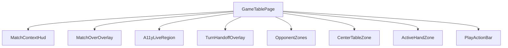
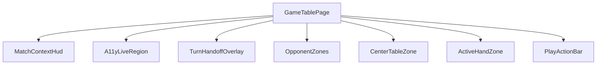

# Review Report: Round Progression and Match Over

**Review Mode:** Incremental (T-2: Add round-progression computed properties to GameTablePage)
**Source:** docs/specs/ui/round-progression/
**Reviewed against:** proposal.md, spec.md, user-stories.md, bdd-test.md, design.md, tasks.md

## 1. Executive Summary

This incremental review focused on T-2 only, covering class-level computed properties and local UI signal state in GameTablePage. In this scope, no implementation defects were identified: the expected T-2 computed gates and view-model shaping are present, and the associated unit tests are meaningful and non-superficial. Feature-level UI behavior for buttons, overlay, and end-to-end BDD traceability remains intentionally deferred to downstream tasks (T-3 through T-11).

- Total findings: 0 (0 Critical, 0 Major, 0 Minor, 0 Note)
- Spec compliance (T-2 scoped acceptance criteria): 9 of 9 met
- Architecture alignment: aligned for T-2 scope
- Test quality: meaningful (T-2 unit coverage)

## 2. Architecture Comparison

### 2.1 Planned Component Tree

### 2.2 Actual Component Tree

### 2.3 Drift Analysis

No actionable drift was identified for the T-2 scope. The absence of MatchOverOverlay wiring in the current actual tree is expected at this stage and mapped to later tasks (T-5 and T-6). For T-2 itself, the class-level architecture matches AD-4, AD-7, and AD-8: continuation-button visibility gates are computed from roundResult/matchWinner, roundScoreBreakdown is built by playerId join, winnerNames is string-only, matchScoreEntries uses matchScores, and showMatchOverOverlay is initialized as local signal state.

## 3. Findings

No findings were identified in the reviewed T-2 scope.

## 4. Traceability Matrix

No open findings in this review pass.

## 5. Spec Compliance Summary

| Requirement | Status     | Notes                                                                                                        |
| ----------- | ---------- | ------------------------------------------------------------------------------------------------------------ |
| FR-1.1      | ⚠️ Partial | Out of scope for T-2 behavioral UI completion; T-2 provides round-complete state gating primitives only.     |
| FR-1.2      | ⚠️ Partial | Not directly implemented by T-2; existing HUD behavior not changed in this task.                             |
| FR-1.3      | ⚠️ Partial | T-2 adds roundScoreBreakdown view-model shaping; rendering panel is deferred to T-3.                         |
| FR-1.4      | ⚠️ Partial | Not changed by T-2; verified only indirectly via existing page structure.                                    |
| FR-1.5      | ⚠️ Partial | Not changed by T-2; action-bar behavior remains outside this task scope.                                     |
| FR-2.1      | ⚠️ Partial | T-2 adds showStartNextRoundButton computed gate; button rendering/wiring is deferred to T-3 and T-4.         |
| FR-2.2      | ⚠️ Partial | T-2 adds showViewWinnerButton computed gate; UI mutual-exclusivity rendering is deferred to T-3 and T-4.     |
| FR-2.3      | ⚠️ Partial | Start-next-round handler wiring is outside T-2 (planned in T-4).                                             |
| FR-2.4      | ⚠️ Partial | Next-round visual transition is outside T-2 and depends on T-4.                                              |
| FR-2.5      | ⚠️ Partial | Keyboard interaction for new controls is outside T-2 and depends on T-3/T-4.                                 |
| FR-2.6      | ⚠️ Partial | Spanish accessible labels for new controls are outside T-2 and depend on T-3.                                |
| FR-2.7      | ⚠️ Partial | View-winner event flow is outside T-2 and depends on T-3/T-6.                                                |
| FR-3.1      | ⚠️ Partial | T-2 introduces local showMatchOverOverlay state groundwork; full action-gated transition is deferred to T-6. |
| FR-3.2      | ⚠️ Partial | Match-over overlay component not in T-2 scope (planned in T-5/T-6).                                          |
| FR-3.3      | ⚠️ Partial | T-2 introduces winnerNames computed strings; overlay presentation is deferred to T-5/T-6.                    |
| FR-3.4      | ⚠️ Partial | T-2 introduces matchScoreEntries from matchScores; overlay rendering is deferred to T-5/T-6.                 |
| FR-3.5      | ⚠️ Partial | Overlay dismissal policy is outside T-2 and depends on T-5/T-6.                                              |
| FR-3.6      | ⚠️ Partial | Inert/aria-hidden extension for match-over state is outside T-2 and depends on T-6.                          |
| FR-4.1      | ⚠️ Partial | Return-to-lobby control is outside T-2 and depends on T-5/T-6.                                               |
| FR-4.2      | ⚠️ Partial | Router navigation wiring for return flow is outside T-2 and depends on T-6.                                  |
| FR-4.3      | ⚠️ Partial | Session-preservation behavior is not changed in T-2; action path pending T-6.                                |
| FR-4.4      | ⚠️ Partial | Keyboard accessibility for return action is outside T-2 and depends on T-5/T-6.                              |
| FR-5.1      | ⚠️ Partial | Play-again control is outside T-2 and depends on T-5/T-6.                                                    |
| FR-5.2      | ⚠️ Partial | Play-again same-session behavior is outside T-2 and depends on T-6.                                          |
| FR-5.3      | ⚠️ Partial | Direct initGame action wiring is outside T-2 and depends on T-6.                                             |
| FR-5.4      | ⚠️ Partial | Overlay dismissal and board reset are outside T-2 and depend on T-6.                                         |
| FR-5.5      | ⚠️ Partial | Keyboard accessibility for play-again action is outside T-2 and depends on T-5/T-6.                          |
| FR-6.1      | ⚠️ Partial | Overlay focus-entry behavior is outside T-2 and depends on T-6.                                              |
| FR-6.2      | ⚠️ Partial | Overlay dialog semantics are outside T-2 and depend on T-5.                                                  |
| FR-6.3      | ⚠️ Partial | Focus return targets for overlay actions are outside T-2 and depend on T-6.                                  |
| FR-6.4      | ⚠️ Partial | Round/winner announcements for this feature are outside T-2 and planned for later tasks.                     |
| FR-6.5      | ⚠️ Partial | New control labels are outside T-2 and depend on T-3/T-5.                                                    |
| US-1        | ⚠️ Partial | T-2 provides computed logic prerequisites; complete user flow requires T-3/T-4.                              |
| US-2        | ⚠️ Partial | T-2 provides overlay state/data prerequisites; complete overlay flow requires T-5/T-6.                       |
| US-3        | ⚠️ Partial | Return-to-lobby interaction is outside T-2 and depends on T-5/T-6.                                           |
| US-4        | ⚠️ Partial | Play-again interaction is outside T-2 and depends on T-5/T-6.                                                |
| US-5        | ⚠️ Partial | Board visibility behavior is not altered in T-2; full round-complete UX needs T-3/T-4.                       |
| US-6        | ⚠️ Partial | T-2 delivers breakdown data shaping; breakdown panel rendering is deferred to T-3.                           |
| NFR-1.1     | ⚠️ Partial | Mutual-exclusivity logic is implemented in computed gates; template-level enforcement comes in T-3/T-4.      |
| NFR-1.2     | ⚠️ Partial | Non-automatic overlay groundwork exists (local signal default false), full gating behavior requires T-6.     |
| NFR-1.3     | ⚠️ Partial | Play-again reset path is outside T-2 and depends on T-6.                                                     |
| NFR-1.4     | ⚠️ Partial | Round-result reset visibility path is outside T-2 and depends on T-4.                                        |
| NFR-2.1     | ⚠️ Partial | Keyboard requirements for new controls are outside T-2 and depend on T-3/T-6.                                |
| NFR-2.2     | ⚠️ Partial | Feature-specific live-region announcements are outside T-2 and depend on T-4/T-6.                            |
| NFR-3.1     | ⚠️ Partial | MatchOverOverlay component is outside T-2 and planned in T-5.                                                |
| NFR-3.2     | ⚠️ Partial | T-2 introduces typed breakdown interface in GameTablePage; HUD contract completion requires T-3.             |

## 6. Task Completion Summary

| Task | Title                                                      | Status      | Findings |
| ---- | ---------------------------------------------------------- | ----------- | -------- |
| T-2  | Add round-progression computed properties to GameTablePage | ✅ Complete | —        |

## 7. Test Coverage Summary

| Scenario | Step Definitions | Meaningful | Findings                                                              |
| -------- | ---------------- | ---------- | --------------------------------------------------------------------- |
| SC-01    | ❌ No            | ❌ No      | Out of T-2 scope                                                      |
| SC-02    | ❌ No            | ❌ No      | Out of T-2 scope                                                      |
| SC-03    | ❌ No            | ⚠️ Partial | Unit-level coverage via roundScoreBreakdown shaping only              |
| SC-04    | ❌ No            | ⚠️ Partial | Unit-level zero-value shaping covered; UI rendering deferred          |
| SC-05    | ❌ No            | ⚠️ Partial | Unit-level playerId name resolution covered                           |
| SC-06    | ❌ No            | ❌ No      | Out of T-2 scope                                                      |
| SC-07    | ❌ No            | ❌ No      | Out of T-2 scope                                                      |
| SC-08    | ❌ No            | ⚠️ Partial | Unit-level visibility gate covered                                    |
| SC-09    | ❌ No            | ⚠️ Partial | Unit-level mutual exclusivity gate covered                            |
| SC-10    | ❌ No            | ⚠️ Partial | Unit-level mutual exclusivity gate covered                            |
| SC-11    | ❌ No            | ❌ No      | Out of T-2 scope                                                      |
| SC-12    | ❌ No            | ❌ No      | Out of T-2 scope                                                      |
| SC-13    | ❌ No            | ❌ No      | Out of T-2 scope                                                      |
| SC-14    | ❌ No            | ❌ No      | Out of T-2 scope                                                      |
| SC-15    | ❌ No            | ❌ No      | Out of T-2 scope                                                      |
| SC-16    | ❌ No            | ⚠️ Partial | Unit-level non-automatic overlay state remains false on winner change |
| SC-17    | ❌ No            | ❌ No      | Out of T-2 scope                                                      |
| SC-18    | ❌ No            | ❌ No      | Out of T-2 scope                                                      |
| SC-19    | ❌ No            | ❌ No      | Out of T-2 scope                                                      |
| SC-20    | ❌ No            | ❌ No      | Out of T-2 scope                                                      |
| SC-21    | ❌ No            | ❌ No      | Out of T-2 scope                                                      |
| SC-22    | ❌ No            | ❌ No      | Out of T-2 scope                                                      |
| SC-23    | ❌ No            | ❌ No      | Out of T-2 scope                                                      |
| SC-24    | ❌ No            | ❌ No      | Out of T-2 scope                                                      |
| SC-25    | ❌ No            | ❌ No      | Out of T-2 scope                                                      |
| SC-26    | ❌ No            | ❌ No      | Out of T-2 scope                                                      |
| SC-27    | ❌ No            | ❌ No      | Out of T-2 scope                                                      |
| SC-28    | ❌ No            | ❌ No      | Out of T-2 scope                                                      |
| SC-29    | ❌ No            | ❌ No      | Out of T-2 scope                                                      |
| SC-30    | ❌ No            | ❌ No      | Out of T-2 scope                                                      |
| SC-31    | ❌ No            | ❌ No      | Out of T-2 scope                                                      |
| SC-32    | ❌ No            | ❌ No      | Out of T-2 scope                                                      |
| SC-33    | ❌ No            | ❌ No      | Out of T-2 scope                                                      |
| SC-34    | ❌ No            | ❌ No      | Out of T-2 scope                                                      |
| SC-35    | ❌ No            | ❌ No      | Out of T-2 scope                                                      |
| SC-36    | ❌ No            | ❌ No      | Out of T-2 scope                                                      |
| SC-37    | ❌ No            | ❌ No      | Out of T-2 scope                                                      |
| SC-38    | ❌ No            | ❌ No      | Out of T-2 scope                                                      |
| SC-39    | ❌ No            | ❌ No      | Out of T-2 scope                                                      |
| SC-40    | ❌ No            | ❌ No      | Out of T-2 scope                                                      |
| SC-41    | ❌ No            | ❌ No      | Out of T-2 scope                                                      |
| SC-42    | ❌ No            | ❌ No      | Out of T-2 scope                                                      |

## 8. Test Quality Summary

| Test File                                                           | Type | Meaningful Assertions | Issues                                                                                     |
| ------------------------------------------------------------------- | ---- | --------------------- | ------------------------------------------------------------------------------------------ |
| src/app/features/game-board/game-table-page/game-table-page.spec.ts | Unit | ✅ Yes                | No superficial assertion-only, no-op, or tautological patterns found in T-2-specific tests |

## 9. Security Cross-Reference

This section cross-references Critical and High security findings from the companion security-report.md. See docs/specs/ui/round-progression/security-report.md for the full security analysis.

No Critical or High security findings are currently reported for this scope.

## 10. Recommendations

### Critical (blocks release)

1. None.

### Major (fix before merge)

1. None for T-2 scope.

### Minor (improvement)

1. Complete T-3 and T-4 to bind T-2 computed gates and breakdown view-model into visible HUD behavior.
2. Complete T-5 and T-6 to realize action-gated match-over flow built on T-2 signal foundations.
3. Complete T-10 and T-11 to close BDD scenario traceability with executable feature/step mappings.

### Notes (informational)

1. Security companion report includes Medium and Info findings only (no Critical/High) in current scope.
