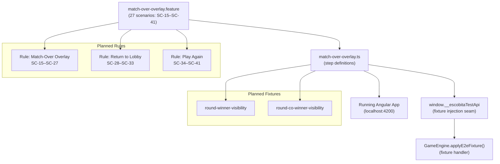

# Review Report: Round Progression and Match Over

**Review Mode:** Incremental (T-11: Cypress E2E — match-over overlay scenarios)
**Source:** `docs/specs/ui/round-progression/`
**Reviewed against:** proposal.md, spec.md, user-stories.md, bdd-test.md, design.md, tasks.md

## 1. Executive Summary

The T-11 implementation delivers a complete and high-quality set of Cypress E2E tests covering all 27 match-over overlay scenarios (SC-15 through SC-41). Every step definition has a meaningful body with real assertions — no empty bodies, no no-op implementations, and no superficial assertions. The feature file structure faithfully reproduces the BDD spec text and covers all three sub-features (Match-Over Overlay, Return to Lobby, Play Again). Fixture injection via the test seam is used consistently instead of full match simulation, following the established project pattern. The only notable concern is a minor gap where one SC-30 assertion verifies pre-fill state through the runtime service rather than the DOM, and a set of informational observations about implicit cross-file step dependencies and DOM-structure-coupled selectors in helper functions.

- Total findings: 5 (0 Critical, 0 Major, 1 Minor, 4 Note)
- Spec compliance: 27 of 27 scenarios fully implemented
- Architecture alignment: Aligned — follows project conventions
- Test quality: Meaningful — all steps have genuine assertions

## 2. Architecture Comparison

### 2.1 Planned Test Architecture

### 2.2 Actual Test Architecture

```mermaid
graph TD
    FF["match-over-overlay.feature\n(27 scenarios: SC-15–SC-41)"]
    SD["match-over-overlay.ts\n(step definitions + helpers)"]
    RP["round-progression.ts\n(8 shared step definitions)"]
    SEAM["window.__escobitaTestApi\n(fixture injection seam)"]
    GE["GameEngine.applyE2eFixture()\n(fixture handler)"]
    APP["Running Angular App\n(localhost:4200)"]

    FF --> SD
    FF -.->|"implicit\nglobal step registry"| RP
    SD --> SEAM
    SEAM --> GE
    SD --> APP

    subgraph "Fixtures Used"
        FIX1["round-winner-visibility"]
        FIX2["round-co-winner-visibility"]
    end

    SD --> FIX1
    SD --> FIX2

    subgraph "Actual Rules"
        R1["Rule: Match-Over Overlay\nSC-15–SC-27\n(Background: 2-player session + winner fixture)"]
        R2["Rule: Return to Lobby\nSC-28–SC-33\n(Background: configured session + winner + overlay)"]
        R3["Rule: Play Again\nSC-34–SC-41\n(Background: configured session + winner + overlay)"]
    end

    FF --> R1
    FF --> R2
    FF --> R3

    subgraph "Shared Steps from round-progression.ts"
        S1["Given: configured with two players"]
        S2["When: activates the button"]
        S3["When: navigates to button using keyboard"]
        S4["Then: button is visible"]
        S5["Then: fresh cards visible on table"]
        S6["Then: each player has N hand cards"]
        S7["Then: round number shown in HUD"]
        S8["Then: button receives keyboard focus"]
    end

    RP --> S1
    RP --> S2
    RP --> S3
    RP --> S4
    RP --> S5
    RP --> S6
    RP --> S7
    RP --> S8
```

### 2.3 Drift Analysis

The actual architecture is aligned with the planned design. The only structural addition not shown in the planned architecture is the implicit dependency on eight step definitions from the round-progression.ts file via the global Cucumber step registry. This is a natural consequence of step reuse across Gherkin feature files and is consistent with the project's existing E2E test patterns. No components, services, routes, or test files were added, removed, or renamed beyond what the task specified.

Both planned fixture types (round-winner-visibility, round-co-winner-visibility) are used as designed. The three-rule structure in the feature file mirrors the three sub-features in the BDD spec (Match-Over Overlay, Return to Lobby, Play Again), each with its own Background for appropriate precondition setup.

## 3. Findings

### RV-01: SC-30 AI difficulty pre-fill verified via runtime service instead of DOM element [Minor]

- **Category:** Test Quality
- **Severity:** Minor
- **Related:** SC-30, FR-4.3, US-3
- **Description:** The Then step "the previous AI difficulty is pre-filled" reads the AI difficulty value from the GameSession service via `readSessionConfigurationSummary()` rather than inspecting the lobby form's DOM element directly.
- **Expected:** SC-30 in bdd-test.md states "the previous AI difficulty is pre-filled", which implies verifying the lobby form input renders the preserved value. The companion assertions for player names and game mode in the same scenario verify pre-fill state via DOM element checks (checking `have.value` and `be.checked` on form inputs).
- **Actual:** AI difficulty is asserted by calling `readSessionConfigurationSummary()` and comparing the service-level property. This confirms the session data is preserved in memory but does not confirm the lobby form element displays the preserved value.
- **Recommendation:** Consider verifying the AI difficulty dropdown's selected value via its DOM element when the form mode is switched to single-player, or accept the service-level verification as sufficient given that the AI difficulty dropdown is only visible in single-player mode and the scenario operates in multiplayer mode.
- **Impact:** If the lobby's `hydrateFromSessionConfiguration()` method failed to populate the AI difficulty dropdown from the service value, this test would not detect the regression. Risk is low since the hydration path is shared with other settings that are DOM-verified.

### RV-02: Eight step definitions from round-progression.ts used implicitly via global step registry [Note]

- **Category:** Code Quality
- **Severity:** Note
- **Related:** T-11, T-10
- **Description:** The match-over-overlay.feature file uses eight step definitions that are defined in round-progression.ts rather than match-over-overlay.ts. These include the session configuration Given step, button activation and keyboard navigation When steps, and several Then assertions for button visibility, card counts, round number, and keyboard focus. The Cucumber global step registry resolves these at runtime, but no comment or documentation in either file acknowledges this cross-file dependency.
- **Expected:** Per the task description, match-over-overlay.ts should implement step definitions for SC-15 through SC-41. Reusing steps from round-progression.ts is valid Cucumber practice.
- **Actual:** The dependency works correctly at runtime. The match-over-overlay.ts file includes a traceability comment listing all covered scenarios but does not reference the steps it delegates to round-progression.ts. Similarly, round-progression.ts does not mark its shared steps as consumed by other feature files.
- **Recommendation:** Consider adding a brief comment at the top of match-over-overlay.ts listing the step patterns expected to be resolved from round-progression.ts. This makes the dependency explicit and protects against accidental breakage if round-progression.ts is refactored or removed independently.
- **Impact:** If any of the eight shared step patterns in round-progression.ts are renamed, removed, or made more specific, match-over-overlay.feature scenarios that depend on them would fail with an "undefined step" error.

### RV-03: lobbyTitle selector uses HTML ID instead of data-testid attribute [Note]

- **Category:** Code Quality
- **Severity:** Note
- **Related:** T-11, AD-3
- **Description:** The selectors object in match-over-overlay.ts defines `lobbyTitle: '#lobby-title'` using an HTML ID selector. All other selectors in the object — and in other E2E step definition files across the project — use the `[data-testid="..."]` pattern.
- **Expected:** The project's E2E selector convention uses data-testid attributes exclusively for test targeting.
- **Actual:** The lobby component's heading element has `id="lobby-title"` but no `data-testid` attribute. The E2E test uses the available ID selector. This pattern is consistent across multiple E2E files that reference the lobby title, so it is an established project-wide deviation rather than a T-11-specific issue.
- **Recommendation:** If the lobby component is updated in a future task, consider adding a `data-testid="lobby-title"` attribute to the heading and updating all E2E files that reference it. No immediate action needed for T-11.
- **Impact:** Minimal. The ID selector is stable and unique. The inconsistency is cosmetic relative to the selector convention.

### RV-04: Helper functions use CSS class and DOM position selectors instead of data-testid [Note]

- **Category:** Code Quality
- **Severity:** Note
- **Related:** T-11
- **Description:** The `readHudScores()` helper function selects child elements within score items using CSS class names (`.score-label`, `.score-value`). The `readOverlayScores()` helper selects child elements within match score rows by querying `span` elements and relying on their positional order (first span is the name, second span is the score).
- **Expected:** The project convention uses data-testid attributes for E2E selectors.
- **Actual:** These internal sub-element selectors rely on component template DOM structure. The parent elements are correctly selected via data-testid, but the child traversal uses CSS classes and element types.
- **Recommendation:** Consider adding data-testid attributes to the score label and score value elements within the MatchContextHud scoreboard and MatchOverOverlay score rows in a future task. This would decouple the E2E helpers from the components' internal DOM structure.
- **Impact:** If the MatchContextHud or MatchOverOverlay templates change their internal CSS class names or span ordering, these helper functions would silently break. The risk is low given these are stable, mature components.

### RV-05: SC-16 applies winner fixture redundantly due to Background overlap [Note]

- **Category:** Test Quality
- **Severity:** Note
- **Related:** SC-16, FR-3.1, NFR-1.2
- **Description:** The Match-Over Overlay rule's Background includes the step "the final round has ended with a match winner declared", which applies the `round-winner-visibility` fixture (setting matchWinner to non-null). SC-16's When step "the match winner signal becomes non-null at round end" then applies the same fixture a second time.
- **Expected:** SC-16 in the BDD spec tests that when the matchWinner signal first transitions to non-null, the overlay does not appear automatically. The Background establishes that a winner has been declared.
- **Actual:** The fixture is applied twice — once in the Background and once in the When step. The second application is idempotent (re-setting the same state), so the test produces the correct result: it verifies the overlay is absent despite matchWinner being non-null. The redundancy comes from the BDD spec itself, which places the winner declaration in the Background while SC-16's narrative implies a fresh transition.
- **Recommendation:** No change needed — the test correctly verifies the specified behaviour. The redundancy originates in the BDD spec structure and is faithfully implemented.
- **Impact:** None. The double fixture application adds negligible execution time and does not affect test correctness.

## 4. Traceability Matrix

| Finding | Severity | Category     | Related Spec           | Status |
| ------- | -------- | ------------ | ---------------------- | ------ |
| RV-01   | Minor    | Test Quality | SC-30, FR-4.3, US-3    | Open   |
| RV-02   | Note     | Code Quality | T-11, T-10             | Open   |
| RV-03   | Note     | Code Quality | T-11, AD-3             | Open   |
| RV-04   | Note     | Code Quality | T-11                   | Open   |
| RV-05   | Note     | Test Quality | SC-16, FR-3.1, NFR-1.2 | Open   |

## 5. Spec Compliance Summary

T-11 provides E2E verification for the following requirements. Compliance status reflects whether the E2E scenario correctly exercises and asserts the specified behaviour.

| Requirement | Status     | Notes                                                                                              |
| ----------- | ---------- | -------------------------------------------------------------------------------------------------- |
| FR-3.1      | ✅ Met     | SC-16 verifies overlay does not auto-appear; SC-15 verifies explicit activation                    |
| FR-3.2      | ✅ Met     | SC-17 verifies full-screen overlay rendering                                                       |
| FR-3.3      | ✅ Met     | SC-18 (sole winner) and SC-19 (co-winners) verify winner name display                              |
| FR-3.4      | ✅ Met     | SC-20 verifies accumulated match scores are shown                                                  |
| FR-3.5      | ✅ Met     | SC-21 (Escape) and SC-22 (outside click) verify non-dismissal                                      |
| FR-3.6      | ✅ Met     | SC-23 verifies inert and aria-hidden on background elements                                        |
| FR-4.1      | ✅ Met     | SC-28 verifies Return to Lobby button presence                                                     |
| FR-4.2      | ✅ Met     | SC-29 verifies navigation to root route                                                            |
| FR-4.3      | ⚠️ Partial | SC-30 verifies player names and game mode via DOM; AI difficulty verified via service only (RV-01) |
| FR-4.4      | ✅ Met     | SC-32 verifies keyboard operability                                                                |
| FR-5.1      | ✅ Met     | SC-34 verifies Play Again button presence                                                          |
| FR-5.2      | ✅ Met     | SC-36 verifies same session configuration retained                                                 |
| FR-5.3      | ✅ Met     | SC-35, SC-37 verify fresh match state; SC-39 verifies bootstrap guard bypass                       |
| FR-5.4      | ✅ Met     | SC-38 verifies game table is fully interactive after Play Again                                    |
| FR-5.5      | ✅ Met     | SC-40 verifies keyboard operability                                                                |
| FR-6.1      | ✅ Met     | SC-26 verifies focus moves into overlay                                                            |
| FR-6.2      | ✅ Met     | SC-25 verifies role="dialog", aria-modal="true", and accessible name                               |
| FR-6.3      | ✅ Met     | SC-33 (lobby focus) and SC-41 (submit-play focus) verify focus restoration                         |
| FR-6.4      | ✅ Met     | SC-27 verifies live-region announcement with winner name                                           |
| FR-6.5      | ✅ Met     | Buttons carry Spanish aria-labels; verified via accessible name assertions                         |
| US-2        | ✅ Met     | All match-over overlay scenarios pass                                                              |
| US-3        | ✅ Met     | Return to Lobby scenarios pass; session preservation verified                                      |
| US-4        | ✅ Met     | Play Again scenarios pass; fresh match with same config verified                                   |
| NFR-1.1     | ✅ Met     | SC-16 confirms mutual exclusivity (overlay absent while View Winner visible)                       |
| NFR-1.2     | ✅ Met     | SC-16, SC-19 confirm correct co-winner and explicit activation behaviour                           |
| NFR-1.3     | ✅ Met     | SC-37, SC-39 confirm fresh state with round 1, zero scores, new deal                               |
| NFR-2.1     | ✅ Met     | SC-24, SC-32, SC-40 confirm keyboard reachability for all new controls                             |
| NFR-2.2     | ✅ Met     | SC-27 confirms live-region announcement pattern                                                    |

## 6. Task Completion Summary

| Task | Title                                                    | Status      | Findings                          |
| ---- | -------------------------------------------------------- | ----------- | --------------------------------- |
| T-11 | Cypress E2E — match-over overlay scenarios (SC-15–SC-41) | ✅ Complete | RV-01, RV-02, RV-03, RV-04, RV-05 |

## 7. Test Coverage Summary

| Scenario | Step Definitions | Meaningful | Findings |
| -------- | ---------------- | ---------- | -------- |
| SC-15    | ✅ Yes           | ✅ Yes     | —        |
| SC-16    | ✅ Yes           | ✅ Yes     | RV-05    |
| SC-17    | ✅ Yes           | ✅ Yes     | —        |
| SC-18    | ✅ Yes           | ✅ Yes     | —        |
| SC-19    | ✅ Yes           | ✅ Yes     | —        |
| SC-20    | ✅ Yes           | ✅ Yes     | —        |
| SC-21    | ✅ Yes           | ✅ Yes     | —        |
| SC-22    | ✅ Yes           | ✅ Yes     | —        |
| SC-23    | ✅ Yes           | ✅ Yes     | —        |
| SC-24    | ✅ Yes           | ✅ Yes     | —        |
| SC-25    | ✅ Yes           | ✅ Yes     | —        |
| SC-26    | ✅ Yes           | ✅ Yes     | —        |
| SC-27    | ✅ Yes           | ✅ Yes     | —        |
| SC-28    | ✅ Yes           | ✅ Yes     | —        |
| SC-29    | ✅ Yes           | ✅ Yes     | —        |
| SC-30    | ✅ Yes           | ⚠️ Partial | RV-01    |
| SC-31    | ✅ Yes           | ✅ Yes     | —        |
| SC-32    | ✅ Yes           | ✅ Yes     | —        |
| SC-33    | ✅ Yes           | ✅ Yes     | —        |
| SC-34    | ✅ Yes           | ✅ Yes     | —        |
| SC-35    | ✅ Yes           | ✅ Yes     | —        |
| SC-36    | ✅ Yes           | ✅ Yes     | —        |
| SC-37    | ✅ Yes           | ✅ Yes     | —        |
| SC-38    | ✅ Yes           | ✅ Yes     | —        |
| SC-39    | ✅ Yes           | ✅ Yes     | —        |
| SC-40    | ✅ Yes           | ✅ Yes     | —        |
| SC-41    | ✅ Yes           | ✅ Yes     | —        |

## 8. Test Quality Summary

| Test File                              | Type                   | Meaningful Assertions | Issues                                                                                                            |
| -------------------------------------- | ---------------------- | --------------------- | ----------------------------------------------------------------------------------------------------------------- |
| cypress/e2e/match-over-overlay.feature | E2E (Gherkin)          | ✅ Yes                | None — all 27 scenarios match BDD spec                                                                            |
| cypress/e2e/match-over-overlay.ts      | E2E (Step Definitions) | ✅ Yes                | RV-01 (one service-level assertion where DOM check expected), RV-04 (CSS class/DOM position selectors in helpers) |

**Overall test quality assessment:** The step definitions demonstrate strong, varied assertion patterns including DOM visibility checks, attribute assertions (role, aria-modal, aria-hidden, inert, aria-pressed, data-testid), computed style comparisons (fontSize, fontWeight), bounding rectangle geometry, elementFromPoint stacking verification, engine state summary assertions, session configuration assertions, focus management verification, history.pushState spy assertions, and console.error spy assertions. No step definitions have empty bodies, no-op implementations, or tautological assertions.

## 9. Security Cross-Reference

No Critical or High security findings were reported by the Security Assistant for the T-11 scope. See [security-report.md](security-report.md) for the full analysis.

| SEC ID | Severity | OWASP    | Summary                                                                                                            |
| ------ | -------- | -------- | ------------------------------------------------------------------------------------------------------------------ |
| SEC-01 | Info     | A05:2021 | Cypress test seam governance — dual-gated by isDevMode() and window.Cypress presence; no new surface added by T-11 |

## 10. Recommendations

### Critical (blocks release)

None.

### Major (fix before merge)

None.

### Minor (improvement)

1. **RV-01:** Consider verifying the AI difficulty pre-fill in SC-30 via the DOM (switching the lobby form to single-player mode and checking the dropdown value) to match the assertion level of the player name and game mode checks in the same scenario.

### Notes (informational)

1. **RV-02:** Consider adding a comment at the top of match-over-overlay.ts listing the eight step patterns expected from round-progression.ts to make the cross-file dependency explicit.
2. **RV-03:** Consider adding a `data-testid="lobby-title"` attribute to the lobby heading element to align with the project's selector convention when the lobby component is next modified.
3. **RV-04:** Consider adding data-testid attributes to score sub-elements (label and value) in MatchContextHud and MatchOverOverlay to decouple E2E helpers from internal DOM structure.
4. **RV-05:** The double fixture application in SC-16 is a faithful implementation of the BDD spec structure and requires no change.
