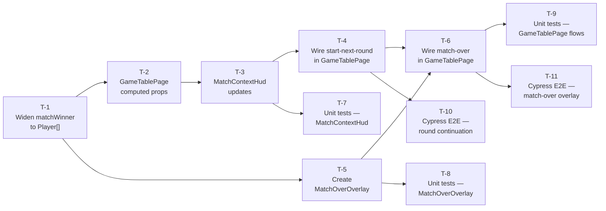

# Implementation Tasks: Round Progression and Match Over

**Source Design:** `docs/specs/ui/round-progression/design.md`
**Source Spec:** `docs/specs/ui/round-progression/`

---

## Task Dependency Overview

---

## Tasks

---

### T-1: Widen `matchWinner` signal to `Player[]` and update all consumers

- **Description:** Change the engine's internal `_matchWinner` writable signal from `Player | null` to `Player[] | null`. Update the public read-only `matchWinner` signal type accordingly. Update `checkWinCondition` utility to collect all players whose accumulated score is at or above 15 and equals the highest score, returning them as an array (sole winner → single-element array; co-winners → multi-element array; no winner → null). Update the `confirmTurn` call site in `GameEngine` to use the new return shape. Update the `matchWinner` input of `MatchContextHud` from `Player | null` to `Player[] | null`. Update all existing `GameEngine` unit tests that reference `matchWinner` to use array assertions. Update any existing `MatchContextHud` unit tests that reference the `matchWinner` input. Confirm the full build passes (TypeScript compilation will surface any unconsidered consumers).
- **Architectural Decision:** AD-1
- **Depends on:** None (this is the foundation task)
- **Components affected:** `GameEngine` service, `checkWinCondition` utility, `MatchContextHud` component, existing unit tests for both.
- **Acceptance criteria:**
  - [ ] The `matchWinner` signal in `GameEngine` is typed as `Signal<Player[] | null>`.
  - [ ] A sole winner produces a single-element `Player[]`, not a plain `Player`.
  - [ ] Two players with identical highest scores at or above 15 both appear in the `matchWinner` array.
  - [ ] Players whose scores are below 15 are never included in the array.
  - [ ] `startNextRound()` still correctly rejects when `matchWinner` is non-null.
  - [ ] All previously passing `GameEngine` unit tests pass without modification to their intent.
  - [ ] `MatchContextHud` compiles with the new `matchWinner` input type.
  - [ ] `ng build` (or equivalent Vite build) completes without TypeScript errors.
- **Estimation hint:** M
- **Spec traceability:** FR-3.1, FR-3.3, NFR-1.2, US-2

---

### T-2: Add round-progression computed properties to `GameTablePage`

- **Description:** Add five new computed properties to `GameTablePage`. The first two are visibility gates: `showStartNextRoundButton` is true when `roundResult()` is non-null and `matchWinner()` is null; `showViewWinnerButton` is true when both are non-null. The third is `roundScoreBreakdown`: a computed that, when `roundResult()` is non-null and `state()` is non-null, joins `roundResult().playerScores` with `state().players` by `playerId` to produce an array of `RoundScoreBreakdownEntry` view-model objects (playerName, escobas, mostCards, mostOros, mostSevens, sieteDiVelo, total); returns an empty array otherwise. The fourth is `winnerNames`: an array of player name strings derived from `matchWinner()`, or an empty array when null. The fifth is `matchScoreEntries`: maps `state().players` to `{ playerName, score }` objects using `state().matchScores`, or an empty array when state is null. Add one new writable signal: `showMatchOverOverlay` initialised to `false`. No template changes yet — that is T-6.
- **Architectural Decision:** AD-4, AD-7, AD-8
- **Depends on:** T-1 (requires widened `matchWinner` type)
- **Components affected:** `GameTablePage` component class only (no template changes in this task).
- **Acceptance criteria:**
  - [ ] `showStartNextRoundButton` is true only when `roundResult` is non-null and `matchWinner` is null.
  - [ ] `showViewWinnerButton` is true only when both `roundResult` and `matchWinner` are non-null.
  - [ ] `showStartNextRoundButton` and `showViewWinnerButton` are never simultaneously true (NFR-1.1).
  - [ ] `roundScoreBreakdown` returns an entry per player with all six category fields populated.
  - [ ] `roundScoreBreakdown` returns an empty array when `roundResult` is null.
  - [ ] Player names in `roundScoreBreakdown` match names in `state().players`.
  - [ ] `winnerNames` returns an array of strings, not Player objects.
  - [ ] `matchScoreEntries` reflects `state().matchScores`, not round scores.
  - [ ] `showMatchOverOverlay` defaults to false.
- **Estimation hint:** S
- **Spec traceability:** FR-1.3, FR-2.1, FR-2.2, TR-4.1–TR-4.3, NFR-1.1

---

### T-3: Update `MatchContextHud` — add breakdown panel and action buttons

- **Description:** Add three new inputs to `MatchContextHud`: `showStartNextRound: boolean`, `showViewWinner: boolean`, and `roundScoreBreakdown: RoundScoreBreakdownEntry[]`. Add two new outputs: `startNextRound` (emitted when "Empezar siguiente ronda" is clicked) and `viewWinner` (emitted when "Ver ganador" is clicked). In the template, add a round score breakdown panel adjacent to the existing `round-outcome-indicator`. The panel uses `@for` to render one row per entry in `roundScoreBreakdown`, showing the player name and all six scoring categories always (including zero values). Add a `data-testid="round-score-breakdown"` attribute on the panel container. Below the breakdown panel, add the two action buttons conditionally using `@if (showStartNextRound())` and `@if (showViewWinner())`. Each button must have a Spanish text label, a `data-testid` attribute (`start-next-round-button` and `view-winner-button`), and a Spanish `aria-label`. The two buttons are mutually exclusive and never both rendered at the same time.
- **Architectural Decision:** AD-2
- **Depends on:** T-2 (requires the view-model types to be defined)
- **Components affected:** `MatchContextHud` component (class + template + stylesheet).
- **Acceptance criteria:**
  - [ ] `roundScoreBreakdown` panel renders one row per player when non-empty.
  - [ ] Each row shows all six categories even when a category value is zero (SC-04).
  - [ ] Player names in the panel match session-configured names (SC-05).
  - [ ] The "Empezar siguiente ronda" button is visible when `showStartNextRound` is true and hidden when false (SC-08, SC-09).
  - [ ] The "Ver ganador" button is visible when `showViewWinner` is true and hidden when false (SC-10).
  - [ ] Both buttons are never visible at the same time (NFR-1.1).
  - [ ] Clicking "Empezar siguiente ronda" emits the `startNextRound` output event (SC-11).
  - [ ] Clicking "Ver ganador" emits the `viewWinner` output event (SC-15).
  - [ ] Both buttons carry a meaningful Spanish `aria-label` (SC-14, SC-24).
  - [ ] The breakdown panel is not rendered when `roundScoreBreakdown` is empty (SC-07).
- **Estimation hint:** M
- **Spec traceability:** FR-1.2, FR-1.3, FR-2.1, FR-2.2, FR-2.5, FR-2.6, FR-2.7, US-1, US-6

---

### T-4: Wire "Start Next Round" in `GameTablePage`

- **Description:** Add the `onStartNextRound()` event handler to `GameTablePage`. This handler calls `gameEngine.startNextRound()`. Pass the new computed properties and the handler binding to `MatchContextHud` in the template: bind `[showStartNextRound]="showStartNextRoundButton()"`, `[showViewWinner]="showViewWinnerButton()"`, `[roundScoreBreakdown]="roundScoreBreakdown()"`, and `(startNextRound)="onStartNextRound()"`. Also bind `(viewWinner)="onViewWinner()"` here (even though `onViewWinner()` is implemented in T-6 — leave it as a placeholder call if needed, or implement the full handler now). Update the `A11yLiveRegion` announcement: after a round ends (when `roundResult()` becomes non-null), announce the round completion. This can be done via an `effect` that watches `roundResult()` and calls `announce()` with the Spanish round-complete message including the round number.
- **Architectural Decision:** AD-5, TR-2.1
- **Depends on:** T-3
- **Components affected:** `GameTablePage` component (class + template).
- **Acceptance criteria:**
  - [ ] Activating "Empezar siguiente ronda" in the UI calls `gameEngine.startNextRound()` (SC-11).
  - [ ] After `startNextRound()`, the board reflects the new initial deal (SC-12).
  - [ ] The score breakdown and button disappear after activation (SC-07, SC-11).
  - [ ] A live-region announcement is made when the round-complete state is entered (SC-42).
  - [ ] `showStartNextRound` and `showViewWinner` inputs are passed correctly from `GameTablePage` to `MatchContextHud`.
- **Estimation hint:** S
- **Spec traceability:** FR-2.1, FR-2.3, FR-2.4, FR-6.4, TR-2.1, US-1

---

### T-5: Create `MatchOverOverlay` standalone component

- **Description:** Create a new standalone component at `src/app/features/game-board/game-table-page/components/match-over-overlay/`. The component accepts two inputs: `winnerNames: string[]` and `matchScoreEntries: { playerName: string; score: number }[]`. It emits two outputs: `returnToLobby` and `playAgain`. The root template element is a `<section>` with `role="dialog"`, `aria-modal="true"`, `aria-labelledby` referencing the heading element's id, and CSS classes for full-screen positioning following the `TurnHandoffOverlay` layout pattern. The heading displays a Spanish "match over" title. Winner names are rendered via `@for` — each name in its own element. Match score entries are rendered via `@for` showing player name and score. The "Volver al lobby" button has `data-testid="return-to-lobby-button"` and a Spanish `aria-label`; the "Jugar de nuevo" button has `data-testid="play-again-button"` and a Spanish `aria-label`. Neither button closes the overlay itself — they only emit output events. No Escape key handler and no outside-click handler are added (FR-3.5). Apply SCSS for full-screen overlay positioning consistent with `TurnHandoffOverlay`.
- **Architectural Decision:** AD-3, AD-8
- **Depends on:** T-1 (requires Player[] type resolution to be finalised so view-model shapes are stable)
- **Components affected:** New file — `match-over-overlay` component (class, template, stylesheet).
- **Acceptance criteria:**
  - [ ] Component renders with `role="dialog"` and `aria-modal="true"` (SC-25).
  - [ ] A sole winner's name is displayed prominently (SC-18).
  - [ ] Two co-winner names are displayed with equal visual styling (SC-19).
  - [ ] Accumulated match scores are shown for all players (SC-20).
  - [ ] "Volver al lobby" button emits `returnToLobby` output (SC-28, SC-29).
  - [ ] "Jugar de nuevo" button emits `playAgain` output (SC-34, SC-35).
  - [ ] Pressing Escape does not emit any output and does not dismiss the overlay (SC-21).
  - [ ] Clicking outside the overlay content does not emit any output (SC-22).
  - [ ] The overlay covers the full viewport (SC-17).
  - [ ] The component has no injected service dependencies.
- **Estimation hint:** M
- **Spec traceability:** FR-3.2–FR-3.5, FR-4.1, FR-5.1, FR-6.2, US-2, US-3, US-4

---

### T-6: Wire match-over overlay flow in `GameTablePage`

- **Description:** Integrate `MatchOverOverlay` into `GameTablePage`. Import the component. Add it to the template with `@if (showMatchOverOverlay())`. Bind `[winnerNames]="winnerNames()"` and `[matchScoreEntries]="matchScoreEntries()"`. Bind `(returnToLobby)="onReturnToLobby()"` and `(playAgain)="onPlayAgain()"`. Implement `onViewWinner()`: sets `showMatchOverOverlay` to true, calls `announce()` with the match-over live region message (winner name(s)). Implement `onPlayAgain()`: sets `showMatchOverOverlay` to false, then calls `gameEngine.initGame(gameSession.configuration())` unconditionally (not via `bootstrapEngineStateFromSession`), then schedules focus on the "submit play" button via `focusByTestIdAfterRender`. Implement `onReturnToLobby()`: calls `router.navigate(['/'])`. Update the background inert / aria-hidden condition on the board layout wrapper and action bar from `showTurnHandoffOverlay()` to `showTurnHandoffOverlay() || showMatchOverOverlay()`. Schedule focus on the first focusable element inside the overlay when `showMatchOverOverlay` transitions to true, using `afterNextRender` + `focusByTestIdAfterRender`.
- **Architectural Decision:** AD-4, AD-5, AD-6
- **Depends on:** T-4, T-5
- **Components affected:** `GameTablePage` component (class + template).
- **Acceptance criteria:**
  - [ ] Activating "Ver ganador" shows the match-over overlay (SC-15).
  - [ ] The overlay does not appear automatically when `matchWinner()` becomes non-null (SC-16).
  - [ ] The overlay covers the full viewport and is above all game table content (SC-17).
  - [ ] The background board and action bar are inert and `aria-hidden` while the overlay is visible (SC-23).
  - [ ] Focus moves into the overlay when it appears (SC-26).
  - [ ] "Jugar de nuevo" dismisses the overlay and calls `initGame()` unconditionally (SC-37, SC-39).
  - [ ] After "Jugar de nuevo", the board shows the round 1 initial deal and is fully interactive (SC-38).
  - [ ] After "Jugar de nuevo", focus reaches the "submit play" button (SC-41).
  - [ ] "Volver al lobby" navigates to "/" without clearing `GameSession.configuration()` (SC-29, SC-30).
  - [ ] A live-region announcement is made when the overlay appears (SC-27).
- **Estimation hint:** M
- **Spec traceability:** FR-3.1–FR-3.6, FR-4.2, FR-4.3, FR-5.3, FR-5.4, FR-6.1, FR-6.3, FR-6.4, TR-3.1–TR-3.3, US-2, US-3, US-4

---

### T-7: Unit tests — `MatchContextHud` updates

- **Description:** Extend the existing `MatchContextHud` spec file to cover all new inputs and outputs introduced in T-3. Add test cases for: breakdown panel renders all six category columns; zero values are shown not omitted; panel is absent when `roundScoreBreakdown` is empty; "Empezar siguiente ronda" button visible when `showStartNextRound` is true; "Empezar siguiente ronda" hidden when `showStartNextRound` is false; "Ver ganador" visible when `showViewWinner` is true; "Ver ganador" hidden when `showViewWinner` is false; both buttons never simultaneously visible; `startNextRound` output emitted exactly once on button activation; `viewWinner` output emitted exactly once on button activation; accessible label on each button is present and in Spanish. Also update any existing tests that set `matchWinner` to a single `Player` to use `Player[]` instead (consequence of T-1).
- **Architectural Decision:** AD-2
- **Depends on:** T-3
- **Components affected:** `match-context-hud.spec.ts`
- **Acceptance criteria:**
  - [ ] All previously passing `MatchContextHud` tests continue to pass.
  - [ ] New tests cover all six scoring category fields in the breakdown (SC-03).
  - [ ] Zero-value category test passes (SC-04).
  - [ ] Button mutual exclusivity test passes (NFR-1.1).
  - [ ] Output emission tests pass for both `startNextRound` and `viewWinner`.
  - [ ] All tests pass under `vitest run`.
- **Estimation hint:** S
- **Spec traceability:** FR-1.3, FR-2.1, FR-2.2, FR-2.5, FR-2.6, US-1, US-6, NFR-1.1

---

### T-8: Unit tests — `MatchOverOverlay`

- **Description:** Create `match-over-overlay.spec.ts`. Cover: sole winner name renders; two co-winner names both render with no styling difference (test for presence, not for computed CSS); accumulated match scores render for all players; "Volver al lobby" button is present; "Jugar de nuevo" button is present; clicking "Volver al lobby" emits `returnToLobby` exactly once; clicking "Jugar de nuevo" emits `playAgain` exactly once; pressing Escape does not emit any output; the root element has `role="dialog"` and `aria-modal="true"`.
- **Architectural Decision:** AD-3
- **Depends on:** T-5
- **Components affected:** New file `match-over-overlay.spec.ts`
- **Acceptance criteria:**
  - [ ] Sole winner test passes (SC-18).
  - [ ] Co-winner display test passes (SC-19).
  - [ ] Accumulated score rendering test passes (SC-20).
  - [ ] Escape key non-dismissal test passes (SC-21).
  - [ ] `role="dialog"` and `aria-modal="true"` assertions pass (SC-25).
  - [ ] Both output emission tests pass.
  - [ ] All tests pass under `vitest run`.
- **Estimation hint:** S
- **Spec traceability:** FR-3.2–FR-3.5, FR-4.1, FR-5.1, FR-6.2, US-2

---

### T-9: Unit tests — `GameTablePage` round progression and match-over flows

- **Description:** Create two new spec files. In `game-table-page.round-progression.spec.ts`: test `showStartNextRoundButton` truth table across the four combinations of `roundResult`/`matchWinner` nullness; test `showViewWinnerButton` truth table; test `roundScoreBreakdown` resolves player names from engine state; test `onStartNextRound()` calls `gameEngine.startNextRound()`; test that the live-region message is set when round-complete state is entered. In `game-table-page.match-over.spec.ts`: test `showMatchOverOverlay` defaults to false; test `onViewWinner()` sets it to true; test `onPlayAgain()` sets it to false; test `onPlayAgain()` calls `gameEngine.initGame()` with the session configuration; test `onPlayAgain()` calls `initGame()` even when `gameEngine.state()` is already non-null (bypasses bootstrap guard); test `onReturnToLobby()` calls `router.navigate(['/'])`; test that the background inert condition is true when `showMatchOverOverlay` is true; test that the background inert condition is true when `showTurnHandoffOverlay` is true; test that the live-region announces the winner name on `onViewWinner()`.
- **Architectural Decision:** AD-4, AD-5, AD-6
- **Depends on:** T-6
- **Components affected:** New files `game-table-page.round-progression.spec.ts` and `game-table-page.match-over.spec.ts`
- **Acceptance criteria:**
  - [ ] All four truth-table cases for `showStartNextRoundButton` pass.
  - [ ] All four truth-table cases for `showViewWinnerButton` pass.
  - [ ] `roundScoreBreakdown` name-resolution test passes.
  - [ ] `onPlayAgain()` bypass test passes (state non-null does not block `initGame()` call).
  - [ ] Combined inert condition tests pass for both overlay types.
  - [ ] All tests pass under `vitest run`.
- **Estimation hint:** M
- **Spec traceability:** FR-2.3, FR-3.1, FR-5.3, NFR-1.1, NFR-1.2, TR-3.1, TR-3.2, AD-4, AD-5, AD-6

---

### T-10: Cypress E2E — round continuation scenarios (SC-01–SC-14, SC-42)

- **Description:** Create `round-progression.feature` and `round-progression.ts` in `cypress/e2e/`. Use the `applyE2eFixture` seam to set up an end-of-round state (final turn confirmed, deck empty, hands empty, no match winner) without simulating full match play. Implement step definitions covering: the round-complete state is visually distinct (SC-01); round number and top score remain visible (SC-02); all six scoring categories are shown per player (SC-03); zero-value categories are not omitted (SC-04); player names match session names (SC-05); board zones remain rendered (SC-06); score breakdown disappears after "Empezar siguiente ronda" is activated (SC-07); "Empezar siguiente ronda" is visible when no winner (SC-08); "Empezar siguiente ronda" is hidden when a winner exists (SC-09); "Ver ganador" appears and "Empezar siguiente ronda" disappears when winner is declared (SC-10); activating "Empezar siguiente ronda" triggers next-round transition (SC-11); board reflects new deal after activation (SC-12); keyboard navigation reaches and activates the button (SC-13); accessible label is in Spanish (SC-14); live-region fires on round completion (SC-42). Follow the existing selector-object pattern (data-testid attributes) and the existing step helper conventions.
- **Architectural Decision:** AD-2, TR-1.1
- **Depends on:** T-4
- **Components affected:** New files `cypress/e2e/round-progression.feature` and `cypress/e2e/round-progression.ts`
- **Acceptance criteria:**
  - [ ] All SC-01 through SC-14 and SC-42 scenarios pass in Cypress.
  - [ ] Tests use fixture injection (not full match simulation) for end-of-round setup.
  - [ ] Selectors use data-testid attributes, not CSS class or text selectors.
  - [ ] No existing Cypress tests are broken.
- **Estimation hint:** M
- **Spec traceability:** FR-1.1–FR-1.4, FR-2.1–FR-2.6, FR-6.4, US-1, US-5, US-6

---

### T-11: Cypress E2E — match-over overlay scenarios (SC-15–SC-41)

- **Description:** Create `match-over-overlay.feature` and `match-over-overlay.ts` in `cypress/e2e/`. Use `applyE2eFixture` to set up a final-round-complete state with a declared match winner. Implement step definitions covering: "Ver ganador" transitions to match-over state (SC-15); overlay does not appear automatically without player action (SC-16); overlay appears as full-screen layer (SC-17); sole winner name displayed prominently (SC-18); co-winner names displayed with equal prominence (SC-19); accumulated match scores shown (SC-20); Escape does not dismiss overlay (SC-21); outside-click does not dismiss overlay (SC-22); background is inert and aria-hidden (SC-23); "Ver ganador" keyboard navigation (SC-24); overlay has role="dialog" and accessible name (SC-25); focus moves into overlay (SC-26); live region announces winner (SC-27); "Volver al lobby" button present (SC-28); "Volver al lobby" navigates to lobby (SC-29); session configuration preserved on return to lobby (SC-30); rapid repeated activation does not cause multiple navigations (SC-31); "Volver al lobby" keyboard navigation (SC-32); focus on lobby primary control after return (SC-33); "Jugar de nuevo" button present (SC-34); "Jugar de nuevo" starts fresh match (SC-35); same player names and settings retained (SC-36); round 1, scores reset, new deal (SC-37); overlay dismissed after "Jugar de nuevo" (SC-38); "Jugar de nuevo" bypasses bootstrap guard (SC-39); "Jugar de nuevo" keyboard navigation (SC-40); focus on "submit play" after "Jugar de nuevo" (SC-41). Reuse the existing `openSinglePlayerGame` helper for lobby setup. Follow the selector-object pattern.
- **Architectural Decision:** AD-3, AD-4, AD-5, AD-6
- **Depends on:** T-6
- **Components affected:** New files `cypress/e2e/match-over-overlay.feature` and `cypress/e2e/match-over-overlay.ts`
- **Acceptance criteria:**
  - [ ] All SC-15 through SC-41 scenarios pass in Cypress.
  - [ ] Co-winner scenario (SC-19) uses a fixture with two equal highest scores.
  - [ ] Focus management scenarios (SC-26, SC-33, SC-41) pass without flakiness.
  - [ ] Session preservation scenario (SC-30) verifies lobby form pre-fill.
  - [ ] No existing Cypress tests are broken.
- **Estimation hint:** L
- **Spec traceability:** FR-3.1–FR-3.6, FR-4.1–FR-4.4, FR-5.1–FR-5.5, FR-6.1–FR-6.5, US-2, US-3, US-4

---

## Implementation Order

1. **T-1** — Widen `matchWinner` to `Player[]`. This is the engine breaking change that must land first; the TypeScript build must be green before anything else starts.
2. **T-2** — Add computed properties to `GameTablePage`. These are pure logic additions with no template changes; they form the shared foundation for T-3 and T-5.
3. **T-3** — Update `MatchContextHud` with breakdown panel and action buttons. Template and component class only; no `GameTablePage` wiring yet.
4. **T-5** — Create `MatchOverOverlay` component. Can proceed in parallel with T-3 once T-1 is done; no dependency between T-3 and T-5.
5. **T-4** — Wire "Start Next Round" in `GameTablePage`. Connects T-3's new outputs to the engine call and live region.
6. **T-6** — Wire match-over overlay flow in `GameTablePage`. Integrates `MatchOverOverlay`, implements all three action handlers, and extends the inert/aria-hidden condition.
7. **T-7** — Unit tests for `MatchContextHud`. Can be written immediately after T-3 is complete; does not require T-4 or T-6.
8. **T-8** — Unit tests for `MatchOverOverlay`. Can be written immediately after T-5 is complete.
9. **T-9** — Unit tests for `GameTablePage` round/match flows. Requires T-6 to be complete.
10. **T-10** — Cypress E2E for round continuation. Requires T-4 (the UI must be wired end-to-end for E2E to work).
11. **T-11** — Cypress E2E for match-over overlay. Requires T-6 (the full overlay flow must be wired).

> T-7 and T-8 can run in parallel with T-4/T-5 respectively. T-10 can begin as soon as T-4 is merged, in parallel with T-6. T-11 is the final task and depends on the complete feature implementation.
